# 1010 SQL
## 데이터베이스
+ 체계적인 데이터 모음
<hr>

+ 증가하는 데이터 사용량
  + 매일 초당 2억개의 메일이 전송되며, 3만명이 넷플릭스를 시청
  + 배달의 민족 월평균 주문 약 6천만 건 (2020)
  + 전세계 모든 데이터의 약 90%는 2015년 이후에 생성된 것(IBM)
+ 데이터 센터의 성장
  + 카카오 - 제1데이터센터와 제2데이터센터에 1.5조 투자(2022)
  + 네이버 - 제2데이터센터에 6500억원 투자(2020)
  + 전 세계 데이터 센터 시장 2022년 부터 2026년까지 연평균 20% 이상 성장

<hr>

+ > 데이터를 저장하고 잘 관리하여 활용할 수 있는 기술이 중요해짐

+ 기존의 데이터 저장 방식
  + 파일 이용
  + 스프레드 시트 이용

+ 파일을 이용한 데이터 관리
  + 어디에서나 쉽게 사용 가능
  + 데이터를 구조적으로 관리하기 어려움

+ 스프레드 시트를 이용한 데이터 관리
  + 테이블의 열과 행을 사용해 데이터를 구조적으로 관리 가능
  + 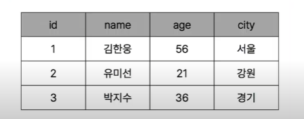
  
  + 스프레드 시트의 한계
    + 크기 - 일반적으로 약 100만행 까지만 저장가능
    + 보안 - 단순히 파일이나 링크 소유여부에 따른 단순한 접근 권한 기능 제공
    + 정확성
      + 만약 공식적으로 "강원"의 지명이 "강언"으로 바뀌었다고 가정한다면
      + 이 변경으로 인해 테이블 모든 위치에서 해당 값을 업데이트 해야함
      + 찾기 및 바꾸기 기능을 사용해 바꿀 수 있지만 데이터가 여러 시트에 분산되어 있다면 변경에 누락이 생기거나 추가 문제가 발생할 수 있음


## Relational Database
+ 데이터 베이스 역할
  + 데이터를 저장(구조적 저장) 하고 조작(CRUD)

+ 관계형 데이터베이스
  + 데이터 간에 **관계** 가 있는 데이터 항목들의 모음
  + 테이블, 행, 열의 정보를 구조화 하는 방식
  + 서로 관련된 데이터 포인터를 저장하고 이에 대한 액세스를 제공
  + 이 관계로 인해 두 테이블을 사용하여 데이터를 다양한 형식으로 조회할 수 있음
    + 특정 날짜에 구매한 모든 고객 조회
    + 지난 달에 배송일이 지연된 고객 조회
    + 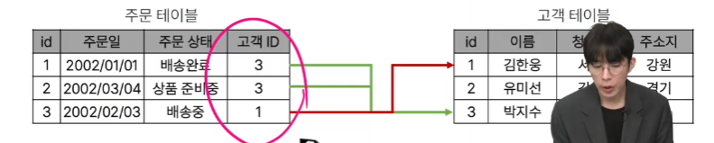
    + 고객 ID와 같이 연결된 연결고리가 중요함

+ 관계
  + 여러 테이블 간의 (논리적) 연결

+ 관계형 데이터 베이스의 예시
  + 다음과 같이 고객 데이터가 테이블에 저장되어 있다고 가정
  + 고객 데이터 간 비교를 위해서는 어떤 값을 활용해야 할까?
    + 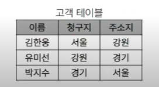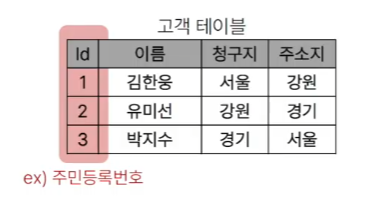
    + 각 데이터에 고유한 식별 값을 부여하기(기본 키, primary key)
  + 누가 어떤 주문을 했는지 어떻게 식별할 수 있을까?
    + 고객의 고유한 식별 값을 저장하자(외래 키, Foreign key)
    + 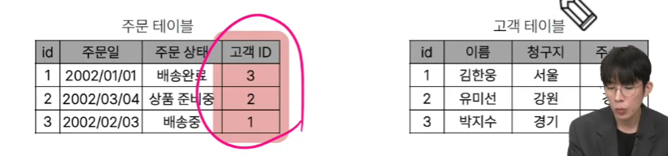

+ 관계형 데이터베이스 관련 키워드
  1. Table - 데이터를 기록하는 곳 (Relation)
  2. Field - 각 필드에는 고유한 데이터 형식(타입)이 지정됨 (Column)세로
  3. Record - 각 레코드에는 구체적인 데이터 값이 저장됨 (Row)가로
  4. Database - 테이블의 집합 (Schema) 스키마
  5. Primary key(기본 키) - 각 레코드의 고유한 값, 레코드 식별자로 사용
  6. Foreign key(외래 키) 
     + 테이블의 필드 중 다른 테이블의 레코드를 식별할 수 있는 키
     + 다른 테이블의 기본 키를 참조
     + 각 레코드에서 서로 다른 테이블 간의 **관계를 만드는 데** 사용

## RDBMS
+ DBMS (Database Management System)
  + 데이터 베이스를 관리하는 소프트웨어 프로그램
+ RDBMS (Relational Database Management System)
  + 관계형 데이터 베이스를 관리하는 소프트웨어 프로그램

+ DBMS
  + 데이터 저장 및 관리를 용이하게 하는 시스템
  + 데이터베이스와 사용자 간의 인터페이스 역할
  + 사용자가 데이터 구성, 업데이트, 모니터링, 백업, 복구등을 할 수 있도록 도움

+ RDBMS 서비스 종류
  + SQLite
  + MySQL
  + PostgreSQL
  + Oracle Database
  + ...

+ SQLite
  + 경량의 오픈 소스 데이터베이스 관리 시스템
  + 컴퓨터나 모바일 기기에 내장되어 간단하고 효율적인 데이터 저장 및 관리를 제공

+ 데이터 베이스 정리
  + Table은 데이터가 기록되는 곳
  + Table 에는 행에서 고유하게 식별 가능한 기본 키라는 속성이 있으며, 외래 키를 사용하여 각 행에서 서로 다른 테이블 간의 관계를 만들 수 있음
  + 데이터는 기본 키 또는 외래 키를 통해 결합(join)될 수 있는 여러 테이블에 걸쳐 구조화 됨

## SQL
+ Structure Query Language
  + 데이터베이스에 정보를 저장하고 처리하기 위한 프로그래밍 언어
  + Structure - 테이블 형태로 구조화된 관계형 데이터베이스
  + Query - 데이터베이스에게 요청을 질의(요청)
  + => 관계형 데이터베이스와의 대화를 위해 사용하는 프로그래밍 언어

+ SQL Syntax
  + 
  + SQL 키워드는 대소문자를 구분하지 않음
    + 하지만 대문자로 작성하는 것을 권장(명시적 구분)
  + 각 SQL statements의 끝에는 세미콜론(;)이 필요
    + 세미콜론은 각 SQL statements을 구분하는 방법 (명령어의 마침표)

+ SQL statements 
  + SQL을 구성하는 가장 기본적인 코드 블록
  + 예시
    + 
    + 해당 예시 코드는 SELECT Statement라 부름
    + 이 Statement는 SELECT, From 2개의 keyword로 구성됨

+ 수행목적에 따른 SQL Statements 4가지 유형
  + DDL - 데이터 정의
    + 데이터의 기본 구조 및 형식 변경
    + SQL 키워드 - CREATE, DROP, ALTER
  + DQL - 데이터 검색
    + 데이터 검색
    + SQL 키워드 - SELECT
  + DML - 데이터 조작
    + 데이터 조작
    + SQL 키워드 - INSERT, UPDATE, DELETE
  + DCL - 데이터 제어
    + 데이터 및 작업에 대한 사용자 권한 제어
    + SQL 키워드 - COMMIT, ROLLBACK, GRANT, REVOKE
  + 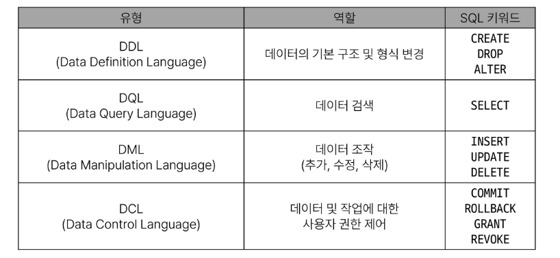

### 참고
+ Query
  + "데이터베이스로 부터 정보를 요청" 하는 것
  + 일반적으로 SQL로 작성하는 코드를 쿼리문(SQL문)이라함

+ SQL 표준
  + SQL은 미국 국립 표준 협회(ANSI)와 국제 표준화 기구(ISO)에 의해 표준이 채택됨
  + 모든 RDBMS에서 SQL표준을 지원
  + 다만 각 RDBMS마다 독자적인 기능에 따라 표준을 벗어나는 문법이 존재하니 주의

## Single Table Queries
### Querying data
#### SELECT
+ SELECT statement
  + 테이블에서 데이터를 조회

+ SELECT syntax
  + 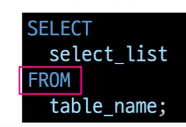
    + SELECT 키워드 이후 데이터를 선택하려는 필드를 하나 이상 지정
    + FROM 키워드 이후 데이터를 선택하려는 테이블의 이름을 지정

+ SELECT 활용
  + 테이블에서 employees 에서 Lastname 필드의 모든 데이터를 조회
    ```sql
    SELECT
        Lastname
    From
        employees;
    ```
  + 테이블 employees에서 Lastname, Firstname 필드의 모든 데이터를 조회
    ```sql
    SELECT
        Lastname, Firstname
    FROM
        employees;
    ```
  + 테이블 employees에서 모든 필드 데이터를 조회
    ```sql
    SELECT
        *
    FROM
        employees;
    ```
  + 테이블 employees에서 FirstName필드의 모든 데이터를 조회
  + (단, 조회시 Firstname이 아닌'이름'으로 출력될 수 있도록 변경)
    ```sql
    SELECT
        Firstname AS '이름'
    FROM
        employees;
    ```
  + 테이블 tracks에서 Name, Milliseconds 필드의 모든 데이터 조회
  + (단, Milliseconds 필드는 60000으로 나눠 분 단위 값으로 출력)
    ```sql
    SELECT
        Name, 
        Milliseconds / 60000 AS '재생 시간(분)'
    FROM
        employees;
    ```
+ SELECT 정리
  + SELECT 문을 사용하여 테이블의 데이터를 조회 및 반환
  + ' * ' (asterisk)를 사용하여 모든 필드를 선택

### sorting data
#### Order by
+ ORDER BY statement
  + 조회 결과의 레코드를 정렬

+ ORDER BY syntax
  + 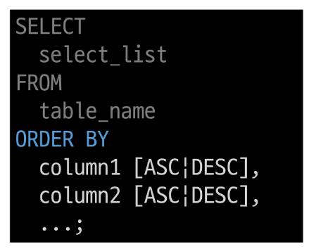
  + FROM clause 뒤에 위치
  + 하나 이상의 커럼을 기준으로 결과를
  + 오름차순(ASC, 기본값)
  + 내림차순(DESC)으로 정렬

+ ORDER BY 활용
  + 테이블 employees에서 FirstName필드의 모든 데이터를 오름차순으로 정렬
    ```sql
    SELECT
        FirstName
    FROM
        employees
    ORDER BY
        FirstName;
    ```
  + 테이블 employees에서 FisrtName 필드의 모든 데이터 내림차순으로 조회
    ```sql
    SELECT
        FirstName
    FROM
        employees
    ORDER BY
        FirstName DESC;
    ```
  + 테이블 customers에서 country필드를 기준으로 내림차순으로 정렬 한 다음 City필드 기준으로 오름차순 정렬하여 조회
    ```sql
    SELECT
        Country, City
    FROM
        customers
    ORDER BY
        Country DESC, City;
    ```
  + 테이블 tracks에서 Milliseconds필드를 기준으로 내침차순으로 정렬한 다음 Name, Milliseconds 필드의 모든 데이터를 조회
  + (단, Milliseconds 필드는 60000으로 나눠 분 단위 값으로 출력)
    ```sql
    SELECT
        Name, Milliseconds / 60000 AS '재생 시간(분)'
    FROM
        tracks
    ORDER BY
        Milliseconds DESC;
    ```


+ 정렬에서의 NULL
  + NULL값이 존재할 경우 오름차순 정렬 시 결과에 NULL이 먼저 출력
  + 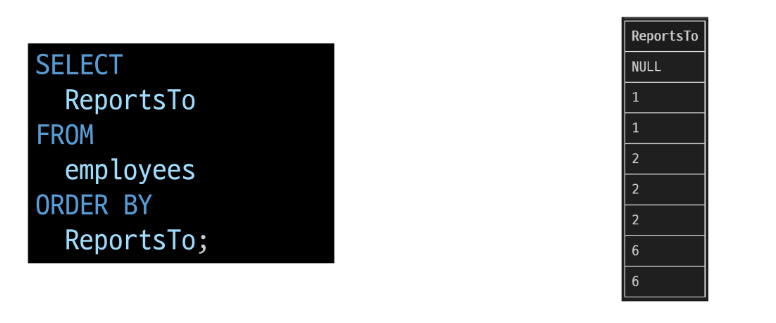

+ SELECT statement 실행 순서
  + FROM -> SELECT -> ORDER BY
  + 테이블에서 (FROM)
  + 조회하여 (SELECT)
  + 정렬 (ORDER BY)

### Filtering data
+ Filtering data 관련 Keywords
  + Clause
    + DISTINCT
    + WHERE
    + LIMIT

  + Operator
    + BETWEEN
    + IN
    + LIKE
    + Comparison
    + Logical

#### DISTINCT
+ DISTINCT statement
  + 조회 결과에서 중복된 레코드를 제거

+ DISTINCT syntax
  + 
  + SELECT 키워드 바로 뒤에 작성해야 함
  + SELECT DISTINCT 키워드 다음에 고유한 값을 선택하려는 하나 이상의 필드를 지정

+ DISTINCT 활용 1
  + 테이블 customers에서 country 필드의 모든 데이터를 오름차순 조회
    ```sql
    SELECT
        Country
    FROM
        customers
    ORDER BY
        Country;
    ```
  + 테이블 customers에서 Country 필드의 모든 데이터를 중복없이 오름차순 조회
    ```sql
    SELECT DISTINCT
        Country
    FROM
        customers
    ORDER BY
        Country;
    ```

#### WHERE
+ WHERE statement
  + 조회 시 특정 검색 조건을 지정

+ WHERE syntax
  + 
  + FROM clause 뒤에 위치
  + search_condition은 비교연산자 및 논리연산자(AND, OR, NOT 등)를 사용하는 구문이 사용됨

+ WHERE 활용
  + 테이블 customers에서 City 필드 값이 'Prague'인 데이터의 LastName, FirstName, City 조회
  ```sql
  SELECT
      LastName, FirstName, City
  FROM
      customers
  WHERE
      City = 'Prague';
  ```

  + 테이블 customers에서 City 필드 값이 'Prague'가 아닌 데이터의 LastName, FirstName, City 조회
  ```sql
  SELECT
      LastName, FirstName, City
  FROM
      customers
  WHERE
      City != 'Prague';
  ```

  + 테이블 customers에서 Company 필드 값이 NULL이고 Country필드 값이 'USA'인 데이터의 LastName, FirstName, Company, Country 조회 
  ```sql
  SELECT
      LastName, FirstName, Company, City
  FROM
      customers
  WHERE
      Company IS NULL
      AND Country = 'USA';
  ```

  + 테이블 customers에서 Company 필드 값이 NULL이거나 Country필드 값이 'USA'인 데이터의 LastName, FirstName, Company, Country 조회 
  ```sql
  SELECT
      LastName, FirstName, Company, City
  FROM
      customers
  WHERE
      Company IS NULL
      OR Country = 'USA';
  ```

  + 테이블 tracks에서 Bytes 필드 값이 10000이상 500000이하 인 데이터의 Name, Bytes 조회
  ```sql
  SELECT
      Name, Bytes
  FROM
      tracks
  WHERE
      Bytes BETWEEN 10000 AND 500000;
  -- WHERE
  --     Bytes >= 10000
  --     AND Bytes <= 500000;
  ```

  + 테이블 tracks 에서 Bytes 필드 값이 10000이상 500000 이하인 데이터의 Name, Bytes을 Bytes를 기준으로 오름차순 조회
  ```sql
  SELECT
      Name, Bytes
  FROM
      tracks
  WHERE
      Bytes BETWEEN 10000 AND 500000
  ORDER BY
      Bytes;
  ```

  + 테이블 cutomers에서 Country 필드 값이 'Canada' 또는 'Germany' 또는 'France'인 데이터의 LastName, FirstName, Country 조회
  ```sql
  SELECT
      LastName, FirstName, Country
  FROM
      customers
  WHERE
      Country IN ('Canada', 'Germany', 'France');

  -- WHERE
  --     Country = 'Canada'
  --     OR Country = 'Germany'
  --     OR Country = 'France'
  ```

  + 테이블 customers에서 Country 필드 값이 'Canada' 또는 'Germany' 또는 'France'가 아닌 데이터의 LastName, FirstName, Country 조회
  ```sql
  SELECT
      LastName, FirstName, Country
  FROM
      customers
  WHERE
      Country NOT IN ('Canada', 'Germany', 'France');
  ```

  + 테이블 customers에서 LastName 필드 값이 son으로 끝나는 데이터의 LastName, FirstName 조회
  ```sql
  SELECT
      LastName, FirstName
  FROM
      customers
  WHERE
      LastName LIKE '%son';
  ```

  + 테이블 customers에서 FirstName 필드 값이 4자리면서 'a'로 끝나는 데이터의 LastName, FirstName 조회
  ```sql
  SELECT
      LastName, FirstName
  FROM
      customers
  WHERE
      FirstName LIKE '___a';
  ```

#### Operators
+ Comparison Operators 
  + 비교 연산자
  + =, >=, <=, !=, IS, LIKE, IN, BETWEEN AND

+ Logical Oprators
  + 논리 연산자
  + AND(&&), OR(||), NOT(!)

+ IN operator
  + 값이 특정 목록 안에 있는지 확인

+ LIKE Operator
  + 값이 특정 패턴에 일치하는지 확인
  + (Wildcards와 함께 사용)

+ Wildcard Charactres
  + %
    + 0개 이상의 문자열과 일치하는지 확인
  + _
    + 단일 문자와 일치하는지 확인

#### LIMIT
+ LIMIT clause
  + 조회하는 레코드의 수를 제한

+ LIMIT syntax
  + 
  + 하나 또는 두 개의 인자를 사용(0 또는 양의 정수)
  + row_count 는 조회하는 최대 레코드 수를 지정

+ LIMIT & OFFSET 예시
  + 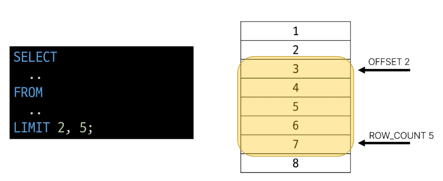

+ LIMIT 활용
  + 테이블 tracks에서 TrackId, Name, Bytes 필드 데이터를 Bytes 기준 내림차순으로 7개만 조회
    ```sql
    SELECT
        TrackID, Name, Bytes
    From
        tracks
    ORDER BY Bytes DESC
    LIMIT 7;
    ```
  + 테이블 tracks에서 TrackID, Name, Bytes 필드 데이터를 Bytes 기준 내림차순으로 4번째부터 7번째 데이터만 조회
    ```sql
    SELECT
        TrackID, Name, Bytes
    From
        tracks
    ORDER BY Bytes DESC
    LIMIT 3, 4;
    -- LIMIT 4 OFFSET 3;
    ```

### Grouping data
#### GROUP BY
+ GROUP BY clause
  + 레코드를 그룹화하여 요약본 생성
  + '집계 함수'와 함께 사용

+ Aggregation Functions ( 집계 함수 )
  + 값에 대한 계산을 수행하고 단일한 값을 반환하는 함수
  + SUM, AVG, MAX, MIN, COUNT

+ GROUP BY syntax
  + 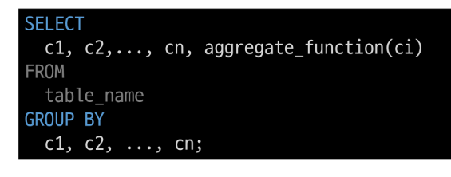
  + FROM 및 WHERE 절 뒤에 배치
  + GROUP BY 절 뒤에 그룹화 할 필드 목록을 작성

+ GROUP BY 예시
  + Country 필드를 그룹화
    + 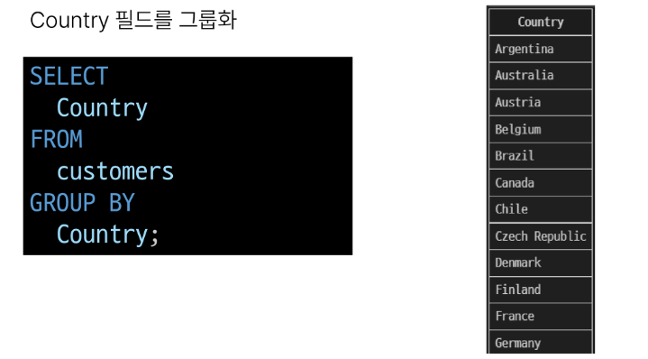
  + COUNT 함수가 각 그룹에 대한 집계된 값을 계산
    + 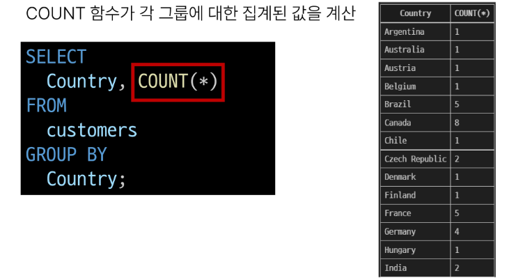

+ GROUP BY 활용
  + 테이블 tracks에서 Composer필드를 그룹화하여 각 그룹에 대한 Bytes 평균 값을 내림차순 조회
    ```sql
    SELECT
        Composer,
        AVG(Bytes)
    FROM
        tracks
    GROUP BY
        Composer
    ORDER BY
        AVG(Bytes) DESC;
    ```

    ```sql
    SELECT
        Composer,
        AVG(Bytes) AS avgOfBytes
    FROM
        tracks
    GROUP BY
        Composer
    ORDER BY
        avgOfBytes DESC;
    ```

  + 테이블 tracks에서 Composer 필드를 그룹화하여 각 그룹에 대한 Milliseconds의 평균값이 10 미만인 데이터 조회
  + (단, Milliseconds 필드를 60000나눠 분 단위 값의 평균으로 계산)
    ```sql
    -- 오류 발생함
    SELECT
        Composer,
        AVG(Milliseconds / 60000 ) AS avgOfMinute
    FROM
        tracks
    WHERE
        avgOfMinute < 10
    GROUP BY
        Composer;
    ``` 
    + Having clause
      + 집계항목에 대한 세부조건을 지정
      + 주로 GROUP BY와 함께 사용되며 GROUP BY가 없다면 WHERE 처럼 동작
    ```sql
    -- 이렇게 사용해야함
    SELECT
        Composer,
        AVG(Milliseconds / 60000 ) AS avgOfMinute
    FROM
        tracks

    GROUP BY
        Composer
    HAVING
        avgOfMinute < 10;
    ```

+ SELECT statement 실행 순서
  + FROM -> WHERE -> GROUP BY -> HAVING -> SELECT -> ORDER BY -> LIMIT
  1. 테이블에서 (FROM)
  2. 특정 조건에 맞추어 (WHERE)
  3. 그룹화 하고 (GROUP BY)
  4. 만약 그룹중에서 조건이 있다면 맞추고 (HAVING)
  5. 조회하여 (SELECT)
  6. 정렬하고 (ORDER BY)
  7. 특정위치의 값을 가져옴 (LIMIT)

https://gist.github.com/yts0275/33692ef95e622b7d5cfd02cd77a4b7e6

# SQL2
## Managing Tables
- SQL Statements 유형

### Create a table
- CREATE TABLE statement
  - 테이블 생성

- CREATE TABLE syntax
  - 각 필드에 적용할 데이터 타입 작성
  - 테이블 및 필드에 대한 제약조건(constraints)작성
  - 

+ CREATE TABLE 활용
  1. examples 테이블 생성 및 확인
    - ```sql
      CREATE TABLE examples(
        ExamID INTERGER PRIMARY KEY AUTOINCREMENT,
        LastName VARCHAR(50) NOT NULL,
        FirstNAME VARCHAR(50) NOT NULL
      );
      ```
    - 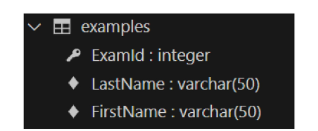


  2. 테이블 스키마(구조) 확인
    - ```sql
      PRAGMA table_info('examples');
      ```
    - 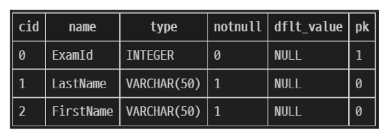

  - 데이터 타입
    - 

  - 제약 조건
    - 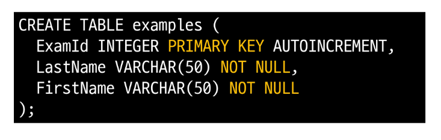

  - AUOTOINCREMENT 키워드
    - 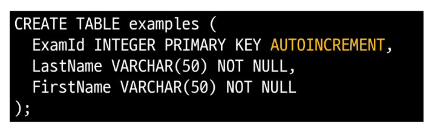

- SQLite 데이터 타입
  1. NULL : 아무런 값도 포함하지 않음을 나타냄 
  2. INTEGER : 정수
  3. REAL : 부동 소수점
  4. TEXT : 문자열
  5. BLOB : 이미지, 동영상, 문서 등 바이너리 데이터

- Constraints ( 제약 조건 )
  - 테이블의 필드에 적용되는 규칙 또는 제한 사항
  - 데이터의 무결성을 유지하고 데이터베이스의 일관성을 보장

- 대표적인 제약조건
  - PRIMARY KEY
    - 해당 필드를 기존 키로 지정
    - INTEGER타입에만 적용되며, INT, BIGINT등과 같은 정수 유형은 적용되지 않음
  - NOT NULL
    - 해당 필드에 NULL값을 허용하지 않도록 지정
  - FOREIGN KEY
    - 다른 테이블과의 외래 키 관계를 정의

- AUTOINCREMENT keyword
  - 자동으로 고유한 정수 값을 생성하고 할당하는 필드 속성
  - 특징
    - 필드의 자동 증가를 나타내는 특수한 키워드
    - 주로 primary key필드에 적용
    - INTEGER PRIMARY KEY AUTOINCREMENT가 작성된 필드는 항상 새로운 레코드에 대해 이전 최대 값보다 큰 값을 할당
    - 삭제된 값은 무시되며 재사용할 수 없게 됨.

## Modifying table fields
### ALTER TABLE

- ALTER TABLE statement
  - 테이블 및 필드 조작

- ALTER TABLE 역할
  - 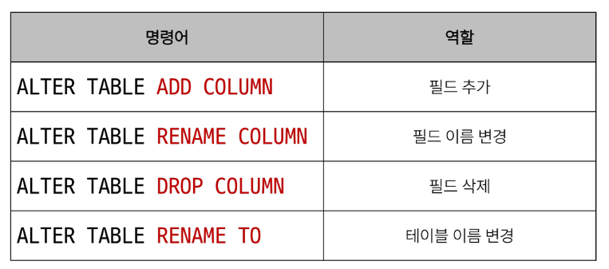

<hr>

#### - ALTER TABLE ADD COLUMN syntax
  - ADD COLUMN 키워드 이후 추가하고자 하는 새 필드 이름과 데이터타입 및 제약 조건 작성
  -   ```sql
      ALTER TABLE
        table_name
      ADD COLUMN
        column_definition;
      ```

- ALTER TABLE ADD COLUMN 활용
  1. examples 테이블에 다음 조건에 맞는 Country 필드 추가
     - 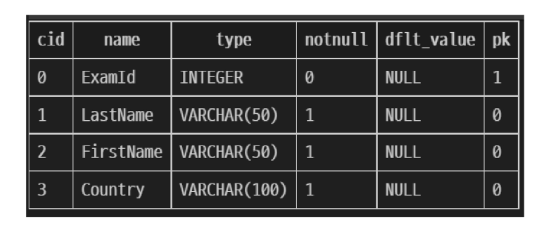
      ```sql
      ALTER TABLE
        examples
      ADD COLUMN
        Country VARCHAR(100) NOT NULL;
      ```

  2. examples 테이블에 다음 조건에 맞는 Age, Address 필드 추가
     - 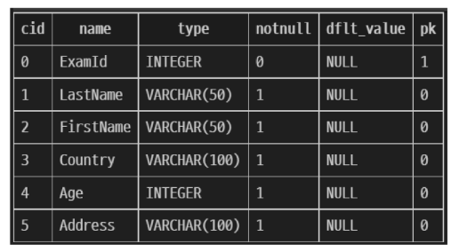
     - SQLite는 단일 문을 사용하여 한번에 여러 필드를 추가할 수 없음

      ```sql
      ALTER TABLE examples
      ADD COLUMN Age INTEGER NOT NULL;

      ALTER TABLE examples
      ADD COLUMN Address VARCHAR(100) NOT NULL;
      ```

<hr>

#### - ALTER TABLE RENAME COLUMN syntax
  - RENAME COLUMN 키워드 뒤에 이름을 바꾸려는 필드의 이름을 지정하고 TO 키워드 뒤에 새 이름을 지정
  ```sql
  ALTER TABLE
    table_name
  RENAME COLUMN
    current_name TO new_name
  ``` 

- ALTER TABLE RENAME COLUMN 활용
  1. examples 테이블 Address 필드의 이름을 PostCode로 변경
     - 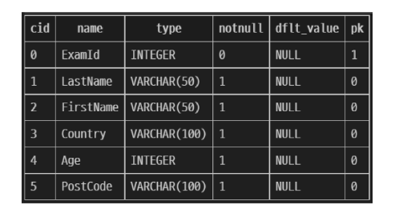
       ```sql
       ALTER TABLE examples
       RENAME COLUMN Address TO PostCode;
       ```

<hr>

#### - ALTER TABLE DROP COLUMN syntax
  - DROP COLUMN 키워드 뒤에 삭제하려는 필드의 이름을 지정
  - 삭제하는 필드가 다른 부분에서 참조되지 않고 PRIMARY KEY가 아니며 UNIQUE 제약 조건이 없는 경우에만 작동
    ```sql
    ALTER TABLE
      table_name
    DROP COLUMN
      current_name
    ```

- ALTER TABLE DROP COLUMN 활용
  1. examples 테이블의 PostCode 필드를 삭제  
    ```sql
    ALTER TABLE
      examples
    DROP COLUMN
      PostCode;
    ``` 

<hr>

#### - ALTER TABLE RENAME TO syntax
  - Rename To 키워드 뒤에 새로운 테이블 이름 지정\
  ```sql
  ALTER TABLE
    table_name
  RENAME TO
    new_table_name
  ``` 

- ALTER TABLE RENAME TO 활용
  1. examples 테이블 이름을 new_examples로 변경
    - 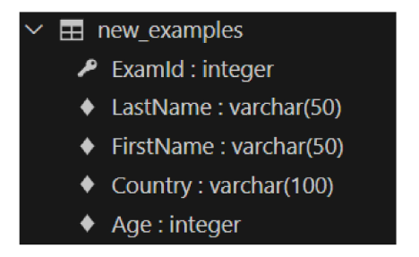
    ```sql
    ALTER TABLE
      examples
    RENAME TO
      new_examples;
    ``` 

## Delete a Table
### DROP TABLE 
- DROP TABLE statement
  - 테이블 삭제

- DROP TABLE syntax
  - DROP TABLE statement 이후 삭제할 테이블 이름 작성
  ```sql
  DROP TABLE table_name;
  ``` 
  
- DROP TABLE 활용
  1. examples 테이블 삭제
    ```sql
    DROP TABLE examples
    ```
## 참고
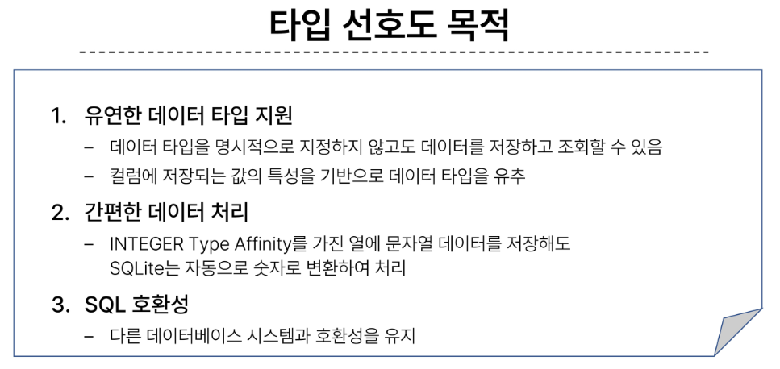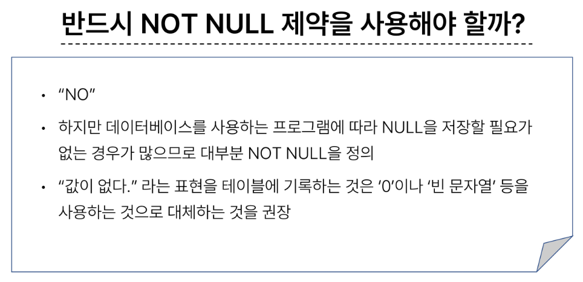

## Modifying Data


### Insert data
#### INSERT
- INSERT statement
  - 테이블 레코드 삽입

- INSERT syntax
  - INSERT INTO 절 다음에 테이블 이름과 괄호 안에 필드 목록 작성
  - VALUES 키워드 다음 괄호 안에 해당 필드에 삽입할 값 목록 작성
  ```sql
  INSERT INTO table_name (c1, c2, ...)
  VALUES (v1, v2, ...);
  ```  

- 실습 테이블 작성
  ```sql
  CREATE TABLE articels(
    id INTEGER PRIMARY KEY AUTOINCREMENT,
    title VARCHAR(100) NOT NULL,
    content VARCHAR(200) NOT NULL,
    created DATE NOT NULL
  )
  ```

- INSERT 활용
  1. articles 테이블에 다음과 같은 데이터 입력
    ```sql
    INSERT INTO
      articles (title, content, createdAt)
    VALUES
      ('hello', 'world', '2000-01-01')
    ```
      - 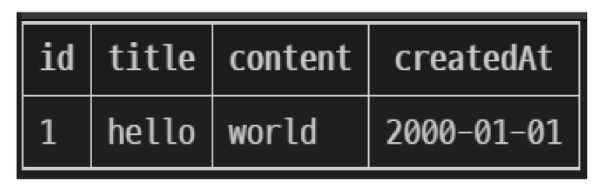

  2. articles 테이블에 다음과 같은 데이터 추가 입력
    ```sql
    INSERT INTO
      articles (title, content, createdAt)
    VALUES
      ('title1', 'content1', '1900-01-01'),
      ('title2', 'content2', '1800-01-01'),
      ('title3', 'content3', '1700-01-01'),
    ```  
    - 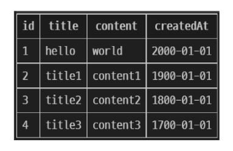

  3. DATE 함수를 사용해 articles 테이블에 다음과 같은 데이터 추가 입력
    ```sql
    INSERT INTO
      articles(title, content, createdAt)
    VALUES
      ('mytitle', 'mycontent', DATE());
    ```
    - 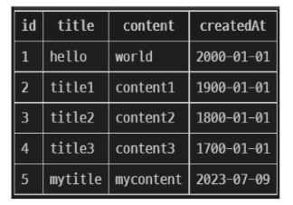

### Update data
#### UPDATE
- UPDATE statement
  - 테이블 레코드 수정

- UPDATE syntax
  -  SET 절 다음에 수정 할 필드와 새 값을 지정
  -  WHERE 절에서 수정 할 레코드를 지정하는 조건 작성
  -  WHERE 절을 작성하지 않으면 모든 레코드를 수정
  ```sql
  UPDATE table_name
  SET column_name = expression,
  [WHERE
    condition];
  ```

- UPDATE 활용
  1. articles 테이블 1번 레코드의 title 필드 값을 'upate Title'로 변경
    ```sql
    UPDATE
      articles
    SET
      title = 'update Title'
    WHERE
      id = 1;
    ```
    - 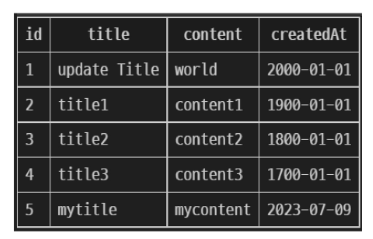

  2. articles 테이블 2번 레코드의 title, content 필드 값을 각각 'update Title', 'update Content'로 변경 
    ```sql
    UPDATE
      articles
    SET
      title = 'update Title'
      content = 'update Content'
    WHERE
      id = 2;
    ```
    - 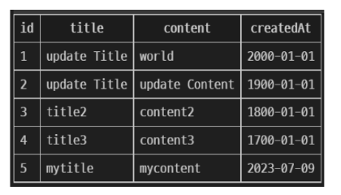

### Delete data
#### DELETE
- DELETE statement
  - 테이블 레코드 삭제

- DELETE syntax
  - DELETE FROM 절 다음에 테이블 이름 작성
  - WHERE 절에서 삭제한 레코드를 지정하는 조건 작성
  - WHERE 절을 작성하지 않으면 모든 레코드를 삭제
  ```sql
  DELETE FROM table_name
  [WHERE
    condition];
  ```
  
- DELETE 활용
  1. articles 테이블의 1번 레코드 삭제
    ```sql
    DELETE FROM
      articles
    WHERE
      id = 1;
    ``` 
    - 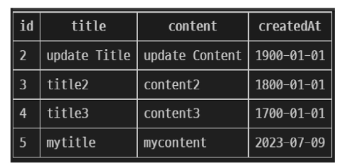

  2. articles 테이블에서 작성일이 오래된 순으로 레코드 2개 삭제
    ```sql
    DELETE FROM
      articles
    WHERE id IN (
      SELECT id FROM articles
      ORDER BY createdAt
      LIMIT 2
    );
    ``` 
    - 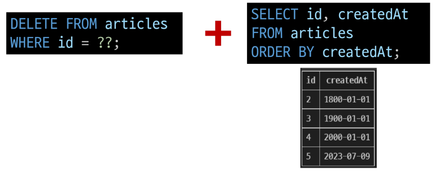

### 참고
- SQLite의 날짜와 시간
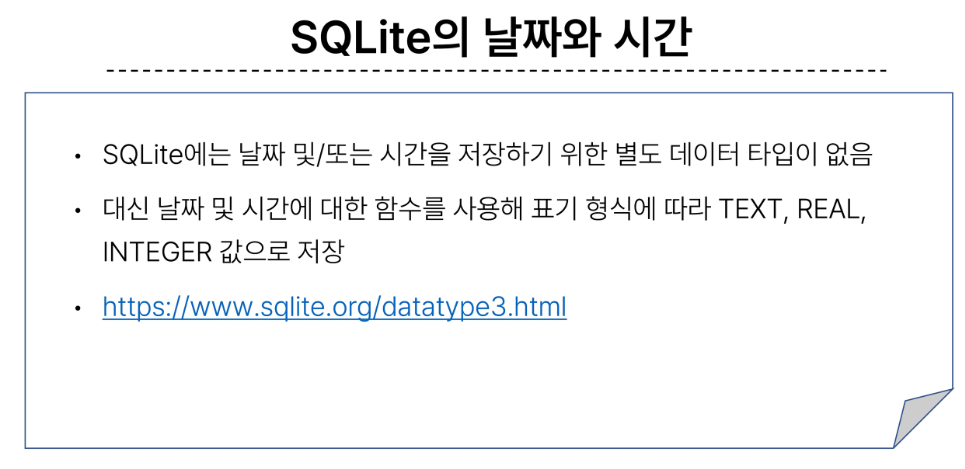

## Multi table queries
### JOIN
- 관계
  - 여러 테이블 간의 (논리적) 연결

- 관계의 필요성
  1. 커뮤니티 게시판에 필요한 데이터 생각해보기
    - 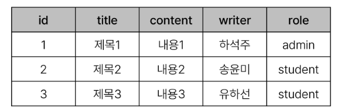

  2. 하석주가 작성한 모든 게시물 조회하기
  - 어떤 문제점이 있을까?
    - 동명이인이 있다면, 혹은 특정 데이터가 수정된다면
  ```sql
  SELECT *
  FROM 테이블
  WHERE writer = '하석주';
  ``` 

  3. 테이블을 나누어서 분류하자
  - 각 게시글은 누가 작성했는지 알 수 있을까?
  - 작성자들의 역할은 무엇인가?
    - 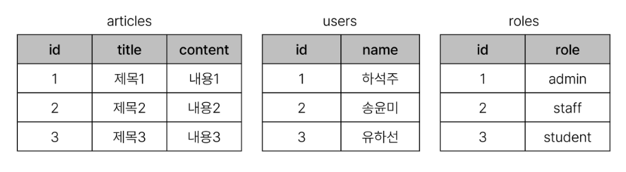

  4. articles와 users 테이블에 각각 userID, roleID 외래 키 필드 작성
  - 관리자인 사람만 보고싶다면? -> roleID가 1인 데이터 조회
  - 하석자라는 사람이 권미숙으로 개명한다면? -> users에서 한번만 변경하면 자동으로 모두 변경
    - 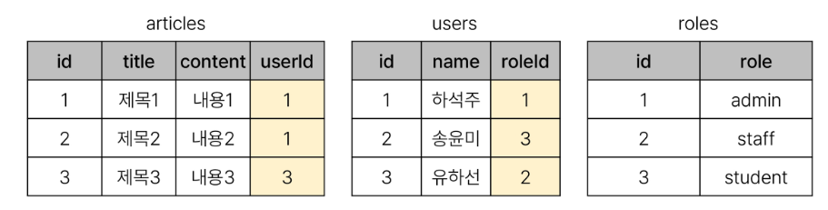

- JOIN이 필요한 순간
  - 테이블을 분리하면 데이터관리는 용이해질 수 있으나 출력시에는 문제가 있음
  - 테이블 한 개만을 출력할 수 밖에 없어 다른 테이블과 결합하여 출력하는 것이 필요해짐
  - => 'JOIN'

### Joining tables
#### JOIN
- JOIN clause 
  - 둘 이상의 테이블에서 데이터를 검색하는 방법

- JOIN의 종류
  - INNER JOIN
  - LEFT JOIN

- 사전준비
  1. users 및 articles 테이블 생성
    ```sql
    CREATE TABLE users(
      id INTEGER PRIMARY KEY AUTOINCREMENT,
      name VARCHAR(50) NOT NULL
    );
    ```  
    ```sql
    CREATE TABLE articles(
      id INTEGER PRIMARY KEY AUTOINCREMENT,
      title VARCHAR(50) NOT NULL,
      content VARCHAR(100) NOT NULL,
      userID INTEGER NOT NULL,
      FOREIGN KEY (user id)
        REFERENCES users(id)
    );
    ```  

  2. 각 테이블에 실습 데이터 입력
    ```sql
    INSERT INTO
      users (name)
    VALUES
      ('하석주'),
      ('송윤미'),
      ('유하선');
    
    INSERT INTO
      articles (title, content, userID)
    VALUES
      ('제목1', '내용1', 1),
      ('제목2', '내용2', 2),
      ('제목3', '내용3', 3),
      ('제목4', '내용4', 4),
      ('제목5', '내용5', 5);
    ```  
    - 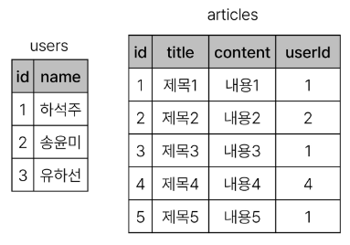

#### INNER JOIN
- INNER JOIN claues
  - 두 테이블에서 값이 일치하는 레코드에 대해서만 결과를 반환
  - 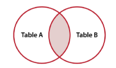

- INNER JOIN syntax
  - FROM 절 이후 메인 테이블 지정 (table_a)
  - INNER JOIN 절 이후 메인 테이블과 조인할 테이블을 지정 (table_b)
  - ON 키워드 이후 조인 조건을 작성
  - 조인 조건은 table_a와 table_b 간의 레코드를 일치시키는 규칙을 지정
  ```sql
  SELECT 
    select_list
  FROM
    table_a
  INNER JOIN
    table_b
  ON
    table_b.fk = table_a.pk;
  ```

- INNER JOIN 예시
  ```sql
  SELECT *
  FROM articles
  INNER JOIN users
    ON users.id = articles.userID;
  ```
  - 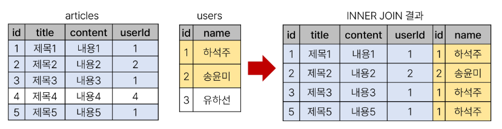

- INNER JOIN 활용
  1. 1번 회원(하석주)가 작성한 모든 게시글의 제목과 작성자명을 조회 
    ```sql
    SELECT articles.title, users.name
    FROM articles
    INNER JOIN users
      ON users.id = articles.userID
    WHERE users.id = 1;
    ``` 
    - 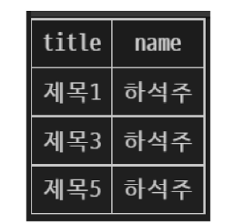

#### LEFT JOIN
- LEFT JOIN claues
  - 오른쪽 테이블의 일치하는 레코드와 함께 왼쪽 테이블의 모든 레코드 반환
  - 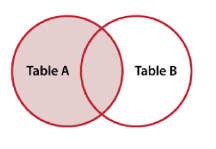

- LEFT JOIN syntax
  - FROM 절 이후 왼쪽 테이블 지정 (table_a)
  - LEFT JOIN 절 이후 오른쪽 테이블 지정 (table_b)
  - ON 키워드 이후 조인 조건을 작성
    - 왼쪽 테이블의 각 레코드를 오른쪽 테이블의 모든 레코드와 일치시킴
  ```sql
  SELECT
    select_list
  FROM 
    table_a
  LEFT JOIN table_b
    ON table_b.fk = table_a.pk;
  ```

- LEFT JOIN 예시
  ```sql
  SELECT *
  FROM articles
  LEFT JOIN users
    ON users.id = articles.userID;
  ```
  - 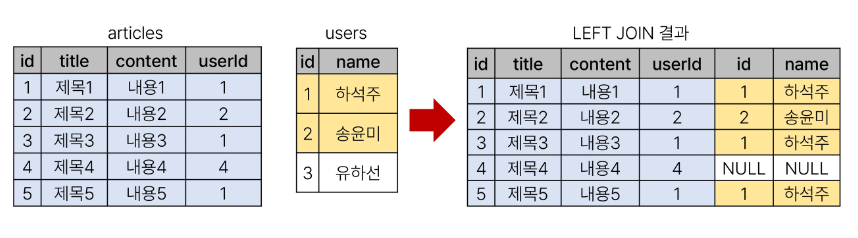

- LEFT JOIN 특징
  - 왼쪽은 테이블의 모든 레코드를 표기
  - 오른쪽 테이블과 매칭되는 레코드가 없으면 NULL 표시

- LEFT JOIN 활용
  - 게시글을 작성한 이력이 없는 회원 정보 조회
    ```sql
    SELECT *
    FROM users
    LEFT JOIN articles
      ON articles.userID = users.id
    WHERE articles.userID IS NULL;
    ``` 
    - 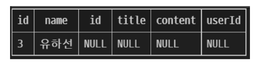