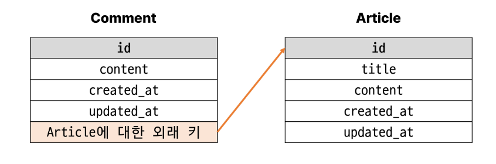
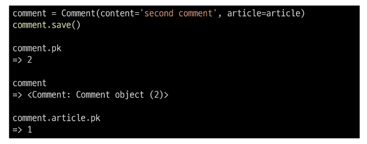

# 1011 Many to one relationship1 N:1
- Many to one relationship1(N:1, 1:N)
  - 한 테이블의 0개 이상의 레코드가 다른 테이블의 레코드 한개와 관련된 관계

- Comment - Article
  - 0개이상의 댓글은 1개의 게시글에 작성될 수 있다.
  - comment = N , Article = 1

- 테이블 관계
  - 

- Foreignkey
  - N:1 관계 설정 모델 필드

## 댓글 모델 구현
- 댓글 모델 정의
  - ForeignKey() 클래스의 인스턴스 이름은 참조하는 모델 클래스 이름의 "단수형"으로 작성하는 것을 권장
  - ForeignKey() 클래스를 작성하는 위치와 관계없이 외래키는 테이블 필드 마지막에 생성됨
  - 
- ForeignKey(to, on_delete)
  - to : 참조하는 모델 클래스 이름 
  - on_delete : 외래 키가 참조하는 객체(1)가 사라졌을 때, 외래 키를 가진 객체(N)를 어떻게 처리할 지를 정의하는 설정(데이터 무결성)

- on_delete의 'CASCADE'
  - 부모 객체(참조 된 객체)가 삭제 됐을 때 이를 참조하는 객체도 삭제
  - 기타 설정 값은 공식문서 참고
    - https://docs.djangoproject.com/en/4.2/ref/models/fields/#arguments

- Migration
  - 댓글 테이블의 article_id 필드 확인
  - 참조하는 클래스 이름의 소문자(단수형)로 작성하는 것이 권장되었던 이유
    - '참조 대상 클래스 이름' + '_ (underbar)' + '클래스 이름'
  - 

## 댓글 생성 연습
1. shell_plus 실행 및 게시글 작성
   - 

2. 댓글 생성
   - 

3. 댓글 외래키 입력
   - 

4. comment 인스턴스를 통한 article 값 참조하기
   - 

5. 작성된 게시물의 pk와 content 조회
   - 

6. 두번째 댓글 생성
   - 

7. 작성된 댓글 데이터 확인
   - 

## 관계 모델 참조
- 역참조
  - N:1 관계에서 1에서 N을 참조하거나 조회하는 것
  - N은 외래키를 가지고 있어 물리적으로 참조가 가능하지만,
  - 1은 N에 대한 참조방법이 존재하지 않아 별도의 역참조 이름이 필요

- 역참조 예시
  - > article().comment_set.all()
  - article() : 모델 인스턴스
  - related manager : 역참조 이름
  - all() : QuerySet API

- related manager
  - N:1 혹은 M:N 관계에서 역참조 시에 사용하는 매니저
  - 'object'매니저를 통해 queryset api를 사용했던 것처럼 
  - related manager를 통해 queryset api를 사용할 수 있게 됨

- related manager 이름 규칙
  - N:1 관계에서 생성되는 Related manager의 이름은 참조하는 "모델명_set" 이름 규칙으로 만들어짐
  - 해당 댓글의 게시글( Comment -> Article )
    - comment.article
  - 게시글의 댓글 목록( Article -> Comment )
    - article.comment_set.all()

- Related manager 연습
  1. shell_plus 실행 및 1번 게시글 조회
     - 
  2. 1번 게시글에 작성된 모든 댓글 조회하기(역참조)
     - 
  3. 1번 게시글에 작성된 모든 댓글 내용 출력
     - 

## 댓글 구현
### 댓글 CREATE
1. 사용자로부터 댓글 데이터를 입력받기 위한 CommentForm 정의
   - 

2. detail view 함수에서 CommentForm을 사용하여 detail 페이지에 렌더링
   - 

3. Comment클래스의 외래 키 필드 article 또한 데이터 입력이 필요한 필드이기 때문에 출력되고 있는것.
- 하지만, 외래 키 필드는 *사용자 입력 값으로 받는 것이 아닌 view함수 내에서 다른 방법으로 전달받아 저장* 되어야함. 
   - 

4. CommentForm의 출력 필드 조정
   - 

5. 출력에서 제외된 외래 키 데이터는 어디서 받아와야 할까?
   - detail 페이지의 url
   - path('<int:pk>/', views.detail, name = 'detail') 에서 해당 게시글의 pk값이 사용되고 있음
   - 댓글의 외래 키 데이터에 필요한 정보가 바로 게시글의 pk 값

6. url 작성 및 action 값 작성
   - 

7. "comments_create" view함수 정의
   - 
   - save(commit=False)
     - DB에 저장하지 않고 인스턴스만 반환
     - ( Create, but don't save the new instance )

8. save의 commit 인자를 활용해 외래 키 데이터 추가 입력
   -  

9. 댓글 작성 후 테이블 확인
   - 

### 댓글 READ
1. detail view 함수에서 전체댓글 데이터를 조회
   - 

2. 전체 댓글 출력 및 확인
   - 

### 댓글 DELETE
1. 댓글 삭제 url 작성
   - 

2. 댓글 삭제 view 함수 정의
   - 

3. 댓글 삭제 버튼 작성
   - 

4. 댓글 삭제 버튼 출력 확인 및 삭제 테스트
   - 

## 참고

