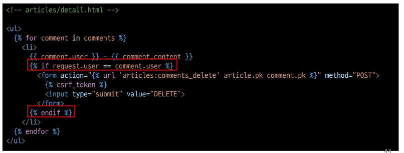

# 1012 Many to one relationship2
- Article(N) - User(1)
  - 0개 이상의 게시글은 1명의 회원에 의해 작성될수 있다.

- Comment(N) - User(1)
  - 0개 이상의 댓글은 1명의 회원에 의해 작성될 수 있다.

## Article & User
### 모델 관계 설정
- Article - User 모델 관계 설정
  - User 외래키 정의
  - 

- User 모델을 참조하는 2가지 방법
  - get_user_model()  //  settings.AUTH_USER_MODEL
  - django 프로젝트의 '내부적인 구동 순서'와 '반환 값'에 따른 이유
  - 우리가 기억할 것은 User모델은 직접 참조하지 않는다는 것
  - 

- Migration
  1. 기본적으로 모든 컬럼은 NOT NULL 제약조건이 있기 때문에 데이터가 없이는 새로운 필드가 추가되지 못함
       - 기본값 설정 필요
     - $ python manage.py migrations
     - 1을 입력하고 Enter 진행 ( 다음화면에서 직접 기본 값 입력 )
     - 

  2. 추가되는 외래 키 user_id에 어떤 데이터를 넣을 것인지 직접 입력해야 함
     - 마찬가지로 1 입력하고 Enter 진행
     - 그러면 기존에 작성된 게시글이 있다면 모두 1번 회원이 작성한 것처럼 처리 됨 
     - 

  3. migrations 파일 생성 후 migrate 진행
     - $ python manage.py migrate  

  4. article 테이블의 user_id 필드 생성 확인
     - 

### 게시글 CREATE
1. 기존 ArticleForm 출력 변화 확인
   - User 모델에 대한 외래 키 데이터 입력을 위해 불필요한 input이 출력 
   - 

2. ArticleForm 출력 필드 수정
   - 

3. 게시글 작성 시 에러 발생
   - user_id 필드 데이터가 누락되었기 때문
   - 

4. 게시글 작성 시 작성자 정보가 함께 저장될 수 있도록 save의 commit 옵션 활용
   - 

5. 게시글 작성 후 테이블 확인
   - 

### 게시글 READ
1. 각 게시글의 작성자 이름 출력
   - 

2. 각 게시글의 작성자 이름 출력
   - 

### 게시글 UPDATE
1. 게시글 수정 요청 사용자와 게시글 작성 사용자를 비교하여 본인의 게시글만 수정할 수 있도록 하기
   - 

2. 해당 게시글의 작성자가 아니라면 수정/삭제 버튼을 출력하지 않도록 하기
   - 

### 게시글 DELETE
1. 삭제를 요청하려는 사람과 게시글을 작성한 사람을 비교하여 본인의 게시글만 삭제할 수 있도록 하기

## Comment & User
### 모델 관계 설정
- Comment - User 모델 관계 설정
  - User 외래 키 설정 (models.py)
  - 

- Migration
  1. 이전에 Article과 User 모델 관계 설정 때와 동일한 상황
     - 기존 Comment 테이블에 새로운 컬럼이 빈 값으로 추가 될 수 없기 때문에 기본 값 설정 과정이 필요  
     - $ python manage.py migrations
     - 위의 1 누르고 1눌러 user_id 지정
     - $ python manage.py migrate

  2. comment 테이블 user_id 필드 확인
    - 

### 댓글 CREATE
1. 댓글 작성 시 이전에 게시글 작성할 때와 동일한 에러 발생
   - 댓글의 user_id 필드 데이터가 누락되었기 때문 
   - 

2. 댓글 작성시 작성자 정보가 함께 저장될 수 있도록 작성
   - 

3. 댓글 작성 후 테이블 확인
   - 

### 댓글 READ
- 댓글 출력 시 댓글 작성자와 함께 출력
  - 

### 댓글 DELETE
1. 댓글 삭제 요청 사용자와 댓글 작성 사용자를 비교하여 본인의 댓글만 삭제 할 수 있도록 하기
   - 

2. 해당 댓글의 작성자가 아니라면, 댓글 삭제 버튼을 출력하지 않도록 함
   - 

### 참고
- 인증된 사용자만 댓글 작성 및 삭제
  - @login_required 사용
  - 