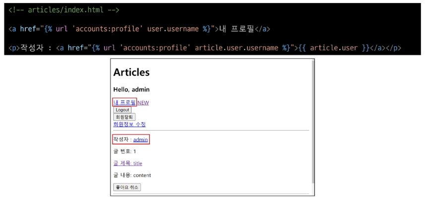
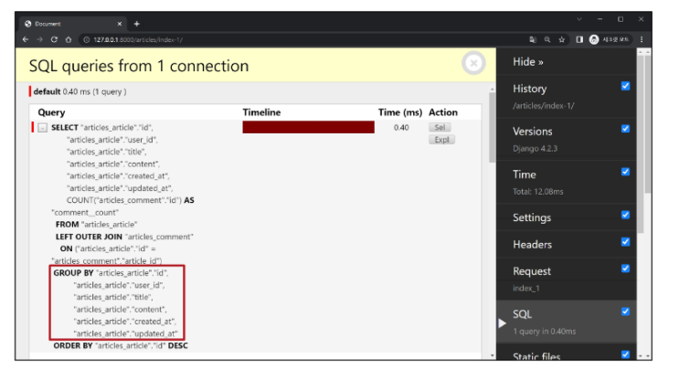

# 1017 Many TO Many relationship2
## 팔로우
### 프로필
+ 각 회원의 개인 프로필 페이지에 팔로우 기능을 구현하기 위해 프로필페이지를 먼저 구현

+ 프로필 구현
1. url 작성
 + 
2. view 함수 작성
 + 
3. profile 템플릿 작성
 + 
4. 프로필 페이지로 이동할 수 있는 링크 작성
 + 
5. 프로필 페이지 결과 확인
 + 

### 팔로우 기능 구현
+ User(M) - User(N)
  + 0명 이상의 회원은 0명 이상의 회원과 관련
  + 회원은 0명 이상의 팔로워를 가질 수 있고, 0명이상의 다른 회원들을 팔로잉 할 수 있음

+ 팔로우 기능 구현
1.  ManyToManyField 작성
  + 참조
    + 내가 팔로우 하는 사람들(팔로잉, followings)
  + 역참조
    + 상대방 입장에서 나는 팔로워 중 한 명(팔로워, followers)
  + 바뀌어도 상관없으나 관계 조회 시 생각하기 편한 방향으로 정한 것
  + 

2. Migrations 진행 후 중개 테이블 확인
   + 

3. URL 작성
   + 

4. view 함수 작성
   + 

5. 프로필 유저의 팔로잉, 팔로워 수 & 팔로우, 언팔로우 버튼 작성
   + 

6. 팔로우 버튼 클릭 후 팔로우 버튼 변화 및 중개 테이블 데이터 확인
   + 

#### 참고
+ .exists()
  + QuerySet에 결과가 포함되어 있으면 True를 반환하고 결과가 포함되어 있지 않으면 False
  + => 큰 QuerySet에 있는 특정 객체 검색에 유용
  + 적용 예시
    + 
    + 

## Fixtures
+ Django가 데이터베이스로 가져오는 방법을 알고 있는데 데이터 모음
+ => 데이터베이스 구조에 맞추어 작성 되어있음

+ 초기 데이터 제공
  + Fixtures의 사용 목적

+ 초기 데이터의 필요성
  + 협업하는 유저 A, B가 있다고 생각해보기
    1. A가 먼저 프로젝트를 작업 후 github에 push
       + gitignore로 인해 DB는 업로드하지 않기 때문에 A가 생성한 데이터도 업로드X
    2. B가 github에서 A가 push한 프로젝트를 pull(혹은 clone)
       + 결과적으로 B는 DB가 없는 프로젝트를 받게 됨
  + 이처럼 Django프로젝트의 앱을 처음 설정할 때 동일하게 준비 된 데이터로 데이터베이스를 미리 채우는 것이 필요한 순간이 있음
  + fixtures를 사용해 앱에 초기 데이터(initial data)를 제공

### Fixtures 활용
+ 사전준비
  + M:N 까지 모두 작성된 Django 프로젝트에서 유저, 게시글, 댓글 등 각 데이터를 최소 2~3개 이상 생성해두기

+ fixtures 관련 명령어
  + dumpdata
    + 생성
    + 데이터베이스의 모든 데이터를 추출
    + 추출한 데이터는 json형식으로 저장
    + 
    + 
    + 
  + loaddata
    + 로드(데이터 입력)
    + Fixtures 데이터를 데이터베이스로 불러오기
    + Fixtures 파일 기본 경로
      + app_name/fixtures
      + Django는 설치된 모든 app의 디렉토리에서 fixtures폴더 이후의 경로로 fixtures파일을 찾아 load
    + 
    + ! 순서 주의 사항 !
      + 만약 loaddata를 한번에 실행하지 않고 하나씩 실행한다면 모델 관계에 따라 load하는 순서가 중요할 수 있음
        + comment는 article에 대한 key(FK) 및 user에 대한 key가 필요
        + article은 user에 대한 key가 필요
      + 즉 현재 모델 관계에서는 user -> article -> comment 순으로 data를 넣어야 오류가 발생하지 않음
      + 

#### 참고
+ 모든 모델을 함꺼번에 dump하기
  + 
+ loaddata시 encoding codec 관련 에러가 발생하는 경우
+ 2가지 방법 중 택 1
  1. dumpdata시 추가 옵션작성
    + 
  2. 메모장 활용
     1. 메모장으로 json파일 열기
     2. "다른 이름으로 저장"클릭
     3. 인코딩을 UTF8로 선택 후 저장

#### Fixtures파일을 직접 만들지 말것
#### 반드시 dumpdata명령어를 사용하여 생성

## Improve query 쿼리개선
### 사전준비
+ Improve query
  + 같은 결과를 얻기 위해 DB측에 보내는 쿼리 개수를 점차 줄여 조회하기

+ 사전 준비
  + 데이터
    + 게시글 10개, 댓글 100개, 유저 5개
  + 모델관계
    + N:1 - Article:User / Comment:Article / Comment: Article
    + N:M - Article:User
  + 
  + 서버확인
    + 

### annotate
+ SQL의 Group By 쿼리를 사용
+ database내 99-django-improve 프로젝트 사용

+ 문제 상황
  + 
  + 

+ annotate 적용
  + 문제 해결
  + 게시글을 조회하면서 댓글 개수까지 한번에 조회해서 가져오기
  + 
  + "11 queries including 10 similar" => 1 query
  + 

### select_related
+ SQL의 INNER JOIN 쿼리를 활용
+ 1:1 또는 N:1 참조관계에서 활용

+ 문제 상황
  + 

+ select_related 적용
  + 문제 해결
  + 게시글을 조회하면서 유저 정보까지 한번에 조회해서 가져오기
  + 
  + "11 queries including 10 similar and 8 duplicates" => 1 query
  + 

### prefetch_related
+ M:N 또는 N:1 역참조 관계에서 사용
+ SQL이 아닌 Python을 사용한 JOIN을 진행

+ 문제 상황
  + 

+ prefetch_related 적용
  + 문제 해결
  + 게시글을 조회하면서 참조된 댓글까지 한번에 조회해서 가져오기
  + 
  + "11 queries including 10 similar" => 2 queries

### select_related & prefetch_related
+ 문제 상황
  + 
  + 

+ prefetch_related 적용
  + 문제해결 1단계
  + 게시글을 조회하면서 참조된 댓글까지 한번에 조회
  + 
  + "111 queries including 110 similar and 100 duplicates" 
  + => "102 queries including 100 similar and 100 duplicates"
  + 아직 각 댓글을 조회하면서 각 댓글의 작성자를 중복 조회 하는중
  + 

+ select_related & prefetch_related 적용
  + 문제해결 2단계
  + 게시글 + 각 게시글의 댓글 목록 + 댓글의 작성자를 한번에 조회
  + 
  + "102 queries including 100 similar and 100 duplicates" => 2 queries
  + 

### 참고
+ 섣부른 최적화는 악의 근원
  + 작은 효율성(small effciency)에 대해서는, 말하자면 97%정도에 대해서는 잊어버려라. 섣부른 최적화(premature optimization)는 모든 악의 근원이다
  + 도널드 커누스