# 1018 Django REST framework 1
## REST API
- API ( Application Programming Interface)
  - 애플리케이션과 프로그래밍으로 소통하는 방법
  - 클라이언트 - 서버 처럼 서로 다른 프로그램에서 요청과 응답을 받을 수 있도록 만든 체계

- API란
  - 예를 들어 우리집 냉장고에 전기를 공급해야 한다고 가정
  - 우리는 그냥 냉장고의 플러그를 소켓에 꽂으면 제품이 작동한다.
  - 중요한 것은 우리가 가전제품에 전기를 공급하기위해 직접 배선을 하지않는다는 것이다.
  - 이는 매우 위험하면서도 비효율적인 일이기 때문이다.
  - => 복잡한 코드를 추상화하여 대신 사용할 수 있는 몇 가지 더 쉬운 구문을 제공

- Web API
  - 웹 서버 또는 웹 브라우저를 위한 API
  - 현대 웹 개발은 하나부터 열까지 직접 개발하기보다 여러 OPEN API들을 활용하는 추세
  - 대표적인 Third Party Open API 서비스 목록
    - youyube API
    - Google Map API
    - Naver Papago API
    - KaKao Map API

- REST ( Representational State Transfer )
  - API Server를 개발하기 위한 일종의 소프트웨어 설계 방법론"약속(규칙X)"

- RESTful API
  - REST 원리를 따르는 시스템을 RESTful하다고 부름
  - "자원을 정의"하고 "자원에 대한 주소를 지정"하는 전반적인 방법을 서술
  - => 각각 API구조를 작성하는 모습이 너무 다르니 약속을 만들어서 다같이 통일해서 쓰자

- REST API
  - REST라는 설계 디자인 약속을 구현한 API
  - 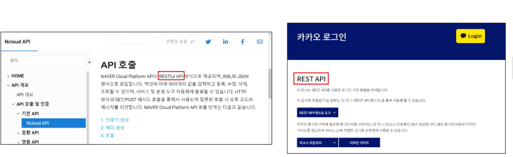

- REST에서 자원을 정의하고 주소를 지정하는 방법
  1. 자원의 식별
    - URI
  2. 자원의 행위
    - HTTP Methods
  3. 자원의 표현
    - JSON 데이터
    - 궁극적으로 표현되는 데이터 결과물

### 자원의 식별
- URI ( Uniform Resource Indentifier ) 통합 자원 식별자
  - 인터넷에서 리소스(자원)를 식별하는 문자열
  - 가장 일반적인 URI는 웹 주소로 알려진 URL

- URL ( Uniform Resource Locator ) 통합 자원 위치
  - 웹에서 주어진 리소스의 주소
  - 네트워크 상에 리소스가 어디 있는지를 알려주기 위한 약속
  - 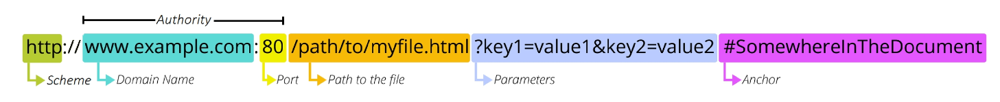

- Schema (or Protocol )
  - 브라우저가 리소스를 요청하는데 사용해야 하는 규약
  - URL의 첫 부분은 브라우저가 어떤 규약을 사용하는지를 나타냄
  - 기본적으로 웹은 HTTP(S)를 요구하며 메일을 열기위한 mailto:, 파일을 전송하기 위한 ftp: 등 다른 포로토콜도 존재

- Domain Name
  - 요청중인 웹 서버를 나타냄
  - 어떤 웹 서버가 요구되는 지를 가리키며 직접 IP주소를 사용하는 것도 가능하지만, 사람이 외우기 어렵기 때문에 주로 Domain Name으로 사용
  - 예를 들어 도메인 google.com의 IP주소는 142.251.42.142

- PORT
  - 웹 서버의 리소스에 접근하는데 사용되는 기술적인 문(Gate)
  - HTTP 프로토콜의 표준 포트
    - HTTP - 80
    - HTTPS - 443
  - 표준포트만 생략가능

- Path
  - 웹 서버의 리소스 경로
  - 초기에는 실제 파일이 위치한 물리적 위치를 나타냈지만, 오늘날은 실제 위치가 아닌 추상회된 형태의 구조를 표현
  - 예를 들어 /articles/create/가 실제 articles 폴더안에 create폴더안을 나타내는 것은 아님

- Parameters
  - 웹서버에 제공하는 추가적인 데이터 
  - '&' 기호로 구분되는 key-value 쌍 목록
  - 서버는 리소스를 응답하기 전에 이러한 파라미터를 사용하여 추가 작업을 수행할 수 있음

- Anchor
  - 일종의 "북마크"를 나타내며 브라우저에 해당 지점에 있는 콘텐츠를 표시
  - fragment identifier( 부분 식별자 )라고 부르는 '#' 이후 부분을 서버에 전송되지 않음
  - https://docs.djangoproject.com/en/4.2/intro/install/#quick-install-guide 요청에서 #quick-install-guide는 서버에 전잘되지 않고 브라우저에서 해당 지점으로 이동할 수 있도록 함

### 자원의 행위
- HTTP Request Methods
  - 리소스에 대한 행위(수행하고자 하는 동작)를 정의
  - HTTP verbs 라고도 함

- 대표 HTTP Request Methods
  1. GET
     - 서버에 리소스의 표현을 요청
     - GET을 사용하는 요청은 데이터만 검색해야 함
  2. POST
     - 데이터를 지정된 리소스에 제출
     - 서버의 상태를 변경
  3. PUT
     - 요청한 주소의 리소스를 수정
  4. DELETE
     - 지정된 리소스를 삭제

- HTTP response status codes
  - 특정 HTTP 요청이 성공적으로 완료되었는지 여부를 나타냄
  - 5개의 응답 그룹
    - information responses ( 100 - 199 )
    - Succesful responses ( 200 - 299 )
    - Redirection messages ( 300 - 399 )
    - Client error responses ( 400 - 499 )
    - Server error responses ( 500 - 599 )

### 자원의 표현
- 그동안 서버가 응답(자원을 표현)했던 것
  - 지금까지 Django 서버는 사용자에게 페이지(html)만 응답하고 있었음
  - 하지만 서버가 응답할 수 있는 것은 페이지 뿐만 아니라 다양한 데이터 타입을 응답할 수 있음
  - REST API는 이 중에서도 JSON 타입으로 응답하는 것을 권장


- 응답 데이터 타입의 변화
  1. 페이지(html)만을 응답하는 서버
     - 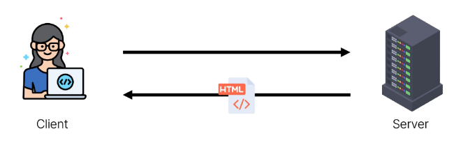
  2. 이제는 JSON 데이터를 응답하는 REST API서버로의 변환
     - 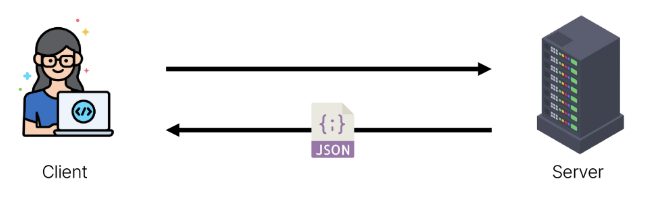
  3. Django는 더이상 Template부분에 대한 역할을 담당하지 않게 되며, Front-end와 Back-end가 분리되어 구성됨
     - 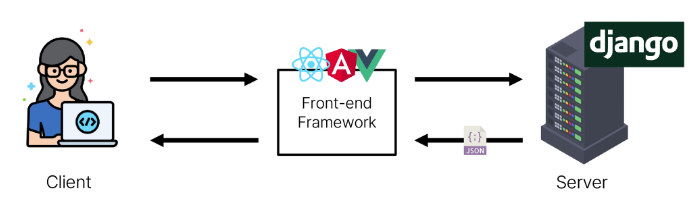
  4. 이제부터 Django를 사용해 RESTful API 서버를 구축할 것
     - 

### 사전준비
- 사전 제공된 99-json-response-practice 기반 시작
- 가상 환경 생성, 활성화 및 패키지 설치
- migrate진행
- 준비된 fixtures파일을 load하여 실습용 초기 데이터 입력
```
python manage.py migrate
python manage.py loaddata articles.json
```
- 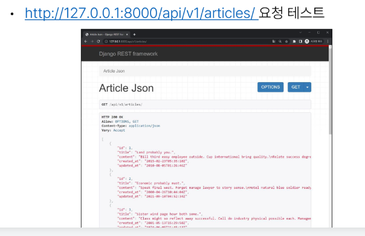

- python으로 json 응답받기
  - 준비된 python-request-sample.py 확인
    - 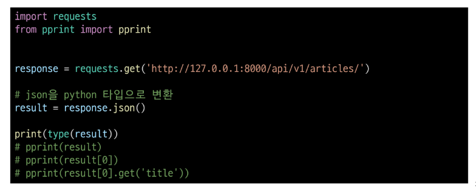

### DRF
- Django REST framework
  - Django에서 Restful API 서버를 쉽게 구축할 수 있도록 도와주는 오픈소스 라이브러리

### Serialization
- Serialization '직렬화'
  - 여러 시스템에서 활용하기 위해 데이터 구조나 객체 상태를 나중에 재구성할 수 있는 포맷으로 변환하는 과정
  - => 어떠한 언어나 환경에서도 나중에 다시 쉽게 사용할 수 있는  포맷으로 변환하는 과정

- Serialization 예시
  - 데이터 구조나 객체 상태를 나중에 재구성할 수 있는 포맷으로 변환하는 과정
    - 
    - 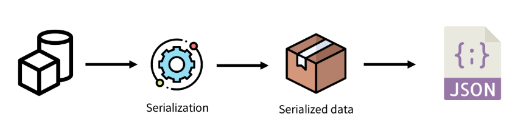

## DRF with Single Model
- 프로젝트 준비
  - 사전 제공된 drf프로젝트 기반 시작
  - 가상 환경 생성, 활성화 및 패키지 설치
  - migrate 진행
  - 준비된 fixtures파일을 load하여 실습용 초기 데이터 입력
    ```
    python manage.py migrate
    python manage.py loaddata articles.json
    ```

- Postman 설치 및 안내
  - Postman 설치
    - API를 구축하고 사용하기 위한 플랫폼
    - API를 빠르게 만들 수 있는 여러 도구 및 기능을 제공
  - 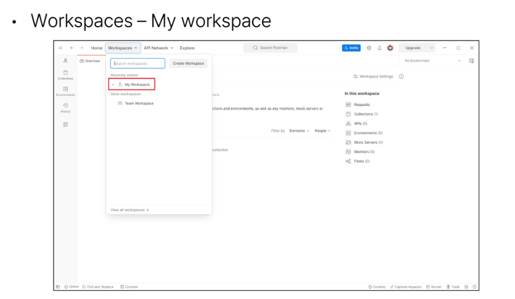

- Postman 화면 구성
  - 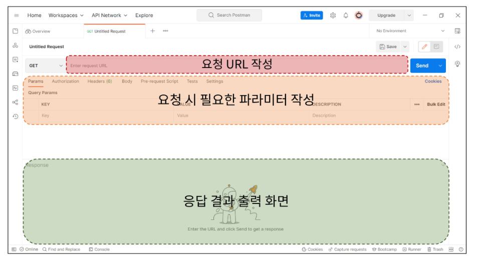

- URl 과 HTTP request methods
  - 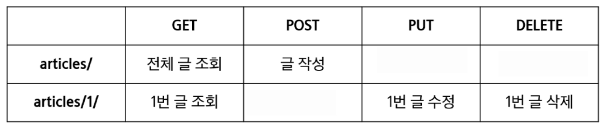

### GET
- GET- List
  1. 게시글 데이터 목록 조회하기
  - 게시글 데이터 목록을 제공하는 ArticleListSerializer 정의
    - 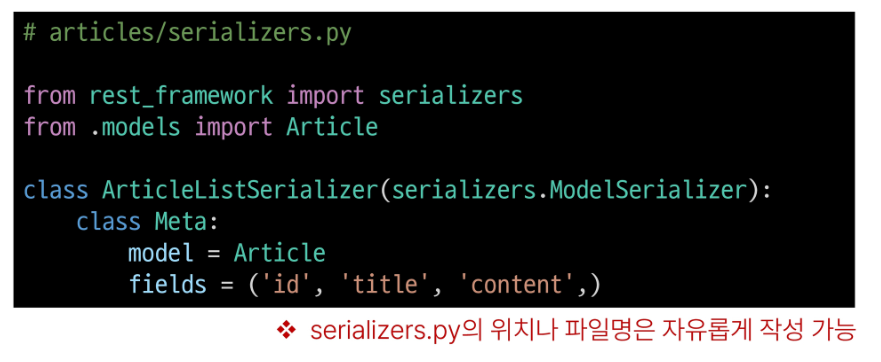
    - ModelSerializer
      - Django 모델과 연결된 Serializer 클래스
  1. url 및 view 함수 작성
     - 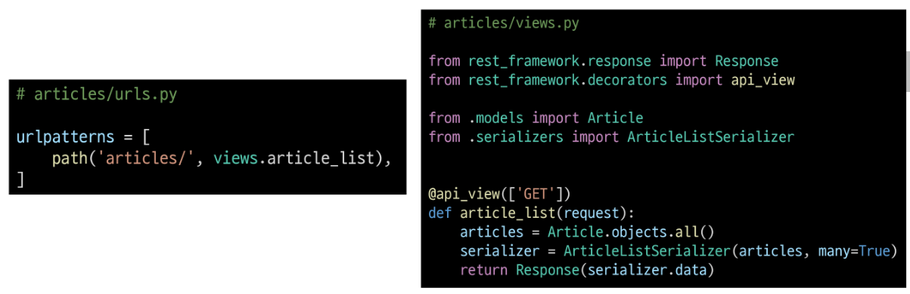
  2. http://127.0.0.1:8000/api/v1/articles/ 응답확인
     - 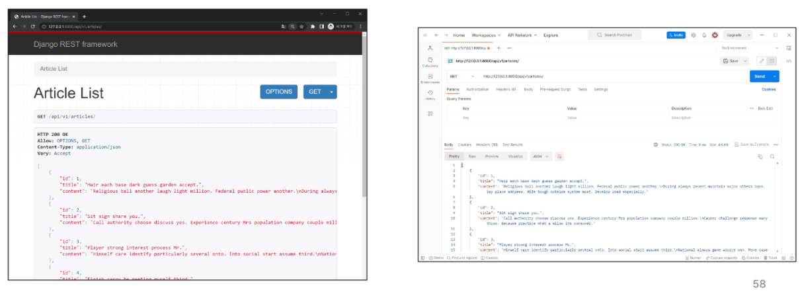
 
- 이전 view함수와의 비교
  - 똑같은 데이터를 HTML에 출력되도록 페이지와 함께 응답했던 과거의 view 함수
  - Json 데이터로 serializataion 하여 페이지 없이 응답하는 현재의 view 함수
  - 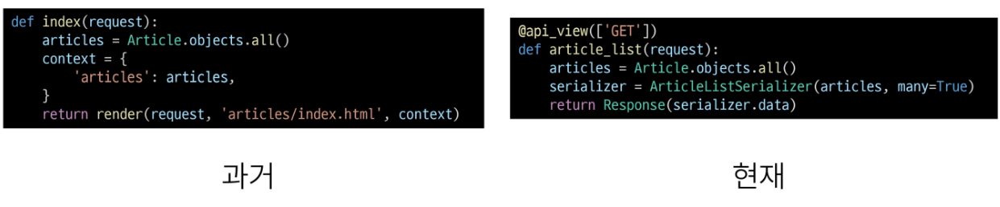

- 'api_view' decorator
  - DRF view 함수에서는 필수로 작성되며 view함수를 실행하기 전 HTTP 메서드를 확인
  - 기본적으로 GET메서드만 허용되며 다른 메서드 요청에 대해서는 405 Method Not Allowed로 응답
  - DRF view 함수가 응답해야하는 HTTP 메서드 목록을 작성

- GET - Detail
  1. 단일 게시글 조회하기
  - 각 게시글의 상세정보를 제공하는 ArticleSerializer 정의
     - 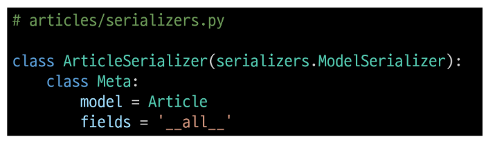
  1. url 및 view 함수 작성 
     - 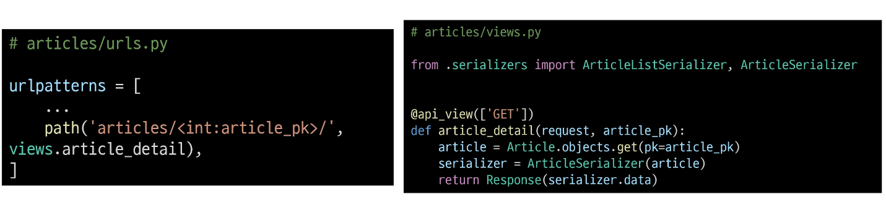
  2. http://127.0.0.1:8000/api/v1/articles/1/ 응답확인
     - 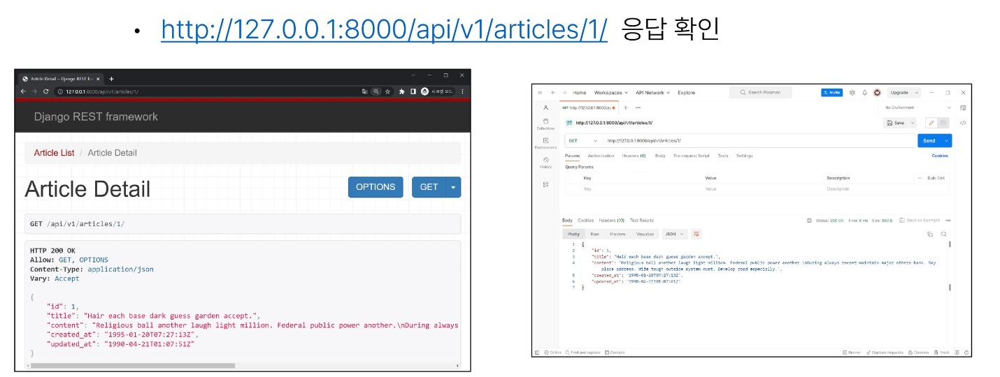

### POST
- 게시글 데이터 생성하기
- 데이터 생성이 성공했을 경우 201 Created 를 응답
- 데이터 생성이 실패 했을 경우 400 Bad request를 응답

- article_list view함수 구조 변경 ( method에 따른 분기처리 )
  - 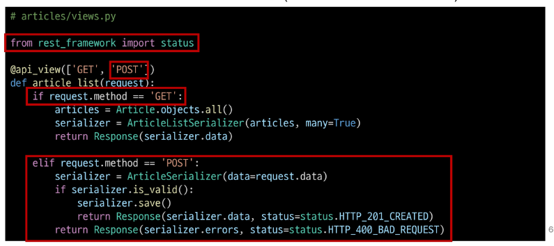

- POST 응답확인
  - http://127.0.0.1:8000/api/v1/articles/
  - 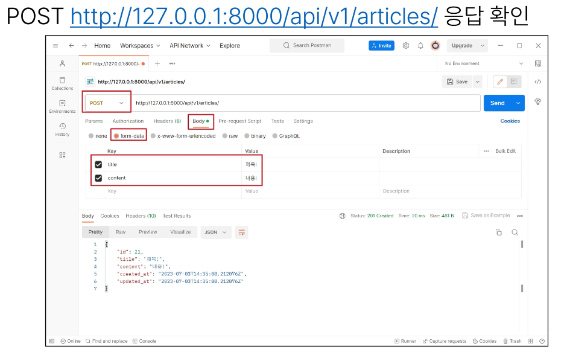

- 새로 생성된 게시글 데이터 확인
- GET http://127.0.0.1:8000/api/v1/articles/21/
  - 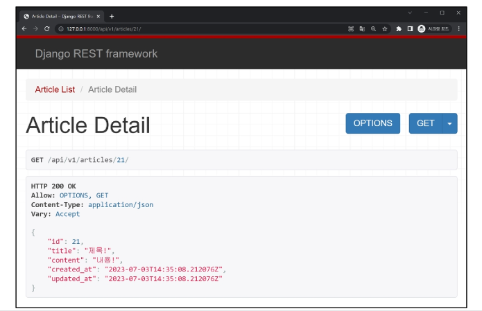

### DELETE
- 게시글 데이터 삭제하기
- 요청에 대한 데이터 삭제가 성공했을 경우는 204 No Content 응답
  - 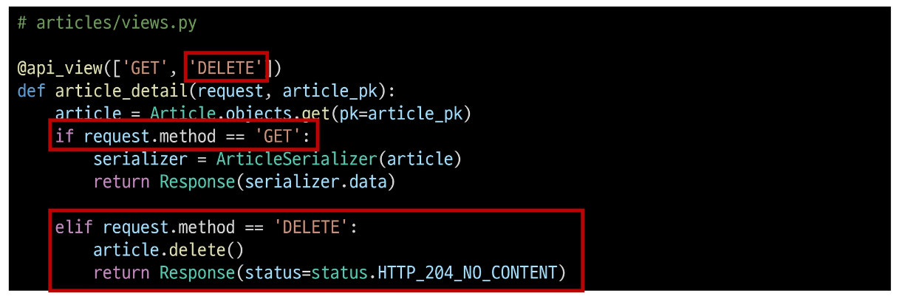

- DELETE http://127.0.0.1:8000/api/v1/articles/21/ 응답확인
  - 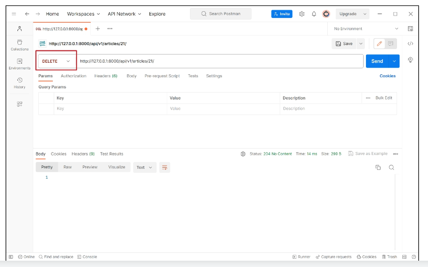

### PUT
- 게시글 데이터 수정하기
- 요청에 대한 데이터 수정이 성공했을 경우는 200 OK 응답
  - 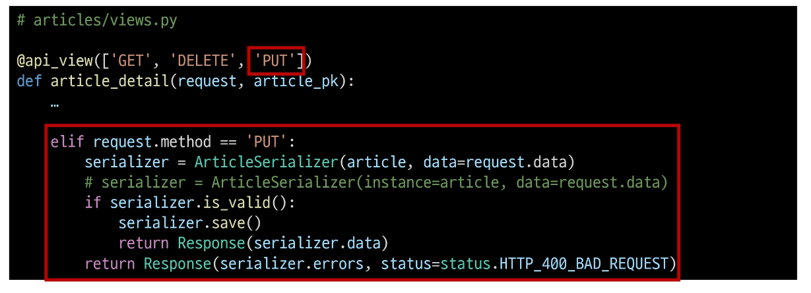

- PUT http://127.0.0.1:8000/api/v1/articles/21/ 응답확인
  - 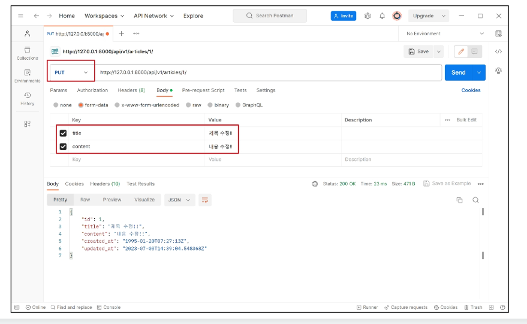

- GET http://127.0.0.1:8000/api/v1/articles/21/ 수정된 데이터 확인
  - 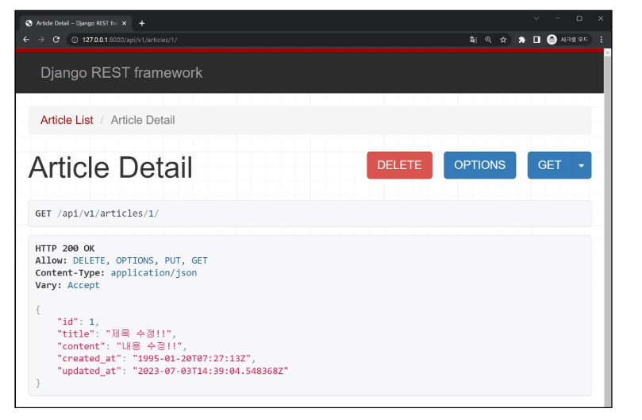

### 참고
- raise_exception
  - is_valid()는 유효성 검사 오류가 있는 경우 ValidationError 예외를 발생시키는 선택적 raise_exception 인자를 사용할 수 있음
  - DRF 에서 제공하는 기본 예외 처리기에 의해 자동으로 처리되며 기본적으로 HTTP 400 응답을 반환
    - 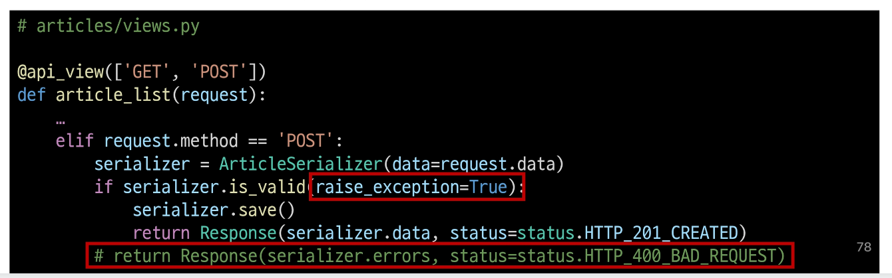

