# 1019 Django REST framework2
## DRF with N:1 Relation
### 사전준비
- Comment 모델 정의
  - comment 클래스 정의 및 데이터베이스 초기화
    - 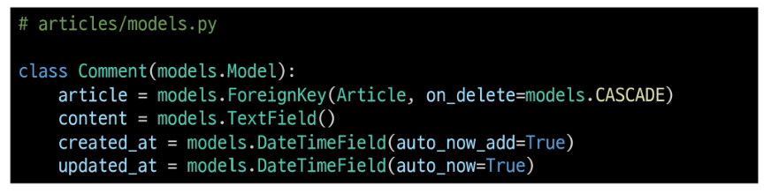
  - Migration 및 fixtures 데이터로드
    - 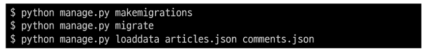

- URL 및 HTTP request method 구성
  - 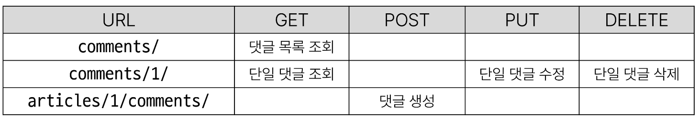

### GET
#### LIST
- 댓글 목록 조회를 위한 CommentSerialize 정의
  - 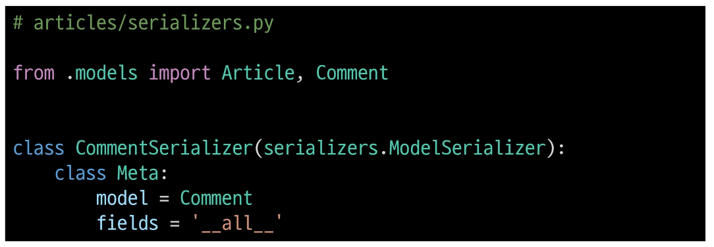

- url작성
  - 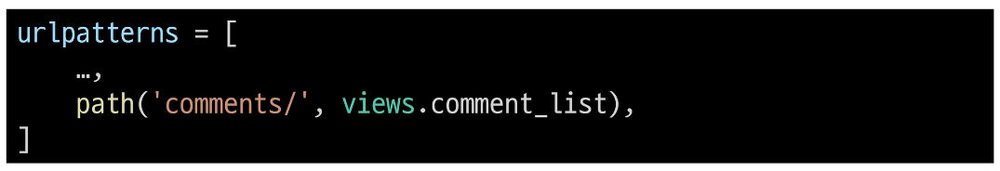

- view 함수 작성
  - 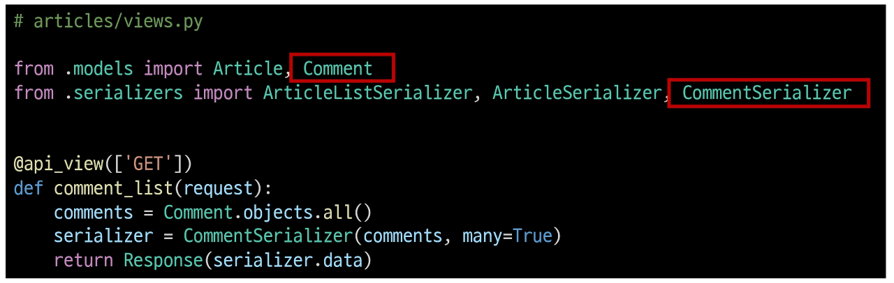

- GET http://127.0.0.1:8000/api/v1/comments/ 응답 확인
  - 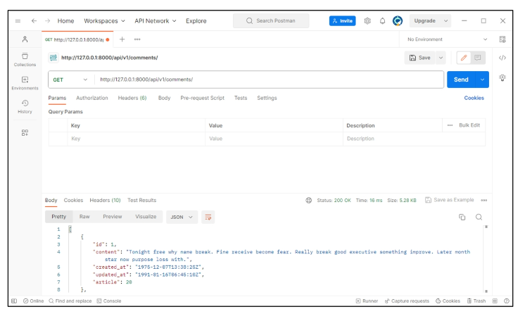

#### Detail
- 단일 댓글 조회를 위한 url 및 view 함수 작성
  - 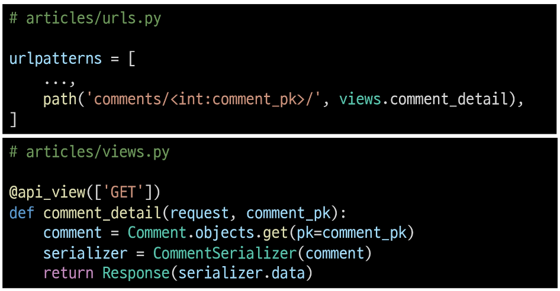

- GET http://127.0.0.1:8000/api/v1/comments/1/ 응답 확인

### POST
- 단일 댓글 생성을 위한 url 및 view 함수 작성
  - 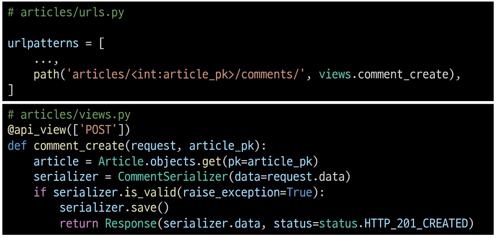

- serializer 인스턴스의 save() 메서드는 특정 Serializer 인스턴스를 저장하는 과정에서 추가 데이터를 받을 수 있음
  - 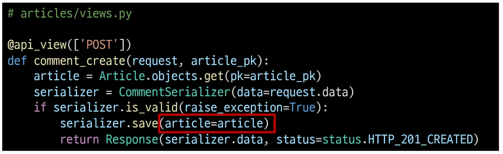

- POST http://127.0.0.1:8000/api/v1/articles/1/comments/ 응답 확인
  - 상태코드 400 응답확인
  - 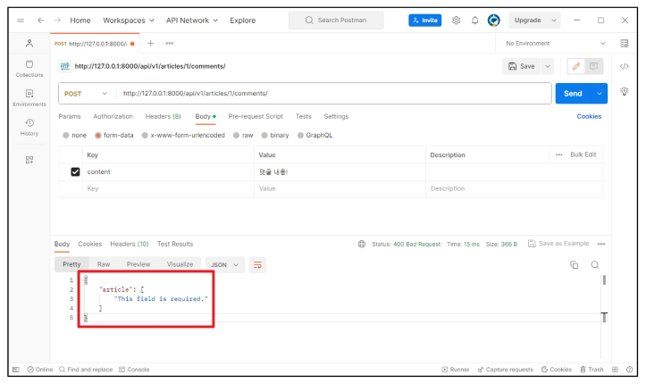

- CommentSerializer에서 외래 키에 해당하는 article field 또한 사용자로부터 입력받도록 설정되어 있기 때문에 서버측에서 누락되었다고 판단한 것

- 읽기 전용 필드
  - 데이터를 전송하는 시점에 "유효성 검사에서 제외시키고, 데이터 조회시에는 출력"하는 필드
  - 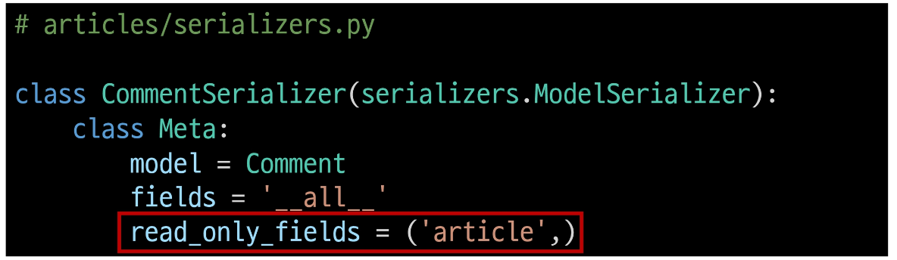

- POST http://127.0.0.1:8000/api/v1/articles/1/comments/ 응답 확인
  - 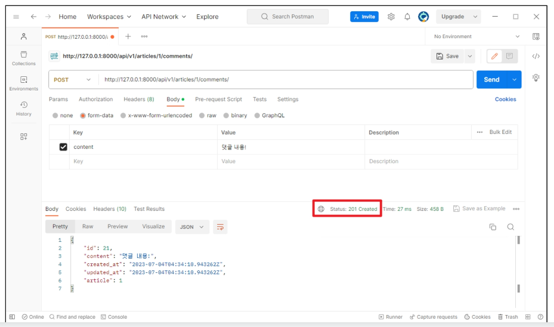

### DELETE & PUT
- 단일 댓글 삭제 및 수정을 위한 view 함수 작성
  - 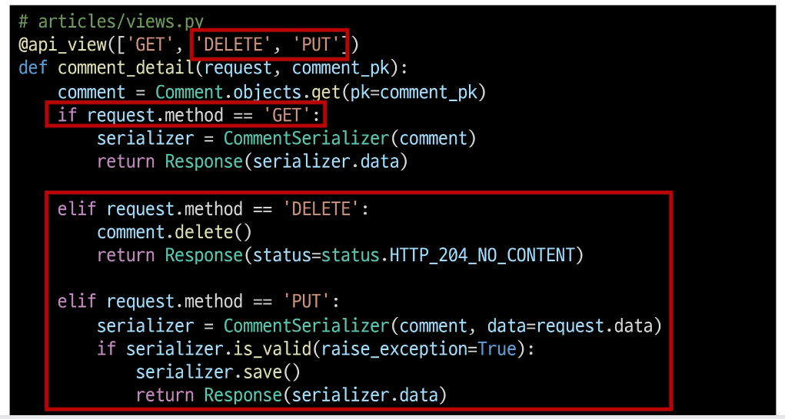

- DELETE http://127.0.0.1:8000/api/v1/comments/21/ 응답 확인
  - 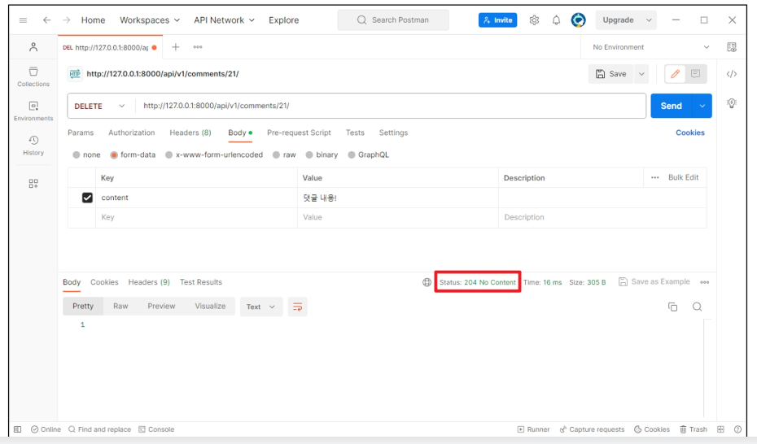

- PUT http://127.0.0.1:8000/api/v1/comments/1/ 응답 확인
  - 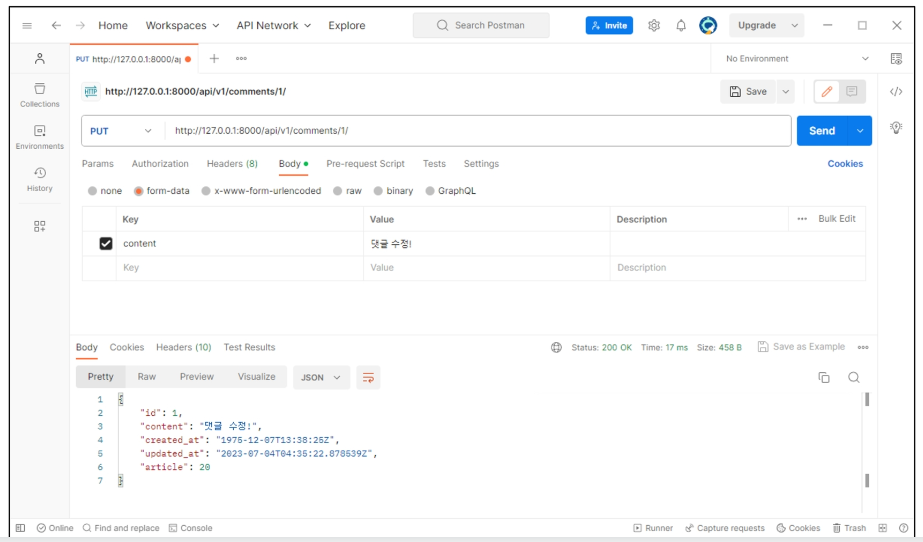

### 응답 데이터 재구성
- 댓글 조회 시 게시글 출력 내역 변경
  - 댓글 조회 시 게시글 번호만 제공해주는 것이 아닌 '게시글의 제목' 까지 제공하기
    - 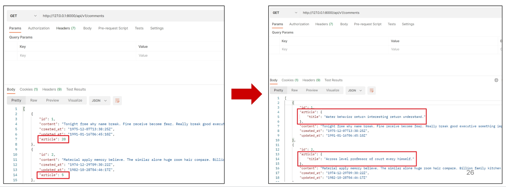

  - 필요한 데이터를 만들기 위한 Serializer는 내부에서 추가 선언 가능
    - 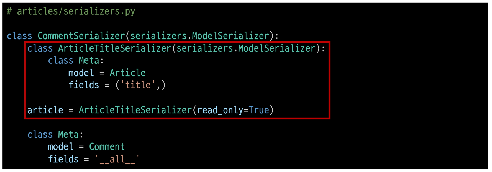

  - GET http://127.0.0.1:8000/api/v1/comments/1/ 응답 확인
    - 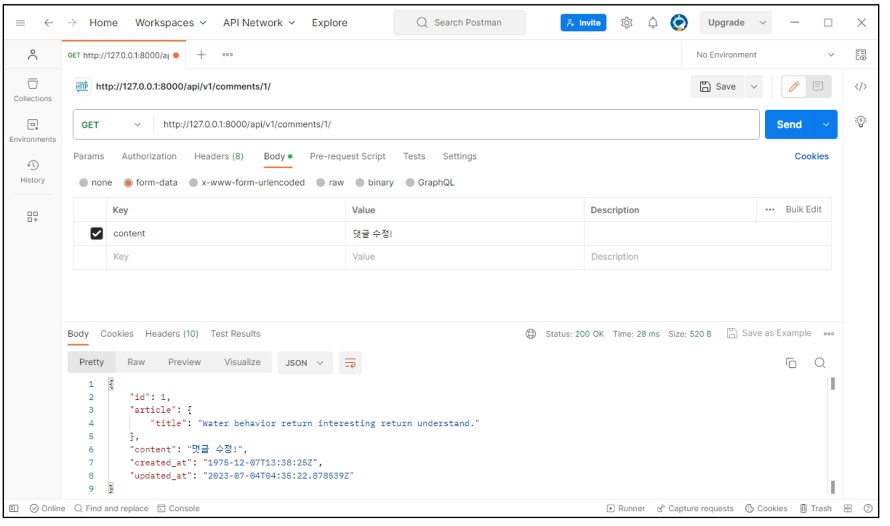

## 역참조 데이터 구성
- Article -> Comment 간 역참조 관계를 활용한 JSON 데이터 재구성
  - 아래 2가지 사항에 대한 데이터 재구성하기
  1. 단일 게시글 조회 시 "해당 게시글에 작성된 댓글 목록 데이터" 도 함께 붙여서 응답
  2. 단일 게시글 조회 시 "해당 게시글에 작성된 댓글 개수 데이터" 도 함께 붙여서 응답

1. 단일 게시글 + 댓글 목록
   - Nested relationships
     - 모델 관계 상으로 참조하는 대상은 참조되는 대상의 표현에 포함되거나 중첩될 수 있음
     - 이러한 중첩된 관계는 serializers를 필드로 사용하여 표현 가능 
     - 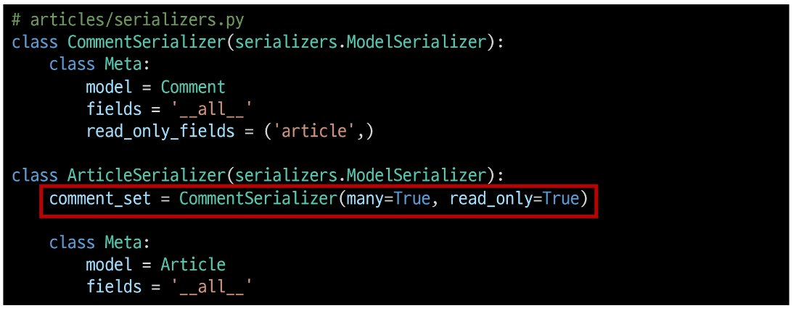
   
   - GET http://127.0.0.1:8000/api/v1/articles/2/ 응답 확인
     - 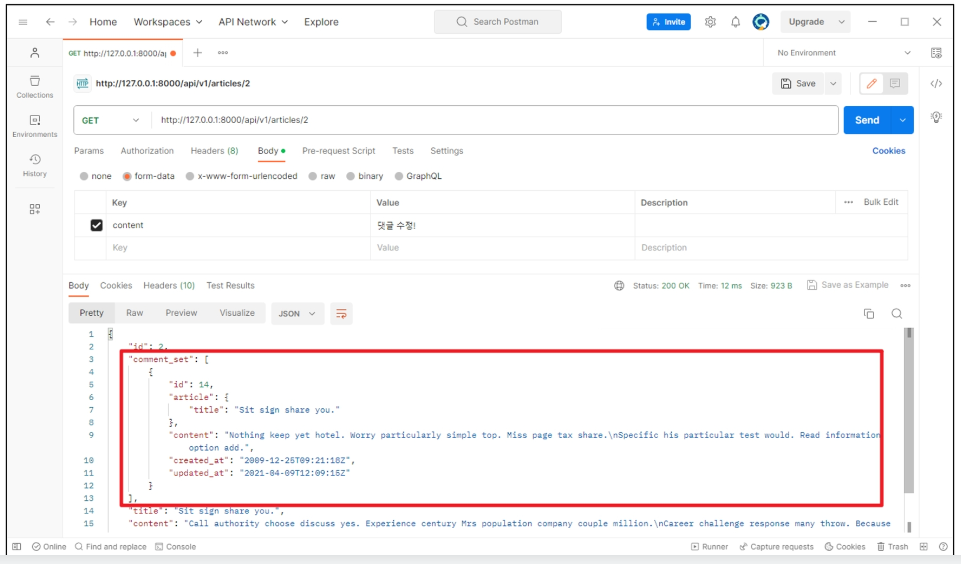

2. 단일 게시글 + 댓글 개수
   - 댓글 개수에 해당하는 새로운 필드 생성
     - 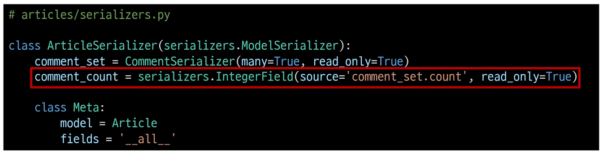
   - 'Source'
     - 필드를 채우는 데 사용할 속성의 이름
     - 점 표기법(dotted notation)을 사용하여 속성을 탐색 할 수 있음
     - 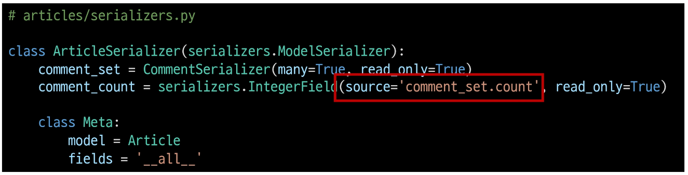
   - GET http://127.0.0.1:8000/api/v1/articles/3/ 응답확인
     - 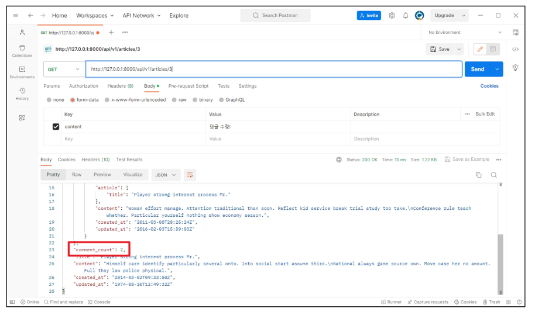

- [주의]읽기 전용 필드 지정 이슈
  - 특정 필드를 override혹은 추가한 경우 read_only_fields는 동작하지 않음
  - 해당 필드의 read_only 키워드 인자로 작성해야함
  - 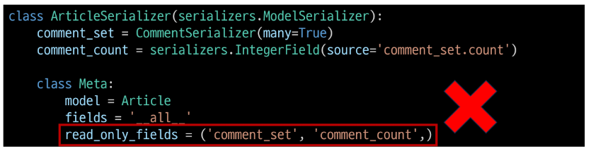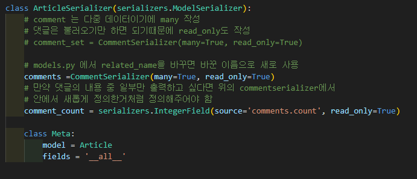

## API 문서화
- OpenAPI Specification ( OAS )
  - RESTful API를 설명하고 시작화하는 표준화된 방법
  - API에 대한 세부사항을 기술할 수 있는 공식 표준

- 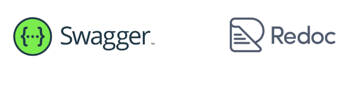
  - OAS기반 API에 대한 문서를 생성하는데 도움을 주는 오픈소스 프레임워크

### drf-spectacular 라이브러리
- https://drf-spectacular.readthedocs.io/en/latest/readme.html#installation
- DRF 위한 OpenAPI 3.0 구조 생성을 도와주는 라이브러리
- 설치 및 등록
  - 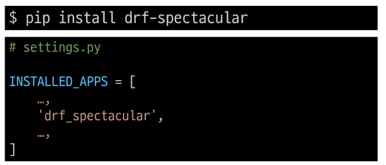

- 관련 설정 코드 입력 (OpenAPI 스키마 자동 생성 코드)
  - 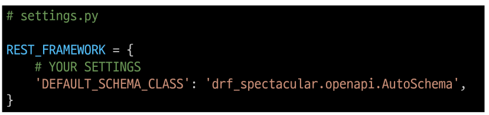

- swagger, redoc 페이지를 제공을 위한 url 작성
  - 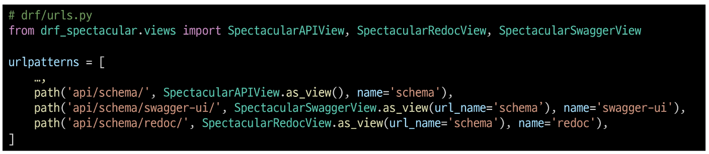

- http://127.0.0.1:8000/api/schema/swagger-ui/ 페이지 확인
  - 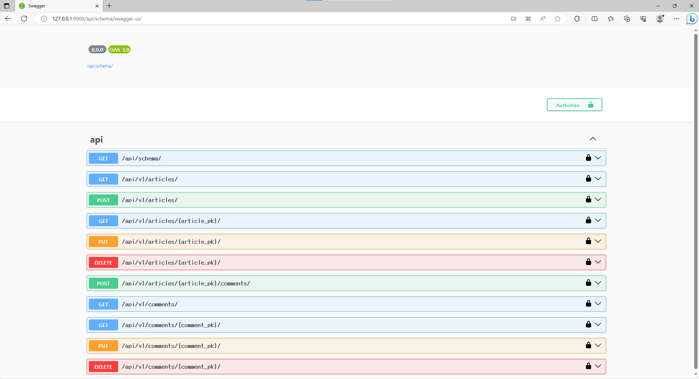

- http://127.0.0.1:8000/api/schema/redoc 페이지 확인
  - 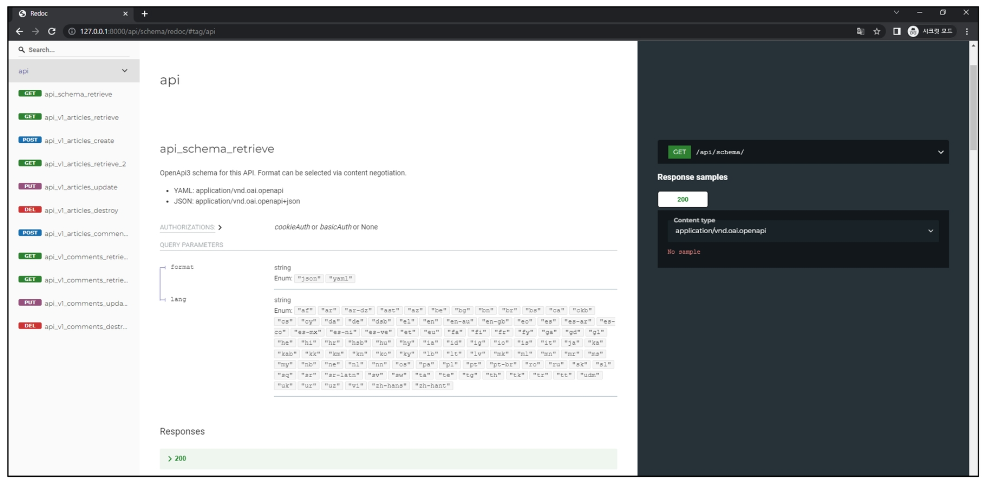

- OAS의 핵심 이점 - "설계 우선" 접근법
  - API를 먼저 설계하고 명세를 작성한 후, 이를 기반으로 코드를 구현하는 방식
  - API의 일관성을 유지하고, API 사용자는 더 쉽게 API를 이해하고 사용할 수 있음
  - 또한 OAS를 사용하면 API가 어떻게 작동하는지를 시각적으로 보여주는 문서를 생성할 수 있으며, 이는 API를 이해하고 테스트하는데 매우 유용
  - 이런 목적으로 사용되는 도구가 Swagger-UI 또는 ReDoc

### 참고
- Django shortcuts functions
  - render()
  - redirect()
  - get_object_or_404()
  - get_list_or_404()

- get_object_or_404()
  - 모델 manager objects에서 get()을 호출하지만, 해당 객체가 없을 땐 기존 DoesNotExist 예외 대신 Http404를 raise 함
  - 적용
    - 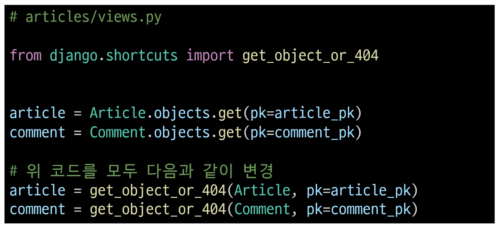

- get_list_or_404()
  - 모델 manager objects 에서 filter()의 결과를 반환하고, 해당 객체 목록이 없을 땐 Http404를 raise 함
  - 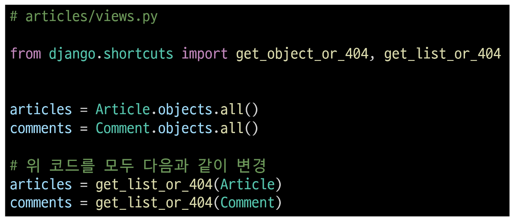

- 적용
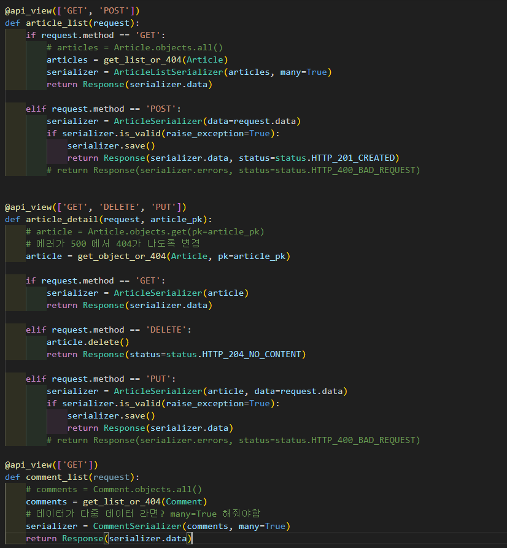

- 적용 전/후 비교
  - 존재하지 않는 게시글 조회시 이전에는 상태 코드 500을 응답했지만 현재는 404를 응답
  - 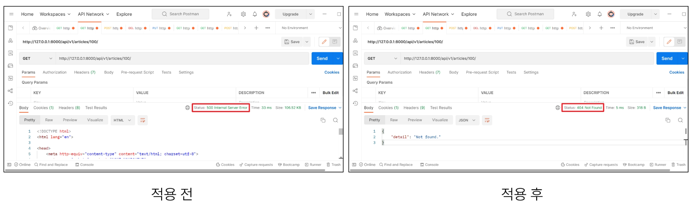

- 왜 사용해야 할까?
  - 클라이언트에게 "서버에 오류가 발생하여 요청을 수행할 수 없다(500)"라는 원인이 정확하지 않은 에러를 제공하기 보다는, 적절한 예외 처리를 통해 클라이언트에게 보다 정확한 에러 현황을 전달하는 것도 매우 중요한 개발 요소 중 하나 이기 때문