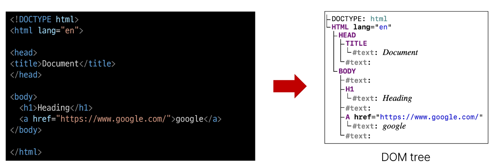
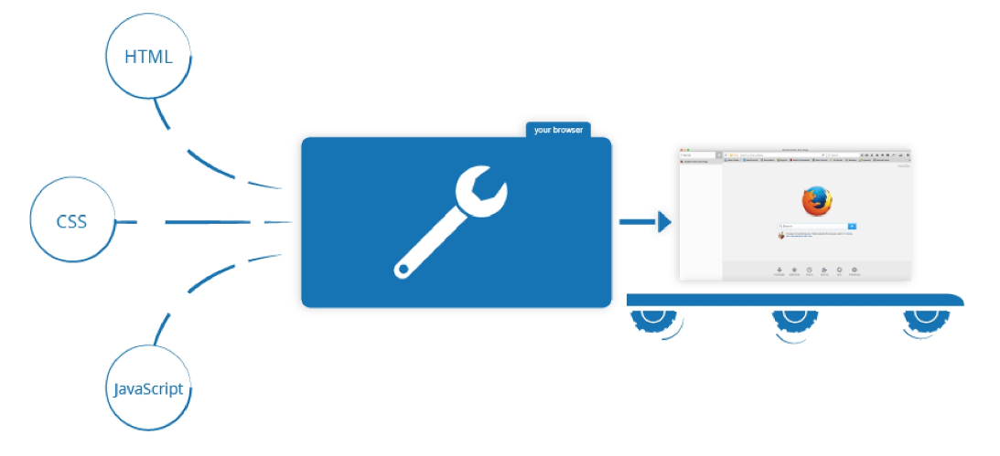
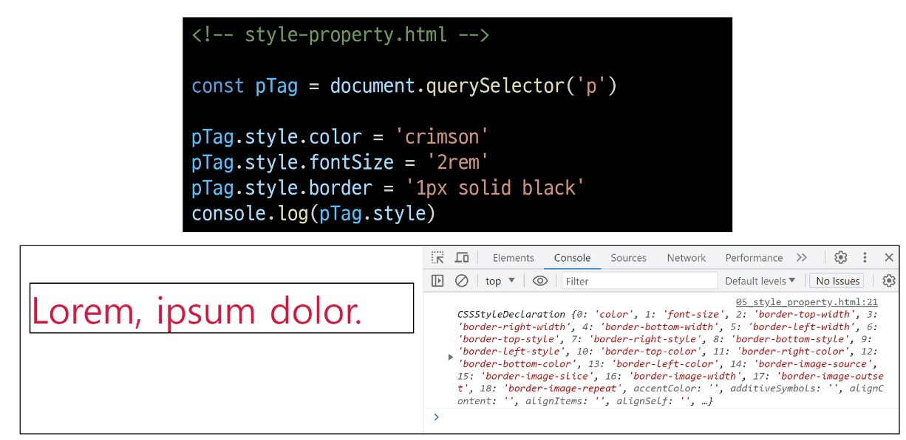

# 1023 Inreoduction of JavaScript
## History of JavaScript
### 웹 브라우저와 JavaScript
- 웹의 탄성 ( 1990 )
  - 팀 버너스리 경이 WWW, 하이퍼텍스트 시스템 고안
  - URL, HTTP 최초 설계 및 구현
  - 초기의 웹은 정적인 텍스트 페이지만을 지원
  - 

- 웹 브라우저의 대중화( 1993 )
  - Netscape사의 최초 상용 웹 브라우저인 Netscape Navigator 출시
  - 당시 약 90% 이상의 시장 점유율을 가짐
  - 

- JavaScript의 탄생( 1995 )
  - 당시 Netscape 소속 개발자 Brandon Eich는 웹의 동적 기능 개발이라는 회사의 요구사항을 넘어 스크립트 언어 Mocha를 개발
  - 이후 LiveScript로 이름을 변경했으나 당시 가장 인기있던 프로그래밍 언어인 Java의 명성에 기대해보고자 JavaScript로 이름을 변경
  - JavaScript는 Netscape Navigator 2.0 에 탑재되어 웹 페이지에 동적 기능을 추가하는데 사용됨
  - 

- JavaScript 파편화 ( 1996 )
  - Microsoft가 자체 웹 브라우저인 인터넷 익스플로러 3.0에 JavaScript와 유사한 언어인 JScript를 도입
  - 이 과정에서 많은 회사들이 자체적으로 JavaScript를 독자적으로 변경하고 이를 자체 브라우저에 탑재
  - => JavaScript 파편화의 시작
  - 

- 1차 브라우저 전쟁 ( 1995 - 2001 )
  - 
  - Microsoft는 IE를 자사 윈도우 운영체제에 내장하여 무료로 배포
  - 빌 게이츠를 필두로 한 Microsoft의 공격적인 마케팅, 자금력 그리고 윈도우 운영체제 점유율 앞에 Netscape는 빠르게 몰락하기 시작
  - IE의 시장 점유율은 2002년 약 96%에 달하며 Microsoft가 승리
  - 추후 Brandon Eich와 함께 Netscape에서 나온 핵심 개발진은 모질라 재단을 설립하여 firefox 브라우저를 출시 (2003)

- 1차 브라우저 전쟁의 영향
  - 웹 표준의 부재로 인해 각 기업에서 자체 표준을 확립하려는 상황이 벌어짐
  - 이는 웹 개발자들에게 큰 혼란을 주었으며, 결국 웹 표준의 중요성을 입식하는 계기가 됨
  - 

- ECMAScript 출시( 1997 )
  - JavaScript의 파편화를 막기 위해 1997년 ECMA에서 ECMAScript라는 표준 언어를 정의
  - 이때부터 JavaScript는 ECMAScript 표준에 기반을 두고 발전하기 시작
  - 

- 2차 브라우저 전쟁 ( 2004 - 2017 )
  - 
  - IE에 독주에 대한 Firefox의 대항
    - 2008년까지 30% 점유율 차지
  - Google의 Chrome 브라우저 출시(2008)
  - Chrome은 출시 3년 만에 Firefox의 점유율을 넘어서고 그로부터 반년 뒤 IE의 점유율을 넘어섬

- 2차 브라우저 전쟁의 영향
  - 웹 표준을 준수하는 Chrome의 등장으로 웹 표준의 중요성이 대두
  - 웹의 기능이 크게 확장되며 웹 애플리케이션의 비약적인 발전을 이끌어감
  - => 웹의 기술적 발전과 웹 표준의 중요성 !

### ECMAScript
- ECMAScript 
  - Ecma International(정보와 통신 시스템을 위한 국제적 표준화 기구)
  - Ecma International이 정의하고 있는 표준화된 스크립트 프로그래밍 언어 명세
  - => 스크립트 언어가 준수해야 하는 규칙, 세부사항등을 제공

- ECMAScript와 JavaScript
  - JavaScript는 ECMAScript 표준을 구현한 구체적인 프로그래밍 언어
  - ECMAScript의 명세를 기반으로 하여 웹 브라우저나 Node.js와 같은 환경에서 실행됨
  - => EMCAScript는 JavaScript의 표준이며, JavaScript는 ECMAScirpt 표준을 따르는 구체적인 프로그래밍 언어
  - => EMCAScript는 언어의 핵심을 정의하고, JavaScript는 ECMAScript 표준을 따라 구현된 언어로 사용됨

- ECMAScript의 역사
  - ECMAScript(ES5)에서 안정성과 생산성을 크게 높임( 2009 )
  - ECMAScript 2015(ES6)에서 객체지향 프로그래밍 언어로써 많은 발전을 이루어, 역사상 가장 중요한 버전으로 평가됨( 2015 )
  - 

- JavaScript의 현재
  - 현재는 Chrome, Firefox, Safari, Microsoft Edge 등 다양한 웹브라우저가 출시되어 있으며, 웹 브라우저 시장이 다양화 되어있음
  - 기존에 JavaScript는 브라우저에서만 웹 페이지의 동적인 기능을 구현하는 데에만 사용되었음
    - 예를 들어, 사용자의 입력에 따라 웹 페이지의 내용이 동적으로 변경되거나, 애니메이션 효과가 적용되는 등의 기능
  - 이후 브라우제엇 벗어나 Node.js와 같은 서버 사이드 분야 뿐만 아니라, 다양한 프레임워크와 라이브러리들이 개발되면서, 웹 개발 분야에서는 필수적인 언어로 자리 잡게됨

## JavaScript & DOM
- 웹 브라우저에서의 JavaScript
  - 웹 페이지의 동적인 기능을 구현

- JavaScript 실행 환경 종류
  - 

- DOM
  - The Document Object Model
  - 웹 페이지(Document)를 구조화된 객체로 제공하여 프로그래밍 언어가 페이지 구조에 접근할 수 있는 방법을 제공
  - => 문서 구조, 스타일, 내용 등을 변경할 수 있도록 함

- DOM 특징
  - DOM에서 모든 요소, 속성, 텍스트는 하나의 객체
  - 모두 document 객체의 자식으로 구성됨
  - 

- DOM tree
  - 브라우저는 HTML 문서를 해석하여 DOM tree 라는 객체 트리로 구조화
  - => 객체간 상속 구조가 존재
  - 

- 브라우저가 웹 페이지를 불러오는 과정
  - 웹 페이지는 웹 브라우저를 통해 해석되어 웹 브라우저 화면에 나타남
  - 

- DOM 핵심
  - 문서의 요소들을 객체로 제공하여 다른 프로그래밍 언어에서 접근하고 조작할 수 있는 방법을 제공하는 API

### document 객체
- 'document' 객체
  - 웹 페이지 객체
  - DOM tree의 진입점
  - 페이지를 구성하는 모든 객체 요소를 포함
  - 

- 'document' 객체 예시
  - HTML의 <'title'> 변경하기
  - 

## DOM 선택
- DOM 조작 시 기억해야 할것
  - 
  - 조작 순서
    1. 조작하고자 하는 요소를 "선택(또는 탐색)"
    2. 선택된 요소의 콘텐츠 또는 속성을 "조작"

### 선택 메서드
- 

- document.querySelector(selector)
  - 제공한 선택자와 일치하는 element 한 개 선택
  - => 제공한 CSS selecotr를 만족하는 첫 번째 element 객체를 반환(없다면 null 반환)

- document.querySelectorALL(selector)
  - 제공한 선택자와 일치하는 여러 element를 선택
  - => 제공한 CSS selector를 만족하는 NodeList를 반환

- DOM 선택 실습
  - 

## DOM 조작
### 속성 조작
- 속성(attribute) 조작
  1. 클래스 속성 조작
  2. 일반 속성 조작

- 클래스 속성 조작
  - 'classList' property
    - 요소의 클래스 목록을 DOMTokenList(유사 배열)형태로 반환

- classList 메서드
  - element.classList.add()
    - 지정한 클래스 값을 추가
  
  - element.classList.remove()
    - 지정한 클래스 값을 제거

  - element.classList.toggle()
    - 클래스가 존재한다면 제거하고 false를 반환
    - (존재하지 않으면 클래스를 추가하고 true 반환)

- 클래스 속성 조작 실습
  - add()와 remove() 메서드를 사용해 지정한 클래스 값을 추가 혹은 제거
  - 
  - 

- 속성 조작 메서드
  - Element.getAttribute()
    - 해당 요소에 지정된 값을 반환(조회)

  - Element.setAttribute(name, value)
    - 지정된 요소의 속성 값을 설정
    - 속성이 이미 있으면 기존 값을 갱신(그렇지 않으면 지정된 이름과 값으로 새 속성이 추가)

  - Element.removeAttribute()
    - 요소에서 지정된 이름을 가진 속성 제거

- 속성 조작 실습
  - 

### HTML 콘텐츠 조작
- HTML 콘텐츠 조작
  - 'textContent' property
    - 요소의 텍스트 콘텐츠를 표현
    - 

- HTML 콘텐츠 조작 실습
  - 

### DOM 요소 조작
- DOM 요소 조작 메서드
  - document.createElement(tagName)
    - 작성한 tagName의 HTML 요소를 생성하여 반환

  - Node.appendChild()
    - 한 Node를 특정 부모 Node의 자식 NodeList 중 마지막 자식으로 삽입
    - 추가된 Node객체를 반환

  - Node.removeChild()
    - DOM에서 자식 Node를 제거
    - 제거된 Node를 반환

- DOM 요소 조작 실습
  - 

### style 조작
- style 조작
  - 'style' property
  - 해당 요소의 모든 style 속성 목록을 포함하는 속성

- style 조작 실습
  - 

### 참고
- Node
  - DOM의 기본 구성 단위
  - DOM 트리의 각 부분은 Node라는 객체로 표현됨
    - Document Node -> HTML 문서 전체를 나타내는 노드
    - Element Node -> HTML 요소를 나타내는 노드 ex) 

    - Text Node -> HTML 텍스트, Element Node 내의 텍스트 컨텐츠를 나타냄
    - Attribute Node -> HTML 요소의 속성을 나타내는 노드

- NodeList
  - DOM 메서드를 사용해 선택한 Node의 목록
  - 배열과 유사한 구조를 가짐
  - Index로만 각 항목에 접근 가능
  - 다양한 배열 메서드 사용 가능
  - querySelectorAll()에 의해 반환되는 NodeList는 DOM의 변경사항을 실시간으로 반영하지 않음

- Element
  - Node의 하위 유형
  - Element는 DOM트리에서 HTML 요소를 나타내는 특별한 유형의 Node
  - 예를 들어, <'p'>, <'div'>, <'span'>, <'body'> 등의 HTML 태그들이 Element 노드를 생성
  - Node의 속성과 메서드를 모두 가지고 있으며 추가적으로 요소 특화된 기능
    - (ex: className, innerHTML, id 등)을 가지고 있음
  - => 모든 Element는 Node이지만, 모든 Node가 Element인 것은 아님!

- DOM 속성 확인 Tip
  - 개발자도구 - Elements - Properties
  - 해당 요소의 모든 DOM 속성 확인
  - 

- Parsing
  - 구문 분석, 해석
  - 브라우저가 문자열을 해석하여 DOM Tree로 만드는 과정
  - 