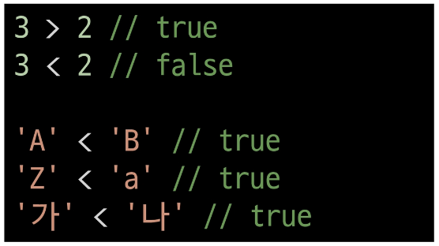
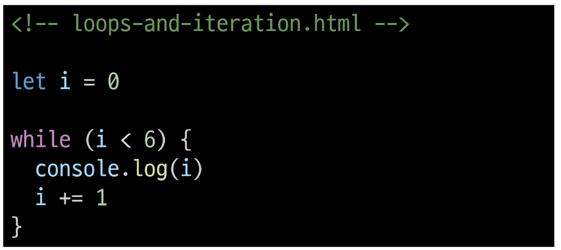
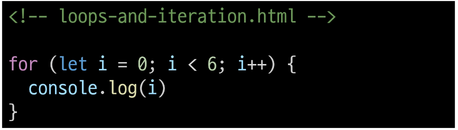

# 1024 Basic syntax of javaScript
## 변수
- JavaScript 문법 학습
  - ECMAScript 2015 (ES6) 이후의 명제를 따름
  - 권장 스타일 가이드
    - https://standardjs.com/rules-kokr.html

- 식별자(변수명) 작성 규칙
  - 반드시 문자, 달러($) 또는 밑줄( _ )로 시작

  - 대소문자를 구분

  - 예약어 사용불가
    - for, if, function 등

  - 카멜 케이스(camelCase)
    - 변수, 객체, 함수에 사용

  - 파스칼 케이스(PascalCase)
    - 클래스, 생성자에 사용

  - 대문자 스네이크 케이스(SNAKE_CASE)
    - 상수(constants)에 사용

- 변수 선언 키워드
  1. let
  2. const
  3. var

- let
  - 블록 스코프(block scope)를 갖는 지역 변수를 선언
  - 재할당 가능
  - 재선언 불가능
  - ES6에서 추가
  - 

- const
  - 블록 스코프를 갖는 지역 변수를 선언
  - 재할당 불가능
  - 재선언 불가능
  - ES6에서 추가
  - 

- 블록 스코프(block scope)
  - if, for 함수 등의 '중괄호({}) 내부'를 가리킴
  - 블록 스코프를 가지는 변수는 블록 바깥에서 접근 불가능
  - 

- 변수 선언 키워드 정리
  - 기본적으로 const 사용을 권장
  - 재할당이 필요한 변수는 let으로 변경해서 사용

## 데이터 타입
- 데이터타입
  - 원시 자료형(Primitive type)
    - Number, String, Boolean, undefined, null
    - 변수에 값이 직접 저장되는 자료형( 불변, 값이 복사 )

  - 참조 자료형(Referenc type)
    - objects( object, Array, Function )
    - 객체의 주소가 저장되는 자료형( 가변, 주소가 복사 )

- 원시 자료형 예시
  - 변수에 할당될 때 값이 복사됨
  - => 변수간에 서로 영향을 미치지 않음
  - 

- 참조 자료형 예시
  - 객체를 생성하면 객체의 메모리 주소를 변수에 할당
  - => 변수간에 서로 영향을 미침
  - 


### 원시 자료형
- Number 
  - 정수 또는 실수형 숫자를 표현하는 자료형
  - 예시
    - 

- String
  - 텍스트 데이터를 표현하는 자료형
  - 예시
    - '+' 연산자를 사용해 문자열 끼리 결합
    - 곱셈, 나눗셈, 뺄셈 불가능
    - 

- Template literals(템플릿 리터럴)
  - 내장된 표현식을 허용하는 문자열 작성 방식
  - Backtick(``)을 이용하여, 여러 줄에 걸쳐 문자열을 정의할 수도 있고 JavasScript의 변수를 문자열 안에 바로 연결할 수 있음
  - 표현식은 '$'와 중괄호로 표기 ( ${expression} )
  - ES6+ 부터 지원
  - 

- null 과 undefined
  - null
    - 변수의 값이 없음을 의도적으로 표현할 때 사용

  - undefined
    - 변수 선언이후 직접 값을 할당하지 않으면 자동으로 할당됨

  - 

- '값이 없음'에 대한 표현이 null과 undefined 2가지인 이유
  - JavaScript의 설계 실수
  - null이 원시 자료형 임에도 불구하고 object로 출력 되는 이유는 javaScript 설계 당시의 버그를 해결하지 않은 것
  - => 해결하지 못하는 이유는 이미 null 타입에 의존성을 띄고 있는 수많은 프로그램이 망가질 수 있기 때문( 하위 호환 유지 )
  - 

- Boolean
  - true/ false
  - 조건문 또는 반복문에서 Boolean이 아닌 데이터 타입은 "자동 형변환 규칙"에 따라 true 또는 false로 변환됨

- 자동 형변환
  - 

## 연산자
- 할당 연산자
  - 오른쪽에 있는 피연산자의 평가 결과를 왼쪽 피연산자에 할당하는 연산자
  - 단축 연산자 지원
  - 

- 증가 & 감소 연산자
  - 증가 연산자( ++ )
    - 피연산자를 증가(1을 더함)시키고 연산자의 위치에 따라 증가하기 전이나 후의 값을 반환
  - 감소 연산자( -- )
    - 피연산자를 감소(1을 뺌)시키고 연산자의 위치에 따라 감소하기 전이나 후의 값을 반환
    
  - => += 또는 -=와 같이 더 명시적인 표현으로 작성 하는 것을 권장

  - 

- 비교 연산자
  - 피연산자들(숫자, 문자, Boolean 등)을 비교하고 결과 값을 boolean으로 반환하는 연산자
  - 

- 동등 연산자( == )
  - 두 피연산자가 같은 값으로 평가되는지 비교 후 boolean 값을 반환
  - '암묵적 타입 변환' 통해 타입을 일치시킨 후 같은 값인지 비교
  - 두 피연산자가 모두 객체일 경우 메모리의 같은 객체를 바라보는지 판별
  - 

- 일치 연산자( === )
  - 두 피연산자의 값과 타입이 모두 같은 경우 true를 반환
  - 같은 객체를 가리키거나, 같은 타입이면서 같은 값인지를 비교
  - 엄격한 비교가 이뤄지며 암묵적 타입 변환이 발생하지 않음
  - 특수한 경우를 제외하고는 동등 연산자가 아닌 "일치 연산자 사용 권장"
  - 

- 논리 연산자
  - and 연산
    - &&
  - or 연산
    - ||
  - not 연산
    - !
  - 단축 평가 지원
  - 

## 조건문
- if 
  - 조건 표현식의 결과값을 boolean타입으로 변환 후 참/거짓을 판단
  - 예시
    - 

- 조건(삼항) 연산자
  - 세 개의 피연산자를 받는 유일한 연산자
  - 앞에서부터 조건문, 물음표(?), '조건문이 참이 경우 실행할 표현식', 콜론(:), '조건문이 거짓일 경우 실행할 표현식'이 배치
  - 

## 반복문
- 반복문의 종류
  - while
  - for
  - for ,,, in
  - for ,,, of

- while
  - 조건문이 참이면 문자을 계속 수행
  - ```JavaScript
    while(조건문) {
        // do something
    } 
    ```
  - 예시
    - 

- for
  - 특정한 조건이 거짓으로 판별될 때까지 반복
  - 
  - 예시
    - 
  - 동작원리
    - 

- for ,,, in
  - 객체의 열겨 가능한 속성(property)에 대해 반복
  - 
  - 예시
    - 

- for ,,, of
  - 반복 가능한 객체(배열, 문자열 등)에 대해 반복
  - 
  - 예시
    - 

- 배열 반복과 for ,, in
  - 배열의 인덱스는 정수 이름을 가진 열거 가능한 속성
  - for ,,, in은 정수가 아닌 이름과 속성을 포함하여 열거 가능한 모든 속성을 반환
  - 내부적으로 for ,,, in 은 배열의 반복자 대신 속성 열거를 사용하기 때문에 특정 순서에 따라 인덱스를 반환하는 것을 보장할 수 없음
  - => 인덱스의 순서가 중요한 "배열에서는 사용하지 않음"
  - => 배열에서는 "for 반복, for ,,, of 반복을 사용"
  - 

- for ,, in 과 for ,, of
  - 

- 반복문 사용 시 const 사용 여부
  - for문
    - for (let i = 0; i < arr.length; i++){ ,,, } 의 경우
    - 최초 정의한 i를 "재할당"하면서 사용하기 때문에 const 사용하면 에러 발생

  - for .. in, for .. of
    - 재할당이 아니라, 매 반복마다 다른 속성 이름이 변수에 지정되는 것이므로 const를 사용해도 에러가 발생하지 않음
    - 단, const 특징에 따라 블록 내부에서 변수를 수정할 수 없음
  
- 반복문 종합
  - 

## 참고
- 세미콜론(semicolon)
  - 자바스크립트는 세미콜론을 선택적으로 사용가능
  - 세미콜론이 없으면 ASI에 의해 자동으로 세미콜론이 삽입됨
    - ASI(Automatic Semicolon insertion, 자동 세미콜론 삽입 규칙)
  - JavaScript를 만든 Brendan Eich 또한 세미콜론 작성을 반대

- 변수 선언 키워드 - 'var'
  - ES6 이전에 변수 선언에 사용했던 키워드
  - 재할당 가능, 재선언 가능
  - "호이스팅"되는 특성으로 인해 예기치 못한 문제 발생 가능
    - 따라서 ES6 이후부터는 var 대신 const와 let을 사용하는 것을 권장
  - 함수 스코프(function scope)를 가짐
  - 변수 선언시 var, const, let 키워드 중 하나를 사용하지 않으면 자동으로 var 선언됨

- 함수 스코프(function scope)
  - 함수의 중괄호 내부를 가리킴
  - 함수 스코프를 가지는 변수는 함수 바깥에서 접근 불가능
  - 

- 호이스팅(hoisting)
  - 변수를 선언 이전에 참조할 수 있는 현상
  - 변수 선언 이전의 위치에서 접근 시 undefined를 반환
  - 
  - JavaScript에서 변수들은 실제 실행시에 코드의 최상단으로 끌어 올려지게 되며(hoisted) 이러한 이유 때문에 var로 선언된 변수는 선언 시에 undefined로 값이 초기화하는 과정이 동시에 발생
  - 

- NaN 을 반환하는 경우 예시
  1. 숫자로서 읽을 수 없음 (Number(undefined))
  2. 결과가 허수인 수학 계산식 (Math.sqrt(-1))
  3. 피연산자가 NaN (7** NaN)
  4. 정의할 수 없는 계산식 (0 * infinity)
  5. 문자열을 포함하면서 덧셈이 아닌 계산식 ('가'/ 3 )

