# 1025 Reference data types
## 함수
- Function
  - 참조 자료형에 속하며 모든 함수는 Function object

- 데이터 타입
  - 원시자료형(Primitive type)
  - 참조자료형(Reference type)
    - objects( object, Array, Function )
    - 객체의 주소가 저장되는 자료형( 가변, 주소가 복사 )

### 함수 정의
- 함수이름
- 함수의 매개변수
- 함수의 body를 구성하는 statement
- return 값이 없다면 undefined를 반환
- 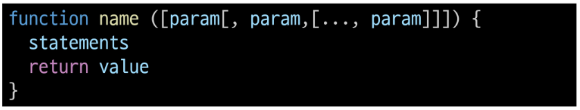

- 함수 정의 2가지 방법
  - 선언식 (function declaration)
    - 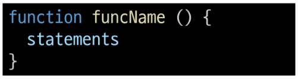
    - 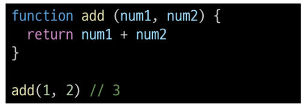
  - 표현식 (function expression)
    - 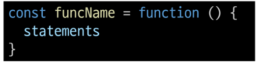
    - 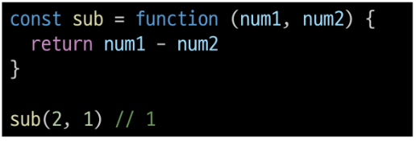

- 함수 표현식 특징
  - 함수 이름이 없는 '익명 함수'를 사용할 수 있음
  - 선언식과 달리 표현식으로 정의한 함수는 호이스팅 되지 않으므로 함수를 정의하기 전에 먼저 사용할 수 없음
  - 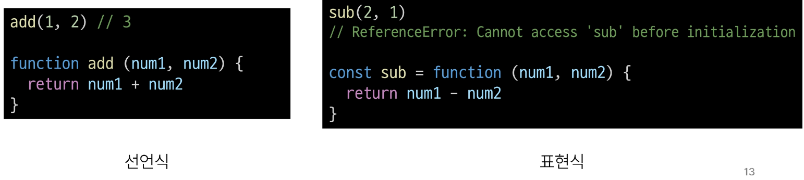

- 함수 선언식과 표현식 종합
  - 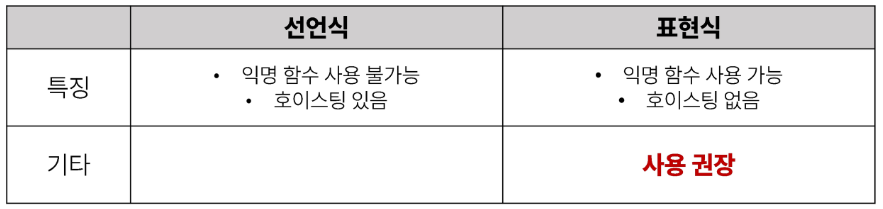

### 매개변수
- 매개변수 정의 방법
  1. 기본 함수 매개변수
  2. 나머지 매개변수

1. 기본 함수 매개변수 (Default function parameter)
  - 값이 없거나 undefined가 전달될 경우 이름 붙은 매개 변수를 기본값으로 초기화
  - 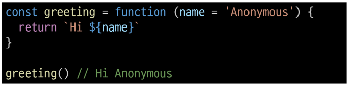
2. 나머지 매개변수 (Rest parameters)
  - 임의의 수의 인자를 '배열'로 허용하여 가변 인자를 나타내는 방법
  - ※ 작성규칙
    - 함수 정의시 나머지 매개변수 하나만 작성할 수 있음
    - 나머지 매개변수는 함수 정의에서 매개변수 마지막에 위치해야 함
    - 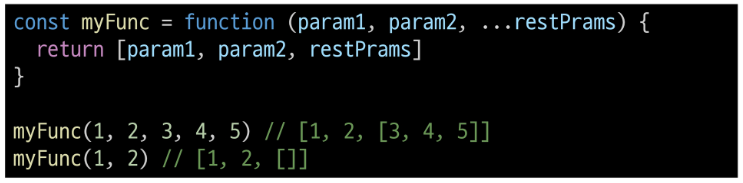

- 매개변수와 인자의 개수 불일치
  - 매개변수 개수 > 인자 개수
  - => 누락된 인자는 undefined로 할당
  - 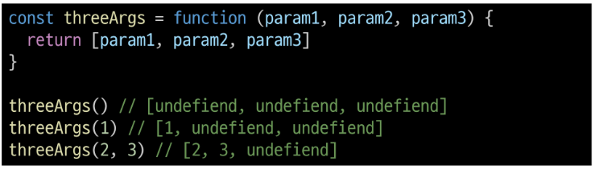

  - 매개변수 개수 < 인자 개수
  - => 초과 입력한 인자는 사용하지 않음
  - 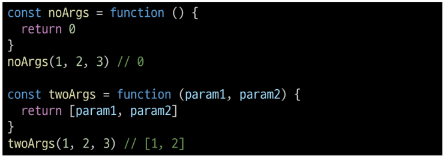

### spread syntax
- " ... " 
  - spread syntax 
  - 전개구문 

- 전개 구문
  - 배열이나 문자열과 같이 반복 가능한 항목을 펼치는 것(확장, 전개)
  - 전개 대상에 따라 역할이 다름
    - => 배열이나 객체의 요소를 개별적인 값으로 분리하거나 다른 배열이나 객체의 요소를 현재 배열이나 객체에 추가하는 등
  1. 함수와의  사용
     1. 함수 호출시 인자 확장
     2. 나머지 매개변수(압축) 
  2. 객체와의 사용 (객체 파트에서 진행)
  3. 배열과의 활용 (배열 파트에서 진행)

- 전개 구문 활용
  - 함수와의 사용
    1. 함수 호출시 인자 확장
       - 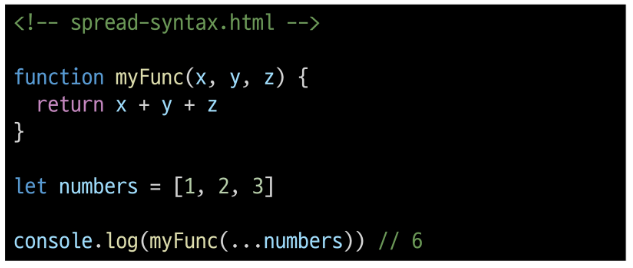
    2. 나머지 매개변수 (압축)
       - 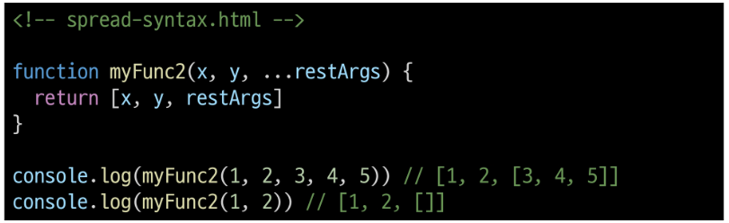

### 화살표 함수
- 화살표 함수 표현식 (Arrow function expression)
  - 함수 표현식의 간결한 표현법

- 화살표 함수 작성 결과
  - 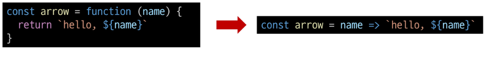

- 화살표 함수 작성 과정
  1. function 키워드 제거 후 매개변수와 중괄호 사이에 화살표(=>) 작성
     - 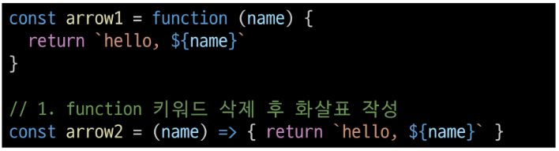
  2. 함수의 매개변수가 하나뿐이라면, 매개변수의 '()' 제거 가능
     - (단, 생략하지 않는 것을 권장)
     - 실제론 2번부터 거의 하지 않음
     - 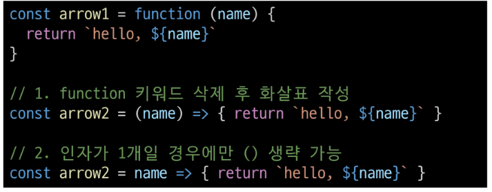
  3. 함수 본문의 표현식이 한줄이라면, '{}'와 'return' 제거 가능
     - 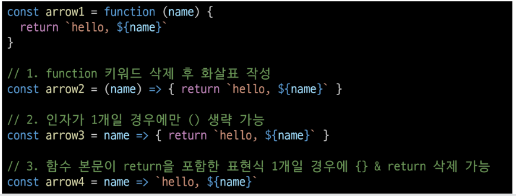

### 참고
- 화살표 함수 심화
  - 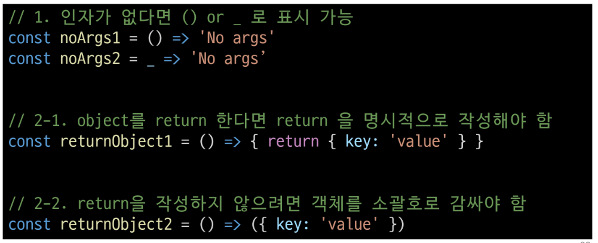

## 객체
- object
  - 키로 구분된 데이터 집합을 저장하는 자료형

### 구조 및 속성
- 객체 구조
  - 중괄호를 이용해 작성
  - 중괄호 안에는 key:value 쌍으로 구성된 속성(property)를 여러 개 작성 가능
  - key는 문자형만 허용
  - value는 모든 자료형 허용
  - 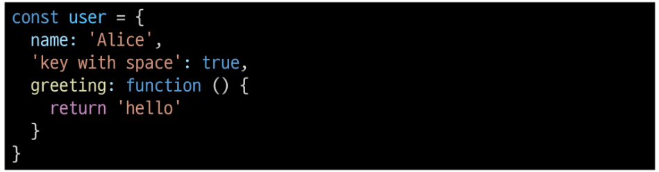

- 속성 참조
  - 점(' . ', chaining operator) 또는 대괄호([])로 객체 요소 접근
  - key 이름에 띄어쓰기 같은 구분자가 있으면 대괄호만 접근 가능
  - 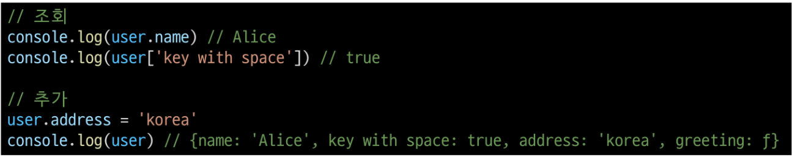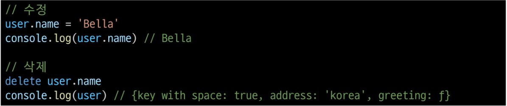

- 'in' 연산자
  - t속성이 객체에 존재하는지 여부를 확인
  - 

### 객체와 함수
- Method
  - 객체 속성에 정의된 함수

- Method 사용 예시
  - object.method() 방식으로 호출
  - 메서드는 객체를 '행동'할 수 있게 함
  - 

### this
- Method
  - 객체 속성에 정의된 함수
  - => this 키워드를 사용해 객체에 대한 특정한 작업을 수행할 수 있음

- 'this' keyword
  - 함수나 메서드를 호출한 객체를 가리키는 키워드
  - => 함수내에서 객체의 속성 및 메서드에 접근하기 위해 사용

- Method & this 사용 예시
  - 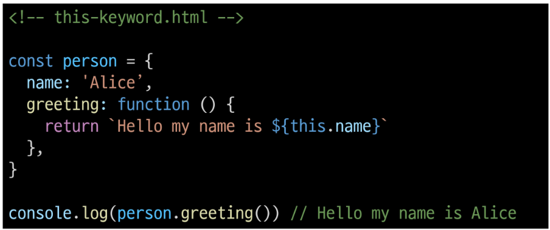

- JavaScript에서 this는 함수를 "호출하는 방법"에 따라 가리키는 대상이 다름
  - 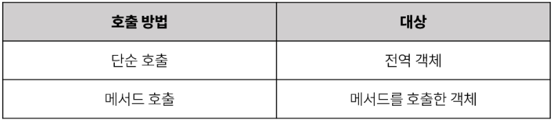

1. 단순 호출시 this
  - 가리키는 대상 => 전역 객체
  - 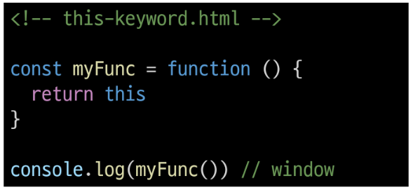

2. 메서드 호출시 this
  - 가리키는 대상 => 메서드를 호출한 객체
  - 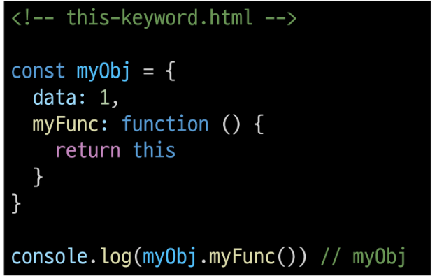

3. 중첩된 함수에서의 this 문제점과 해결책
  - 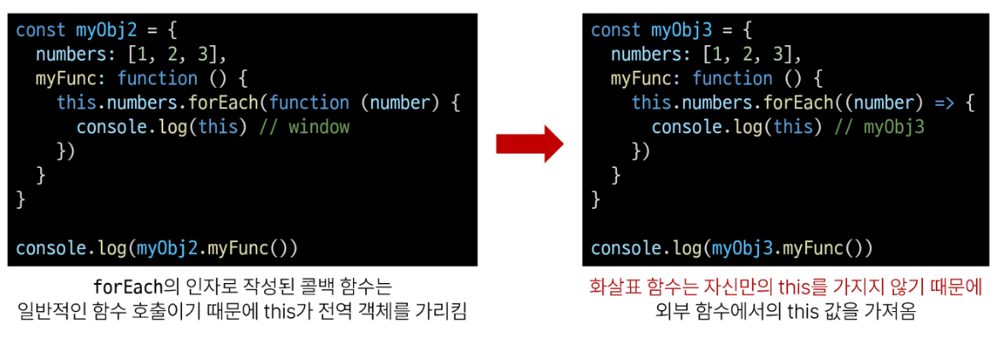

- JavaScript 'this' 정리
  - JavaScript에서 this는 함수가 "호출되는 방식"에 따라 결정되는 현재 객체를 나타냄
  - JavaScript의 함수는 호출될 때 this를 암묵적으로 전달 받음
  - Python의 self와 Java의 this가 선언 시 값이 이미 정해지는 것에 비해 JavaScript의 this는 "함수가 호출되기 전까지 값이 할당되지 않고 호출시에 결정됨"(동적할당)

### 추가 객체 문법
1. 단축 속성
  - 키 이름과 값으로 쓰이는 변수의 이름이 같은 경우 단축 구문을 사용할 수 있음
  - 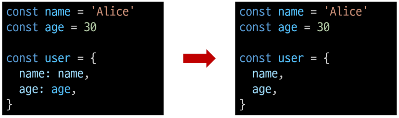

2. 단축 메서드
  - 메서드 선언시 function 키워드 생략 가능
  - 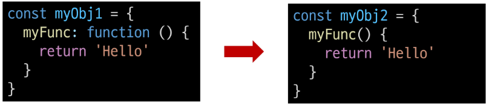

3. 계산된 속성(computed property name)
  - 키가 대괄호([])로 둘러싸여 있는 속성
  - => 고정된 값이 아닌 변수 값을 사용할 수 있음
  - 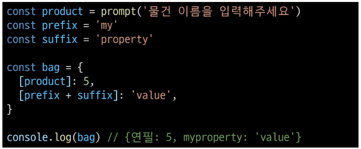

4. 구조 분해 할당 (destructing assignment)
  - 배열 또는 객체를 분해하여 속성을 변수에 쉽게 할당할 수 있는 문법
  - 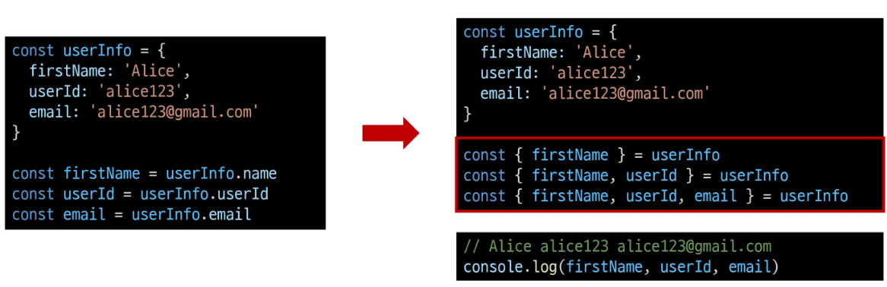

4. 구조 분해 할당 활용
  - '함수의 매개변수'로 객체 구조 분해 할당 활용 가능
  - 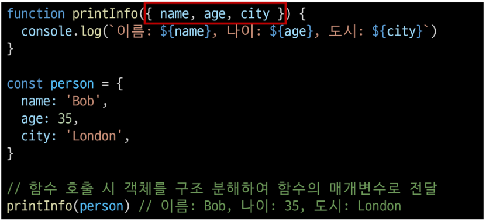

5. object with '전개 구문'
  - "객체 복사"
    - 객체 내부에서 객체 전개
  - 얕은 복사에 활용 가능
  - 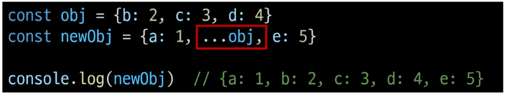

6. 유용한 객체 메서드
  - object.keys()
  - object.values()
  - 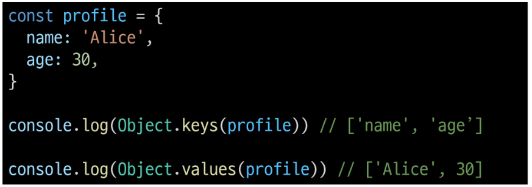

7. Optional chaining ('?.')
  - 속성이 없는 중첩 객체를 에러 없이 접근할 수 있음
  - 만약 참조 대상이 null 또는 undefined 라면 에러가 발생하는 것 대신 평가를 멈추고 undefined를 반환
  - 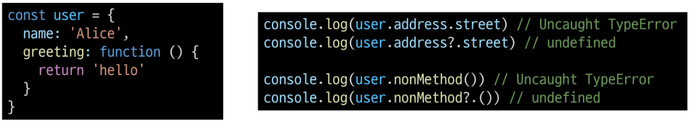
  - Optional chaining이 없다면 다음과 같이 '&&'연산자를 사용해야 함
  - 

7. Optional chaining 장점
  - 참조가 누락될 가능성이 있는 경우 연결된 속성으로 접근할 때 더 짧고 간단한 표현식을 작성할 수 있음
  - 어떤 속성이 필요한지에 대한 보증이 확실하지 않는 경우에 객체의 내용을 보다 편리하게 탐색할 수 있음

7. Optional chaining 주의사항
   1. Optional chaining은 존재하지 않아도 괜찮은 대상에만 사용해야 함(남용X)
       - 왼쪽 평가 대상이 없어도 괜찮은 경우에만 선택적으로 사용
       - 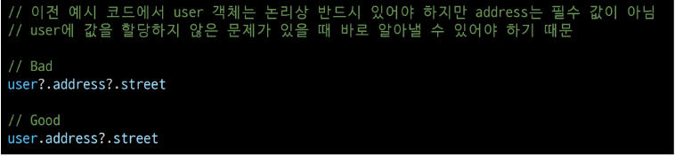
   2. Optional chaining앞의 변수는 반드시 선언되어 있어야 함 
       - 

7. Optional chaining 요약
   1. obj?.prop
      - obj가 존재하면 obj.prop을 반환하고, 그렇지 않으면 undefined를 반환
   2. obj?.[prop]
      - obj가 존재하면 obj[prop]을 반환하고, 그렇지 않으면 undefined를 반환
   3. obj?.method()
      - obj가 존재하면 obj.method()을 호출하고, 그렇지 않으면 undefined를 반환

### JSON
- JSON
  - JavaScript Object Notation
  - key-value 형태로 이루어진 자료 표기법
  - JavaScript의 object와 유사한 구조를 가지고 있지만 JSON은 형식이 있는 "문자열"
  - JavaScript에서 JSON을 사용하기 위해서는 Object 자료형으로 변경해야 함

- Object <-> JSON 변환하기
  - 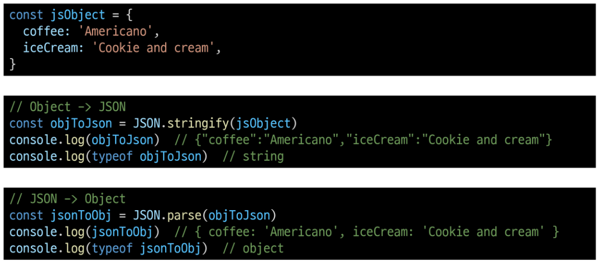

### 참고
- new 연산자
  - JS에서 객체를 하나 생성한다고 한다면?
    - 하나의 객체를 선언하여 생성
  - 동일한 형태의 객체를 또 만든다면?
    - 또 다른 객체를 선언하여 생성해야 함
  - 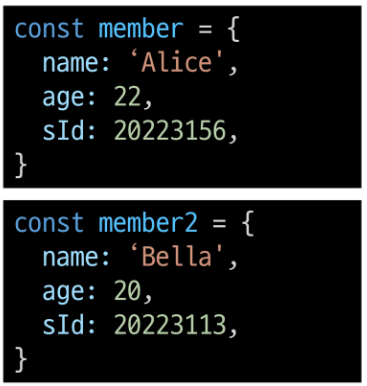
  - 사용자 정의 객체 타입을 생성
  - 매개변수
    1. constructor : 객체 인스턴스의 타입을 기술(명세)하는 함수  
    2. arguments : constructor과 함께 호출될 값 목록

    - new constructor[ ( [ arguments ] ) ]

- new 연산자 활용
  - 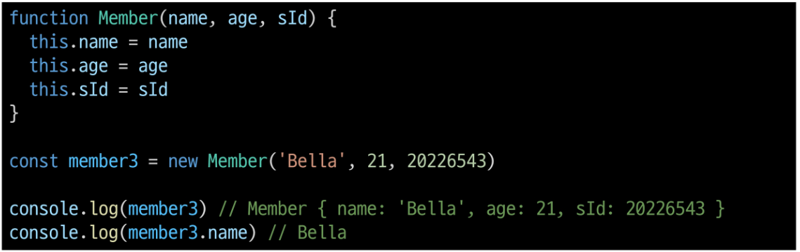

- JavaScript 'this' 장단점
  - this가 미리 정해지지 않고 호출 방식에의해 결정되는 것은
  - 장점
    - 함수(메서드)를 하나만 만들어 여러 객체에서 재사용할 수 있다는 것
  - 단점
    - 이런 유연함이 실수로 이어질 수 있다는 것
  - => 개발자는 this의 동작 방식을 충분히 이해하고 장점을 취하면서 실수를 피하는 데에 집중

## 배열
- Object
  - 키로 구분된 데이터 집합(data collection)을 저장하는 자료형
  - => 이제는 순서가 있는 collection이 필요

- Array 배열
  - 순서가 있는 데이터 집합을 저장하는 자료구조

- 배열 구조
  - 대괄호( [] )를 이용해 작성
  - 배열 요소 자료형 : 제약 없음
  - length 속성을 사용해 배열에 담긴 요소가 몇 개 인지 알 수 있음
  - 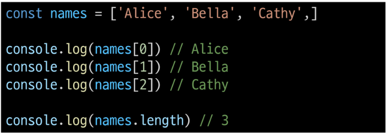

### 배열과 메서드
- 주요 메서드
  - 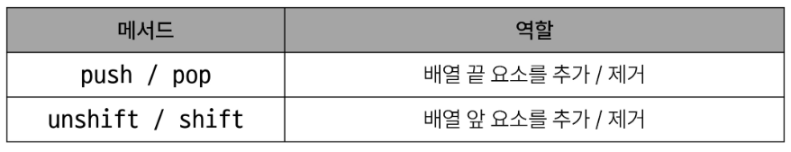

- pop()
  - 배열 끝 요소를 제거하고, 제거한 요소를 반환
  - 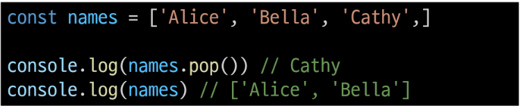

- push()
  - 배열 끝에 요소를 추가
  - 

- shift()
  - 배옆 앞 요소를 제거하고, 제거한 요소를 반환
  - 

- unshift()
  - 배열 앞에 요소를 추가
  - 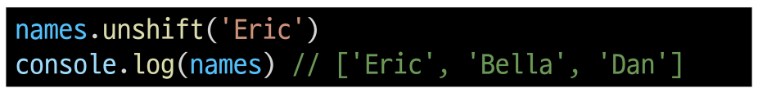

### Array helper method
- Array helper method
  - 배열을 순회하며 특정 로직을 수행하는 메서드
  - => 메서드 호출 시 인자로 함수(콜백 함수)를 받는 것이 특징

- 주요 Array helper method
  - 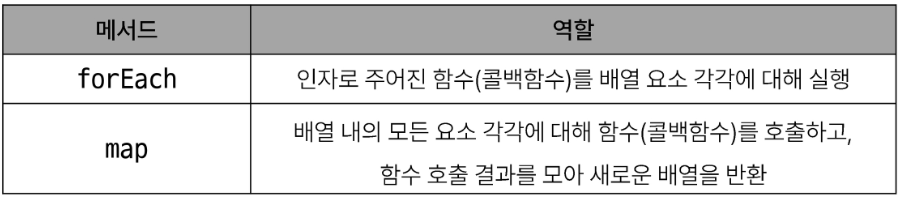

- forEach()
  - 인자로 주어진 함수(콜백 함수)를 배열 요소 각각에 대해 실행
  - 구조
    - arr.forEach(callback(item[, index[, array]]))
    - 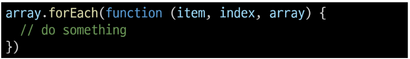
    - 콜백 함수 3가지 매개변수로 구성
      1. item : 처리할 배열의 요소
      2. index : 처리할 배열 요소의 인덱스(선택 인자)
      3. array : forEach를 호출한 배열(선택 인자)
  -  반환 값 : undefined

- forEach 활용
  - 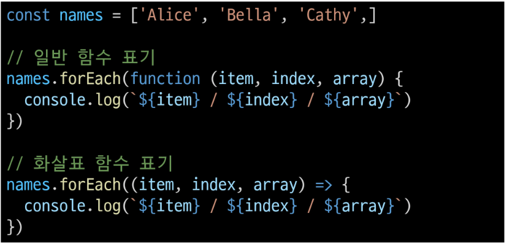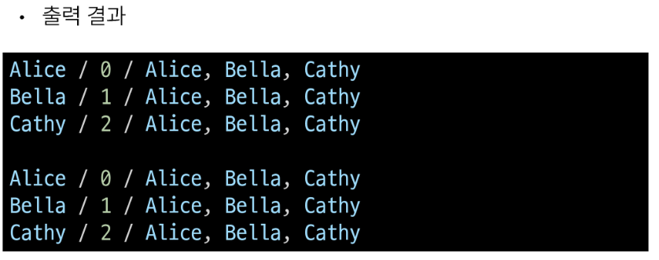

- 콜백 함수 (Callback function)
  - 다른 함수에 인자로 전달되는 함수
  - => 외부 함수 내에서 호출되어 일종의 루틴이나 특정 작업을 진행

- 콜백 함수 예시
  - 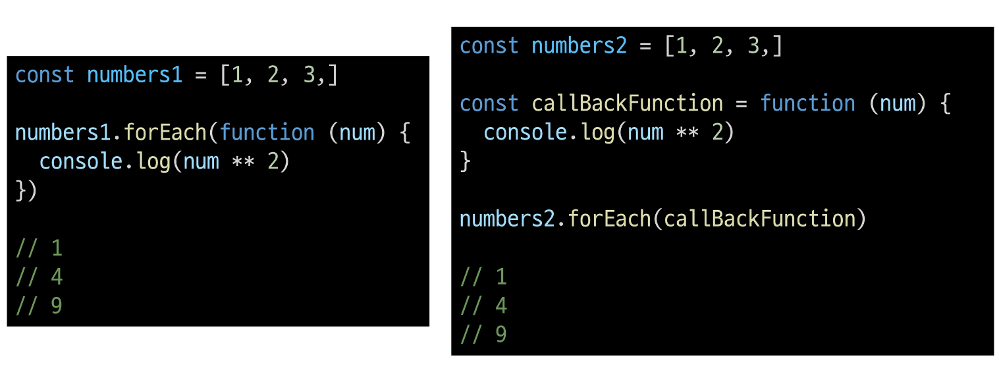

- map()
  - 배열 내의 모든 요소 각각에 대해 함수(콜백 함수)를 호출하고, 함수 호출 결과를 모아 "새로운 배열을 반환"
  - 구조
    - arr.map(callback(item[, index[, array]]))
    - 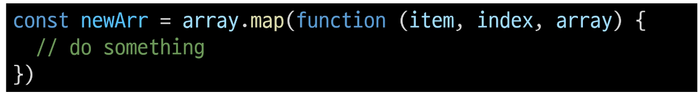
       1. item : 처리할 배열의 요소
       2. index : 처리할 배열의 요소의 인덱스(선택인자)
       3. array : map을 호출한 배열(선택인자)
     - 반환값 : 배열의 각 요소에 대해 실행한 "callback의 결과를 모은 새로운 배열"
       - => 기본적으로 forEach동작 원리와 같지만 forEach와 달리 새로운 배열을 반환함

- map 활용
  - 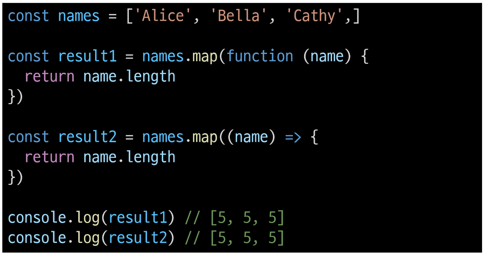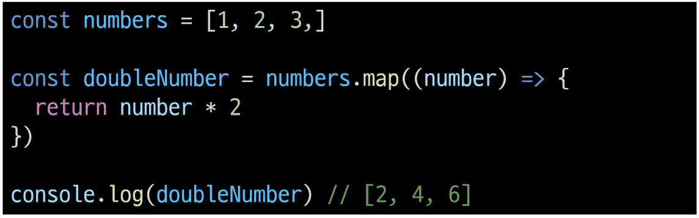

- python에서 map 함수와 비교
  - python의 map에 square 함수를 인자로 넘겨 numbers 배열의 각 요소를 square함수의 인자로 사용하였음
    - 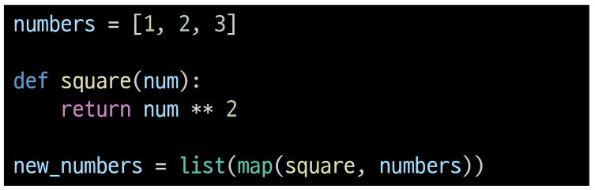
  - map 메서드에 callBackFunc함수를 인자로 넘겨 numbers 배열의 각 요소를 callBackFunc 함수의 인자로 사용하였음
    - 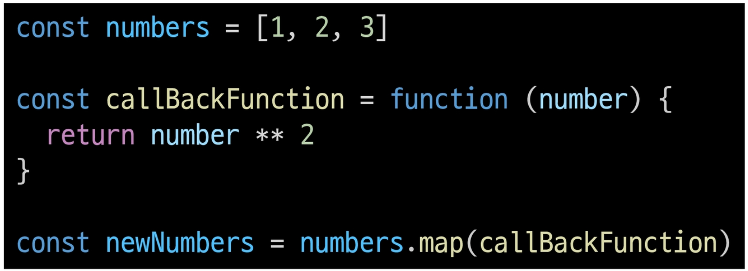

- 배열 순회 종합
  - 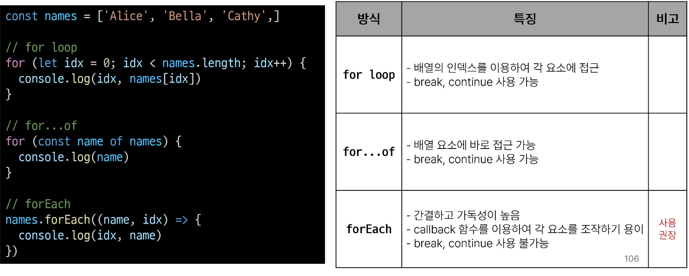

### 추가 배열 문법
1. Array with '전개 구문'
    - 배열 복사
    - 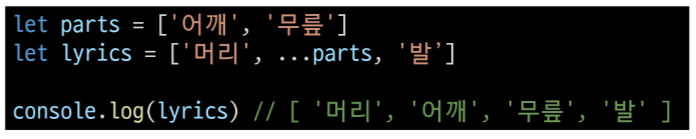

2. 기타 Array Helper Methods
    - MDN 문서를 참고해 사용해보기
    - 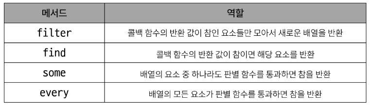

### 참고
- 콜백함수 구조를 사용하는 이유
  1. "함수의 재사용성 측면"
    - 함수를 호출하는 코드에서 콜백 함수의 동작을 자유롭게 변경할 수 있음
    - 예를 들어, map함수는 콜백함수를 인자로 받아 배열의 각 요소를 순회하며 콜백함수를 실행
    - 이때, 콜백 함수는 각 요소를 변환하는 로직을 담당하므로, map 함수를 호출하는 코드는 간결하고 가독성이 높아짐

  2. "비동기적 처리 측면"
    - setTimeout 함수는 콜백함수를 인자로 받아 일정 시간이 지난 후에 실행됨
    - 이때, setTimeout 함수는 비동기적으로 콜백함수를 실행하므로, 다른코드의 실행을 방해하지 않음
    - 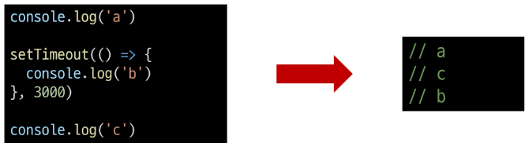

- 배열은 객체다
  - 배열은 키가 속성들을 담고 있는 참조 타입의 객체
  - 배열은 인덱스를 키로 가지며 legnth 프로퍼티를 갖는 특수한 객체
  - 배열의 요소를 대괄호 접근법을 사용해 접근하는 건 객체 문법고 같음
  - 다만 배열의 키는 숫자라는 점
  - 숫자형 키를 사용함으로써 배열은 객체 기본 기능 이외에도 순서가 있는 컬렉션을 제어하게 해주는 특별한 메서드 제공
  - 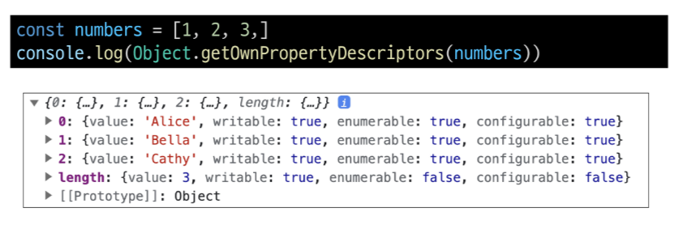

