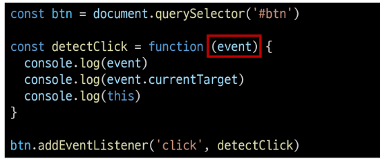

# 1026 Controlling Event
## 이벤트
- 일상 속의 이벤트
  - 컴퓨터 키보드를 눌러 텍스트를 입력하는 것
  - 전화벨이 울려 전화가 왔음을 알리는 것
  - 손을 흔들어 인사하는 것
  - 전화기의 버튼을 눌러서 통화를 시작하는 것
  - 리모컨을 사용하여 채널을 변경하는 것

- 웹에서의 이벤트
  - 버튼을 클릭했을 때 팝업 창이 출력되는 것
  - 마우스 커서의 위치에 따라 드래그 앤 드롭 하는것
  - 사용자의 키보드 입력 값에 따라 새로운 요소를 생성하는 것
  - => 일상에서의 이벤트처럼 웹에서도 이벤트를 통해 특정 동작을 수행한다.

### event
- 무언가 일어났다는 신호, 사건
- => 모든 DOM 요소는 이러한 event를 만들어 냄

- event object
  - DOM에서 이벤트가 발생했을 때 생성되는 객체
  - 이벤트 종류
    - mouse, input, keyboard, touch
    - https://developer.mozilla.org/en-US/docs/Web/API/Event

- DOM 요소는 event를 받고 받은 event를 '처리' 할 수 있음
  - 처리 : event handler(이벤트 처리기)

### event handler
- 이벤트가 발생했을 때 실행되는 함수
- => 사용자의 행동에 어떻게 반응할지를 JavaScript 코드로 표현한 것

- .addEventListener()
  - 대표적인 이벤트 핸들러 중 하나
  - => 특정 이벤트를 DOM요소가 수신했을 때 마다 콜백 함수를 호출
  - 

- .addEventListener(type, handler)
  - type
    - 수신할 이벤트 이름
    - 문자열로 작성(ex. 'click')

  - handler
    - 발생한 이벤트 객체를 수신하는 콜백 함수
    - 콜백 함수는 발생한 Event object를 유일한 매개변수로 받음

- .addEventListener 활용
  - "버튼을 클릭하면 버튼 요소 출력하기"
  - => 버튼에 이벤트 처리기를 부착하여 클릭 이벤트가 발생하면 이벤트가 발생한 버튼정보를 출력
  - 
  - 요소에 addEventListener를 부착하게 되면 내부의 this값은 대상 요소를 가리키게 됨 ( event 객체의 currentTarget 속성값과 동일 )
  - 

- addEventListener의 콜백 함수 특징
  - 발생한 이벤트를 나타내는 Event객체를 유일한 매개변수로 받음
  - 아무것도 반환하지 않음
  - 

### 버블링
- 버블링 개요
  - 핸들러는 form요소에 할당되어 있지만 div나 p요소 같은 중첩된 요소를 클릭해도 동작함
  - => 왜 div나 p를 클릭했는데 form에 할당된 핸들러가 동작할까?
  - 

- 버블링 (Bubbling)
  - 한 요소에 이벤트가 발생하면, 이 요소에 할당된 핸들러가 동작하고, 이어서 부모 요소의 핸들러가 동작하는 현상
  - 가장 최상단의 조상 요소(document)를 만날 때까지 이 과정이 반복되면서 요소 각각에 할당된 핸들러가 동작
  - => 이벤트가 제일 깊은 곳에 있는 요소에서 시작해 부모요소를 거슬러 올라가며 발생하는 것이 마치 물속 거픔과 닮았기 때문

- 버블링 예시
  - 가장 안쪽의 <'p'>요소를 클릭하여 p -> div -> form 순서로 3개의 이벤트 핸들러가 동작
  - 

- 이벤트가 정확히 어디서 발생했는지 접근할 수 있는 방법
  - event.target
  - event.currentTarget

- 'target' & 'currentTarget' 속성
  - 'target' 속성
    - 이벤트가 발생한 가장 안쪽의 요소(target)를 참조하는 속성
    - 실제 이벤트가 시작된 target 요소
    - 버블링이 진행되어도 변하지 않음

  - 'currentTarget' 속성
    - '현재'요소
    - 항상 이벤트 핸들러가 연결된 요소만을 참조하는 속성
    - 'this'와 같음

- 'target' & 'currentTarget' 예시
  - 세 요소 중 가장 최상위 요소인 outerouter 요소에만 이벤트 핸들러가 부착
  - 각 요소를 클릭했을 때 event의 target과 currentTarget의 차이를 비교
    - 
  - 'target'
    - 실제 이벤트가 발생하는 요소를 가리킴
  - 'current target'  
    - 핸들러가 연결된 outerouter 요소만을 가리킴
  - 핸들러는 outerouter에 하나 밖에 없지만 이 핸들러에서 outerouter의 내부 모든 하위 요소에서 발생하는 클릭 이벤트를 잡아내고 있음
  - 클릭 이벤트가 어디서 발생했든 상관없이 outerouter까지 이벤트가 버블링되어 핸들러를 실행시키기 때문
  - 

## event handler 활용
- event hanlder 활용 실습
  1. 버튼을 클릭하면 숫자를 1씩 증가해서 출력하기
  2. 사용자의 입력 값을 실시간으로 출력하기
  3. 사용자의 입력 값을 실시간으로 출력
    - '+' 버튼을 클릭하면 출력한 값의 CSS 스타일을 변경하기
  4. todo 프로그램 구현
  5. 로또 번호 생성기 구현

1. click 이벤트 실습
  + 버튼을 클릭하면 숫자를 1씩 증가
  + 

2. input 이벤트 실습
  - 사용자의 입력 값을 실시간으로 출력하기
  - 

- currentTarget 주의 사항
  - console.log()로 event 객체를 출력할 경우 currentTarget 키의 값은 null을 가짐
  - currentTarget은 이벤트가 처리되는 동안에만 사용할 수 있기 때문
  - 대신 console.log(event.currentTarget)을 사용하여 콘솔에서 확인 가능
  - => currentTarget 이후의 속성 값들은 'target'을 참고해서 사용하기
  - 

3. click & input 이벤트 실습
  - 사용자의 입력 값을 실시간으로 출력
    - 버튼을 클릭하면 출력한 값의 CSS 스타일을 변경하기
  - 
  - 

4. todo 실습
  - 
  - 
  - todo 기능 추가
    1. 빈 문자열 입력 방지
    2. 입력이 없을 경우 경고 대화상자를 띄움
  - 

5. 로또 번호 생성기 실습
  - 
  - 

- lodash
  - 모듈성, 성능 및 추가 기능을 제공하는 JavaScript 유틸리티 라이브러리
  - array, object 등 자료구조를 다룰 때 사용하는 유용하고 간편한 함수들을 제공
  - https://lodash.com/

### 이벤트 기본 동작 취소
- .preventDefault()
  - 해당 이벤트에 대한 기본 동작을 실행하지 않도록 지정

- 이벤트 동작 취소 실습
  - copy 이벤트 동작 취소
  - 
  - form 제출 시 새로고침 동작 취소
  - 

### 참고
- addEventListener에서의 화살표 함수 주의 사항
  - 화살표 함수는 자신만의 this를 가지지 않기 때문에 자신을 포함하고 있는 자신의 함수의 this를 상속받음
  -  