# 1031 Ajax with Django
## Ajax 와 서버
- Ajax
  - Asynchronous JavaScript + XML
  - JavaScript의 비동기 구조와 XML 객체를 활용해 비동기적으로 서버와 통신하여 웹 페이지의 일부분만을 업데이트 하는 웹 개발 기술

- Ajax를 활용한 클라이언트 서버 간 동작
  - 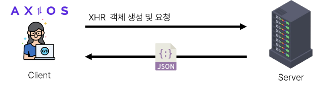
  - 클라이언트 / 서버
  - 이벤트 발생 => XML 객체 생성 및 요청 (클라이언트)
  - -> Ajax 요청 처리 -> 응답 데이터 생성 -> JSON 데이터 응답 (서버)
  - => 응답 데이터를 활용해 DOM조작 (클라이언트)

### Ajax with follow
- 사전준비
  1. M:N 까지 진행한 Django 프로젝트 준비
  2. 가상환경 생성 및 활성화, 패키지 설치

- Ajax 적용
  1. 프로필 페이지에 axios CDN 작성
     - 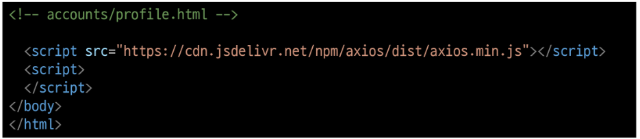

  2. Form요소 선택을 위해 id 속성 지정 및 선택
  - action 과 method 속성은 삭제 (요청은 axios로 대체되기 때문)
    - 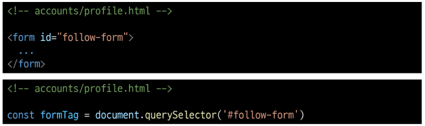

  3. form요소에 이벤트 핸들러 작성 및 Submit 이벤트의 기본 동작 취소
    - 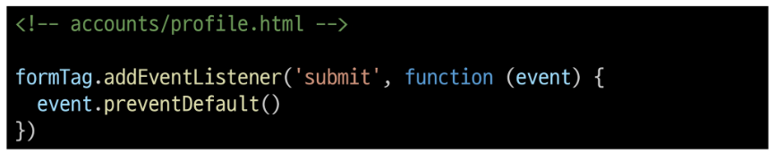

  4. axios 요청작성
     1. url에 작성할 user pk는 어떻게 작성해야 할까?
     2. csrf token은 어떻게 보내야 할까?
    - 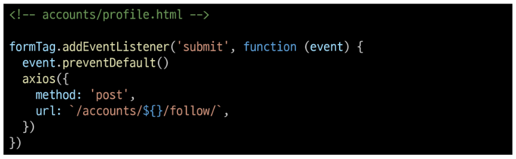

  5. url에 작성할 user pk 가져오기 ( HTML => JavaScript )
    - 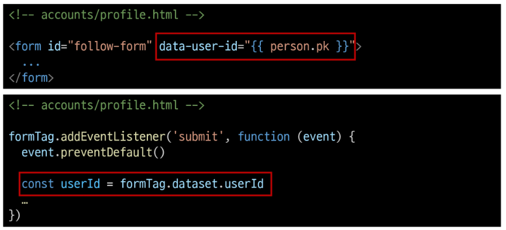

  - "data-&" 속성
    - 사용자 지정 데이터 특성을 만들어 임의의 데이터를 HTML과 DOM 사이에서 교환할수 있는 방법
  - data-& 사용 예시
    - 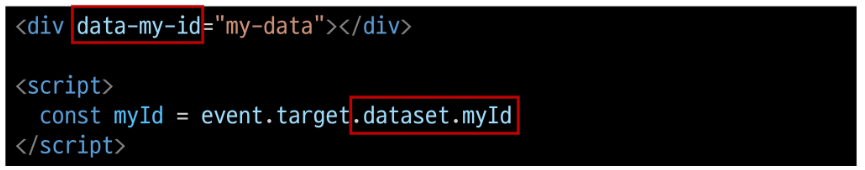
    - 모든 사용자 지정 데이터는 JavaScript에서 dataset 속성을 통해 사용
    - 주의사항
      1. 대소문자 여부에 상관없이 'xml'문자로 시작 불가
      2. 세미콜론 포함불가
      3. 대문자 포함불가
      - https://developer.mozilla.org/ko/docs/Web/HTML/Global_attributes/data-*/

  6. 요청 url 작성 마무리
    - 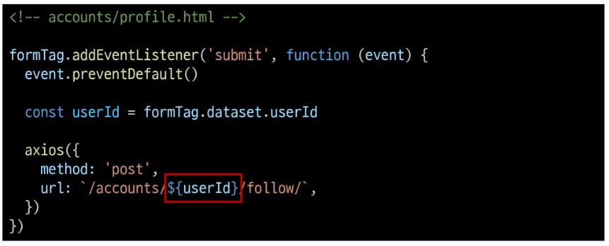

  7. 문서상 hidden 타입으로 존재하는 csrf 데이터를 이제는 axios로 전송해야함
    - 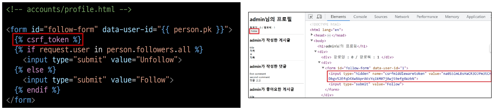

  8. csrf 값을 가진 input 요소를 직접 선택 후 axios에 작성하기 
    - https://docs.djangoproject.com/en/4.2/howto/csrf/
    - 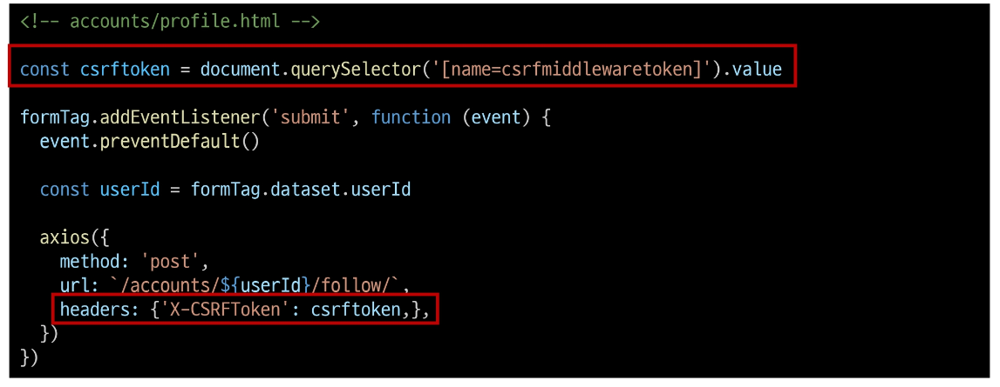

  9. 팔로우 버튼을 토긇기 위해서는 현재 팔로우 상태인지 언팔로우 상태인지에 대한 상태확인이 필요
    - => Django의 view함수에서 팔로우 여부를 파악 할 수 있는 변수를 추가로 생성해 JSON 타입으로 응답하기

  10. 팔로우 상태 여부를 JavaScript에게 전달할 데이터 작성
    - 응답은 더 이상 HTML 문서가 아닌 JSON 데이터로 응답
    - 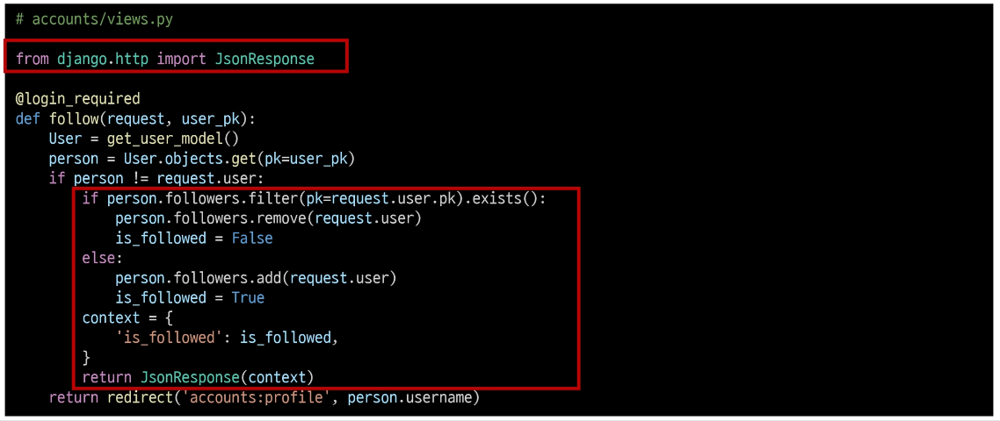

  11. 팔로우 요청 후 Django 서버로 부터 받은 데이터 확인하기
    - 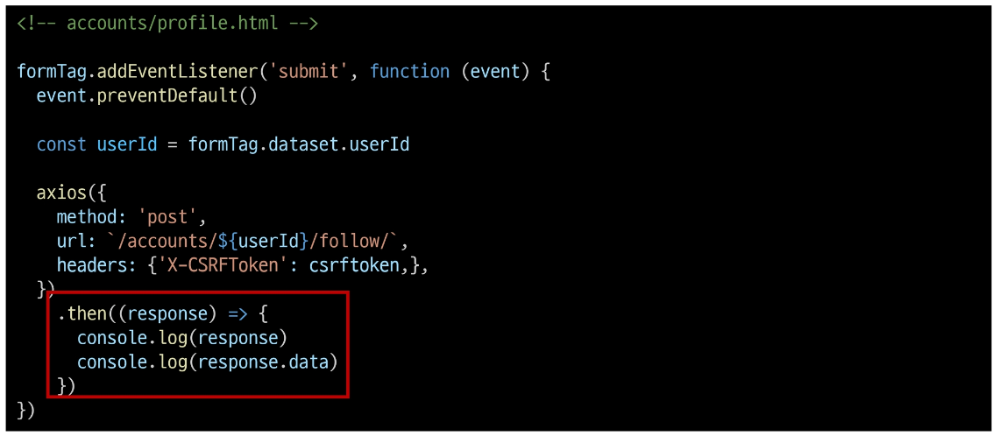

  12. 응답 데이터 is_followed 에 따라 팔로우 버튼을 토글하기
    - 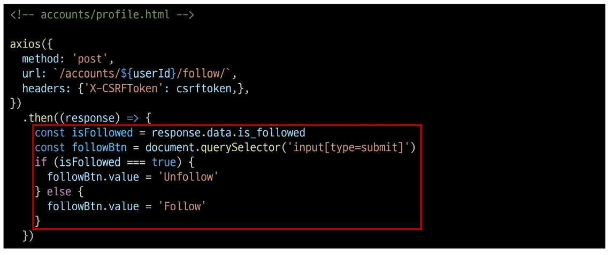

  13. 클라이언트와 서버 간 XHR객체가 주고 받는 것을 확인하기
    - 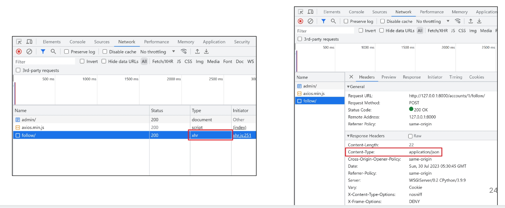

  14.  팔로잉 수와 팔로워 수 비동기 적용
    - 해당 요소를 선택할 수 있도록 span태그와 id 속성 작성
    - 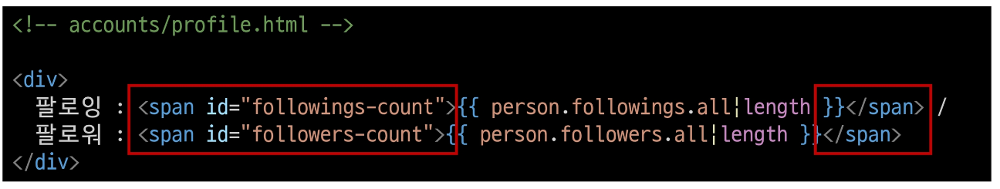

  15. 각 span태그를 선택
    - 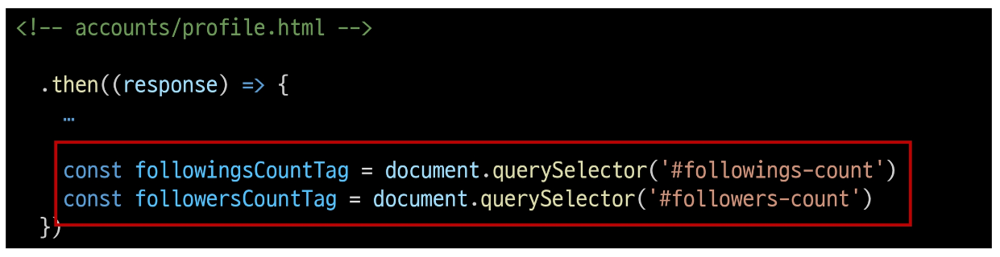

  16. Django view 함수에서 팔로워, 팔로잉 인원 수 연산을 진행하여 결과를 응답으로 전달
    - 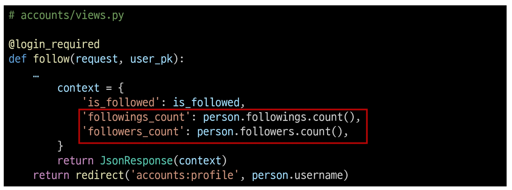

  17. 응답 데이터의 연산 결과를 각 태그의 인원수 값 변경에 적용
    - 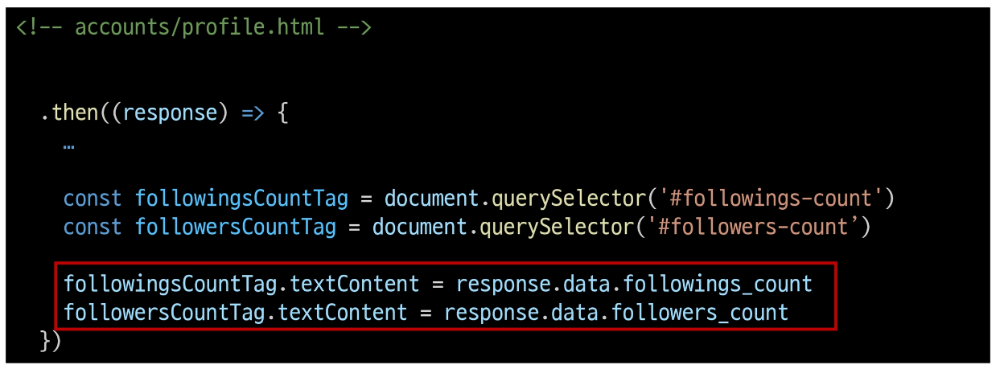

## Ajax with likes
- Ajax 좋아요 적용 시 유의사항
  - Ajax 적용은 팔로우와 모두 동일
  - 단, 팔로우와 달리 좋아요 버튼은 한페이지에 여러 개가 존재
    1. forEach()
    2. querySelectorAll()

- Ajax 적용
  1. HTML 완성 부분
    - 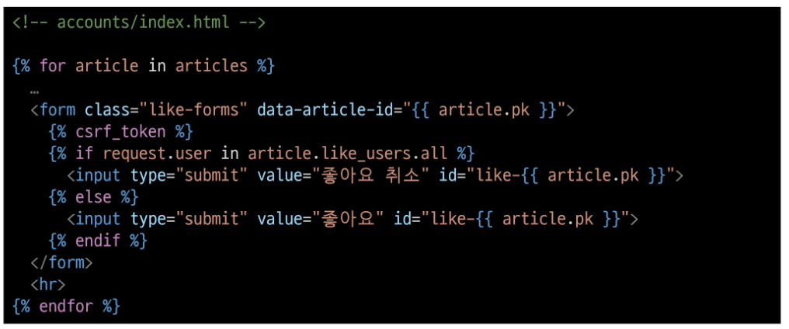

  2. View함수 완성 부분
    - 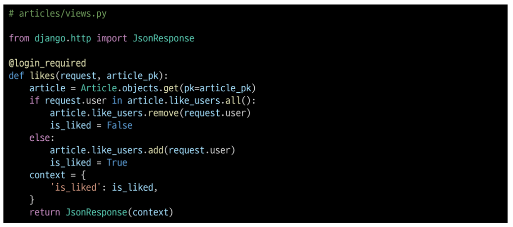

  3. JavaScript 완성 부분
    - 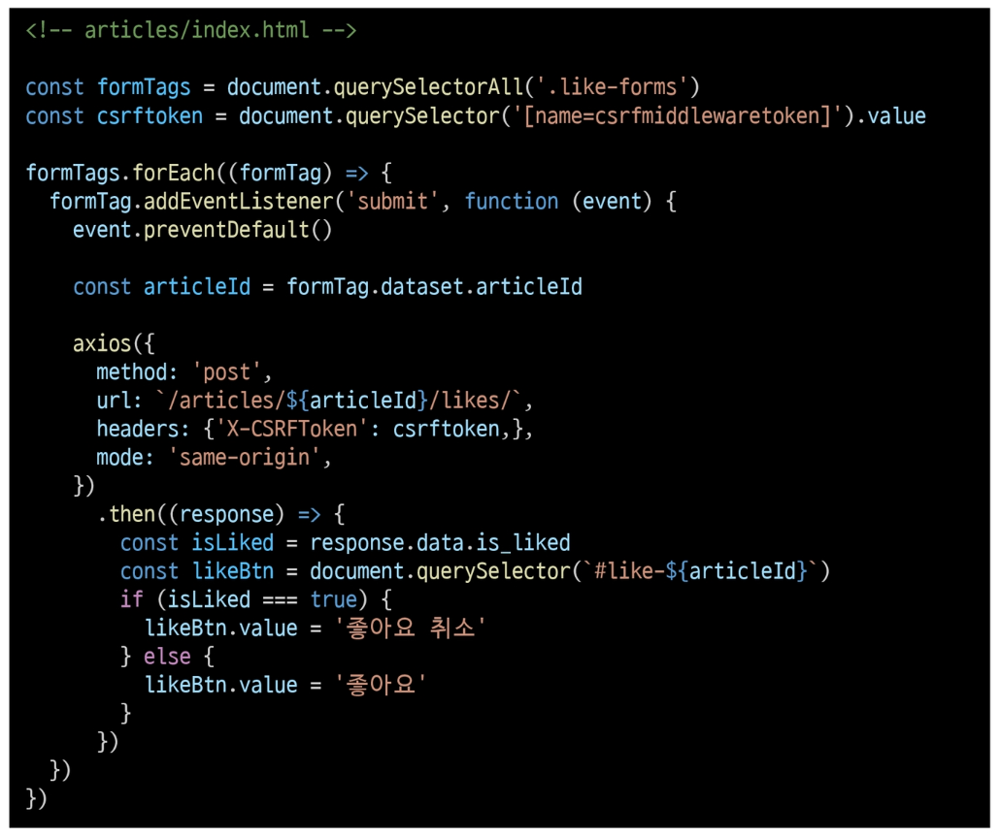

## 참고
- Ajax의 필요성
  - human-centered desing with UX ( 인강 중심으로 설계된 사용자 경험)
  - 