# 1004 Django Authentication System1
## Cookie & Session
+ 우리는 서버로부터 받은 페이지를 둘러볼 때 우리는 서버와 서로 연결되어 있는 상태가 아니다.
+ HTTP
  + HTML 문서와 같은 리소스들을 가져올 수 있도록 해주는 규약
  + 웹(WWW)에서 이루어지는 모든 데이터 교환의 기초
  + 특징
    + 비연결 지향
      + 서버는 요청에 대한 응답을 보낸후 연결을 끊음
    + 무상태
      + 연결을 끊는 순간 클라이언트와 서버간의 통신이 끝나며 상태 정보가 유지되지 않음
      + 즉 로그인상태를 유지하거나, 장바구니에 담은 상품을 유지할 수 없다.
## 쿠키(Cookie)
+ 서버가 사용자의 웹 브라우저에 전송하는 작은 데이터 조각
  + 클라이언트 측에서 저장되는 작은 데이터 파일이며, 사용자 인증, 추적, 상태 유지 등에 사용되는 데이터 저장 방식
+ 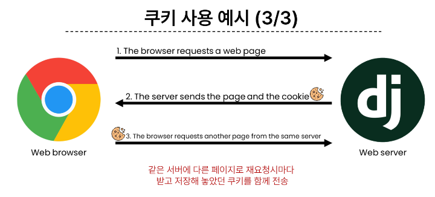
+ > 쿠키의 사용원리
  1. 브라우저(클라이언트)는 쿠키를 KEY-VALUE의 데이터 형식으로 저장
  2. 이렇게 쿠키를 저장해 놓았다가, 동일한 서버에 재요청 시 저장된 쿠키를 함께 전송
  + 쿠키는 두 요청이 동일한 브라우저에서 들어왔는지 아닌지를 판단할 때 주로 사용됨
    + 이를 이용해 로그인 상태를 유지
    + 상태가 없는 HTTP프로토콜에서 상태 정보를 기억시켜 주기 때문
    + 
+ > 쿠키 사용목적
  1. 세션관리
    + 로그인, 아이디 자동완성, 공지 하루안보기, 팝업체크, 장바구니 등의 정보 관리
  2. 개인화
     + 사용자 선호, 테마 등의 설정
  3. 트래킹
     + 사용자 행동을 기록 및 분석  

### 세션(Session)
+ 서버 측에서 생성되어 클라이언트와 서버 간의 상태를 유지
+ 상태 정보를 저장하는 데이터 저장 방식
 + 쿠키에 세션 데이터를 저장하여 매 요청시마다 세션 데이터를 함께 보냄

+ > 세션의 작동원리
  1. 클라이언트가 로그인을 하면 서버가 session 데이터를 생성 후 저장
  2. 생성된 session 데이터에 인증할 수 있는 session id를 발급
  3. 발급한 session id를 클라이언트에게 응답
  4. 클라이언트는 응답 받은 session id를 쿠키에 저장
  5. 클라이언트가 다시 동일한 서버에 접속하면 요청과 함께 쿠키(session id가 저장된)를 서버에 전달
  6. 쿠키는 요청 때마다 서버에 함께 전송되므로 서버에서 session id를 확인해 로그인 되었다는 것을 알도록 함

+ 서버측에서는 세션 데이터를 생성 후 저장하고 세션 ID를 생성
+ 이 ID를 클라이언트 측으로 전달하여, 클라이언트는 쿠키에 이 ID를 저장
+ 서버로부터 쿠키를 받아 브라우저에 저장하고, 클라이언트가 서버에 재요청 시마다 저장해 두었던 쿠키도 요청과 함께 전송
  + 예를 들어 로그인 상태 유지를 위해 로그인 되어있다는 사실을 입증하는 데이터를 매 요청마다 계속해서 보내는 것

+ **쿠키와 세션의 목적**
  + 서버와 클라이언트 간의 상태를 유지!!

### 참고
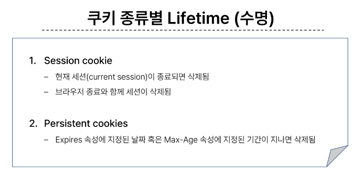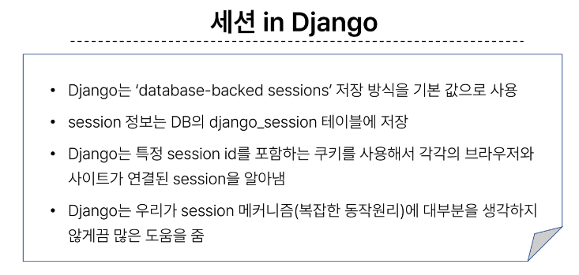

## Authentication System (인증시스템)
+ 사용자 인증과 관련된 기능을 모아놓은 시스템
+ Authentication (인증)
  + 사용자가 자신이 누구인지 확인하는 것(신원 확인)
+ 사전 준비
  + 두번째 app 'accounts' 생성 및 등록
  + auth와 관련한 경로나 키워드들을 django 내부적으로 accounts 라는 이름으로 사용하고 있기 때문에 되도록 'accounts'로 지정하는 것을 권장
  + 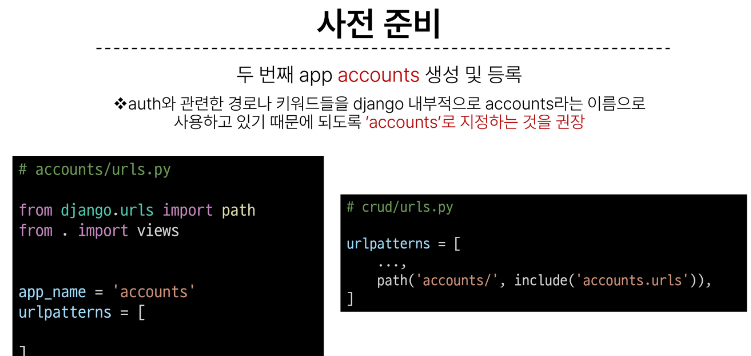

### Custom User model
+ Custom User model로 "대체"하기
  + 장고가 기본적으로 제공하는 User model은 내장된 auth앱의 User클래스를 사용
  + 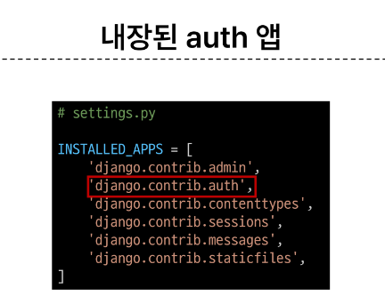

+ User 클래스를 대체하는 이유
  + 우리는 지금까지 별도의 User클래스 정의없이 내장된 User 클래스를 사용했음
  + 별도의 설정없이 사용할 수 있어 간편하지만,
  + 개발자가 "직접 수정할 수 없는 문제가 존재"

+ 대체하는 방법
  1. AbstractUser를 상속받는 커스텀 User 클래스 작성
     + 기존 User 클래스도 AbstractUser를 상속받기 때문에  
     + 커스텀 User 클래스도 기존 User클래스와 완전히 같은 모습을 가지게 됨
     + 
  2. django프로젝트가 사용하는 기본 user모델을 우리가 작성한 User모델로 지정
     + 수정 전 기본값은 'auth.User' 
     + 
  3. 기본 user모델이 아니기 때문에 등록하지 않으면 admin site에 출력되지 않음
     +  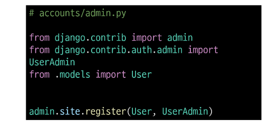
+ 주의할 점 !
   + 프로젝트 중간에 AUTH_USER_MODEL을 변경 할 수 없음
   + 이미 프로젝트가 진행되고 있을 경우 데이터베이스 초기화 후 진행

+ 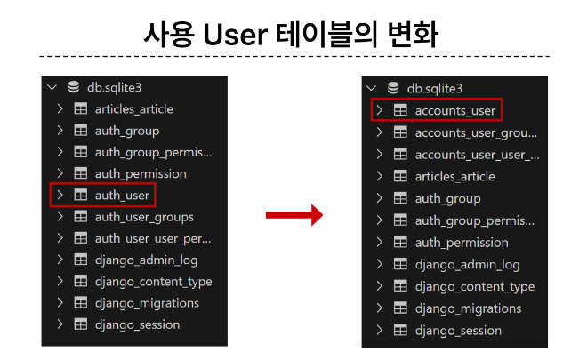
+ 프로젝트를 시작하면 반드시 USER모델을 대체해야 한다.
  + Django는 새 프로젝트를 시작하는 경우 비록 기본 User모델이 충분하더라도 커스텀 User모델을 설정하는 것을 강력하게 권장
  + 커스텀 User모델은 기본 User 모델과 동일하게 작동하면서도 "필요한 경우 나중에 맞춤 설정할 수 있기 때문"
  + 단 User모델 대체 작업은 프로젝트의 모든 migrations 혹은 첫 migrate를 실행하기 전에 이 작업을 마쳐야 함

## Login
+ Session을 create 하는 과정
  
+ AuthenticationForm()
  + 로그인 인증에 사용할 데이터를 입력받는 bulit-in form

+ 로그인 페이지 작성
  + 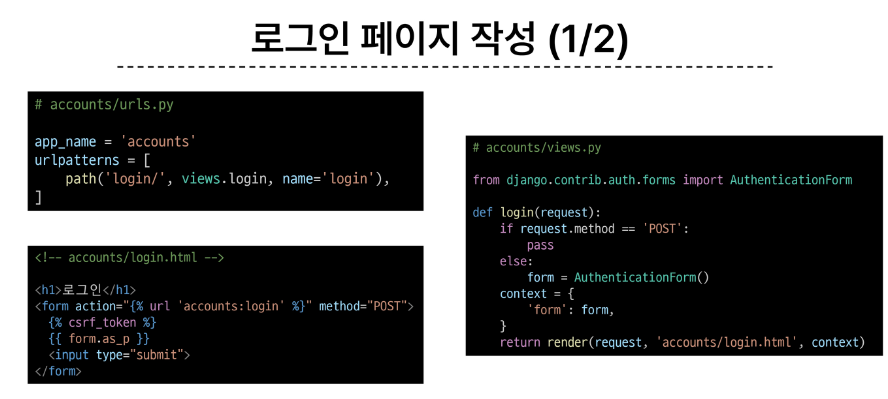
  + 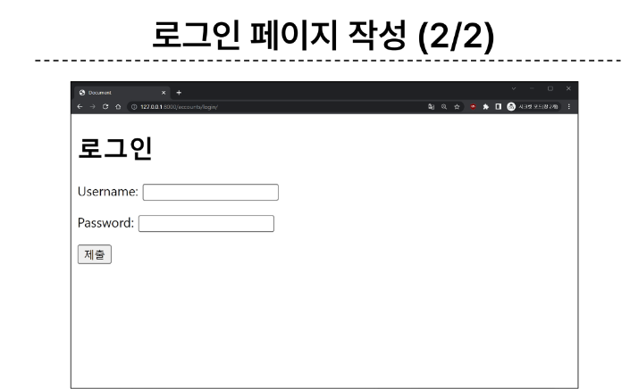

+ 로그인 로직 작성
  + 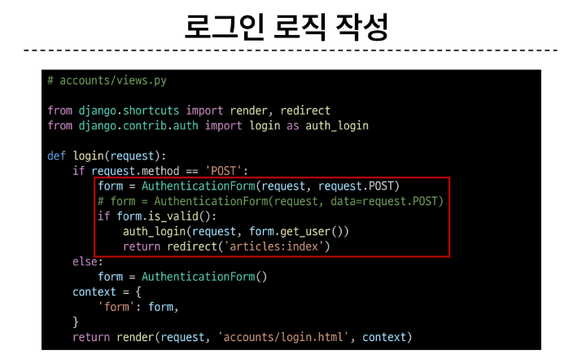

+ login(request, user)
  + AuthenticationForm을 통해 인증된 사용자를 로그인하는 함수

+ get_user()
  + AuthenticationForm의 인스턴드 메서드
  + 유효성 검사를 통과했을 경우 로그인 한 사용자 객체를 반환

+ 세션 데이터 확인하기
  1. 로그인 후 발급받은 세션확인
      + django_session 테이블에서 확인   
      + 
  2. 브라우저에서 확인
     + 개발자도구 - Application - Cookies
     + 

+ 로그인 링크 작성
  + 

## Logout
+ Session을 Delete하는 과정

+ logout(request)
  + 현재 요청에 대한 Session Date를 DB에서 삭제
  + 클라이언트의 쿠키에서도 Session id를 삭제

+ 로그아웃 로직 작성
  + 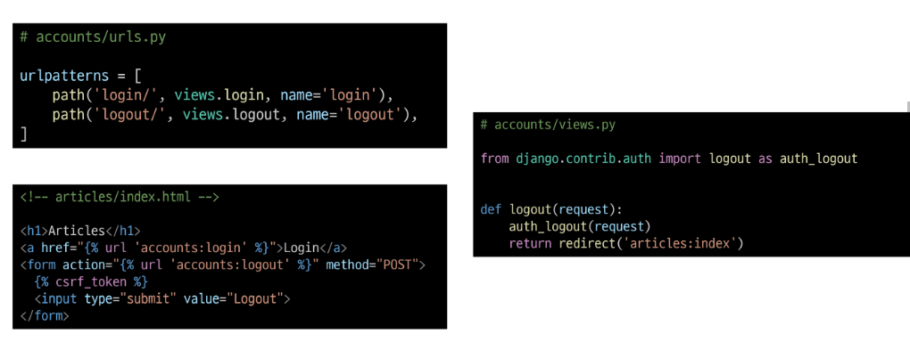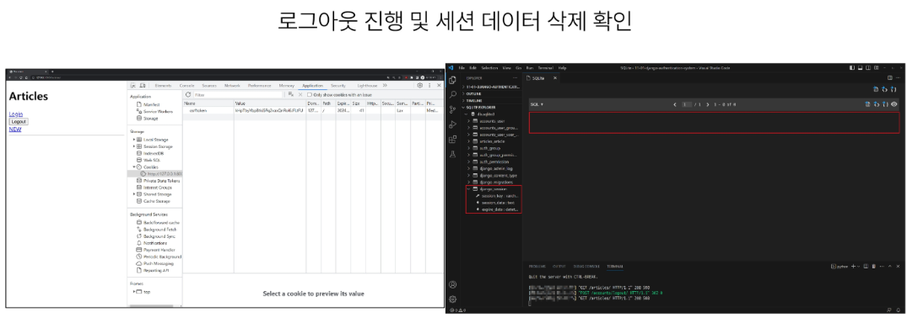

## Template with Authentication data
+ 템플릿에서 인증 관련 데이터를 출력하는 방법

+ 현재 로그인 되어 있는 유저 정보 출력하기
  + 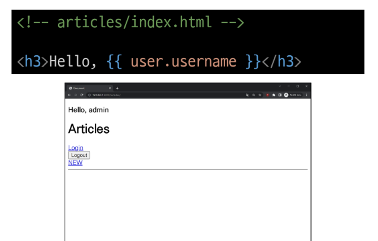

+ context processors
  + 템플릿이 렌더링 될 때 호출 가능한 컨텍스트 데이터 목록
  + 작성된 컨텍스트 데이터는 기본적으로 템플릿에서 사용 가능한 변수로 포함됨
  + 즉 django에서 자주 사용하는 데이터 목록을 미리 템플릿에 로드해 둔 것
  + 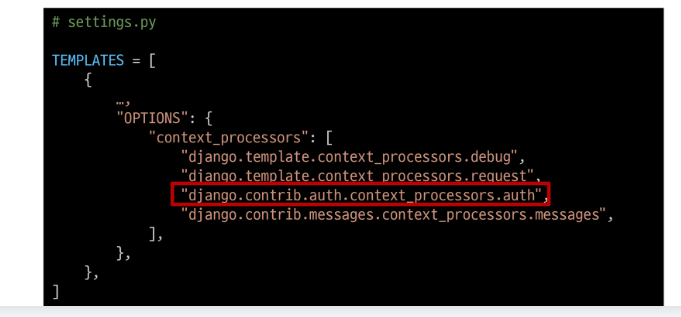

## 참고
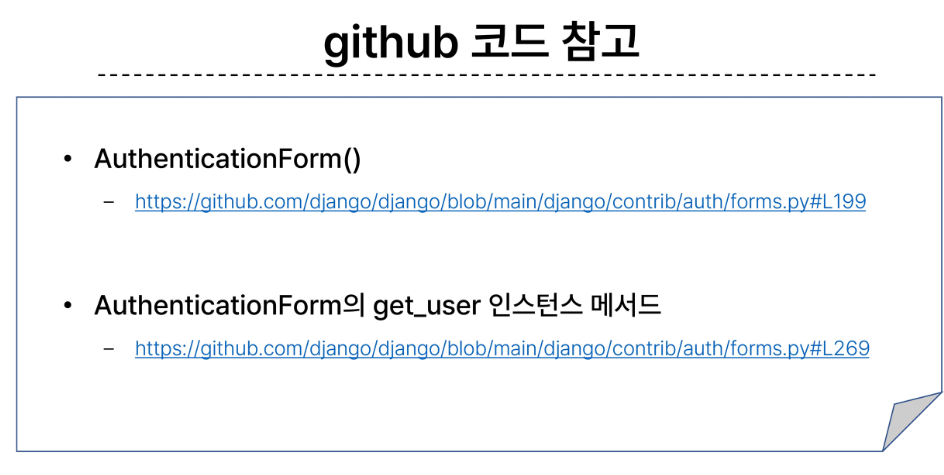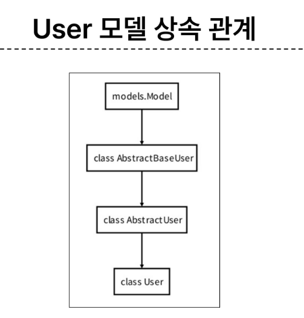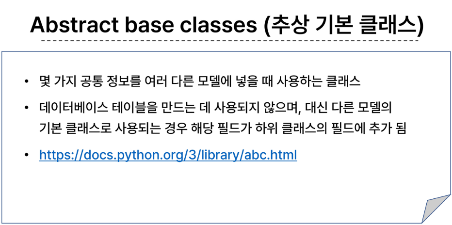

