# 1005 Authentication System 2
## 회원가입
+ User 객체를 Create하는 과정
+ UserCreationForm()
  + 회원 가입시 사용자 입력 데이터를 받을 built-in ModelForm

+ 회원가입 페이지 작성
  + 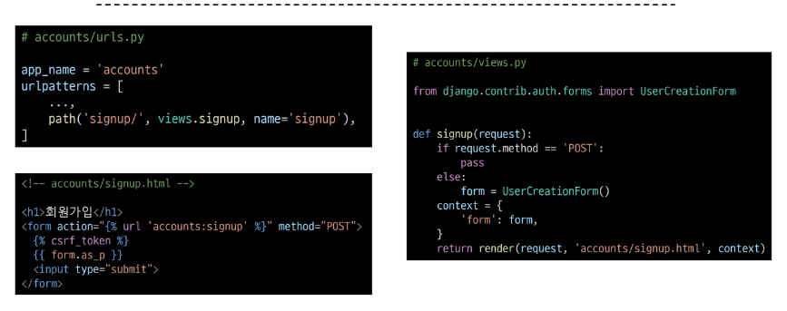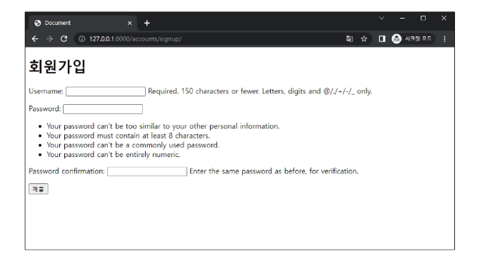

+ 회원가입 로직 작성
  + 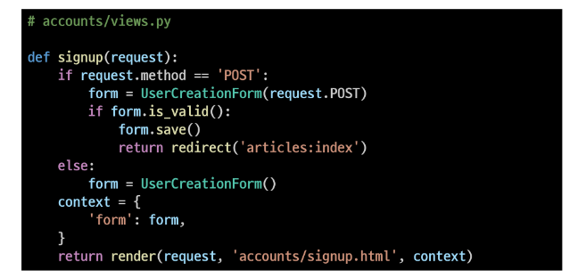

+ 회원가입 로직 에러
  + 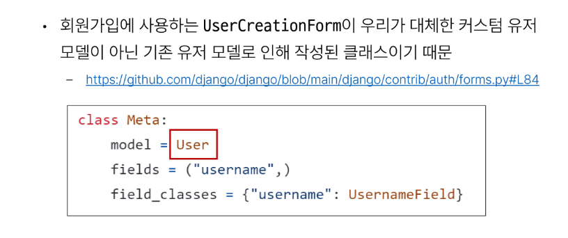

+ 회원가입 로직 재작성
  + 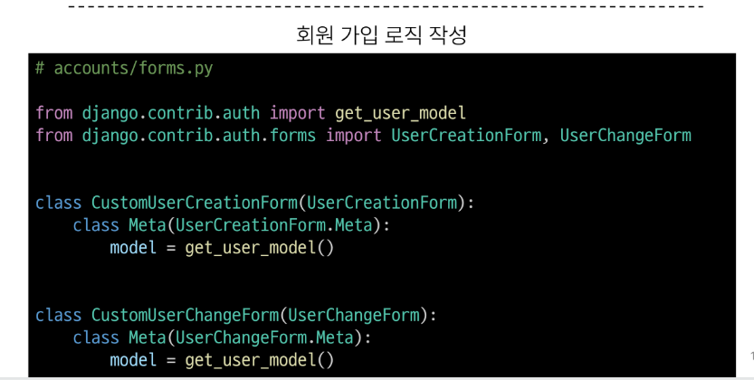

+ get_user_model()
  + "현재 프로젝트에서 활성화된 사용자 모델(active user model)" 을 반환하는 함수

+ User 모델을 직접 참조하지 않는 이유
  + get_user_model()을 사용해 User 모델을 참조하면 커스텀 User모델을 자동으로 반환해주기 떄문
  + Django는 User클래스를 직접 참조하는 대신 get_user_model()을 사용해 참조해야 한다고 필수적으로 강조하고있음
  + (user model 참조에 대한 자세한 내용은 추후 모델관계에서 다룰 예정)

+ 회원가입 로직 작성 (커스텀 form 적용)
  + 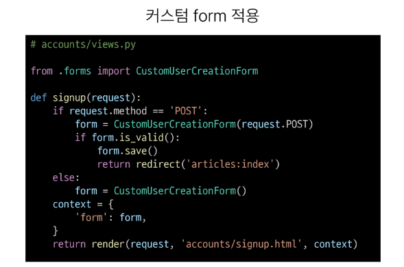

## 회원탈퇴
+ User객체를 Delete 하는 과정

+ 회원탈퇴 로직 작성
  + 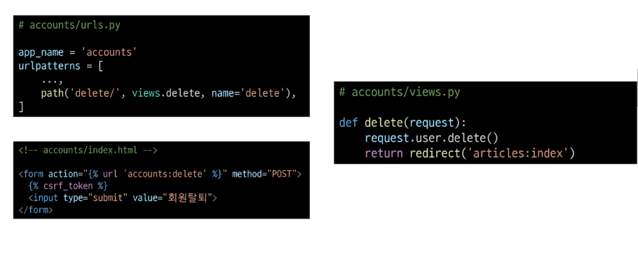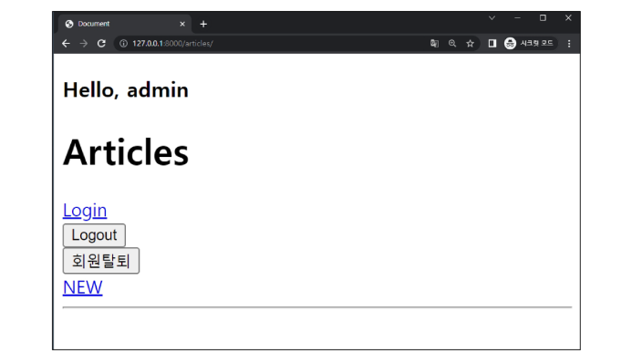

## 회원정보 수정
+ User 객체를 Update하는 과정

+ UserChangeForm()
  + 회원정보 수정 시 사용자 입력 데이터를 받을 bulit-in ModelForm
  
+ 회원정보 수정 페이지 작성
  + 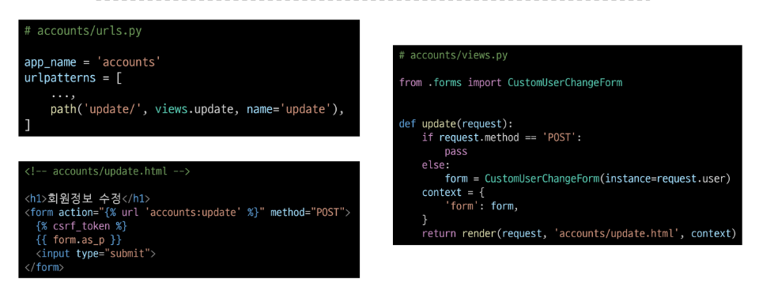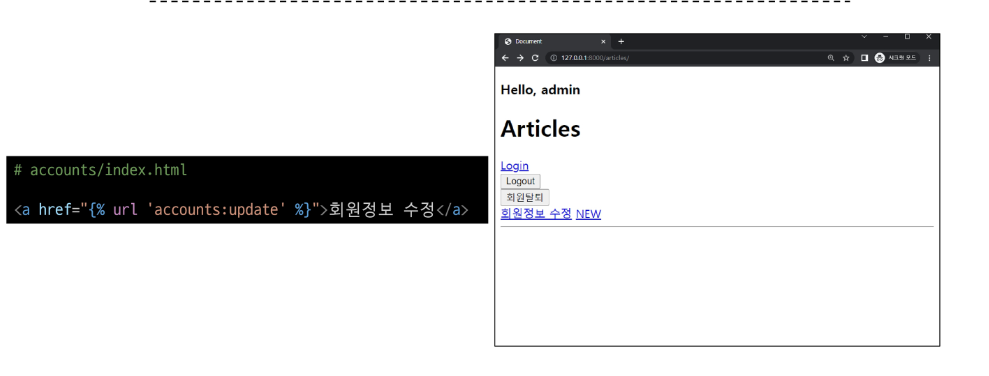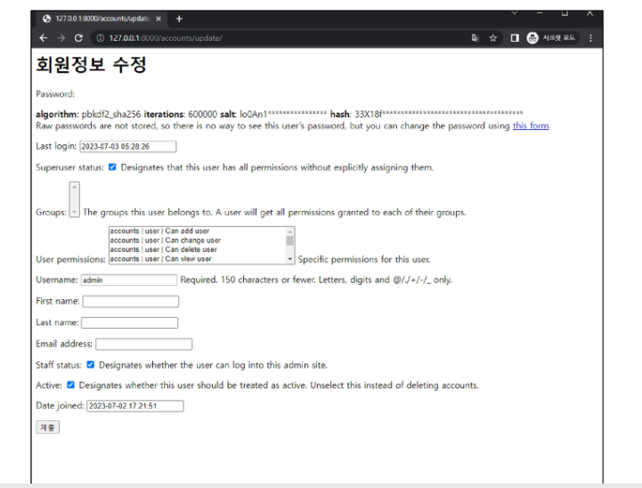

+ UserChangeForm 사용시 문제점
  + User 모델의 모든 정보들(fields)까지 모두 출력되어 수정이 가능하기때문에 일반 사용자들이 접근해서는 안되는 정보는 출력하지 않도록 해야 한다
  + CustomUserChangeForm에서 접근 가능한 필드를 조정

+ CustomUserChangeForm 출력 필드 재정의
  + User Model의 필드목록 확인
  + 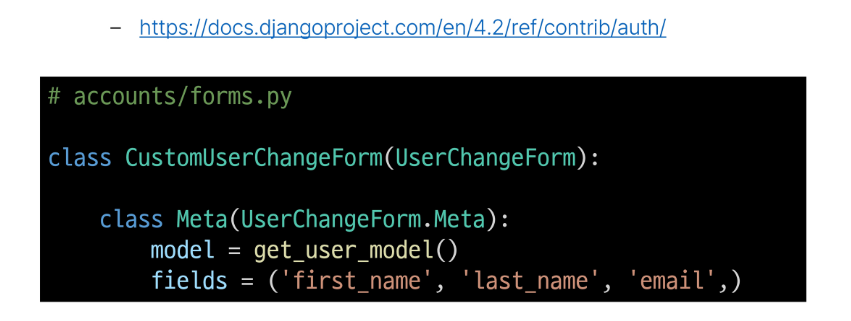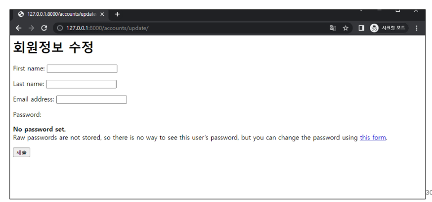

+ 회원정보 수정 로직 작성
  + 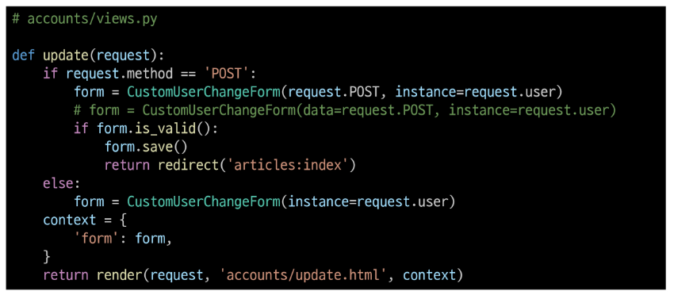

## 비밀번호 변경
+ 인증된 사용자의 Session 데이터를 Update 하는 과정

+ PasswordChangeForm()
  + 비밀번호 변경 시 사용자 입력 데이터를 받을 built-in Form

+ 비밀번호 변경 페이지 작성
  + Django는 비밀번호 변경 페이지를 회원정보 수정 form 에서 별도 주소로 안내
  +  /user_pk/password/
  + 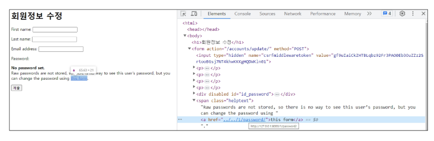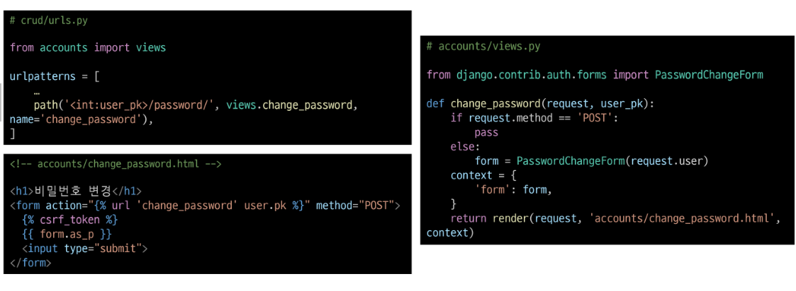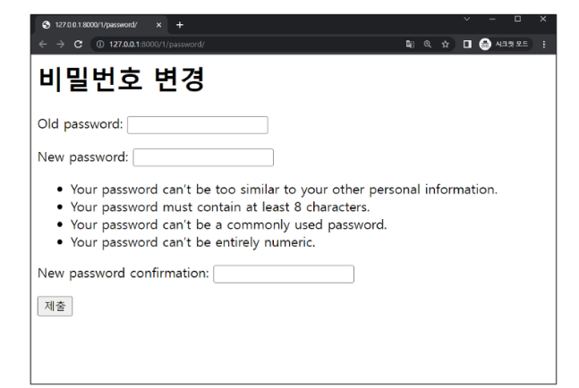

+ 비밀번호 변경 로직 작성
  + 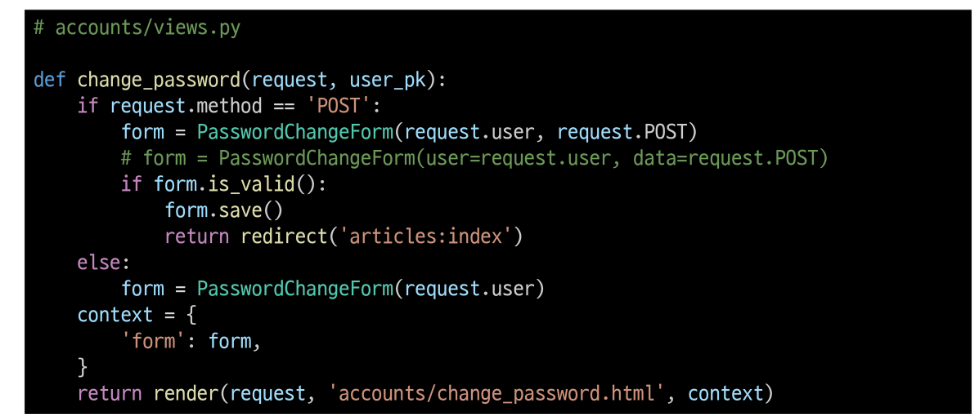

## 세션 무효화 방지하기
+ 암호 변경시 세션 무효화
  + 비밀번호가 변경되면 기존 세션과의 회원 인증 정보가 일치하지 않게 되어버려 로그인 상태가 유지되지 못하고 로그아웃 처리됨
  + 비밀번호가 변경되면서 기존 세션과 회원 인증 정보가 일치하지 않기 때문

+ update_session_auth_hash(request, user)
  + 암호 변경시 세션 무효화를 막아주는 함수
  + 암호가 변경되면 새로운 password의 Session Data로 기존 session을 자동으로 갱신
  + 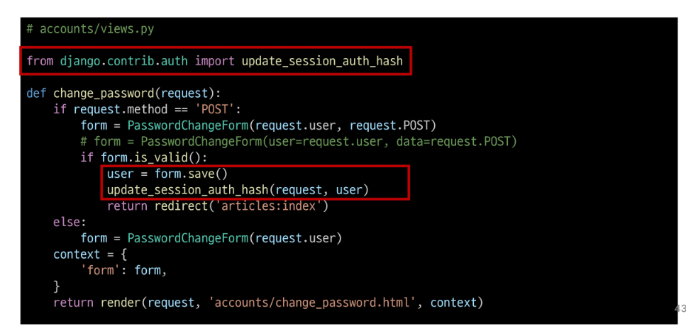

## 인증된 사용자에 대한 접근 제한
+ 로그인 사용자에 대해 접근을 제한하는 2가지 방법
  1. is_authenticated 속성
  2. login_required 데코레이터 

+ is_authenticated
  + 사용자가 인증 되었는지 여부를 알 수 있는 User model의 속성
  + 모든 User 인스턴스에 대해 항상 Ture인 읽기 전용 속성이며, 비인증 사용자에 대해서는 항상 False
  + 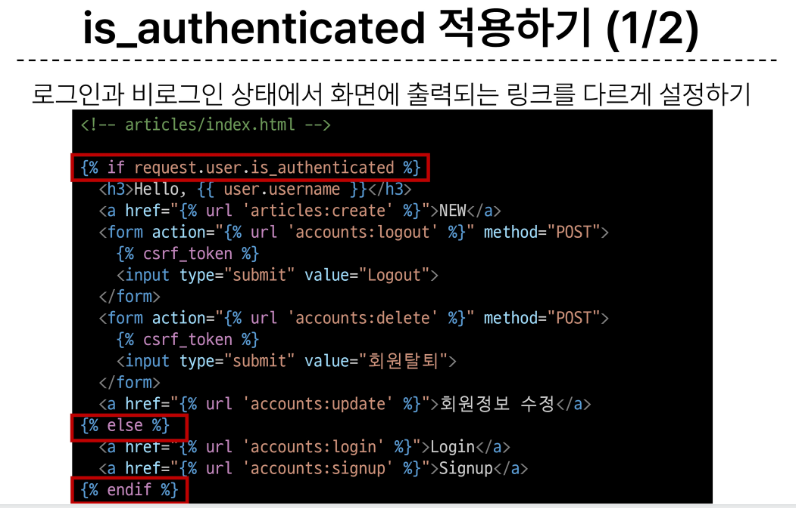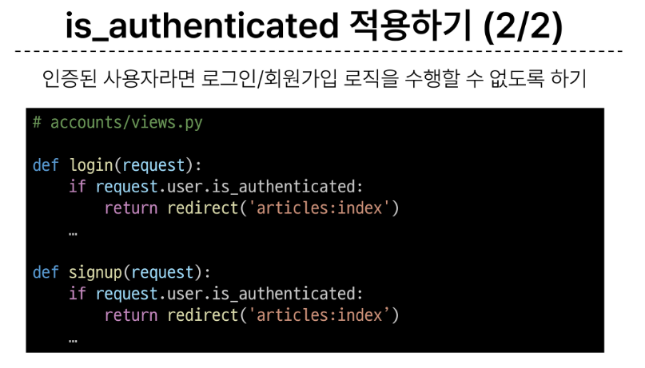

+ login_required
  + 인증된 사용자에 대해서만 view 함수를 실행시키는 데코레이터
  + 비인증 사용자의 경우 /accounts/login/ 주소로 redirect 시킴
  + 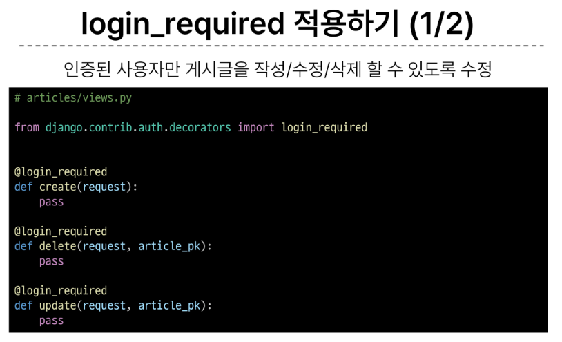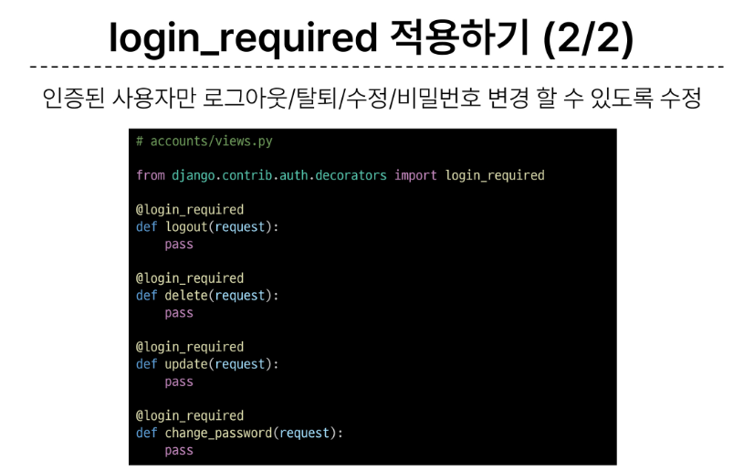

## 참고
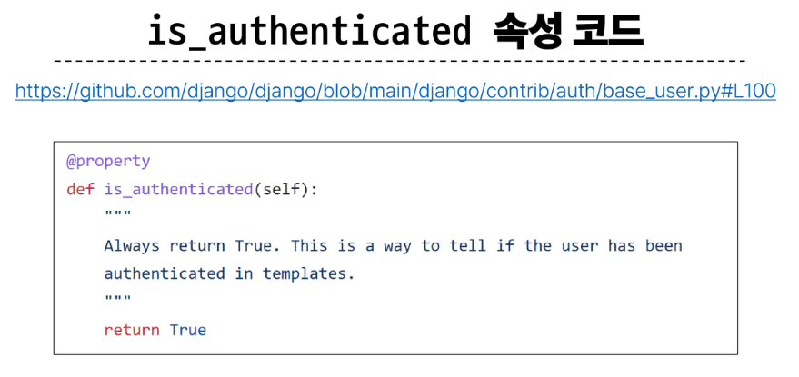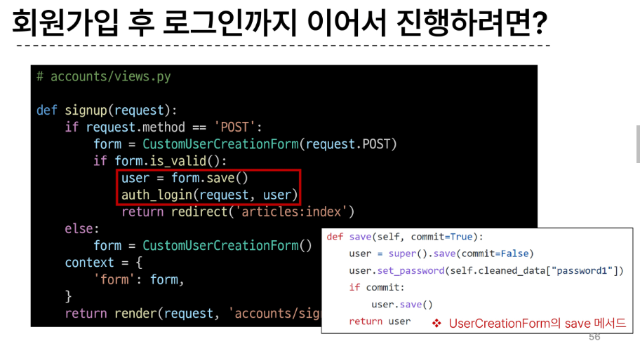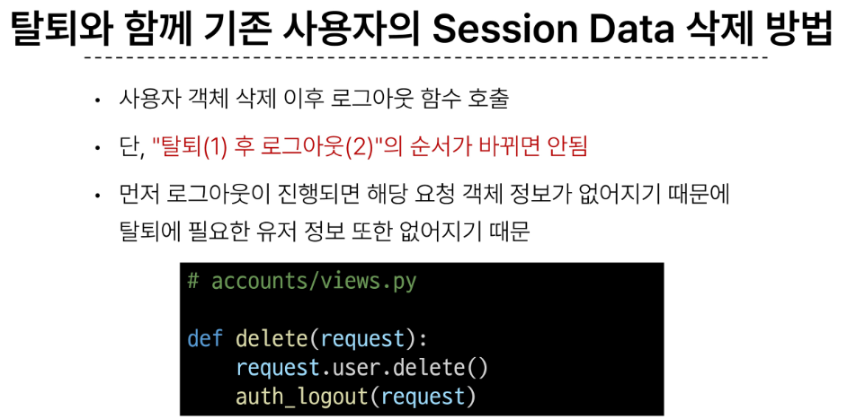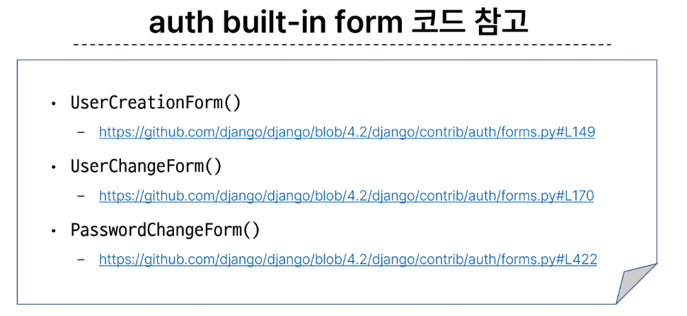


## 강사님 강의
+ 장고 한국말로 바꾸는 것
  + 프로젝트 settings의 LANGUAGE_CODE = 'ko-kr' 로 변경
  + TIME_ZONE = 'UTC-8' 으로 한국시간으로 변경(Asia/seoul 로 작성해도 됌)

+ 회원가입시 추가적인 필드 사용하는 방법
  + nickname 필드 써보기
  + models.py에서 유저에 대해 닉네임에 대한 정보를 추가해주고 
  + forms.py에서 커스텀 유저에대해 기존 필드에 필드를 추가해준다
```py
# models.py

# django 가 사용하는 default User 모델 기반으로 개발을 할거다
# 그래서 상속을 받음
# Create your models here.
from django.db import models
from django.contrib.auth.models import AbstractUser

# 앞으로 필드 수정등의 추가적인 작업을 하기 위해 
# 상속을 받아서 정의
class User(AbstractUser):
    nickname = models.CharField(max_length=50, null=True)
    

```
```py
# forms.py
class CustomUserCreationForm(UserCreationForm):
    nickname = forms.CharField(max_length= 30 , required=False, help_text="필요 시 닉네임을 설정하시오.")
    class Meta(UserCreationForm.Meta):
        model = get_user_model()
        # field는 기존 field + 닉네임까지 추가
        fields = UserCreationForm.Meta.fields + ('nickname', )
```


+ python 데코레이터 개념
  + 전처리 후처리 코드가 너무 중복될 때를 이를 없애기 위해 데코레이터를 사용함

+ login 이후 요청했던 페이지로 돌아가기