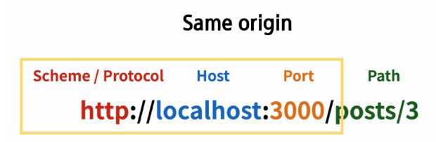

# 1114 Vue with DRF1
## 프로젝트 개요
### DRF 프로젝트 안내
- DRF 프로젝트 안내
  - 스켈레톤 프로젝트 django-pjt 제공
  - 외부 패키지 및 라이브러리는 requirements.txt에 작성되어 있음
  - DRF 프로젝트는 주석을 해제하며 진행

- Skeleton code 살펴보기
  - Model 클래스
  - URL 확인
  - serializers 확인
  - views.py import 부분 확인
  - views.py 함수 확인
  - settings.py 확인
  - Fixtures 확인

- 실행환경 설정
```s
가상 환경 생성 및 활성화
경로 확인 후에 진행
$ python -m venv venv
$ source venv/Scripts/activate
패키지 설치
$ pip install -r requirements.txt
Migration 진행
$ python manage.py makemigrations
$ python manage.py migrate
Fixtures 데이터 로드
$ python manage.py loaddata articles.json
장고 실행
$ python manage.py runserver
```
```s
다른 컴퓨터에서 내 실행창을 보고싶을 때
1. ip 확인하기
	git bash 에 $ ipconfig 입력
	이미지의 IPv4 주소 결과 복사
2. Django settings.py 수정
	ALLOWED_HOSTS = ['*'] 추가하기
3. runserver 하기
	$ python manage.py runserver <본인 IP 주소>:8000
	위 사진 예시 기준으로 명령어
	$ python manage.py runserver 70.12.102.160:8000
```
### vue 프로젝트 안내
- 스켈레톤 프로젝트 vue-pjt 제공
- vite를 사용해 pinia 및 vue router가 추가 되어있음
- pinia-plugin-persistedstate가 설치 및 등록 되어있음
- vue 프로젝트는 직접 코드를 작성하며 진행
- 
- 
 
 - Skeleton code 살펴보기
   - App 컴포넌트
   - route에 등록된 컴포넌트(Article, Create, Detail, Login, SignUp)
   - ArticleList 컴포넌트
   - ArticleListItem 컴포넌트
   - router routes 현황 (index.js)
   - store 현황
   - main.js

- 실행환경 설정
```s
패키지 설치
npm install
axios 설치
npm install axios
서버 실행
npm run dev
```
```s
다른 컴퓨터에서 내 실행창을 보고싶을 때
package.json 의 scripts -> dev 부분에 아래와 같이 작성

"scripts": {
    "dev": "vite --host 0.0.0.0",
    ...
},
```
#### 메인 페이지 구현
- ArticleView 컴포넌트에 ArticleList 컴포넌트와 ArticleListItem 컴포넌트 등록 및 출력하기
- ArticleList와 ArticleListItem은 각각 게시글 출력을 담당
#### state 참조 및 출력 코드 작성하기
- 작성된 코드 확인

## state with DRF
- 임시데이터가 아닌 DRF 서버에 직접 요청하여 데이터를 응답받아 store에 저장 후 출력하기

- state with DRF
  - DRF 서버로의 AJAX 요청을 위한 axios 설치 및 관련 코드 작성
  - 
  - DRF 서버로 요청을 보내고 응답 데이터를 처리하는 getArticles 함수 작성
  - 
  - ArticleView 컴포넌트가 마운트 될 때 getArticles 함수가 실행되도록 함
  - => 해당 컴포넌트가 렌더링 될 때 항상 최신 게시글 목록을 불러오기 위함
  - 
  - Vue와 DRF 서버를 모두 실행한 후 응답 데이터 확인
  - => 에러발생
  - 
  - 그런데 DRF 서버측에는 문제없이 응답했음( 200 OK )
  - => 서버는 응답했으나 브라우저 측이 거절한 것
  - 
  - 브라우저가 거절한 이유
  - 


## CORS Policy
### CORS
- SOP ( smae-origin policy)
  - 동일 출처 정책

- SOP ( 동일 출처 정책 )
  - 어떤 출처(origin)에서 불러온 문서나 스크립트가 다른 출처에서 가져온 리소스와 상호 작용하는 것을 제한하는 보안 방식
  - https://developer.mozilla.org/en-US/docs/Web/Security/Same-origin_policy
  - 웹 애플리케이션의 도메인이 다른 도메인의 리소스에 접근하는 것을 제어하여 사용자의 개인정보와 데이터의 보안을 보호하고, 잠재적인 보안 위협을 방지
  - 잠재적으로 해로울 수 있는 문서를 분리함으로써 공격받을 수 있는 경로를 줄임

- Origin( 출처 )
  - URL의 Protocol, Host, Port 를 모두 포함하여 "출처"라고 부름
  - Same Origin 예시
    - 아래 세 영역이 일치하는 경우에만 동일 출처(Same-origin)로 인정
    - 
  - Same Origin 예시
    - http://localhost:3000/articles/3/을 기준으로 동일 출처 여부를 비교
    - 

- CORS policy의 등장   
  - 기본적으로 웹 브라우저는 같은 출처에서만 요청하는 것을 허용하며, 다른 출처로의 요청은 보안상의 이유로 차단됨
    - SOP에 의해 다른 출처의 리소스와 상호작용 하는 것이 기본적으로 제한되기 때문
  - 하지만 현대 웹 애플리케이션은 다양한 출처로부터 리소스를 요청하는 경우가 많기 때문에 CORS 정책이 필요하게 되었음
  - -> CORS는 웹 서버가 리소스에 대한 서로 다른 출처 간 접근을 허용하도록 선택할 수 있는 기능을 제공

- CORS ( Cross-Origin Resource Sharing )
  - 교차 출처 리소스 공유

- CORS ( 교차 출처 리소스 공유 )
  - 특정 출처 (Origin)에서 실행 중인 웹 애플리케이션이 다른 출처의 자원에 접근할 수 있는 권한을 부여하도록 브라우저에 알려주는 체제
  - => 만약 다른 출처의 리소스를 가져오기 위해서는 이를 제공하는 서버가 브라우저에서 다른 출처지만 접근해도 된다는 사실을 알려야함
  - => "CORS policy ( 교차 출처 리소스 공유 정책 )"

- CORS policy ( 교차 출처 리소스 공유 정책 )
  - 다른 출처에서 온 리소스를 공유하는 것에 대한 정책
  - 서버에서 설정되며, 브라우저가 해당 정책을 확인하여 요청이 허용되는지 여부를 결정
  - 다른 출처의 리소스를 불러오려면 그 출처에서 올바른 CORS header를 포함한 응답을 반환해야 함
  - https://developer.mozilla.org/ko/docs/Web/HTTP/CORS

- CORS 적용 방법
  - 

### CORS Headers 설정
- CORS Headers 설정하기
  - Django에서는 django-cors-headers 라이브러리를 활용
  - => 손쉽게 응답 객체에 CORS header를 추가해주는 라이브러리
  - https://github.com/adamchainz/django-cors-headers

- django-cors-headers 사용하기
  - 설치 ( requirements.txt 로 인해 사전에 설치되어 있음)
  - 
  - 관련코드 주석 해제
  - 
  - CORS를 허용할 VUE 프로젝트의 Domain 등록
  - 

- CORS 처리 결과
  - 메인 페이지에서 DRF 응답 데이터 재확인
  - 
  - 네트워크 응답 객체에서 Fetch/XHR, articles/ 에서 "Access-Control-Allow-Origin" Header 확인
  - 

## Article CR 구현
### 전체 게시글 조회
- 전체 게시글 목록 저장 및 출력
  - 응답 받은 데이터에서 각 게시글의 구조 확인 (id, title, content )
  - 
  - store에 게시글 목록 데이터 저장
  - 
  - store에 저장된 게시글 목록 출력 확인
  - pinia-plugin-persistedstate에 의해 브라우저의 Local Storage에 저장됨
  - 

### 단일 게시글 조회
- DetailView 관련 index.js route 작성
  - 
- ArticleListItem에 DetailView 컴포넌트로 가기 위한 RouterLink 작성
  - 
- DetailView가 마운트 될 때 특정 게시글을 조회하는 AJAX 요청 진행
  - 
- 콘솔내 응답 데이터 확인
  - 
- 응답 데이터 저장 후 출력
  - 
- 결과 확인
  - 

### 게시글 작성
- createView 관련 index.js route 작성
  - 
- ArticleView에 CreateView 컴포넌트로 가기위한 RouterLink 작성
  - 
- v-model을 사용해 사용자 입력 데이터를 양방향 바인딩
- v-model의 trim 수식어를 사용해 사용자 입력 데이터의 공백을 제거
  - 
- 양방향 바인딩 데이터 입력 확인
  - 
- 게시글 생성 요청을 담당하는 createArticle 함수 작성
  - 
- submit 이벤트가 발생하면 createArticle 함수를 호출
- v-on의 prevent 수식어를 사용해 submit 이벤트의 기본 동작(새로고침)취소
  - 
- 게시글 생성 결과 확인
  - 
- 서버 측 DB 확인
  - 