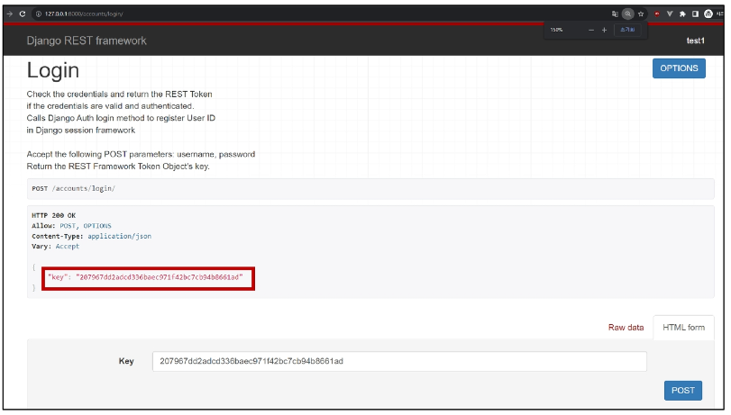
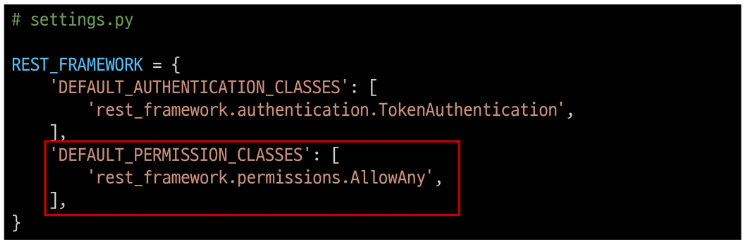
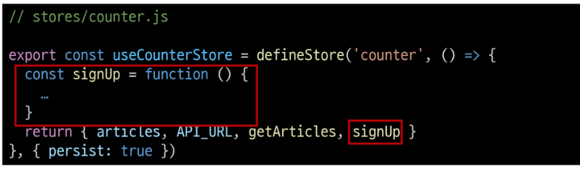
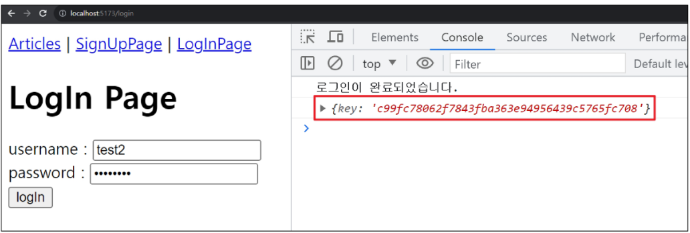
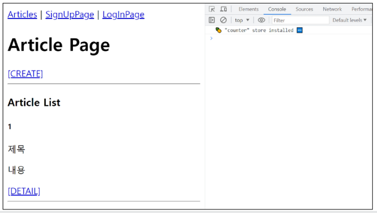

# 1115 Vue with DRF2
## DRF Authentication
- 시작하기 전에
  - 인증 로직 진행을 위해 User모델 관련 코드 활성화
  - django/articles/models.py 의 user ForeignKey 주석 해제
  - 
  - serializers의 read_only_fields 주석 해제
  - 
  - article_list_view 함수에서 게시글 생성시 user 정보도 저장될 수 있도록 주석 해제
  - 
  - DB 초기화
    - db.sqlite3 삭제
    - migrations 파일 삭제
  - Migration 과정 재진행

### Authentication
- Authentication ( 인증 )
  - 수신된 요청을 해당 요청의 사용자 또는 자격 증명과 연결하는 메커니즘
  - => 누구인지를 확인하는 과정

- Permissions( 권한 )
  - 요청에 대한 접근 허용 또는 거부 여부를 결정

- 인증과 권한
  - 인증이 먼저 진행되며 수신 요청을 해당 요청의 사용자 또는 해당 요청이 서명된 토큰(token)과 같은 일련의 자격 증명과 연결
  - 그런다음 권한 및 제한 정책(throttling policies)은 인증이 완료된 해당 자격 증명을 사용하여 요청을 허용해야 하는 지를 결정

- DRF에서의 인증
  - 인증은 항상 view 함수 시작 시, 권한 및 제한 확인이 발생하기 전, 다른코드의 진행이 허용되기 전에 실행됨
  - https://www.django-rest-framework.org/api-guide/authentication
  - 인증 자체로는 들어오는 요청을 허용하거나 거부할 수 없으며, 단순히 요청에 사용된 자격 증명만 식별한다는 점에 유의

- 승인되지 않은 응답 및 금지된 응답
  - 인증되지 않은 요청이 권한을 거부하는 경우 해당되는 두 가지 오류 코드가 응답
  1. HTTP 401 Unauthorized
     - 요청된 리소스에 대한 유효한 인증 자격 증명이 없기 때문에 클라이언트 요청이 완료되지 않았음을 나타냄  
  2. HTTP 403 Forbidden
     - 서버에 요청이 전달되었지만, 권한 때문에 거절되었다는 것을 의미
     - 401과 다른 점은 서버는 클라이언트가 누구인지 알고 있음

### 인증 체계 설정
- 인증 체계 설정 방법 ( django 에서 설정 하기)
  1. 전역 설정
  2. View 함수 별 설정

1. 전역 설정
   - DEFAULT_AUTHENTICATION_CLASSES 를 사용
   - 사용 예시 (django setting에서 사용 )
   - 

2. View 함수 별 설정
   - authentication_classes 데코레이터를 사용
   - 사용 예시 (django view.py 에서 사용)
   - 

- DRF가 제공하는 인증 체계
  1. BasicAuthentication
  2. TokenAuthentication !! !! !!
  3. SessionAuthentication
  4. RemoteUserAuthentication

- TokenAuthentication
  - 간단한 token 기반 HTTP 인증 체계
  - 기본 데스크톱 및 모바일 클라이언트와 같은 클라이언트 - 서버 설정에 적합
  - https://www.django-rest-framework.org/api-guide/authentication/#tokenauthentication
  - => 서버가 사용자에게 토큰을 발급하여 사용자는 매 요청마다 발급받은 토큰을 요청과 함께 보내 인증 과정을 거침

### TokenAuthentication 설정
- TokenAuthentication 적용 과정
  1. 인증 클래스 설정
  2. INSTALLED_APPS 추가
  3. Migrate 진행
  4. 토큰 생성 코드 작성

1. 인증 클래스 설정
   - TokenAuthentication 활성화 코드 주석 해제
   - 기본적으로 모든 view 함수가 토큰 기반 인증이 진행될 수 있도록 설정하는 것
   - 

2. INSTALLED_APPS 추가
   - rest_framework_authtoken 주석 해제
   - 

3. Migrate 진행
    - 

4. 토큰 생성 코드 작성
   - accounts/signals.py 주석 해제
   - => 모든 사용자가 자동으로 생성된 토큰을 가지도록 하는 역할
   - 

### Dj-Rest_Auth 라이브러리
- Dj-Rest_Auth
  - 회원가입, 인증(소셜미디어 인증 포함), 비밀번호 재설정, 사용자 세부 정보 검색, 회원 정보 수정 등 다양한 인증관련 기능을 제공하는 라이브러리
  - https://github.com/iMerica/dj-rest-auth

- Dj-Rest-Auth 설치 및 적용
  - 설치
  - 
  - 추가 APP 주석 해제 ( setting.py )
  - 
  - 추가 URL 주석 해제
  - 

- Dj-Rest-Auth의 Registration(등록) 기능 추가 설정
  1. 패키지 추가 설치
  2. 추가 App 등록
  3. 추가 URL 등록
  4. Migrate
  - https://dj-rest-auth/readthedocs.io/en/latest/installation.html#registration-optional

- Registation 기능 추가
  1. 패키지 추가 설치
     - 
  2. 추가 App 주석 해제
     - 
  3. 추가 URL 주석 해제
     - 
  4. Migrate 진행

### Token 발급 및 활용
- 회원 가입 및 로그인을 진행하여 토큰 발급 테스트 하기
- 라이브러리 추가로 인해 작성된 URL 목록 확인
- 회원가입 진행 (하단 회원가입 form 사용)
  - 
- 로그인 진행 (하단 로그인 form 사용)
  - 
- 로그인 성공 후 DRF로부터 발급 받은 Token 확인
- => 이제 이 Token을 Vue에서 별도로 저장하여 매 요청마다 함께 보내야 인증 됨
  - 

- Token 활용
  - 게시글 작성 과정을 통해 Token 사용 방법 익히기
  - Postman을 활용해 게시글 작성 요청
  - Body에 게시글 제목과 내용 입력
  - 
  - 인증이 제공되지 않았다는 에러발생
  - Headers에 발급받은 Token 작성 후 재요청 하여 성공 확인
    - key : 'Authorization'
    - value : 'Token + 토큰 값'

- 클라이언트가 Token으로 인증 받는 방법
  1. 'Authorization' HTTP Header에 포함
  2. 키 앞에는 문자열 'Token'이 와야하며 공백으로 두 문자열을 구분해야 함
    - 

#### 발급받은 Token을 인증이 필요한 요청마다 함께 보내야 함

## 권한 정책 설정
- 권한 정책 설정
  1. 전역 설정 
  2. view 함수 별 설정

1. 전역 설정
   - DEFAULT_PREMISSION_CLASSES를 사용
   - 사용 예시 (인증된 요청에 한해서 뷰 호출 허용 (로그인이 되어있어야만 접근 허용)한다는 설정 )
   - 
   - 지정하지 않을 경우 이 설정은 기본적으로 무제한 엑세스를 허용
   - AllowAny (디폴트 전역 설정) : 인증 여부에 상관없이 뷰 호출을 허용
   - 

2. View 함수 별 설정
   - permission_classes 데코레이터를 사용
   - 사용 예시
   - 

- DRF가 제공하는 권한 정책
  1. IsAuthenticated !! !!
  2. IsAdminUser
  3. IsAuthenticatedOrReadOnly
  4. ...
  - https://www.django-rest-framework.org/api-guide/permissions/#api-reference

- IsAuthenticated 권한
  - 인증되지 않은 사용자에 대한 권한을 거부하고 그렇지 않은 경우 권한을 허용
  - 등록된 사용자만 API에 액세스할 수 있도록 하려는 경우에 적합

### IsAuthenticated 권한 설정
- 권한 설정
  - DEFAULT_PERMISSION_CLASSES 주석 해제
  - => 기본적으로 모든 view 함수에 대한 접근을 허용
  - 
  - permission_classes 관련 코드 주석 해제
  - => 전체 게시글 조회 및 생성시에만 인증된 사용자만 진행할 수 있도록 권한 설정
  - 

- 권한 활용
  - 만약 관리자만 전체 게시글 조회가 가능한 권한이 설정되었을 때, 인증된 일반 사용자가 조회 요청을 할 경우 응답 확인하기
  - 테스트를 위해 임시로 관리자 관련 권한 클래스로 변경
  - 
  - 전체 게시글 조회 요청
    - 403 Forbidden 발생  
  - IsAuthenticated 권한으로 복구
  - 

## Authentication with Vue
- 시작하기 전에
  - 정상 작동하던 게시글 전체 조회가 작동하지 않음
  - 401 status code 확인
  - => 게시글 조회 요청시 인증에 필요한 수단(token)을 보내지 않고 있으므로 게시글 조회가 불가능해진 것
  - 

### 회원가입
- SignupView route 관련 코드 주석 해제
  - 
- App 컴포넌트에 SignupView 컴포넌트로 이동하는 RouterLink 작성
  - 
- view/SignUpView파일에 회원가입 form 작성 
  - 
- 사용자 입력 데이터와 바인딩 될 반응형 변수 작성
  - 
- SignUpView 컴포넌트 출력 확인
  - 
- 회원가입 요청을 보내기 위한 signUp 함수가 해야 할 일
  1. 사용자 입력 데이터를 받아
  2. 서버로 부터 회원가입 요청을 보냄
  - 
- 컴포넌트에 사용자 입력 데이터를 저장 후 store의 signUp함수를 호출하는 함수 작성
  - 
- 실제 회원가입 요청을 보내는 store의 signUp 함수 작성
  - 
- 회원가입 테스트
  - 
- DB 확인
  - 

### 로그인
- 로그인 로직 구현
  - LoginView route 관련 코드 주석 해제
    - 
  - App컴포넌트에 LoginView 컴포넌트로 이동하는 RouterLink 작성
    - 
  - 로그인 form 작성
    - 
  - 사용자 입력 데이터와 바인딩 될 반응형 변수 작성
    - 
  - LoginView 컴포넌트 출력확인
    - 
  - 로그인 요청을 보내기 위한 login 함수가 해야 할 일
    1. 사용자 입력 데이터를 받아
    2. 서버로 부터 로그인 요청 및 응답 받은 "토큰 저장"
    - 
  - 컴포넌트에 사용자 입력 데이터를 저장 후 store의 login 함수를 호출하는 함수 작성
    - 
  - 실제 로그인 요청을 보내는 store의 login 함수 작성
    - 
  - 로그인 테스트
  - 응답 객체에 발급된 Token이 함께 온 것을 확인
    - 

### 요청과 토큰
#### Token을 store 에 저장하여 인증이 필요한 요청마다 함께 보낸다.
- 토큰 저장 로직 구현
  - 반응형 변수 선언 및 토큰 저장
    - 
  - 다시 로그인 요청 후 저장된 토큰 확인
    - 

- 토큰이 필요한 요청
  1. 게시글 전체 목록 조회
  2. 게시글 작성

- 게시글 전체 목록 조회 with token
  - 게시글 전체 목록 조회 요청 함수 getArticles에 token 추가
  - 
  - 401 응답 메세지가 사라지고 게시글이 출력되는 것을 확인
  - 

- 게시글 작성 with token
  - 게시글 전체 목록 조회 요청 함수 getArticles에 token 추가
    - 
  - 게시글 작성확인

### 인증 여부 확인
- 사용자의 인증(로그인) 여부에 따라 추가 기능 구현
  1. 인증되지 않은 사용자
     - => 메인페이지 접근 제한
  2. 인증 된 사용자
     - => 회원가입 및 로그인 페이지에 접근 제한  

- 인증 상태 여부를 나타낼 속성 값 지정
  - token 여부에 따라 로그인 상태를 Boolean값으로 나타낼 isLogin 변수 작성
  - computed를 활용해 token 값이 변할 때만 계산하도록 함
  - 

1. 인증되지 않은 사용자는 메인 페이지 접근 제한
   - 전역 네비게이션 가드 beforEach를 활용해 다른 주소에서 메인 페이지로 이동 시 인증 되지 않은 사용자라면 로그인 페이지로 이동시키기
   - 
   - 브라우저 local storage에서 token을 삭제 후 메인 페이지 접속 시도
   - 

2. 인증 된 사용자는 회원가입과 로그인 페이지에 접근 제한
   - 다른 주소에서 회원가입 또는 로그인 페이지로 이동 시 이미 인증 된 사용자라면 메인페이지로 이동시키기
   - 
   - 로그인 후 회원가입, 로그인 페이지 접속 시도
   - 

### 기타 기능 구현
- 자연스러운 애플리케이션을 위한 기타 기능 구현
  1. 로그인 성공 후 자동으로 메인 페이지로 이동하기
  2. 회원가입 성공 후 자동으로 로그인까지 진행하기

1. 로그인 성공 후 자동으로 메인페이지로 이동하기
   - 
2. 회원가입 성공 후 자동으로 로그인까지 진행하기
   - 

## 참고
- "이벤트 알림 시스템"
- 애플리케이션 내에서 특정 이벤트가 발생할 때, 다른부분에게 신호를 보내어 이벤트가 발생했음을 알릴 수 있음
- 주로 모델의 데이터 변경 또는 저장, 삭제와 같은 작업에 반응하여 추가적인 로직을 실행하고자 할 때 사용
  - 예를 들어, 사용자가 새로운 게시글을 작성할 때 마다 특정 작업(예: 이메일 알림보내기)을 수행하려는 경우

- Vite에서 환경변수를  사용하는 법
  - https://vitejs.dev/guide/env-and-mode.html
  - 

- 환경 변수 (environment variable)
  - 애플리케이션의 설정이나 동작을 제어하기 위해 사용되는 변수

- 환경 변수의 목적
  - 개발, 테스트 및 프로덕션 환경에서 다르게 설정되어야 하는 설정 값이나 민감한 정보(ex. API Key)를 포함
  - 환경 변수를 사용하여 애플리케이션의 설정을 관리하면, 다양한 환경에서 일관된 동작을 유지하면서 필요에 따라 변수를 쉽게 변경할 수 있음
  - 보안적인 이슈를 피하고, 애플리케이션을 다양한 환경에 대응하기 쉽게 만들어 줌

- Vue 프로젝트 진행 시 유용한 자료
  - Awesome Vue.js
    - vue와 관련하여 선별된 유용한 자료를 아카이빙 및 관리하는 프로젝트
    - https://github.com/vuejs/awesome-vue
    - https://awesome-vue.js.org/

  - Vuetify
    - vue를 위한 UI 라이브러리 (like 'Bootstrap')
    - https://vuetifyjs.com/en/