# 1101 Introduction of Vue
## Front-end Development
### client-side frameworks
- Front-end Development
  - 웹사이트와 웹 애플리케이션의 사용자 인터페이스(UI)와 사용자 경험(UX)을 만들고 디자인하는 것
  - =>HTML, CSS, JavaScript 등을 활용하여 사용자가 직접 상호작용하는 부분을 개발

- Client-side Frameworks
  - 클라이언트 측에서 UI와 상호작용을 개발하기 위해 사용되는 JavaScript 기반 프레임워크
  - 

- Client-side frameworks가 필요한 이유
  1. 웹에서 하는 일이 많아졌다.
    - 단순히 무언가를 읽는 곳 => 무언가를 하는 곳 
    - 사용자는 이제 웹에서 문서만을 읽는 것이 아닌 음악을 스트리밍하고, 영화를 보고, 원거리에 있는 사람들과 텍스트 및 영상 채팅을 통해 즉시 통신하고 있음
    - 이처럼 현대적이고 복잡한 대화형 웹사이트를 "웹 애플리케이션(web applications)"이라 부름
    - JavaScript 기반의 Client-side frameworks의 출현으로 매우 동적인 대화형 애플리케이션을 훨씬 더 쉽게 구축할 수 있게 됨

  2. 웹에서 하는 일이 많아졌다.
    - 다루는 데이터가 많아졌다
    - 만약 친구가 이름을 변경했다면?
    - 친구 목록, 타임라인, 스토리등 친구 이름이 출력되는 모든 곳이 함께 변경되어야 함
    - 애플리케이션의 기본 데이터를 안정적으로 추적하고 업데이트(텐더링, 추가, 삭제 등)하는 도구가 필요
    - => 애플리케이션의 상태를 변경할 때마다 일치하도록 UI를 업데이트해야 한다는 것!

- Vanilla JS만으로 모든 데이터를 조작한다면,,
  - 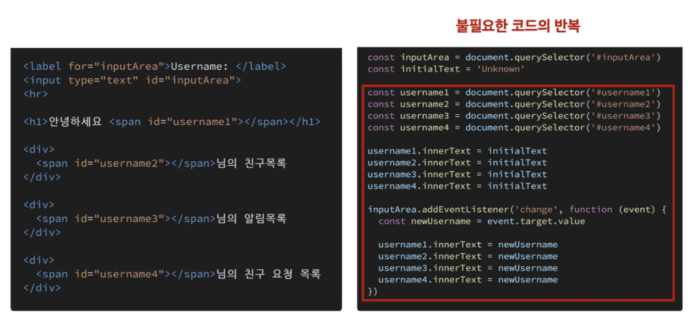

### SPA
- Single Page Application (SPA)
  - 페이지 한개로 구성된 웹 애플리케이션

- Single Page Application
  - 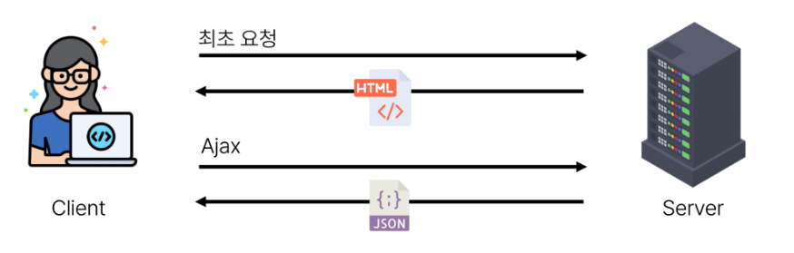
  1. 서버로부터 필요한 모든 정적 HTML을 처음에 한번 가져옴
  2. 브라우저가 페이지를 로드하면 Vue 프레임워크는 각 HTML 요소에 적절한 JavaScript 코드를 실행(이벤트에 응답, 데이터 요청 후 UI 업데이트 등 )
    - ex) 페이지 간 이동시, 페이지 갱신에 필요한 데이터만을 JSON으로 전달받아 페이지 일부 갱신
    - Google Maps, 인스타그램 등의 서비스 에서 갱신 시 새로고침이 없는 이유

- Single Page Application ( SPA )
  - 웹 애플리케이션의 초기 로딩 후 새로운 페이지 요청없이 동적으로 화면을 개신하며 사용자와 상호 작용하는 웹 애플리케이션
  - => CSR방식

- Client-side Rendering( CSR )
  - 클라이언트에서 화면을 렌더링 하는 방식

- Client-side Rendering 방식
  1. 브라우저는 페이지에 필요한 최소한의 HTML 페이지와 JavaScript를 다운로드
  2. 그런 다음 JavaScript를 사용하여 DOM을 업데이트하고 페이지를 렌더링
  - 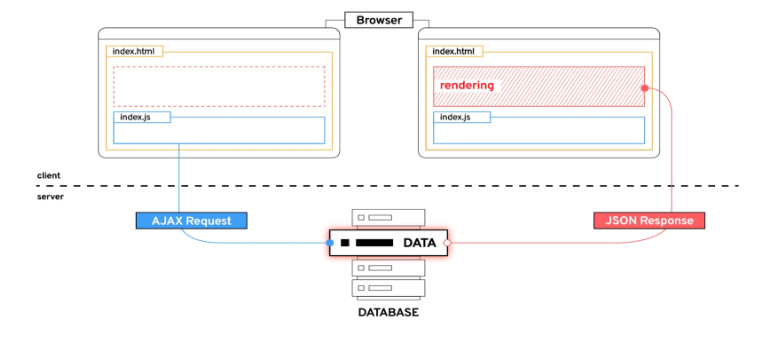

- Client-side Rendering 장점
  1. 빠른속도
    - 페이지의 일부를 다시 렌더링할 수 있으므로 동일한 웹 사이트의 다른페이지로 이동하는 것이 일반적으로 더 빠름
    - 서버로 전송되는 데이터의 양을 최소화
  2. 사용자 경험
    - 새로고침이 발생하지 않아 네이티브 앱과 유사한 사용자 경험을 제공
  3. Front-end 와 Back-end의 명확한 분리 
    - Front-end는 UI렌더링 및 사용자 상호 작용 처리를 담당
    - Back-end는 데이터 밒 API 제공을 담당
    - 대규모 애플리케이션을 더 쉽게 개발하고 유지관리 가능

- Client-side Rendering 단점
  1. 초기 구동속도가 느림
    - 전체페이지를 보기 전에 약간의 지연을 느낄 수 있음
    - JavaScript가 다운로드, 구문 분석 및 실행될때까지 페이지가 완전히 렌더링 되지 않기 때문
  2. SEO(검색 엔진 최적화) 문제 
    - 페이지를 나중에 그려 나가는 것이기 때문에 검색에 잘 노출되지 않을 수 있음

## Vue
### What is Vue
- 사용자 인터페이스를 구축하기 위한 JavaScript 프레임워크
- 2014년 발표 - Evan You
  - 학사 - 미술, 미술사 / 석사 - 디자인 & 테크놀로지 전공 / Angular 개발팀 출신
- 2023 기준 최신 버전은 "Vue3"
  - https://vuejs.org/
  - Vue2 문서에 접속하지 않도록 주의
  - 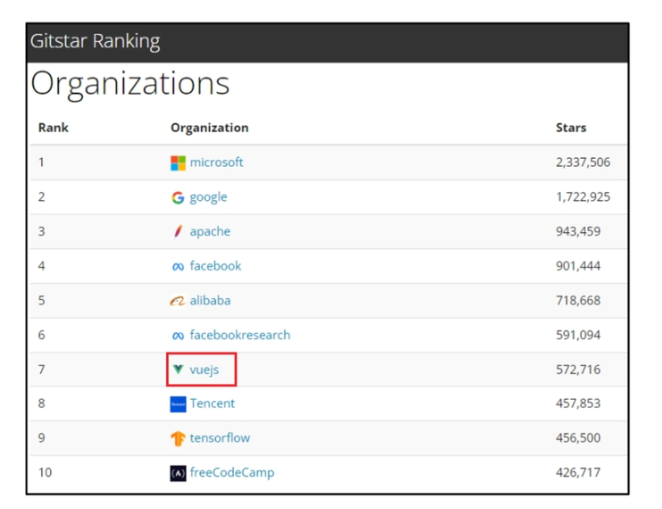

- Vue를 학습하는 이유
  1. 쉬운 학습 곡선 및 간편한 문법
    - 새로운 개발자들도 빠르게 학습할 수 있음
  2. 반응성 시스템
    - 데이터 변경에 따라 자동으로 화면이 업데이트되는 기능을 제공
  3. 모듈화 및 유연한 구조
    - 애플리케이션을 컴포넌트 조각으로 나눌 수 있음
    - 코드의 재사용성을 높이고 유지보수를 용이하게 함

- SSAFY에서의 Vue
  - Vue는 React난 Angular 대비 간결하고 직관적인 문법을 가지고 있어 초기 학습이 상대적으로 원할
    - 짧은 시간내에 효율적으로 결과물을 만들어 낼 수 있음
  - 거대하고 활발한 커뮤니티를 가지고 있어 풍부한 문서, 튜토리얼, 예제 및 다양한 리소스를 공유 받을 수 있음
    - 최선 업데이트 및 트렌드를 공유함으로써 지속적인 학습을 촉진

- Vue의 2가지 핵심 기능
  - 첫 코드 작성 및 결과
  - 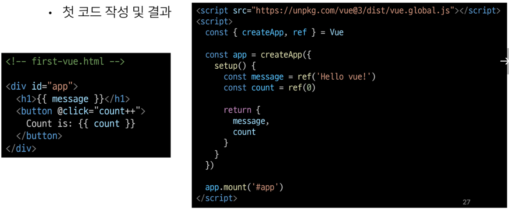
  - 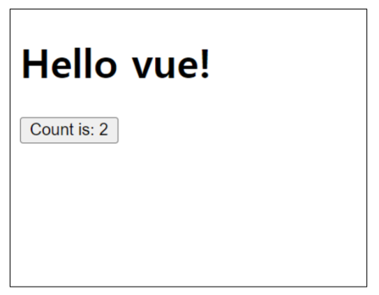
  1. 선언적 렌더링
    - HTML은 확장하는 템플릿 구문을 사용하여 HTML이 JavaScript 데이터를 기반을 어떻게 보이는지 설명할 수 있음 
  2. 반응형
    - JavScript 상태 변경사항을 자동으로 추적하고 변경사항이 발생할 때 DOM을 효율적으로 업데이트 

### Vue Tutorial
- Vue를 사용하는 방법
  1. "CDN" 방식
  2. "NPM" 설치 방식
    - CDN 방식 이후 진행  

- 첫번째 Vue 작성하기
  1. CDN 밒 Application instance 작성
    - 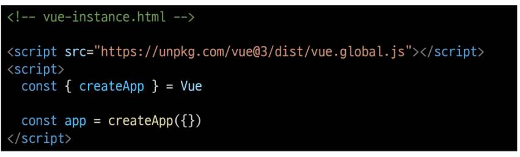
  2. Application instance
    - 모든 Vue 애플리케이션은 createAPP함수로 새 Application instance 를 생성하는 것으로 시작
    - 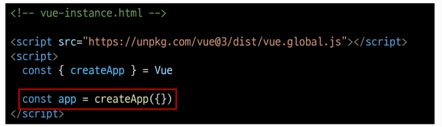
  3. app.mount()
    - 컨테이너 요소에 애플리케이션 인스턴스를 탑재(연결)
    - 각 앱 인스턴스에 대해 mount()는 한번만 호출할 수 있음
    - 

- ref()
  - 반응형 상태(데이터)를 선언하는 함수
  - Declaring Reactive State

- ref 함수
  - 인자를 받아.value 속성이 있는 ref객체로 래핑(wrapping)하여 반환
  - ref로 선언된 변수의 값이 변경되면, 해당 값을 사용하는 템플릿에서 자동으로 업데이트
  - 인자는 어떠한 타입도 가능
  - 
  - 템플릿의 참조에 접근하려면 setup 함수에서 선언 및 반환 필요
  - 템플릿에서 ref를 사용할 때는 .value 를 작성할 필요없음
  - (automatically unwrapped)
  - 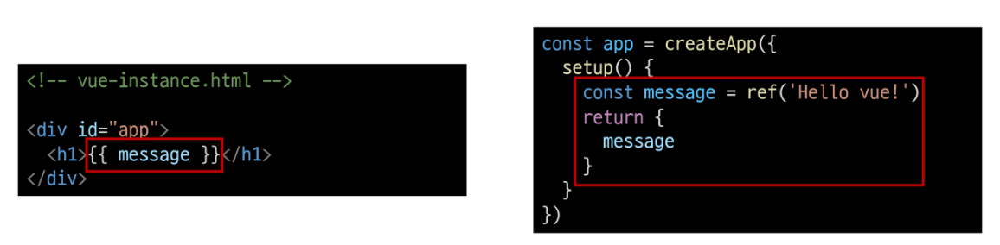

- ref()
  - 반응형 상태(데이터)를 선언하는 함수
  - => 반응형을 가지는 참조 변수를 만드는 것
  - (ref === reactive reference)

- Vue 기본  구조
  - createApp()에 전달되는 객체는 Vue 컴포넌트(Component)
  - 컴포넌트의 상태는 setup() 함수 내에서 선언되어야하며 객체를 반환해야함
  - 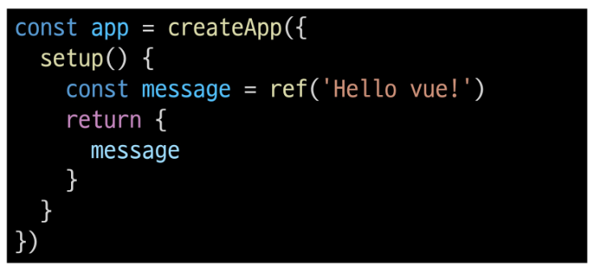

- 템플릿 렌더링
  - 반환된 객체의 속성은 템플릿에서 사용할 수 있음
  - Mustache syntax(콧수염 구문)를 사용하여 메세지 값을 기반으로 동적 텍스트를 렌더링
  - 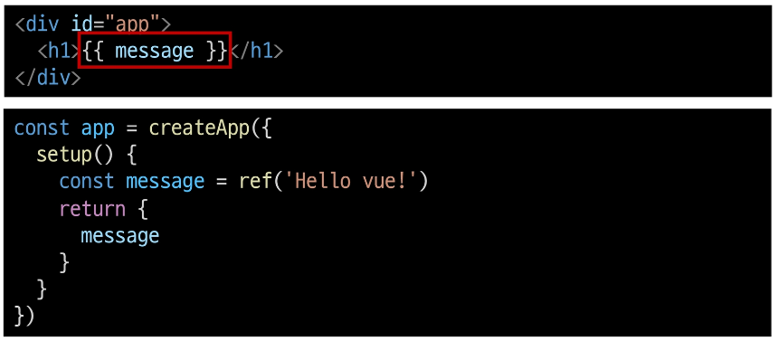
  - 콘텐츠는 식별자나 경로에만 국한되지 않으며 유효한 JavaScript 표현식을 사용할 수 있음
  - 

- Event Listeners in Vue
  - 'v-on' directive를 사용하여 DOM 이벤트를 수신할 수 있음
  - 함수 내에서 refs를 변경하여 구성요소상태를 업데이트
  - 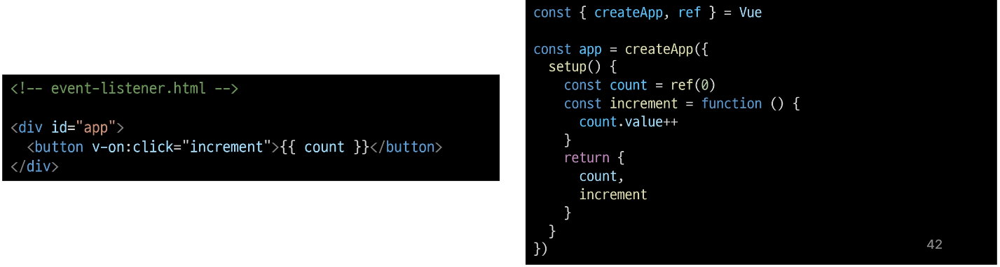

## 참고
### Ref Unwrap 주의사항
- 템플릿에서의 unwrap 시 주의사항
  - 템플릿에서의 unwrap은 ref가 최상위 속성인 경우에만 적용가능
  - 다음 표현식은 어떻게 출력될까?
    - 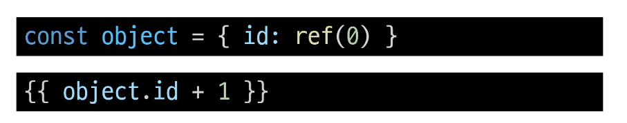
    - 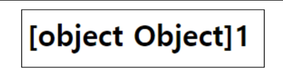
  - object는 최상위 속성이지만 object.id는 그렇지 않음
  - 표현식을 평가할 때 object.id가 unwrap 되지않고 ref 객체로 남아있기 때문
  - 이 문제를 해결하기 위해서는 "id를 최상위 속성으로 분해"해야 함
    - 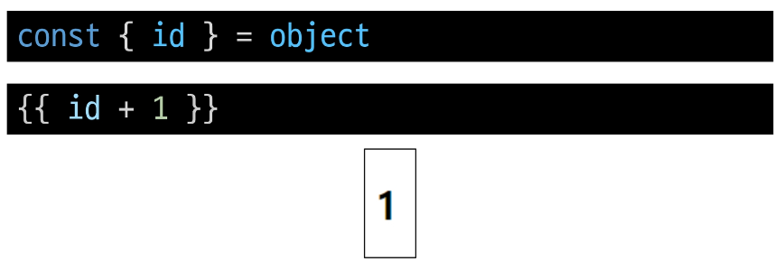
  - 단 ref가 {{}}의 최종 평가인 경우는 unwrap 가능
    - 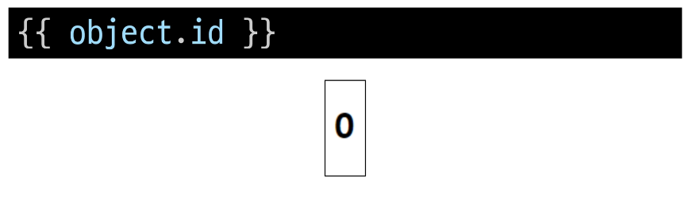

- Why Refs?
  - 일반 변수 대신 굳이 .value가 포함된 ref가 필요한 이유는?
  - Vue는 템플릿에서 ref를 사용하고 나중에 ref의 값을 변경하면 자동으로 변경사항을 감지하고 그에 따라 DOM을 업데이트함
    - "의존성 추적 기반의 반응형 시스템"
  - Vue는 렌더링 중에 사용된 모든 ref를 추적하며, 나중에 ref가 변경되면 이를 추적하는 구성 요소에 대해 다시 렌더링
  - => JavaScript에서는 일반 변수의 접근 또는 변형을 감지할 방법이 없기때문
  - https://vuejs.org/guide/esssentials/reactivity-fundamentals.html#why-refs

- SEO ( Search Engine Optimization)
  - google, bing과 같은 검색 엔진 등에 내 서비스나 제품 등이 효율적으로 검색 엔진에 노출되도록 개선하는 과정을 일컫는 작업
  - 정보의 대상은 주로 HTML에 작성된 내용
  - 검색
    - 각 사이트가 운용하는 검색엔진에 의해 이루어지는 작업
  - 검색 엔진
    - 웹 상에 존재하는 가능한 모든 정보들을 긁어 모으는 방식으로 동작
  - 최근에는 SPA, 즉 CSR로 구성된 서비스의 비중이 증가
  - SPA서비스도 검색 대상으로 넓히기 위해 JS를 지원하는 방식으로 발전하는 중

- CSR & SSR 
  - CSR과 SSR은 흑과 백이 아님
    - 내 서비스에 적합한 렌더링 방식을 적절하게 활용할 수 있어야함
  - SPA서비스에서도 SSR을 지원하는 Framework가 발전하는 있음
    - Vue의 Nuxt.js
    - React의 Next.js
    - Anglar Universal

