# 1106 Basic_syntax2
## Computed Properties
- computed()
  - 계산된 속성을 정의하는 함수
  - 미리 계산된 속성을 사용하여 템플릿에서 표현식을 단순하게 하고 불필요한 반복 연산을 줄임

- computed 기본 예시
  1. 할 일이 남았는지 여부에 따라 다른 메세지를 출력하기
    - 
    - 템플릿이 복잡해지며 todos에 따라 계산을 수행하게 됨
    - 만약 이 계산을 템플릿에 여러번 사용하는 경우에는 반복이 발생
  2. computed 적용
     - 반응성 데이터를 포함하는 복잡한 로직의 경우 computed를 활용하여 미리 값을 계산 
     - 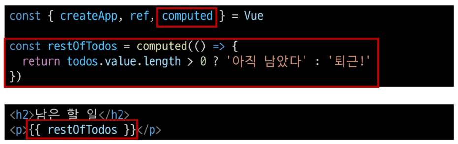

- computed 특징
  - 반횐되는 값은 computed ref이며 일반 refs와 유사하게 계산된 결과를 .value로 참조 할 수 있음 (템플릿에서는 .value 생략가능)
  - computed 속성은 의존된 반응형 데이터를 "자동으로 추적"
  - 의존하는 데이터가 변경될 때만 재평가
    - restOfTodos의 계산은 todos에 의존하고 있음
    - 따라서 todos가 변경될 때만 restOfTodos가 업데이트 됨
  - 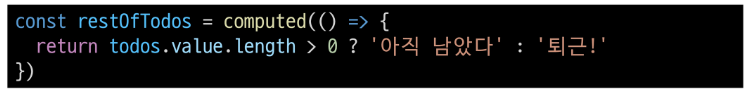

### Computed vs .Methods
- computed와 동일한 로직을 처리할 수 있는 method
  - computed 속성 대신 method로도 동일한 기능을 정의할 수 있음
  - 두 가지 접근 방식은 실제로 완전히 동일
  - 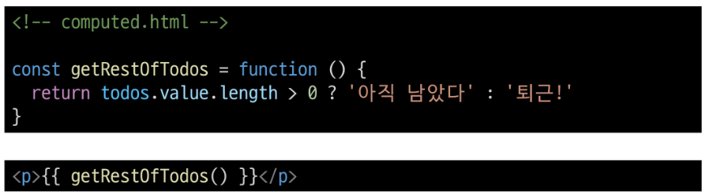

- computed와 method 차이
  - computed 속성은 "의존된 반응형 데이터를 기반으로 캐시(cached)된다
  - 의존하는 데이터가 변경된 경우에만 재평가 됨
  - 즉, 의존된 반응형 데이터가 변경되지 않는 한 이미 계산된 결과에 대한 여러 참조는 다시 평가할 필요 없이 이전에 계산된 결과를 즉시 반환
  - => 반면, method 호출은 다시 렌더링이 발생할 때마다 항상 함수를 실행

- Cache(캐시)
  - 데이터나 결과를 일시적으로 저장해두는 임시 저장소
  - 이후에 같은 데이터나 결과를 다시 계산하지 않고 빠르게 접근할 수 있도록 함

- Cache 예시
  - 웹 페이지의 캐시 데이터
    - 페이지 일부 데이터를 브라우저 캐시에 저장 후 같은 페이지에 다시 요청시 모든 데이터를 다시 응답 받는 것이 아닌 캐시 된 데이터를 사용하여 더 빠르게 웹 페이지를 렌더링

- computed와 method의 적절한 사용처
  - computed 
    - 의존하는 데이터에 따라 결과가 바뀌는 계산된 속성을 만들 때 유용
    - 동일한 의존성을 가진 여러 곳에서 사용할 때 계산 결과를 캐싱하여 중복 계산 방지
  - method
    - 단순히 특정 동작을 수행하는 함수를 정의할 때 사용
    - 데이터에 의존하는지 여부에 관계없이 항상 동일한 결과를 반환하는 함수

- method와 computed 정리
  - computed
    - 의존된 데이터가 변경되면 자동으로 업데이트
  - method
    - 호출해야만 실행됨
  - => 무조건 computed만 사용하는 것이 아니라 사용목적과 상황에 맞게 computed 와 method를 적절히 조합하여 사용

## Conditional Rendering
### v-if
- v-if
  - 표현식 값의 T/F를 기반으로 요소를 조건부로 렌더링

- v-if 예시
  - 'v-else' directive를 사용하여 v-if에 대한 else 블록을 나타낼 수 있음
    - 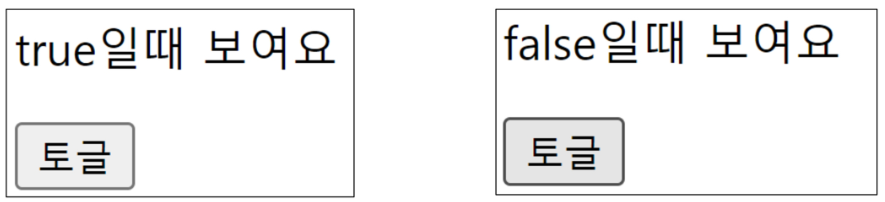
    - 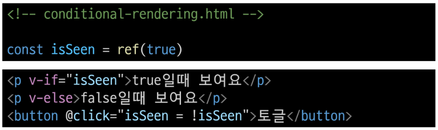
  - 'v-else-if' directive를 사용하여 v-if에 대한 else-if 블록을 나타낼 수 있음
    - 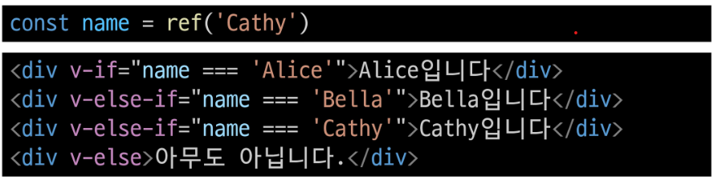

- 여러 요소에 대한 v-if 적용
  - v-if 는 directive 이기 때문에 단일 요소에만 연결 가능
  - 이 경우 template 요소에 v-if를 사용하여 하나 이상의 요소에 대해 적용 할 수 있음 (v-else, v-else-if 모두 적용 가능)
  - 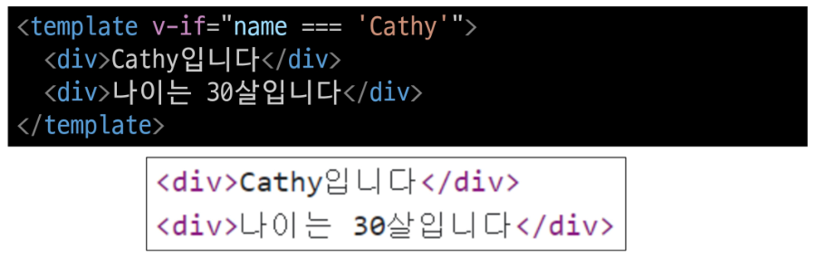

- HTML <'template'> element
  - 페이지가 로드 될 때 렌더링 되지 않지만 JavaScript 를 사용하여 나중에 문서에서 사용할 수 있도록 하는 HTML을 보유하기 위한 메커니즘
  - 보이지 않는 wrapper 역할

### v-if vs v-show
- v-show
  - 표현식 값의 T/F를 기반으로 요소의 가시성을 전환

- v-show 예시
  - v-show 요소는 항상 렌더링 되어 DOM에 남아있음
  - CSS display 속성만 전환하기 때문
  - 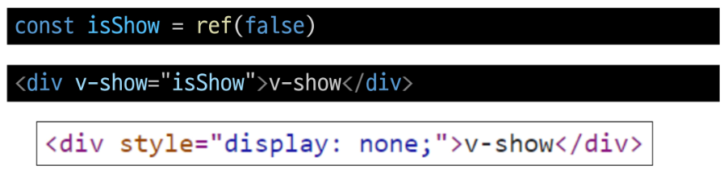

- v-if ( cheap initial load, expensive toggle )
  - 초기 조건이 false인 경우 아무 작업도 수행하지 않음
  - 토글 비용이 높음

- v-show( expensive initial load, chaep toggle)
  - 초기 조건에 관계 없이 항상 렌더링
  - 초기 렌더링 비용이 더 높음

- 무언가를 매우 자주 전환해야 하는 경우에는 v-show를
- 실행중에 조건이 변경되지 않는 경우네는 v-if를 권장

## List-Rendering
### v-for
- v-for
  - 소스 데이터(array, object, number, string, lterable)를 기반으로 요소 또는 템플릿 블록을 여러 번 렌더링

- v-for 구조
  - v-for는 alias in expression 형식의 특수 구문을 사용하여 반복되는 현재 요소에 대한 별칭(alias)을 제공
  - 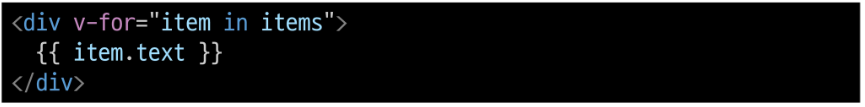
  - 인덱스(객체에서는 키)에 대한 별칭을 지정할 수 있음
  - 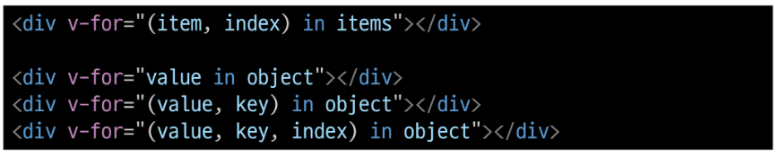

- v-for 예시
  - 배열 반복
  - 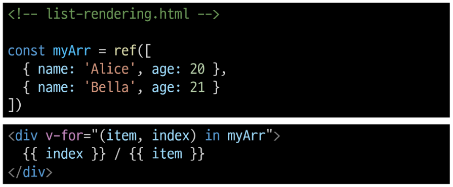
  - -객체 반복
  - 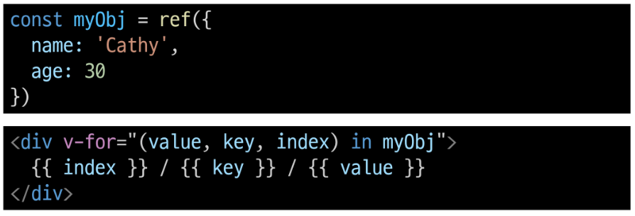

- 여러 요소에 대한 v-for 적용
  - template 요소에 v-for를 사용하여 하나 이상의 요소에 대해 반복 렌더링 할 수 있음
  - 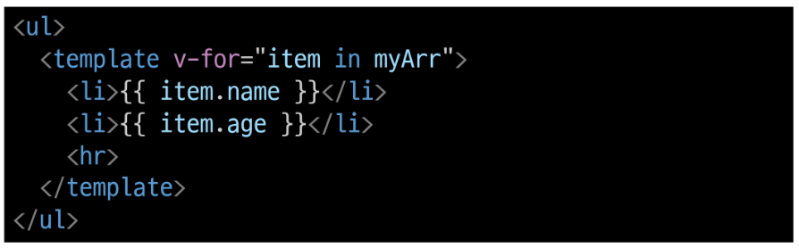

- 중첩된 v-for
  - 각 v-for 범위는 상위 범위에 접근할 수 있음
  - 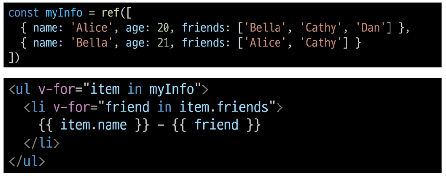

### v-for with key
- 반드시 v-for와 key를 함께 사용한다
  - 내부 컴포넌트의 상태를 일관되게 유지
  - => 데이터의 예측 가능한 행동을 유지 (Vue 내부 동작 관련)

- v-for와 key
  - key는 반드시 각 요소에 대한 고유한 값을 나타낼 수 있는 식별자여야 함
  - 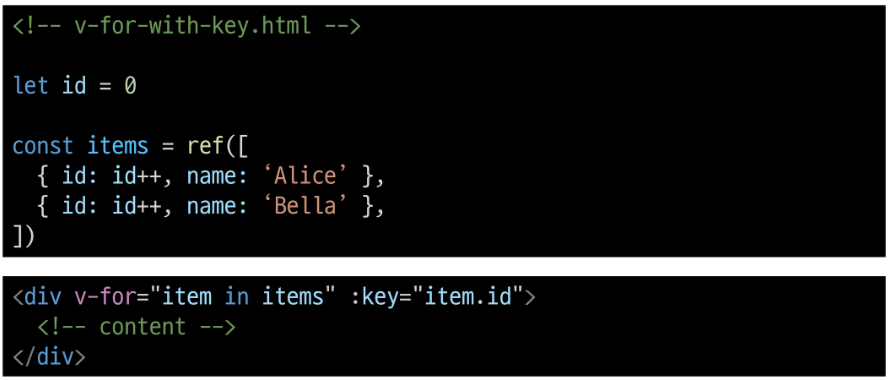

### v-for with v-if
- 동일 요소에 v-for와 v-if를 함께 사용하지 않는다
  - 동일한 요소에서 v-if가 v-for보다 우선순위가 더 높기 때문
  - v-if 조건은 v-for 범위의 변수에 접근할 수가 없음

- v-for와 v-if 문제 상황 1
  - todo 데이터 중 이미 처리한 (isComplete === true ) todo만 출력하기
  - 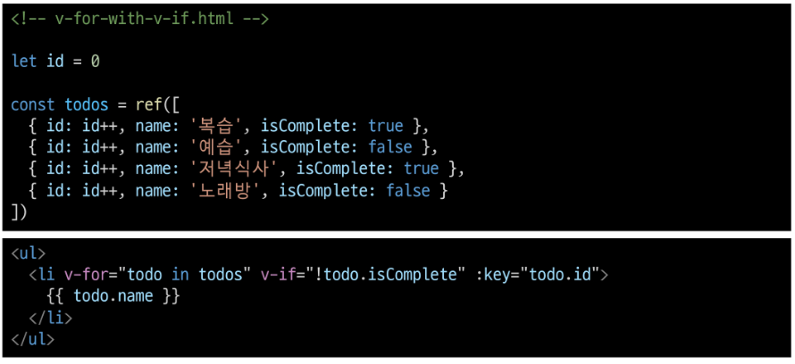

- v-for와 v-if 해결법 1
  - computed를 활용해 필터링 된 목록을 반환하여 반복하도록 설정
  - 

- v-for와 v-if 문제 상황 2
  - v-if가 더 높은 우선순위를 가지므로 v-for의 todo 요소를 v-if에서 사용할 수 없음
  - 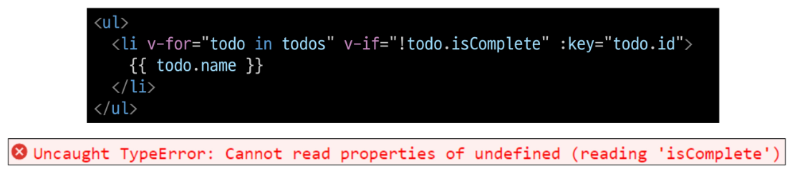

- v-for 와 v-if 해결법 2
  - v-for와 template 요소를 사용하여 "v-if를 이동"
  - 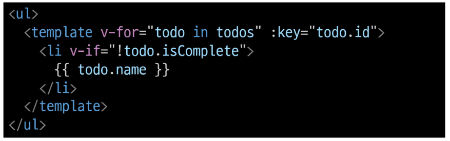

## Watches
- watch()
  - 반응형 데이터를 감시하고 감시하는 데이터가 변경되면 콜백 함수를 호출

- watch 구조
  - 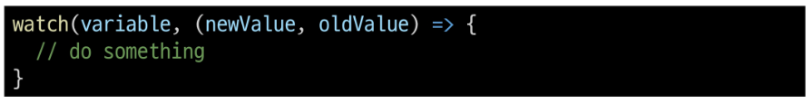
  - variable
    - 감시하는 변수
  - newValue
    - 감시하는 변수가 변화된 값
    - 콜백 함수의 첫번째 인자
  - oldValue
    - 콜백 함수의 두번째 인자

- watch 예시
  1. 감시하는 변수에 변화가 생겼을 때 기본 동작 확인하기
    - 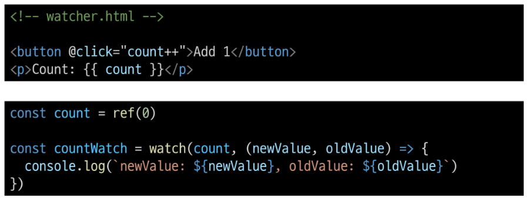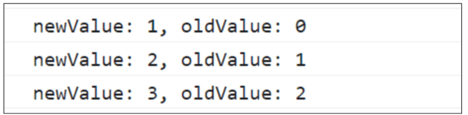
  2. 감시하는 변수에 변화가 생겼을 때 연관 데이터 업데이트하기
    - 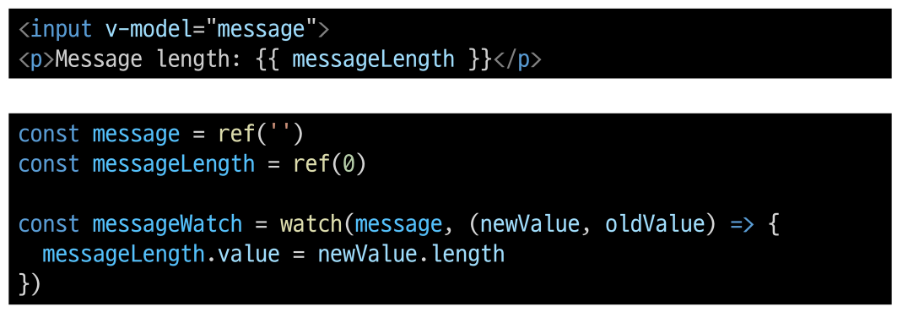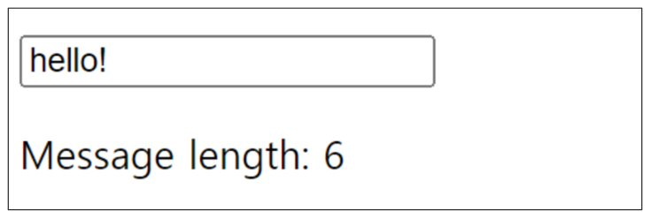

- computed와 watches
  - 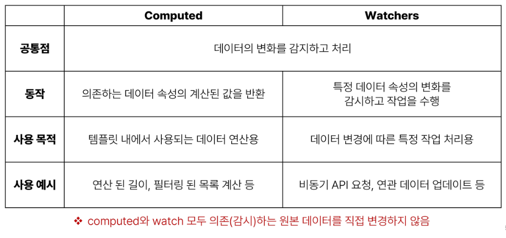

## LifeCycle Hooks
- Lifecycle Hooks
  - Vue 인스턴스의 생애주기 동안 특정 시점에 실행되는 함수
  - => 개발자가 특정 단계에서 의도하는 로직이 실행될 수 있도록 함

- LifeCycle Hooks 예시
  1. Vue 컴포넌트 인스턴스가 초기 렌더링 및 DOM 요소 생성이 완료된 후 특정 로직을 수행하기
    - 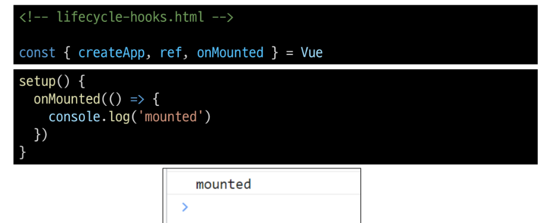
  2. 반응형 데이터의 변경으로 인해 컴포넌트의 DOM이 업데이트된 후 특정 로직을 수행하기
    - 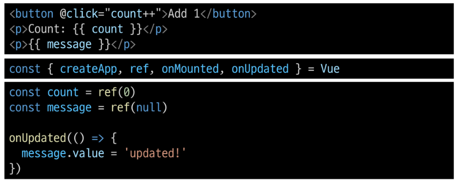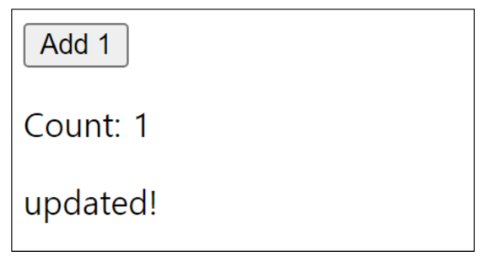

- LifeCycle Hooks 특징
  - Vue는 Lifecycle Hooks에 등록된 콜백 함수들을 인스턴스와 자동으로 연결함
  - 이렇게 동작하려면 hooks 함수들은 반드시 동기적으로 작성되어야 함
  - 인스턴스 생애 주기의 여러 단계에서 호출되는 다른 hooks도 있으며, 가장 일반적으로 사용되는 것은 onMounted, onUpdated, onUnmounted
  - https://vuejs.org/api/composition-api-lifecycle.html

- LifeCycle Hooks Diagram
  - https://vuejs.org/guide/essentials/lifecycle.html#lifecycle-diagram

## Vue Style Guide
- Vue Style Guide
  - Vue의 스타일 가이드 규칙은 우선순위에 따라 4가지 범주로 나눔
  - 규칙 범주
    - 우선 순위 A : 필수(Essential)
    - 우선 순위 B : 적극 권장 (Strongly Recommended)
    - 우선 순위 C : 권장 (Recommeded)
    - 우선 순위 D : 주의 필요 (Use with Caution)
  - https://vuejs.org/style-guide/

- 우선 순위 별 특징
  - A: 필수(Essential)
    - 오류를 방지하는 데 도움이 되므로 어떤 경우에도 규칙을 학습하고 준수
  - B: 적극 권장(Strongly Recommended)
    - 가독성 및/또는 개발자 경험을 향상 시킴
    - 규칙을 어겨도 코드는 여전히 실행되겠지만, 정당한 사유가 있어야 규칙을 위반할 수 있음
  - C: 권장(Recommeded)
    - 일관성을 보장하도록 임의의 선택을 할 수 있음
  - D: 주의 필요(Use with Caution)
    - 잠재적 위험 특성을 고려함

- 우선 순위 A 였던 금일 학습 내용
  1. v-for에 key 작성하기
  2. 동일 요소에 v-if와 v-for 함께 사용하지 않기
  - 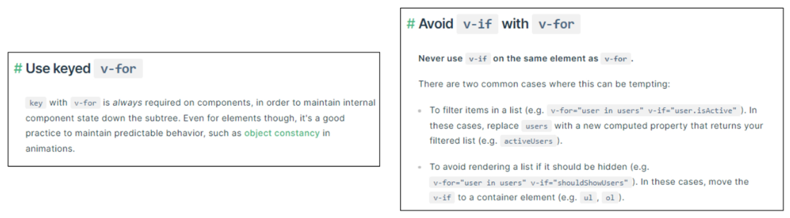

## 참고
- [주의] computed의 반환 값은 변경하지 말 것
  - computed의 반환 값은 의존하는 데이터의 파생된 값
  - 일종의 snapshot이며 의존하는 데이터가 변경될 때 마다 새 snapshot이 생성됨
  - snapshow을 변경하는 것은 의미가 없으므로 계산된 반환 값은 읽기 전용으로 취급되어야 하며 변경되어서는 안됨
  - 대신 새 값을 얻기 위해서는 의존하는 데이터를 업데이트 해야 함

- [주의] computed 사용 시 원본 배열 변경하지 말 것
  - computed에서 reverse() 및 sort() 사용 시 원본 배열을 변경하기 때문에 복사본을 만들어서 진행 해야 함
  - 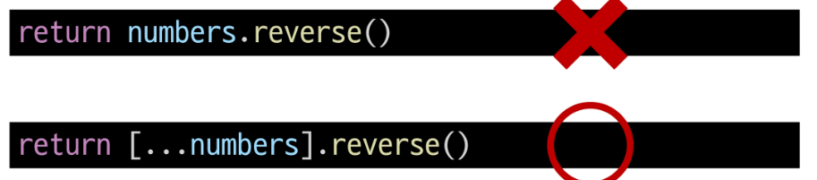

- [주의]배열의 인덱스를 v-for의 key로 사용하지 말 것
  - 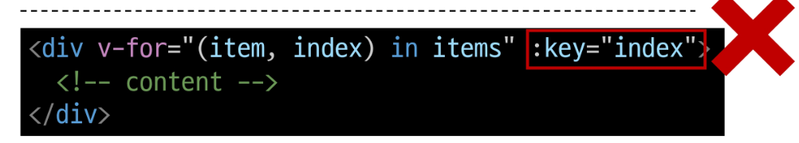
  - 인덱스는 식별자가 아닌 배열의 항목 위치만 나타내기 때문에 Vue 가 DOM을 변경 할 때 (끝이 아닌 위치에 새 항목이 배열에 삽입되면) 여러 컴포넌트간 데이터 공유 시 문제가 발생
  - => 직접 고유한 값을 만들어내는 메서드를 만들거나 외부 라이브러리 등을 활용하는 등 식별자 역할을 할 수 있는 값을 만들어 사용

- v-for와 배열 - "배열 변경 감지"
  - 수정 메서드 ( 원본 배열 수정 )
    - Vue는 반응형 배열의 변경 메소드가 호출 되는 것을 감지하여, 필요한 업데이트를 발생시킴
    - push(), pop(), shift(), unshift(), splice(), sort(), reverse()

  - 배열 교체
    - 원본 배열을 수정하지 않고 항상 새 배열을 반환
    - filter(), concat(), slice()

- v-for와 배열 - "필터링/정렬 결과 표시"
  - 원본 데이터를 수정하거나 교체하지 않고 필터링되거나 정렬된 결과를 표시
    1. computed 활용
      - 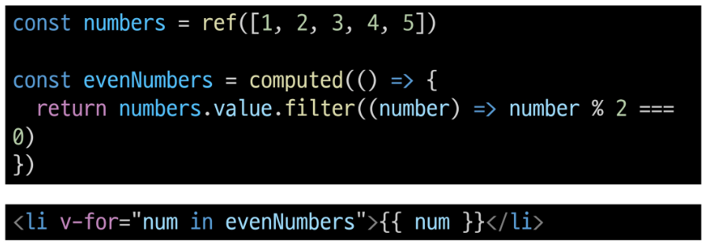
    2. method 활용 (computed가 불가능한 중첩된 v-for에 경우) 
      - 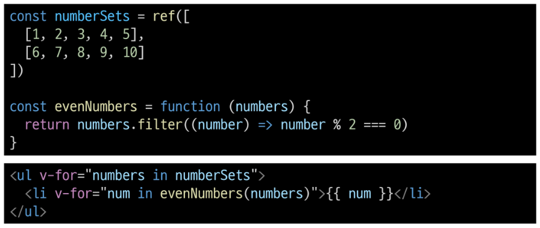