# 1107 Single-File Components
## Single-File Components
### components
- Component
  - 재사용 가능한 코드 블록

- Components 특징
  - UI를 독립적이고 재사용 가능한 일부분으로 분할하고 각 부분을 개별적으로 다룰 수 있음
  - 그러면 자연스럽게 앱은 중첩된 Component의 트리로 구성됨
  - 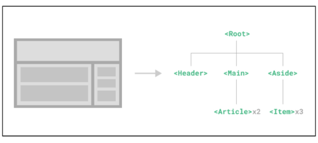
  - 웹서비스는 여러개의 Component로 이루어져 있다
  - 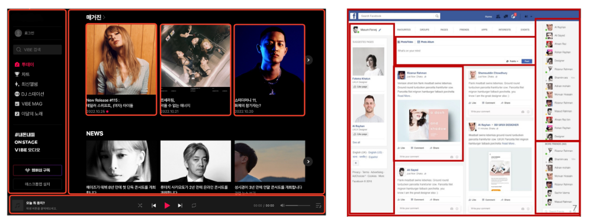

### SFC
- Single-File Components ( SFC )
  - 컴포넌트의 템플릿, 로직 및 스타일을 하나의 파일로 묶어낸 특수한  파일 형식 ( *.vue 파일 )

- SFC 파일 예시
  - Vue SFC는 HTML, CSS 및 JavaScript 3개를 하나로 합친 것
  - <'template'>, <'script'>, <'style'> 블록은 하나의 파일에서 컴포넌트의 뷰, 로직 및 스타일을 캡슐화하고 배치
  - 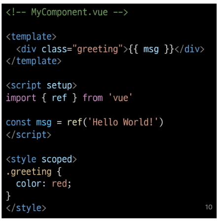

### SFC문법
- SFC 문법 개요
  - 각 *.vue 파일은 세가지 유형의 최상위 언어 블록 <'template'>, <'script'>, <'style'> 로 구성됨
  - 언어 블록의 작성 순서는 상관없으나 일반적으로 template -> script -> style 순서로 작성
  - 

- 언어블록- <'template'>
  - 각 *.vue 파일은 최상위 <'template'> 블록을 하나만 포함할 수 있음
  - 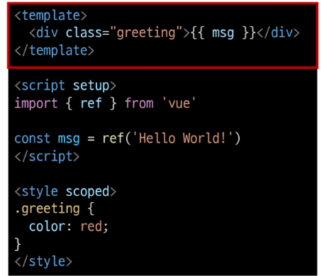
  

- 언어블록- <'script setup'>
  - 각 *.vue 파일은 하나의 <'script setup'> 블록만 포함할 수 있음 ( 일반 <'script'> 제외)
  - 컴포넌트의 setup() 함수로 사용되며 컴포넌트의 각 인스턴스에 대해 실행
  - 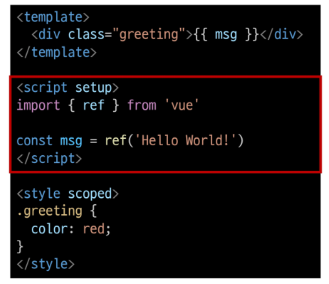

- 언어블록- <'style scope'>
  - *.vue 파일에는 여러 <'style'>태그가 포함될 수 있음
  - scoped가 지정되면 CSS는 현재 컴포넌트에만 적용
  - 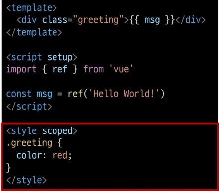

- 컴포넌트 사용하기
  - https://play.vuejs.org/ 에서 vue 컴포넌트 코드 작성 및 미리보기
  - Vue SFC는 컴파일러를 통해 컴파일 된 후 빌드 되어야 함
  - => 실제 프로젝트에서는 일반적으로 SFC 컴파일러를 Vite와 같은 공식 빌드 도구를 사용해 사용
  - 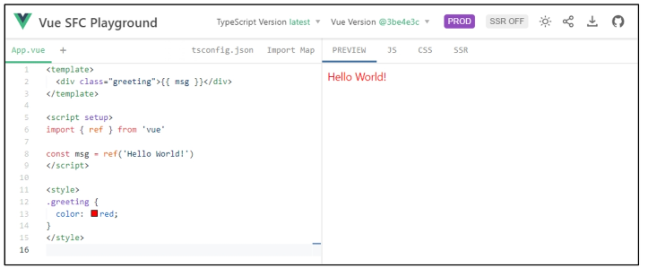

## SFC build tool (Vite)
### Vite
- Vite
  - 프론트 엔드 개발 도구
  - => 빠른 개발 환경을 위한 빌드 도구와 개발 서버를 제공
  - https://vitejs.dev/

- Vite 튜토리얼
  1. vite 프로젝트 생성
    - 
  2. 프로젝트 설정 관련 절차 진행
    - 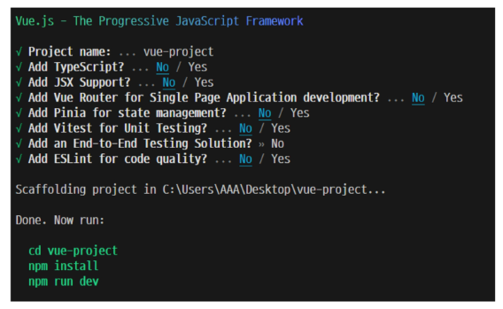
  3. 프로젝트 폴더 이동 및 패키지 설치
    - 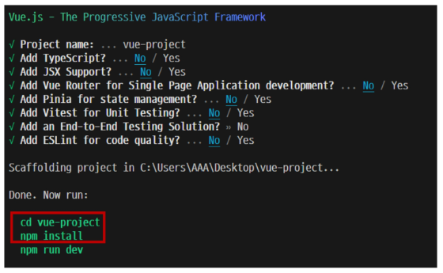
  4. Vue 프로젝트 서버 실행
    - 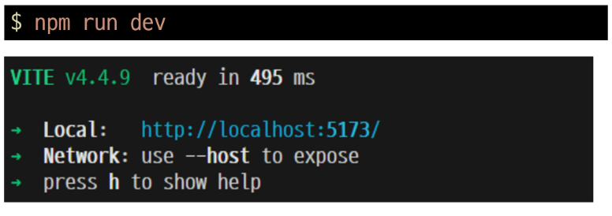
  5. Vue 프로젝트 실행 결과
    - 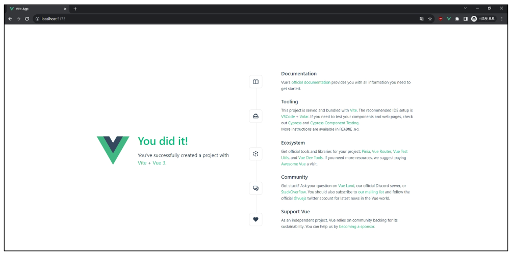

### NPM
- Node Package Manager
  - Node.js의 기본 패키지 관리자
  - 

- Node.js의 영향
  - 기존에 브라우저 안에서만 동작할 수 있었던 JavaScript를 브라우저가 아닌 서버 측에서도 실행할 수 있게함
    - 프론트엔드와 벡엔드에서 동일한 언어로 개발할 수 있게 됨

  - NPM을 활용해 수많은 오픈소스 패키지와 라이브러리를 제공하여 개발자들이 손쉽게 코드를 공유하고 재사용할 수 있게 함

### Vite 프로젝트 구조
- node_modules
  - Node.js 프로젝트에서 사용되는 외부 패키지들이 저장되는 디렉토리
  - 프로젝트의 의존성 모듈을 저장하고 관리하는 공간
  - 프로젝트가 실행될 때 필요한 라이브러리와 패키지들을 포함
  - .gitignore 에 작성됨
  - 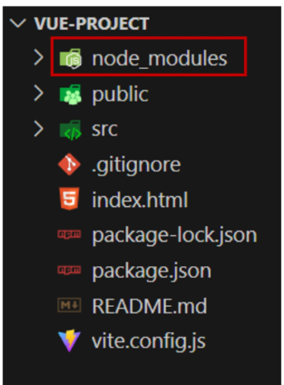

- package-lock.json
  - 패키지들의 실제 설치 버전, 의존성 관계, 하위 패키지 등을 포함하여 패키지 설치에 필요한 모든 정보를 포함
  - 패키지들의 정확한 버전을 보장하여, 여러 개발자가 협업하거나 서버 환경에서 일관성 있는 의존성을 유지하는 데 도움을 줌
  - npm install 명령을 통해 패키지를 설치할 때, 명시된 버전과 의존성을 기반으로 설치

- package.json
  - 프로젝트의 메타 정보와 의존성 패키지 목록을 포함
  - 프로젝트의 이름, 버전, 작성자, 라이선스 등과 같은 메타 정보를 정의
  - => package-lock.json과 함께 프로젝트의 의존성을 관리하고, 버전 충돌 및 일관성을 유지하는 역할
  - 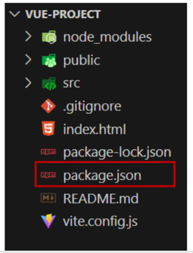

- public 디렉토리
  - 주로 다음 정적 파일을 위치 시킴
    - 소스코드에서 참조되지 안흔
    - 항상 같은이름을 갖는
    - import 할 필요 없는
  - 항상 root 절대 경로를 사용하여 참조
    - public/icon.png는 소스 코드에서 /icon.png로 참조 할 수 있음
  - https://vitejs.dev/guide/assets.html#the-public-directory

- src 디렉토리
  - 프로젝트의 주요 소스 코드를 포함하는 곳
  - 컴포넌트, 스타일, 라우팅등 프로젝트의 핵심 코드를 관리
  - 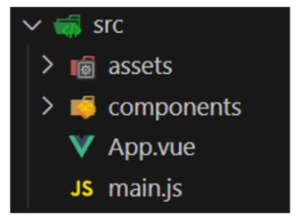

- src/assets 
  - 프로젝트 내에서 사용되는 자원(이미지, 폰트, 스타일 시트)등을 관리
  - 컴포넌트 자체에서 참조하는 내부 파일을 저장하는데 사용
  - 컴포넌트가 아닌 곳에서는 public 디렉토리에 위치한 파일을 사용
  - 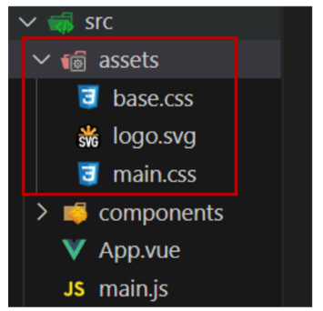

- src/components
  - vue 컴포넌트들을 작성하는 곳
  - 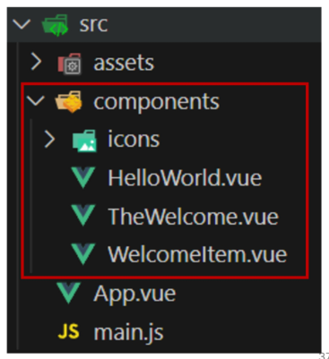

- src/App.vue
  - Vue 앱의 최상위 Root 컴포넌트
  - 다른 하위 컴포넌트들을 포함
  - 애플리케이션 전체의 레이아웃과 공통적인 요소를 정의
  - 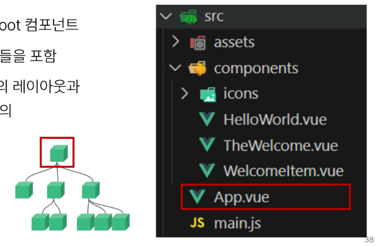

- src/main.js
  - Vue 인스턴스를 생성하고, 애플리케이션을 초기화하는 역할
  - 필요한 라이브러리를 imprt 하고 전역설정을 수행
  - 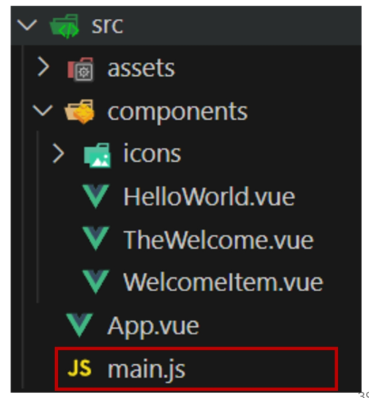

- index.html
  - Vue 앱의 기본 HTML파일
  - 앱의 진입점(entry point)
  - Root 컴포넌트인 App.vue가 해당 페이지에마운트(mount)됨
    - Vue 앱이 SPA 인 이유
  - 필요한 스타일 시트, 스크립트 등의 외부 리소스를 로드할 수 있음
    - ex) bootstrap CDN
  - 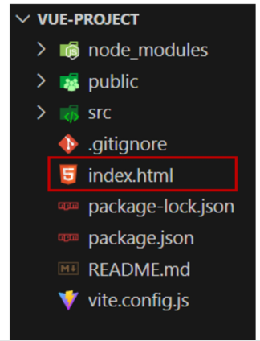

### 모듈과 번들러
- Module
  - 프로그램을 구성하는 독립적인 코드 블록 (*.js파일)

- Module
  - 개발하는 어플리케이션의 크기가 커지고 복잡해지면서 파일 하나에 모든 기능을 담기가 어려워짐
  - 따라서 자연스럽게 파일을 여러 개로 분리하여 관리를 하게 되었고, 이때 분리된 파일 각각이 모듈(nodule) 즉, js 파일 하나가 하나의 모듈
  - 모듈의 수가 많아지고 라이브러리 혹은 모듈 간의 의존성(연결성)이 깊어지면서 특정한 곳에서 발생한 문제가 어떤 모듈 간의 문제인지 파악하기 어려워짐
  - 복잡하고 깊은 모듈의 의존성 문제를 해결하기 위한 도구가 필요
    - => Bundler

- node_modules의 의존성 깊이
  - 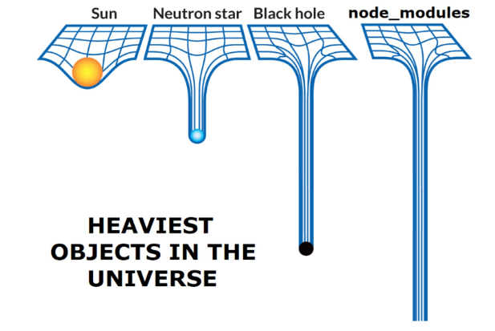

- Bundler
  - 여러 모듈과 파일을 하나(혹은 여러개)의 번들로 묶어 최적화하여 애플리케이션에서 사용할 수 있게 만들어주는 도구가

- Bundler의 역할
  - 의존성 관리, 코드 최적화, 리소스 관리 등
  - Bundler가 하는 작업을 Bunding 이라 함
  - Vite는 Rollup 이라는 Bundler를 사용하며 개발자가 별도로 기타 환경설정에 신경 쓰지 않도록 모두 설정해두고 있음

## Vue Component
### Component 활용
- 컴포넌트 사용 2단계
  1. 컴포넌트 파일 생성
  2. 컴포넌트 등록(import) 

- 사전준비
  1. 초기에 생성된 모든 컴포넌트 삭제(App.vue 제외) 
  2. App.vue 코드 초기화
  - 

1. 컴포넌트 파일 생성
   - MyComponent.vue 생성
   - 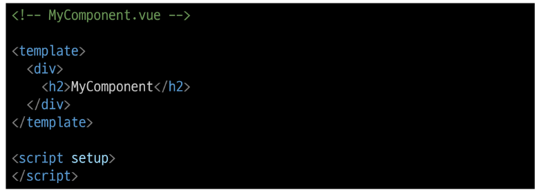

2. 컴포넌트 등록
   - App 컴포넌트에 MyComponent를 등록
   - 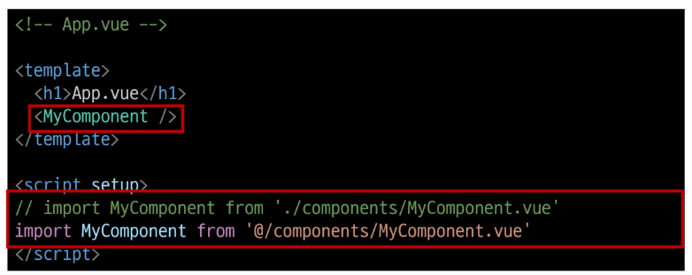
   - App(부모) - MyComponent(자식) 관계 형성
   - @ - 'src/'경로를 뜻하는 약어
   - 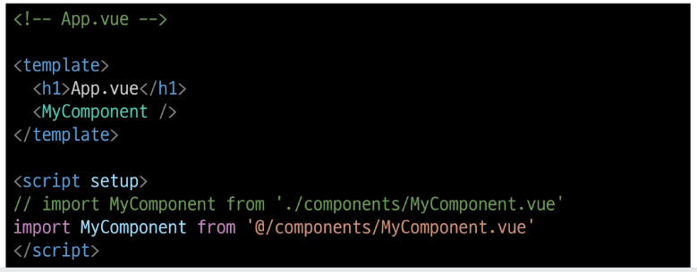

- 결과확인
  - Vue dev tools를 사용해 컴포넌트 관계 형성 확인
  - 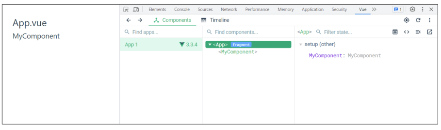

- MyComponentItem 컴포넌트 등록 후 활용
  - MyComponentItem은 MyComponent의 자식 컴포넌트
  - 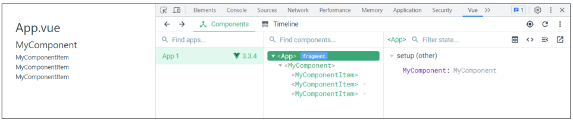
  - 컴포넌트 재사용성 확인
  - 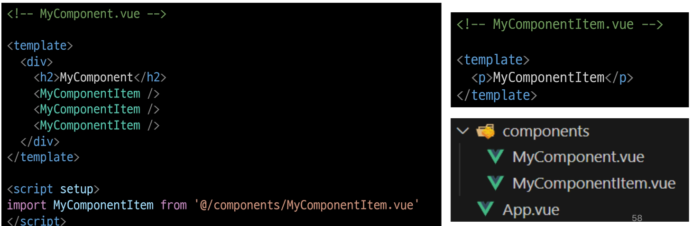

- Component 이름 관련 스타일 가이드
  - https://vuejs.org/style-guide/rules-strongly-recommended.html

## 추가 주제
### Virtual DOM
- Virtual DOM
  - 가상의 DOM을 메모리에 저장하고 실제 DOM과 동기화하는 프로그래밍 개념
  - 실제 DOM과의 변경 사항 비교를 통해 변경된 부분만 실제 DOM에 적용하는 방식
  - 웹 애플리케이션의 성능을 향상시키기 위한 Vue의 내부 렌더링 기술
  - 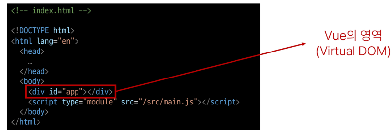

- 내부 렌더링 과정
  - 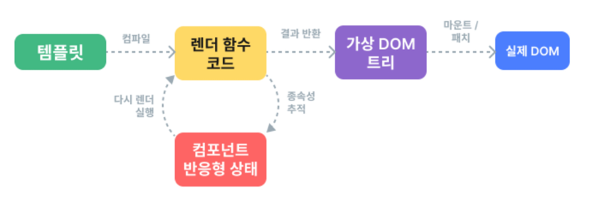

- Virtual DOM 패턴의 장점
  - 효율성
    - 실제 DOM 조작을 최소화하고, 변경된 부분만 업데이트하여 성능을 향상
  - 반응성
    - 데이터의 변경을 감지하고, Virtual DOM을 효율적으로 갱신하여 UI를 자동으로 업데이트
  - 추상화
    - 개발자는 실제 DOM 조작을 Vue에게 맡기고 컴포넌트와 템플릿을 활용하는 추상화된 프로그래밍 방식으로 원하는 UI 구조를 구성하고 관리할 수 있음

- Virtual DOM 주의사항  
  - 실제 DOM에 직접 접근하지 말 것
    - JavaScript에서 사용하는 DOM 접근 관련 메서드 사용 금지
    - querySelector, createElement, addEventListner
  - => Vue의 ref와 Lifecycle Hooks 함수를 사용해 간접적으로 접근하여 조작할 것

- 직접 DOM 엘리먼트에 접근해야 하는 경우
  - ref 속성을 사용하여 특정 DOM 엘리먼트에 직접적인 참조를 얻을 수 있음
  - 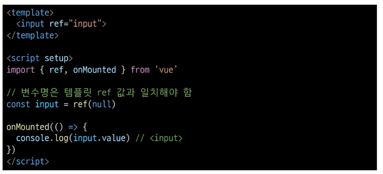

### Composition API & Option API
- 2가지 API 스타일 
  - Composition API
  - Option API

- Composition API
  - import 해서 가져온 API 함수들을 사용하여 컴포넌트의 로직을 정의
  - Vue3에서의 권장 방식
  - 

- Option API 
  - data, methods 및 mounted 같은 객체를 사용하여 컴포넌트의 로직을 정의
  - Vue2에서의 작성방식
  - 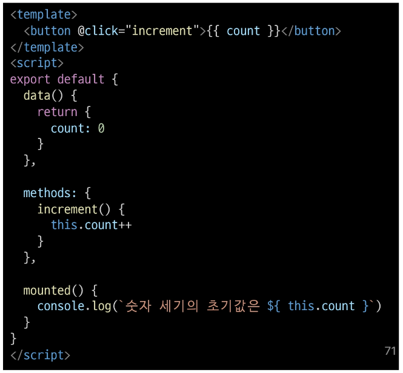

- API 별 권장 사항 
  - Composition API + SFC
    - 규모가 있는 앱의 전체를 구축하려는 경우
  - Option API
    - 빌드 도구를 사용하지 않거나 복잡성이 낮은 프로젝트에서 사용하려는 경우
  - https://vuejs.org/guide/extras/composition-api-faq.html

## 참고
- Scaffolding ( 스캐폴딩 )
  - 새로운 프로젝트나 모듈을 시작하기 위해 초기 구조와 기본 코드를 자동으로 생성하는 과정
  - 개발자들이 프로젝트를 시작하는 데 도움을 주는 틀이나 기반을 제공하는 작업
  - 초기설정, 폴더구조, 파일템플릿, 기본 코드 등을 자동으로 생성하여 개발자가 시작할 때 시간과 노력을 절약하고 일관된 구조를 유지할 수 있도록 도와줌

- SFC의 CSS 기능 - scoped
  - 
  - scoped를 사용하면 부모 컴포넌트의 스타일이 자식 컴포넌트로 유출되지 않음
  - 단, 자식 컴포넌트의 최상위 요소(root element)는 부모와 자식의 CSS 모두 영향을 받음
  - 부모가 레이아웃 목적으로 자식 컴포넌트 최상위 요소의 스타일을 지정할 수 있도록 의도적으로 설계된 것

- SFC의 CSS 기능 - scoped 예시
  - 다음과 같이 APP(부모) 컴포넌트에 적용한 스타일은 scoped가 작성되어 있지만, MyComponent(자식)의 최상위 요소는 부모와 본인의 CSS 모두의 영향을 받기 때문에 부모의 스타일이 적용됨
  - 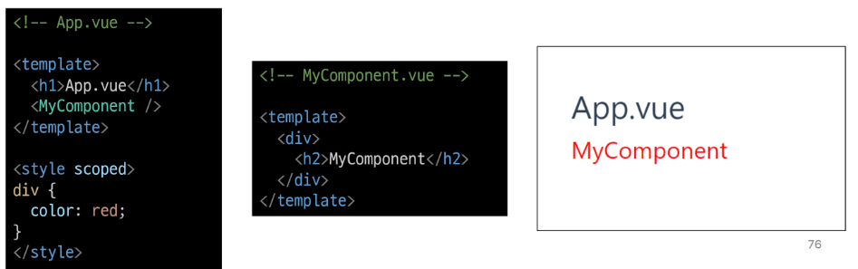

- 모든 컴포넌트에는 최상단 HTML 요소가 작성되는 것이 권장
  - 가독성, 스타일링, 명확한 컴포넌트 구조를 위해 각 컴포넌트에는 최상단 HTML 요소를 작성해야 함 (single Root Element)
  - 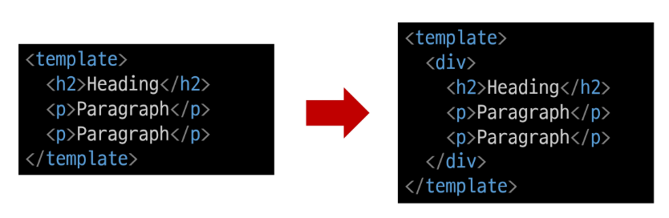

- "관심사항의 분리가 파일 유형의 분리와 동일한 것이 아니다."
  - HTML/CSS/JS 를 한 파일에 혼합하는게 괜찮을까?
  - 프론트-엔드 앱의 사용목적이 점점 더 복잡해짐에 따라, 단순 파일 유형으로만 분리하게 될 경우 프로젝트의 목표를 달성 하는데 도움이 되지않게 됨
  - 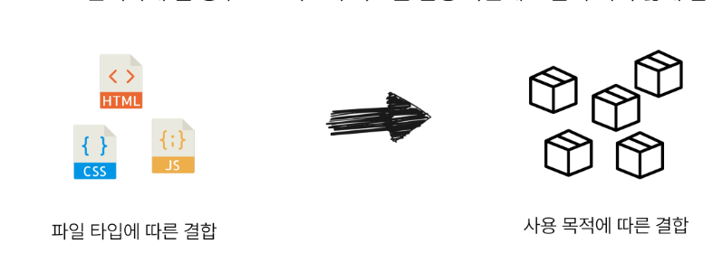