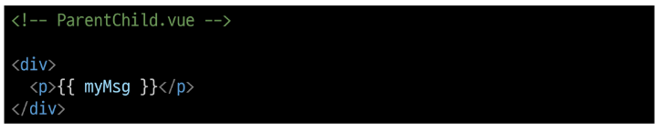

# 1108 Component State Flow
## Passing Props
- 같은 데이터 하지만 다른 컴포넌트
  - 동일한 사진 데이터가 한 화면에 다양한 위치에서 여러번 출력 되고 있음
  - 하지만 해당 페이지를 구성하는 컴포넌트가 여러 개 라면 각 컴포넌트가 개별적으로 동일한 데이터를 관리해야 할까?
  - 그렇다면 사진을 변경해야 할 때 모든 컴포넌트에 대해 변경 요청을 해야함
  - => 공통된 부모 컴포넌트에서 관리하자!
  - 

- Props
  - 부모 컴포넌트로부터 자식 컴포넌트로 데이터를 전달하는데 사용되는 속성

- One-Way Data Flow
  - 모든 Props는 자식 속성과 부모 속성 사이에 "하향식 단방향 바인딩"을 형성
  - one-way-down binding

- Props 특징
  - 부모 속성이 업데이트되면 자식으로 흐르지만 그 반대는 안됨
  - 즉, 자식 컴포넌트 내부에서 props를 변경하려고 시도해서는 안되며 불가능
  - 또한 부모 컴포넌트가 업데이트될 때 마다 자식 컴포넌트의 모든 props가 최신 값으로 업데이트 됨
  - => 부모 컴포넌트에서만 변경하고 이를 내려받는 자식 컴포넌트는 자연스럽게 갱신

- 단방향 인 이유
  - 하위 컴포넌트가 실수로 상위 컴포넌트의 상태를 변경하여 앱에서의 데이터 흐름을 이해하기 어렵게 만드는 것을 방지하기 위함

### 사전준비
1. vue 프로젝트 생성 (npm create vue@latest)
2. 초기 생성된 컴포넌트 모두 삭제 (App.vue 제외)
3. src/assets 내부 파일 모두 삭제
4. main.js 해당 코드 삭제
   - 

- App > Parent > ParentChild 컴포넌트 관계 작성
  - App 컴포넌트 작성
    - 
  - Parent 컴포넌트 생성 후 작성
    - 
  - ParentChild 컴포넌트 생성 후 작성
    - 

## Props 선언
- Props 선언
  - 부모 컴포넌트에서 보낸 props를 사용하기 위해서는 자식 컴포넌트에서 명시적인 Props 선언이 필요

- Props 작성
  - 부모 컴포넌트 Parent에서 자식 컴포넌트 ParentChild에 보낼 Props 작성
  - 

- Props 선언 2가지 방식
  1. 문자열 배열을 사용한 선언
  2. 객체를 사용한 선언

1. 문자열 배열을 사용한 선언
   - defineProps()를 사용하여 props 선언
   - 

2. 객체를 사용한 선언
   - 객체 선언 문법의 각 객체 속성의 키는 props의 이름이 되며, 객체 속성의 값은 값이 될 데이터의 타입에 해당하는 생성자 함수(Number, String)이어야 함
   - 객체 선언 문법 사용 권장!!
   - 

- prop 데이터 사용
  - 템플릿에서 반응형 변수와 같은 방식으로 활용
  - 
  - props를 객체로 반환하므로 필요한 경우 JavaScript에서 접근 가능
  - 
  - prop 출력 결과 확인
  - 

- 한 단계 더 prop 내려 보내기
  - ParentChild 컴포넌트를 부모로 갖는 ParentGrandChild 컴포넌트 생성 및 등록
  - 
  - ParentChild 컴포넌트에서 Parent로 부터 받은 prop인 MyMsg를 ParentGrandChild에게 전달
  - 
  - 출력 결과 확인
  - ParentGrandChild가 받아서 출력하는 prop은 Parent에 정의 되어있는 Prop이며 Parent가 propㅇ르 변경할 경우 이를 전달받고있는 ParentChild, ParentGrandChild에서도 모두 업데이트 됨

## Props 세부사항
- Props 세부사항
  1. Props Name Casing (Props 이름 컨벤션 )
  2. Static Props & Dynamic Props

1. Props Name Casing
   - 선언 및 템플릿 참조 시 (-> camelCase)
     - 
   - 자식 컴포넌트로 전달시 (-> kebab-case)
     - 

2. Static Props & Dynamic Props
   - 지금까지 작성한 것은 Statc(정적) Props
   - v-bind를 사용하여 동적으로 할당된 props를 사용할 수 있음
   1. Dynamic Props 정의
      - 
   2. Dynamic Props 선언 및 출력
      - 
   3. Dynamic Props 출력 확인
      - 

## Component Events

- $emit()
  - 자식 컴포넌트가 이벤트를 발생시켜 부모 컴포넌트로 데이터를 전달하는 역할의 메서드
  - '$' 표기는 Vue 인스턴스나 컴포넌트 내에서 제공되는 전역 속성이나 메서드를 식별하기 위한 접두어

- emit 메서드 구조
  - 
  - event
    - 커스텀 이벤트 이름
  - args
    - 추가 인자

### Event 발신 및 수신
- 이벤트 발신 및 수신 (Emitting and Listening to Events)
  - $emit을 사용하여 템플릿 표현식에서 직접 사용자 정의 이벤트를 발신
  - 
  - 그러면 부모는 v-on을 사용하여 수신할 수 있음
  - 

- 이벤트 발신 및 수신하기
  - ParentChild에서 someEvent라는 이름의 사용자 정의 이벤트를 발신
  - 
  - ParentChild의 부모 Parent는 v-on을 사용하여 발신된 이벤트를 수신
  - 수신 후 처리할 로직 및 콜백함수 호출
  - 
  - 이벤트 수신 결과
  - 

### 'emit'Event 선언
- emit 이벤트 선언
  - defineEmits()를 사용하여 명시적으로 발신할 이벤트를 선언할 수 있음
  - script에서 $emit 메서드를 접근할 수 없기 때문에 defineEmits()는 $emit 대신 사용할 수 있는 동등한 함수를 반환
  - 
  
- 이벤트 선언하기
  - 이벤트 선언 방식으로 추가 버튼 작성 및 결과 확인
  - 

### Event 인자
- 이벤트 인자 (Event Arguments)
  - 이벤트 발신 시 추가 인자를 전달하여 값을 제공할 수 있음

- 이벤트 인자 전달하기
  - ParentChild에서 이벤트를 발신하여 Parent로 추가인자 전달하기
  - 
  - ParentChild에서 발신한 이벤트를 Parent에서 수신
  - 
  - 추가 인자 전달 확인
  -  

### Event 세부사항
- Event Name Casing
  - 선언 및 발신 시 (-> camelCase )
  - 
  - 부모 컴포넌트에서 수신 시 (-> kebab-case)
  - 

### emit Event 실습
- emit 이벤트 실습
  - 최하단 컴포넌트 ParentGrandChild에서 Parent 컴포넌트의 name 변수 변경 요청하기
  - 

- emit 이벤트 실습 구현하기
  - ParentGrandChild 에서 이름 변경을 요청하는 이벤트 발신
  - 
  - 이벤트 수신 후 이름 변경을 요청하는 이벤트 발신
  - 
  - 이벤트 수신 후 이름 변수 변경 메서드 호출
  - 해당 변수를 prop으로 받는 모든 곳에서 자동 업데이트
  - 
  - 버튼 클릭 후 결과 확인
  - 

## 참고
- 정적 & 동적 props 주의사항
  - 첫번째는 정적 props로 문자열로써의 "1"을 전달
  - 두번째는 동적 props로 숫자로써의 1을 전달
  - 

- Prop 선언을 객체 선언 문법으로 권장하는 이유
  - prop에 타입을 지정하는 것은 컴포넌트를 가독성이 좋게 문서화하는데 도움이 되며, 다른 개발자가 잘못된 유형을 전달할 때에 브라우저 콘솔에 경고를 출력하도록 함
  - 추가로 prop에 대한 유효성 검사로써 활용가능
  - https://vuejs.org/guide/components/props.html#prop-validation
  - 

- emit 이벤트도 객체 선언 문법으로 작성 가능
  - props 타입 유효성 검사와 유사하게 emit 이벤트 또한 객체구문으로 선언 된 경우 유효성을 검사할 수 있음
  - https://vuejs.org/guide/components/events.html#events-validation
  - 