# 1109 Router
## Routin
- Routing
  - 네트워크에서 경로를 선택하는 프로세스
  - => 웹 애플리케이션에서 다른 페이지 간의 전환과 경로를 관리하는 기술

- SSR에서의 Routing
  - 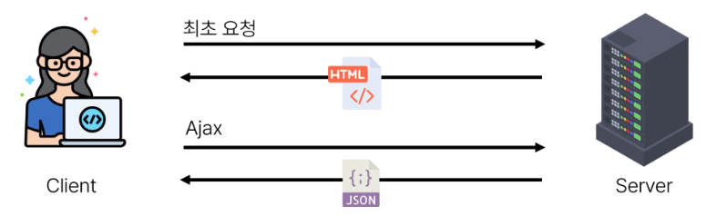
  - 서버가 사용자가 방문한 URL 경로를 기반으로 응답을 전송
  - 링크를 클릭하면 브라우저는 서버로부터 HTML 응답을 수신하고 새 HTML로 전체 페이지를 다시 로드

- CSR/SPA에서의 Routing
  - 
  - SPA에서 routing은 브라우저의 클라이언트 측에서 수행
  - 클라이언트 측 JavaScript가 새 데이터를 동적으로 가져와 전체 페이지를 다시 로드하지 않음
  - 페이지는 1개이지만, 링크에 따라 여러 컴포넌트를 렌더링하여 마치 여러 페이지를 사용하는 것처럼 보이도록 함

- 만약 routing이 없다면
  - 유저가 URL을 통한 페이지의 변화를 감지할 수 없음
  - 페이지가 무엇을 렌더링 중인지에 대한 상태를 알 수 없음
    - URL이 1개이기 때문에 새로고침시 처음페이지로 되돌아감
    - 링크를 공유할 시 첫 페이지만 공유 가능
  - 브라우저의 뒤로 가기 기능을 사용할 수 없음

## Vue Router
- Vue Router
  - Vue 공식 라우터
  - The offical Router for Vue.js

- Vue Router 추가
  - Vite로 프로젝트 생성 시 Router 추가
  - 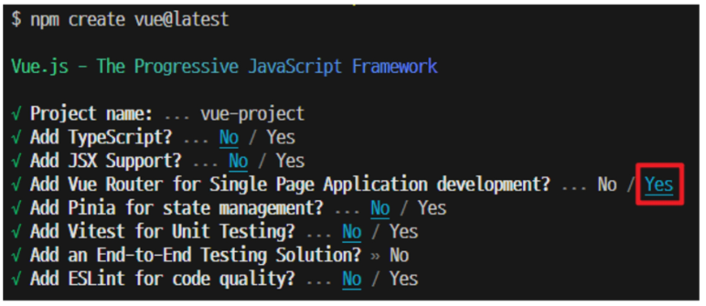
  - 서버 실행 후 Router로 인한 프로젝트 변화 확인
  - Home, About 링크에 따라 변경되는 URL과 새로 렌더링되는 화면
  - 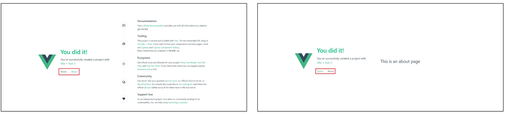

- Vue 프로젝트 구조 변화
  1. App.vue 코드 변화
  2. router 폴더 생성
  3. views 폴더 생성
  - 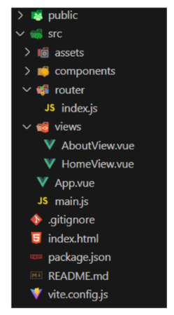

- RouterLink
  - 페이지를 다시 로드하지 않고 URL을 변경하고 URL 생성 및 관련 로직을 처리
  - HTML의 a태크를 렌더링
  - 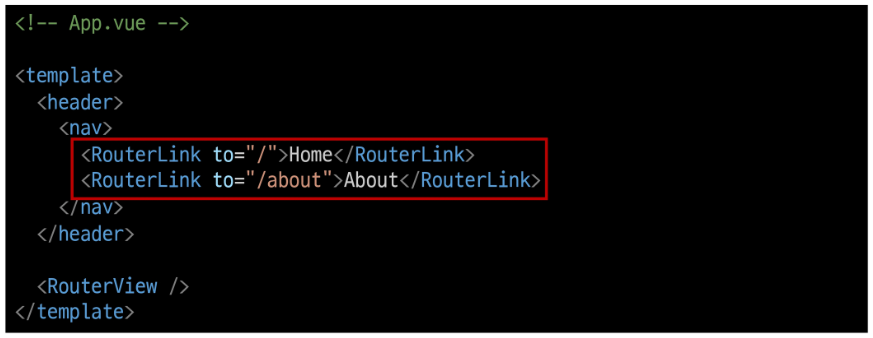

- RouterView
  - URL에 해당하는 컴포넌트를 표시
  - 어디에나 배치하여 레이아웃에 맞출 수 있음
  - 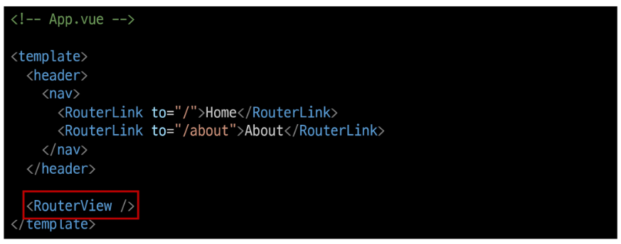

- router/index.js
  - 라우팅에 관련된 정보 및 설정이 작성 되는 곳
  - router에 URL과 컴포넌트를 매핑
  - 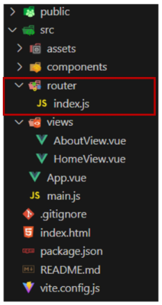

- views
  - RouterView 위치에 렌더링 할 컴포넌트를 배치
  - 기존 components 폴더와 기능적으로 다른 것은 없으며 단순 분류의 의미로 구성됨
  - ※일반 컴포넌트와 구분하기 위해 컴포넌트 이름을 View로 끝나도록 작성하는 것을 권장

### Basic Routing
- 라우팅 기본
  1. index.js에 라우터 관련 설정 작성(주소, 이름, 컴포넌트)
  2. RouterLink의 'to' 속성으로 index.js에서 정의한 주소 속성 값(path)을 사용
  - 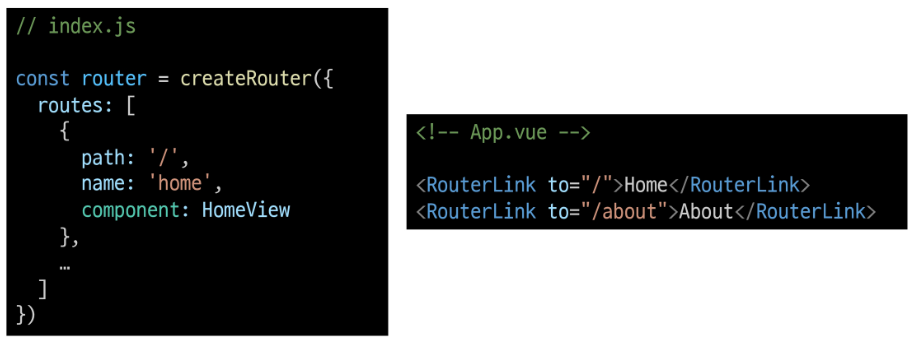

### Named Routes
- Named Routes
  - 경로에 이름을 지정하는 라우팅

- Named Routes 예시
  - name 속성 값에 경로에 대한 이름을 지정
  - 경로에 연결하려면 RouterLink에 v-bind를 사용해 'to' prop 객체로 전달
  - 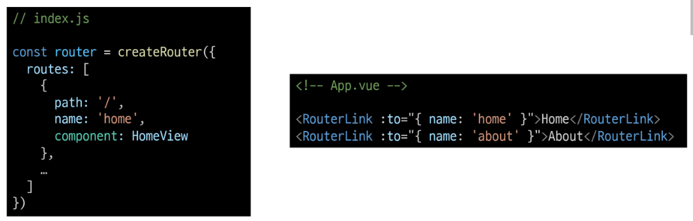

- Named Routes 장점
  - 하드 코딩 된 URL을 사용하지 않아도 됨
  - URL 입력 시 오타 방지

### Dynamic Route Matching with Params
- 매개 변수를 사용한 동적 경로 매칭
  - 주어진 패턴 경로를 동일한 컴포넌트에 매핑 해야 하는 경우 활용
  - 예를 들어 모든 사용자의 ID를 활용하여 프로필 페이지 url을 설계 한다면?
    - user/1
    - user/2
    - user/3
  - 일정한 패턴의 URL 작성을 반복해야함

- 매개변수를 사용한 동적 경로 매칭 활용
  - views내에 UserView 컴포넌트 작성
    - 
  - router내 index.js에 UserView 컴포넌트 라우트 등록
  - 매개변수는 콜론(:)으로 표기
    - 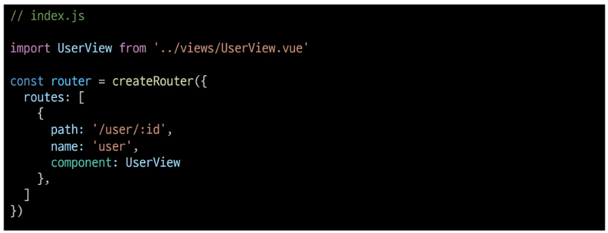
  - App.vue에 RouterLink 추가
  - 라우트의 주소 매개변수는 params: {id: userId}로 작성함
    - 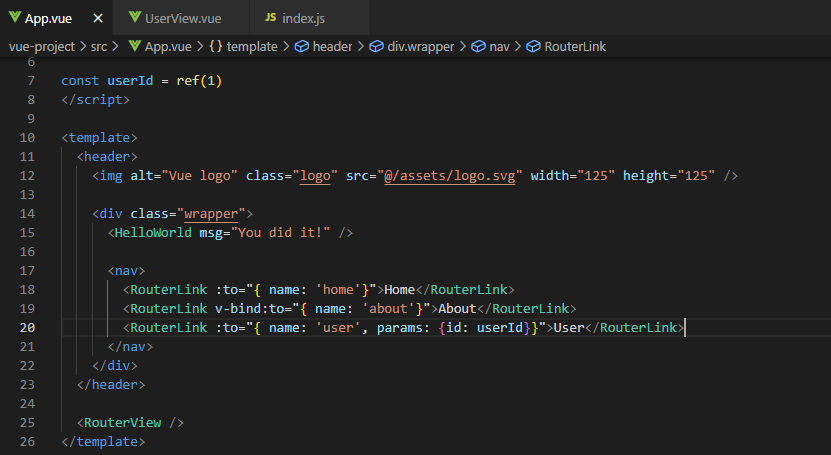
  - 라우트의 매개변수는 컴포넌트에서 $route.params로 참조가능
    - 
  - 다만 다음과 같이 Composition API 방식으로 작성하는 것을 권장
    - 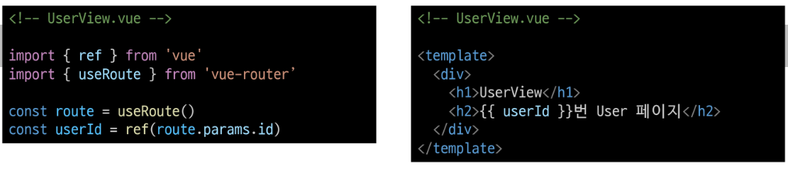

### Programmatic Navigation
- 프로그래밍 방식 네비게이션
  - router의 인스턴스 메서드를 사용해 RouterLink로 a태그를 만드는 것처럼 프로그래밍으로 네비게이션 관련 작업을 수행할 수 있음
  1. 다른 위치로 이동하기
    - router.push()
  2. 현재위치 바꾸기
    - router.replace()

- router.push()
  - 다른 위치로 이동하기
  - Navigate to a differnt location

- router.push()
  - 다른 URL로 이동하는 메서드
  - 새 항목을 history stack에 push 하므로 사용자가 브라우저 뒤로가기 버튼을 클릭하면 이전 URL로 이동할 수 있음
  - RouterLink를 클릭했을 때 내부적으로 호출되는 메서드 이므로 RouterLink를 클릭하는 것은 router.push()를 호출하는 것과 같음
  - 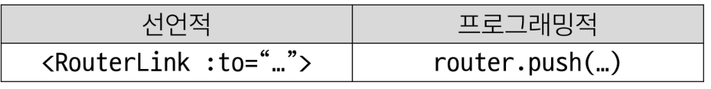

- router.push 활용
  - UserView 컴포넌트에서 HomeView 컴포넌트로 이동하는 버튼 만들기
  - 
  - 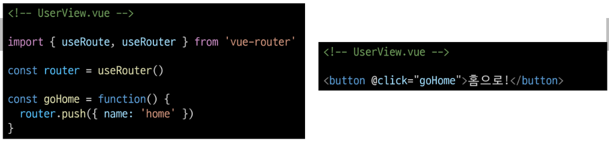

- router.push 인자 활용 참고
  - https://router.vuejs.org/guide/essential/navigation.html
  - 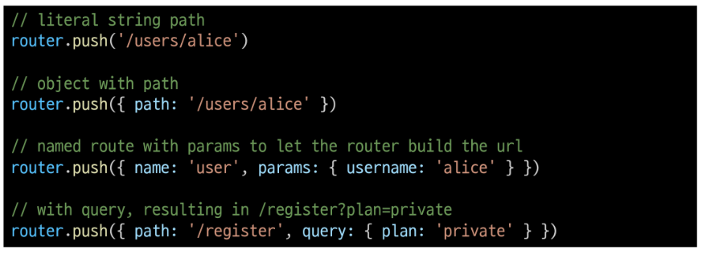

- router.replace()
  - 현재 위치 바꾸기
  - Replace current location

- router.replace()
  - push 메서드와 달리 history stack에 새로운 항목을 push 하지않고 다른 URL로 이동 ( === 이동 전 URL로 뒤로가기 불가)
  - 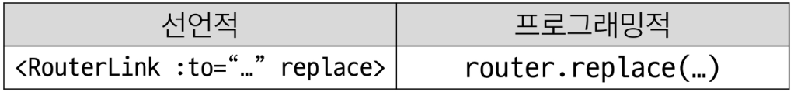

## Navigation Guard
- Navigation Guard
  - Vue router를 통해 특정 URL에 접근할 때 다른 URL로 redirect를 하거나 취소하여 네비게이션을 보호
  - ex) 인증 정보가 없으면 특정 페이지에 접근하지 못하게 함

- Navigation Guard 종류
  1. Globally ( 전역 가드 )
    - 애플리케이션 전역에서 동작
    - index.js에서 정의
  2. Per-route ( 라우터 가드 )
    - 특정 route 에서만 동작
    - index.js의 각 routes에 정의
  3. In-component ( 컴포넌트 가드 )
    - 특정 컴포넌트 내에서만 동작
    - 컴포넌트 Script 에 정의

### Globally Guard
- router.beforeEach()
  - 다른 URL로 이동하기 직전에 실행되는 함수
  - Global Before Guards

- router.beforeEach 구조
  - 
  - to: 이동할 URL 정보가 담긴 Route 객체
  - form: 현재 URL 정보가 담긴 Route 객체
  - 선택적 반환(return)값
    1. false
    2. Route Location 
  - false
    - 현재 네비게이션을 취소
    - 브라우저 URL이 변경된 경우 ( 사용자가 수동으로 또는 뒤로 가기 버튼을 통해) from 경로의 URL로 재설정
  - 
  - Route Location
    - router.push()를 호출하는 것처럼 경로 위치를 전달하여 다른위치로 redirect
    - return이 없다면 'to' URL Route 객체로 이동

- router.beforeEach 예시
  1. 전역가드 beforeEach 작성
  2. HomeView에서 UserView로 이동 후 각 인자 값 출력 확인하기
  - ???????????????????????????????????????????
  - 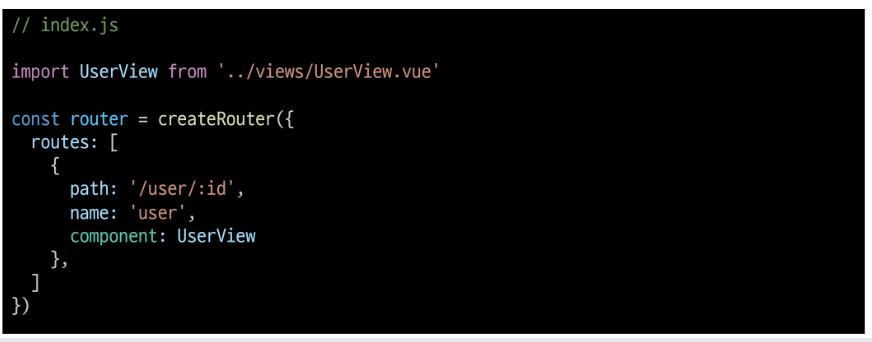
  - to 에는 이동할 URL 인 user 라우트에 대한 정보가,
  - from에는 현재 ULR인 home 라우트에 대한 정보가 들어있음.
  - 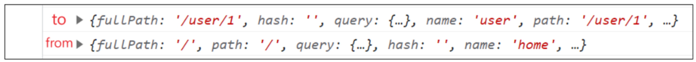

- router.beforeEach 활용
  - 사전준비
    - LoginView 컴포넌트 작성 및 라우트 등록
    - 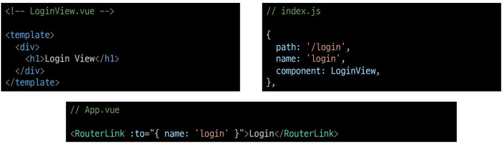
  - Login이 되어있지 않다면 페이지 진입을 막고 Login 페이지로 이동시키기
  - => 어떤 RouterLink를 클릭해도 LoginView 컴포넌트만 볼 수 있음
    - 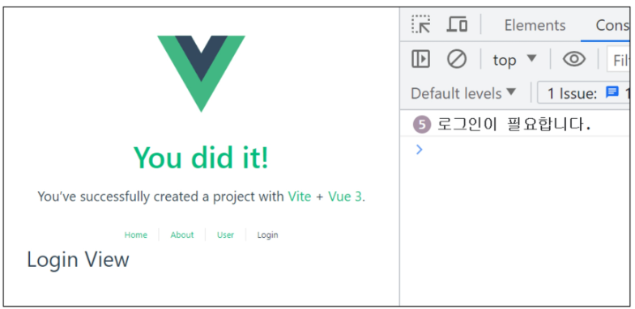
  - 만약 로그인이 되어있지 않고(1), 
  - 이동하는 주소 이름이 login이 아니라면(2), 
  - login 페이지로 redirect
    - 

### Per-route Guard
- router.beforeEnter()
  - route에 진입했을 때만 실행되는 함수
  - => 매개변수, 쿼리 값이 변경될 때는 실행되지 않고 다른 경로에서 탐색할 때만 실행됨

- router.beforeEnter 구조
  - 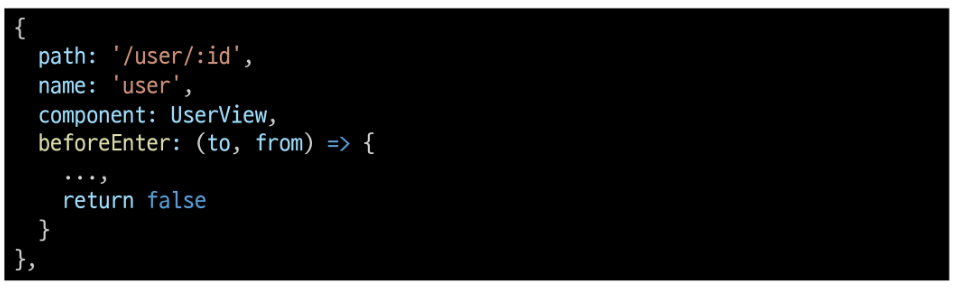
  - routes 객체에서 정의
  - 함수의 to, from, 선택 반환 인자는 beforeEach와 동일

- router.beforeEnter 예시
  1. 라우터 가드 beforeEnter 작성
  2. HomeView에서 Userview로 이동 후 각 인자 값 출력 확인하기
  - 
  - to에는 이동할 URL인 user라우트에 대한 정보가, 
  - from 에는 현재 URL인 home 라우트에 대한 정보가 들어있음
  - 다른 경로에서 user 라우트를 탐색했을 때 실행된 것
  - 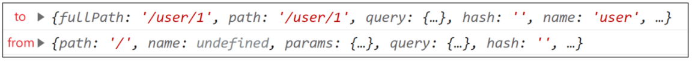

- router.beforeEnter 활용
  - 이미 로그인 한 상태라면 LoginView 진입을 막고 HomeView로 이동시키기
  - ( 전역 가드 활용 코드는 주석 처리 후 진행 )
  - 이미 로그인 상태라면 HomeView로 이동
  - 로그인 상태가 아니라면 LoginView로 이동
  - 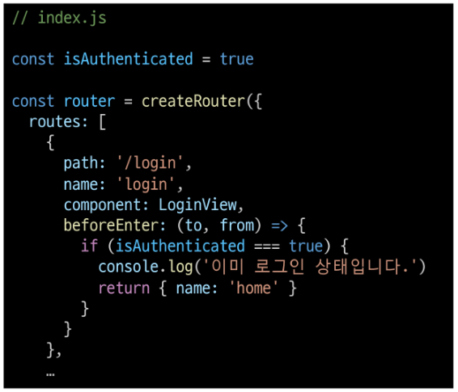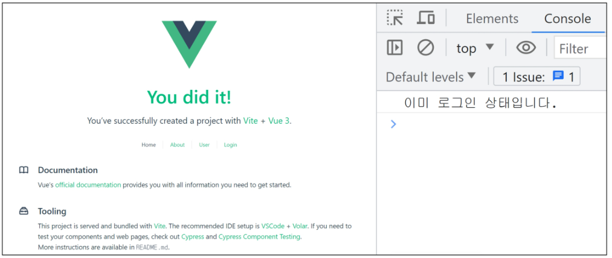

### In-component Guard
- 컴포넌트 가드 종류
  - onBeforeRouteLeave
    - 현재 라우트에서 다른 라우트로 이동하기 전에 실행
    - => 사용자가 현재 페이지를 떠나는 동작에 대한 로직을 처리
  - onBeforeRouteUpdate
    - 이미 렌더링된 컴포넌트가 같은 라우트 내에서 업데이트 되기 전에 실행
    - => 라우트 업데이트시 추가적인 로직을 처리

- onBeforeRouteLeave 활용
  - 사용자가 UserView를 떠날 시 팝업 창 출력하기
  - 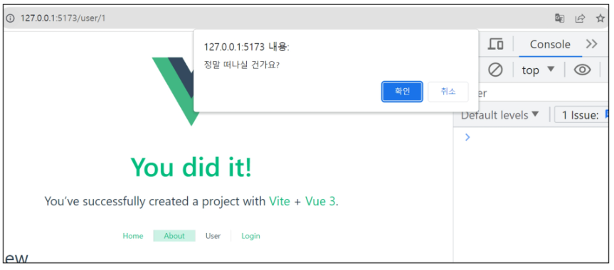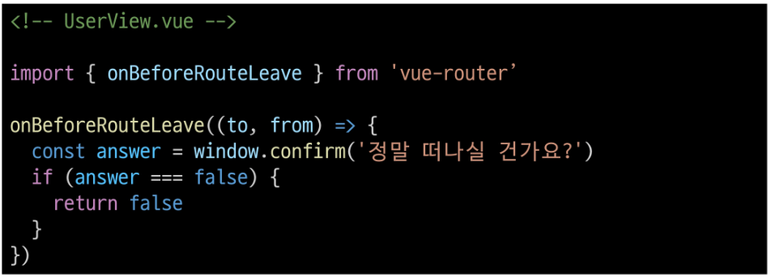

- onBeforeRouteUpdate 활용
  - UserView 페이지에서 다른 id를 가진 User의 UserView 페이지로 이동하기
  - 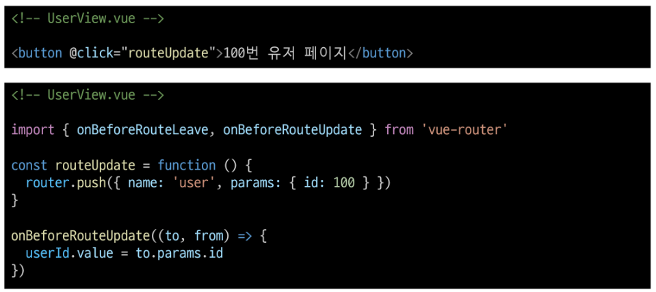

- 만약 onBeforeRouteUpdate를 사용하지 않았다면
  - onBeforeRouteUpdate에서 userId를 변경하지 않으면 userId는 갱신되지 않음
  - 컴포넌트가 재사용되었기 때문
  - 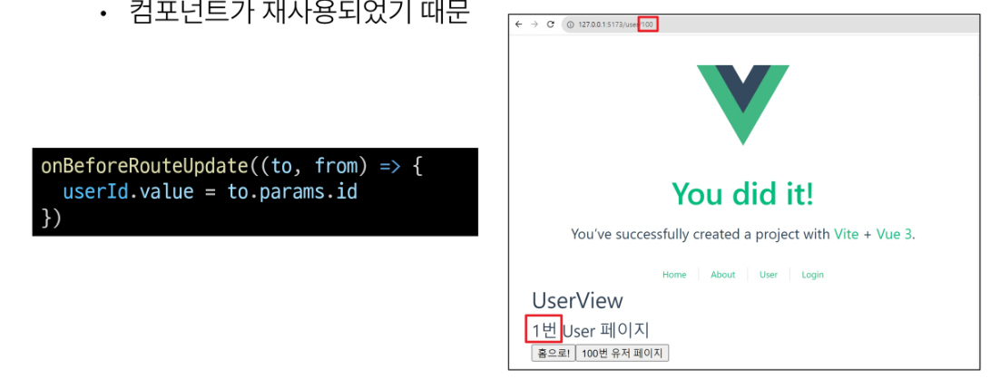

## 참고
- Lazy Loading Routes
  - 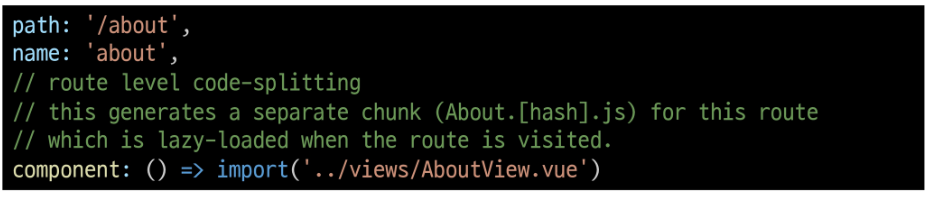
  - 첫 빌드 시 해당 컴포넌트를 로드 하지 않고, "해당 경로를 처음 방문할 때만 컴포넌트를 로드" 하는 것
    - 앱을 빌드할 때 앱의 크기에 따라 페이지 로드 시간이 길어질 수 있기 때문
  - 기존에 "정적 가져오기 방식"을 "동적 가져오기 방식"으로 변경하는 것과 같음