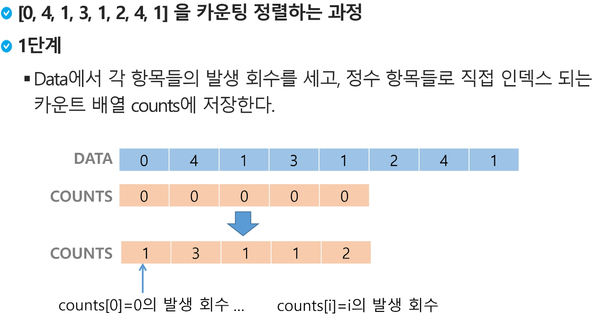
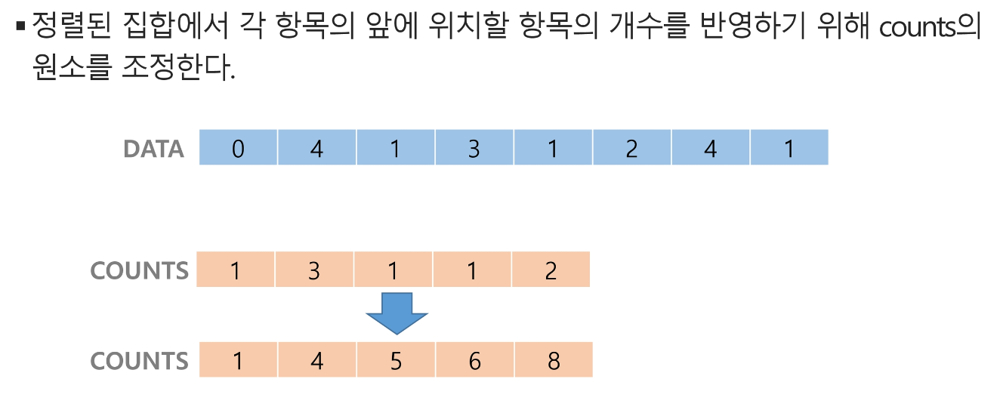
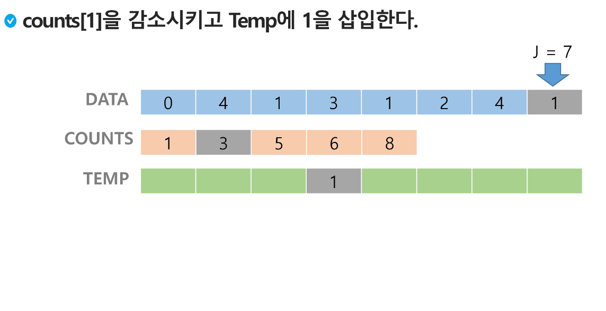
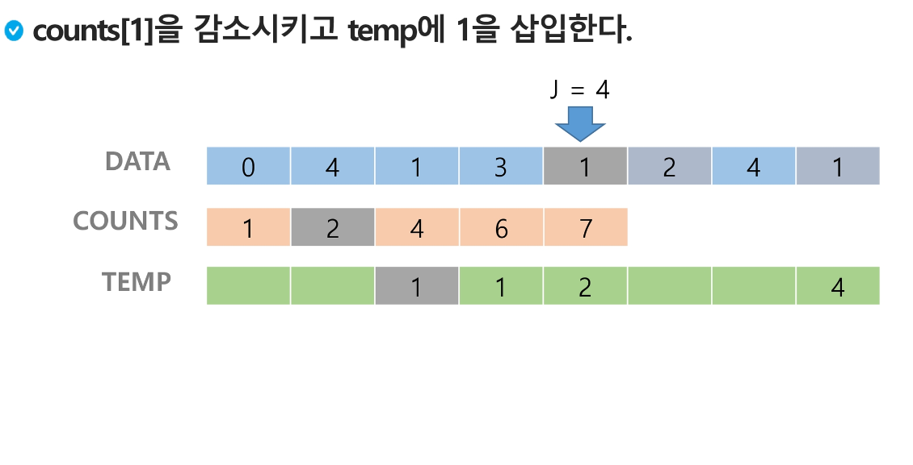
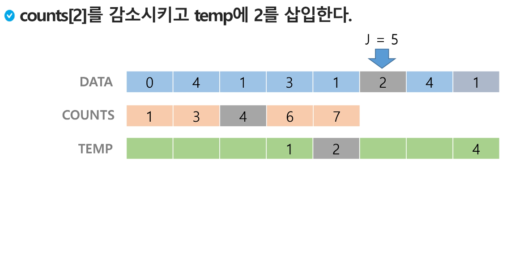
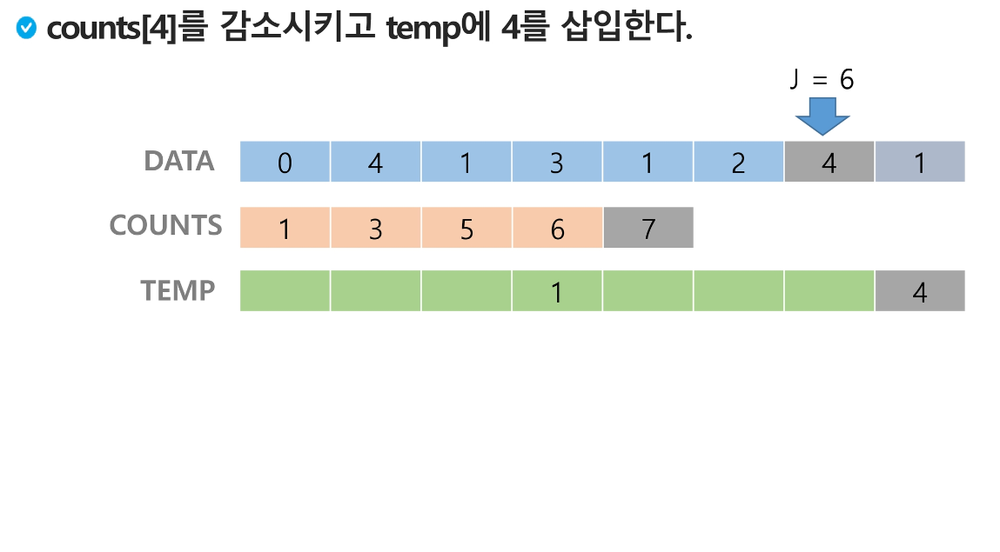
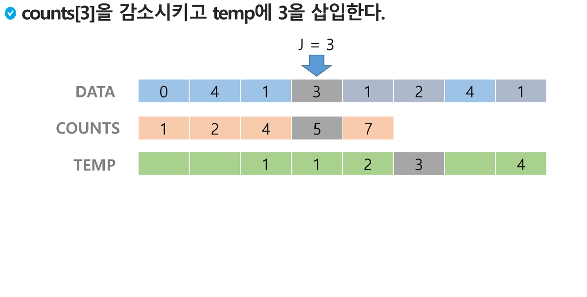
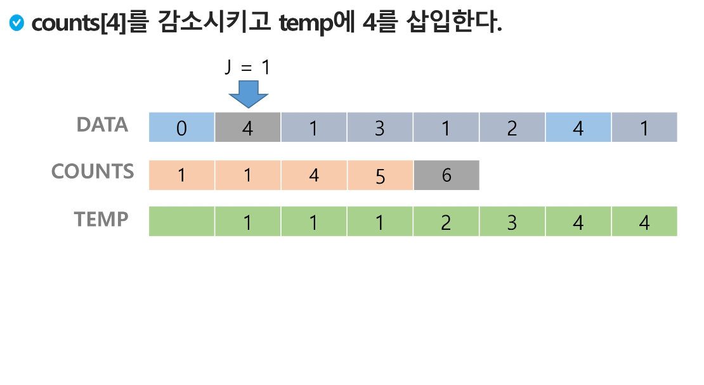
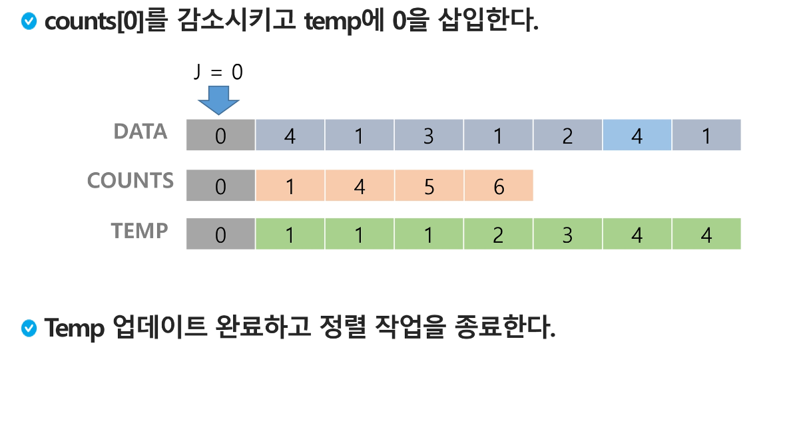

# 8.01
##### 카운팅 정렬 (counting Sort)
* 항목들의 순서를 결정하기 위해 집합에 각 항목이 몇 개씩 있는지 세는 작업을 하여, 선형 시간에 정렬하는 효율적인 알고리즘
* 제한사항
    * 정수나 정수로 표현할 수 있는 자료에 대해서만 적용 가능: 각 항목의 발생 회수를 기록하기 위해, 정수 항목으로 인덱스 되는 카운트들의 배열을 사용하기 때문이다.
    * 카운트들을 위한 충분한 공간을 할당하려면 집합 내의 가장 큰 정수를 알아야 한다.
* 시간 복잡도
    * O(n+k) : n은 리스트 길이, k는 정수의 최댓값

```py
def Counting_Sort(A, B, k )
# A [] - - 입력배열(0 to k )
# B [] - - 정렬된 배열
# C [] - - 카운트 배열.

    C =[0] * (k+1)
    
    for i in range (0, len(A))  :
       C[A[i]] += 1

    for i in range ( 1, len(C)) :
        C[ i ] += C[i-1]

    for i in range (len(B)-1, -1, -1 ) :
        C[A[ i ] ] -= 1
        B[C [ A [ i ] ] ] = A[ i ]

```
*          
* 각 주어진 수의 갯수를 카운트 한다

* 주어진 수의 합을 더한다

* 뒤에서부터 주어진 숫자 자리의 카운트를 줄이며 그 수에 해당하는 인덱스 자리로 이동한다.

* 반복해서 진행한다

* 각각의 정렬 비교
* 


## Baby-gin game
* 0~9 사이의 숫자 카드에서 임의의 카드 6장을 뽑았을때, 3장의 카드가 연속적인 번호를 갖는 경우를 run이라 하고, 3장의 카드가 동일한 번호를 갖는 경우를 triplet이라한다.
+ 그리고 6장의 카드가 run과 triplet로만 구성된 경우를 baby-gin으로 부른다.
* 6자리의 숫자를 입력받아 baby-gin 여부를 판단하는 프로그램을 작성하라.
    * 667767 은 두개의 triplet이므로 baby-gin
    * 050406은 한개의 run과 한개의 triplet 이므로 역시 baby-gin
    * 101123은 한개의 triple이나 run이 아니므로 baby-gin이 아니다.


* 주어진 6개의 숫자로 만들 수 있는 모든 숫자 나열 후 앞자리셋과 뒷자리셋으로 잘라 run과 triplet여부를 판단하여 baby-gin을 판단
* 순열(permutation)
    * 서로 다른 것들 중 몇 개를 뽑아서 한줄로 나열하는 것.
    * 서로 다른 n개 중 r개를 택하는 순열은 다음과 같다.
         * nPr
    * nPr = n * (n-1) * (n-2) * ,,, * (n-r+1)
    * nPn = n! 이라고 표기하면 팩토리얼(Factorial)이라 부른다.
    * n! = n * (n-1) * (n-2) * ,,, * 2 * 1
* 순열 생성 예시
* 


###탐욕(Greedy) 알고리즘
* 최적해를 구하는 데 사용하는 근시안적인 방법
+ 일반적으로 머릿속으로 떠오르는 생각을 검증없이 구현하면 Greedy접근.
#### 탐욕 알고리즘 동작과정
* 1. 해 선택 : 현재 상태에서 부분문제의 최적 해를 구한 뒤, 이를 부분해 집합(solution set)에 추가
* 2. 실행 가능성 검사 : 새로운 부분해 집합이 실행 가능한지 확인, 후 제약조건을 위반하지 않는지 확인.
* 3. 해 검사 : 새로운 부분해 집합이 문제의 해가 되는지 확인, 해가 되지 않는다면 1번부터 다시 재실행
###### 탐욕 알고리즘 예
* 444345 가 주어질때 run 조사후 run데이터를 삭제하면 run이나 triplet이 나오는지 확인ㄴ할 수 있다.
* 
* 444456 이 주어질때 triple 조사후 triplet데이터를 삭제하면 run이나 triplet이 나오는지 확인할 수 있다.
* 

```py
num = 456789  # baby-gin 확인할 6자리 수 
c = [0] * 12      # 6자리 수로부터 각 자리수를 추출하여 개수를 누적할 리스트

for i in range(6):
     c[num % 10 ] += 1
     num //= 10

i = 0
tri = run = 0
while i < 10 :
     if c[i] >= 3 :  # triplete 조사 후 데이터 삭제
        c[i] -= 3
        tri += 1
        continue

     if c[i] >= 1 and c[i+1] >= and c[i+2] >= 1 :   # run 조사 후 데이터 삭제
        c[i] -= 1
        c[ i +1 ] -= 1
        c[ i +2 ] -= 1
        run += 1
        continue
     i += 1

if run +tri == 2 : print ("Baby-Goin")
else : print( "Lose" )
```
* 입력받은 숫자를 정렬한 후, 앞 뒤 3자리씩 끊어서 run 및 triplet을 확인하는 방법이기에 오히려 실패할 수 있다.
    * [1,2,3,1,2,3] 같은 경우 [1,1,2,2,3,3]으로 정렬시 오히려 baby gin확인을 실패할 수 있다.

+ 위처럼 탐욕 알고리즘적 접근은 해답을 찾아내지 못하는 경우도 있기에 유의 해야한다.

user problem 11092번
