# 8.14

## stack2

### 계산기

- 문자열로 된 계산식이 주어질 때, 스택을 이용하여 이 계산식의 값을 계산할 수 있다.

* 문자열 수식 계산의 일반적 방법
  - 1. 중위 표기법의 수식을 후위 표기법으로 변경한다.(스택 이용)
  * 2. 후위 표기법의 수식을 스택을 이용하여 계산한다.

##### 표기법

- 중위 표기법
  - A+B

* 후위 표기법
  - AB+

#### step 1) 중위 -> 후위 표기법으로 변환하는 방법1

- 1. 수식의 각 연산자에 대해 우선순위에 따라 괄호를 사용하여 다시 표현

* 2. 각 연산자를 그에 대응하는 오른쪽 괄호 뒤로 이동.

- 3. 괄호를 제거

```
ex) A*B-C/D
1) ( ( A * B ) - ( C/ D) )
2) ( (A B )* (C D)/ )-
3) AB*CD/-
```

#### step 1) 중위 -> 후위 표기법으로 변환하는 방법2 ( 스택이용 )

- 1. 입력받은 중위 표기식에서 토큰을 읽음

* 2. 토큰이 피연산자면 토큰을 출력

- 3. 토큰이 연산자(괄호포함)일 때, 이 토큰이 스택의 top에 저장되어있는 연산자보다 우선순위가 높으면 스택에 push, 그렇지 않으면 스택 top의 연산자의 우선순위가 토큰의 우선순쉬보다 작을 때까지 스택에서 pop 한 후 토큰의 연산자를 push한다. ( top에 연산자가 없으면 push)

* 4. 토큰이 오른쪽 괄호 ')' 이면 스택 top에 왼쪽 괄호 '('가 올 때까지 스택에 pop연산을 수행하고 pop한 연산자를 출력한다. 왼쪽 괄호 '('를 만나면 pop만하고 출력하지 않음.

- 5. 중위 표기식에 더 읽을 것이 없다면 중지하고, 더 읽을 것이 있다면 1부터 다시 반복.

* 6. 스택에 남아 있는 연산자를 모두 pop하여 출력.
  - 스택 밖의 왼쪽 괄호는 우선순위가 가장 높으며, 스택 안의 왼쪽 괄호는 우선순위가 가장 낮음.

- 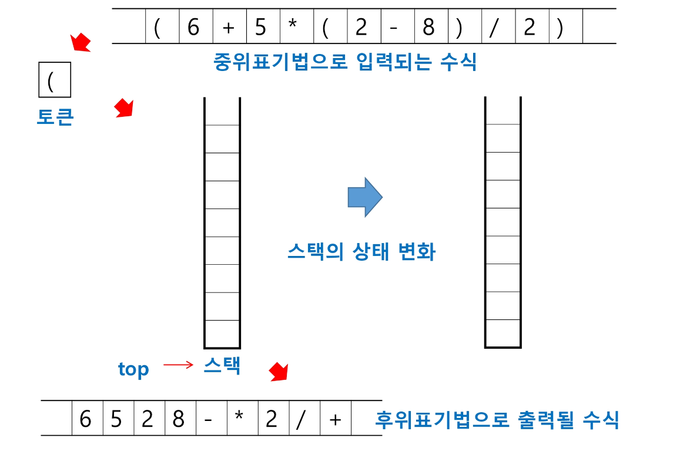 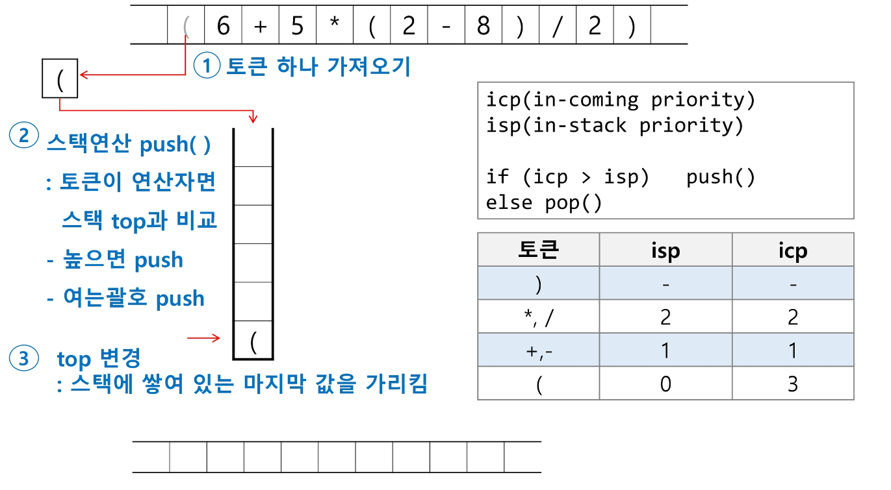 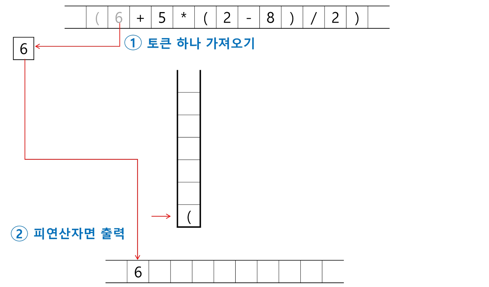 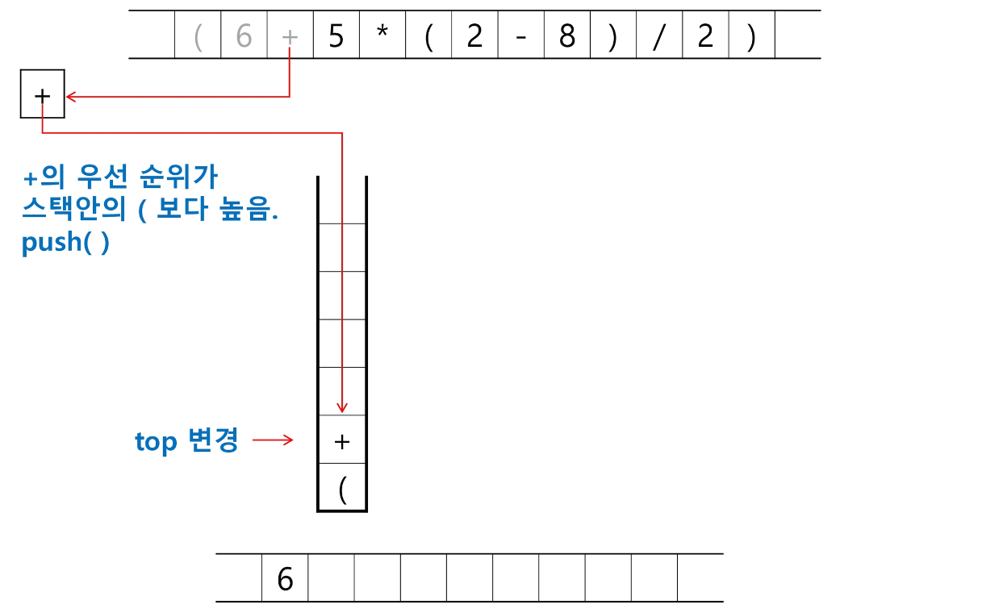 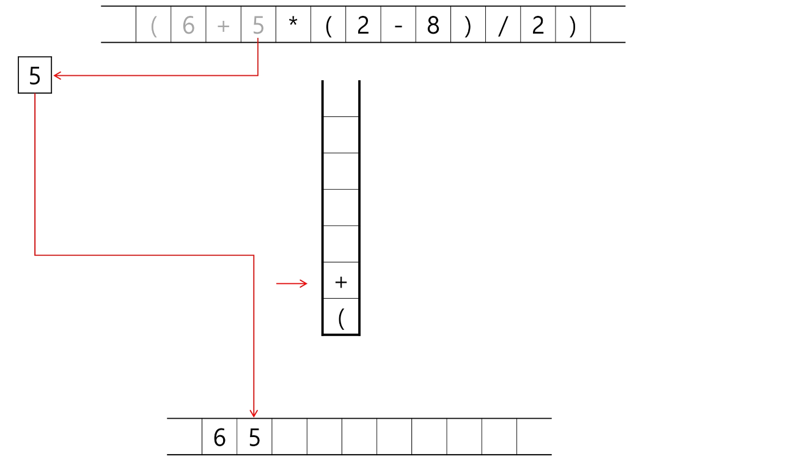 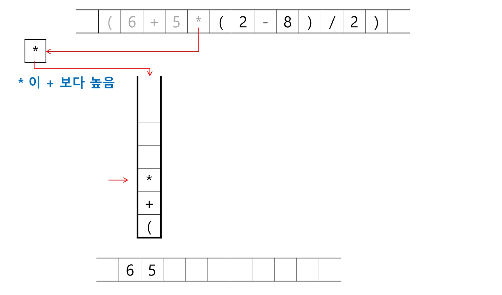 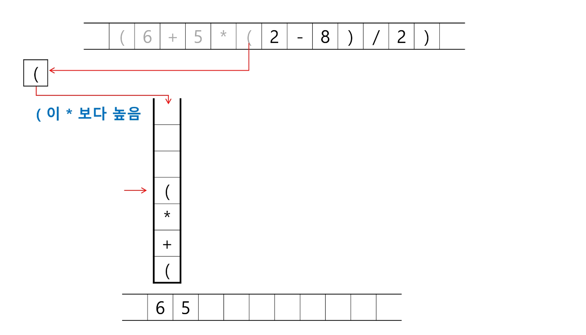 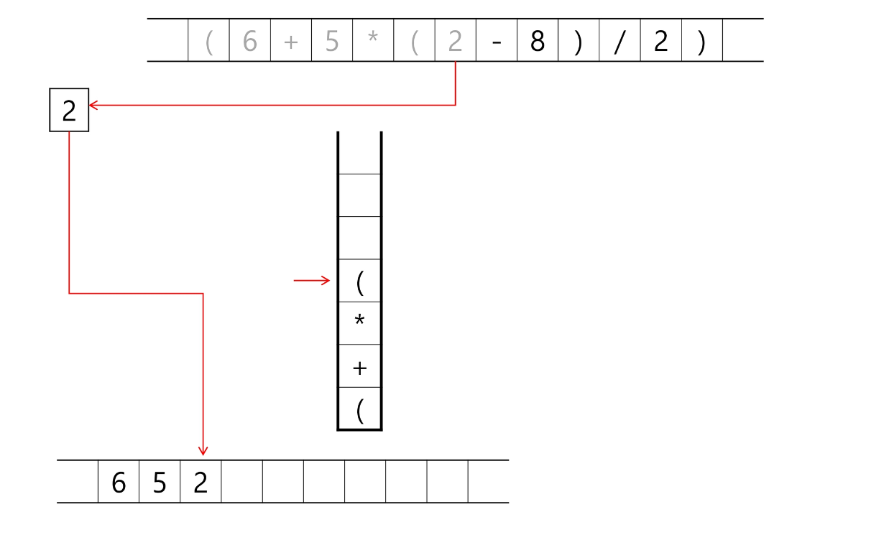 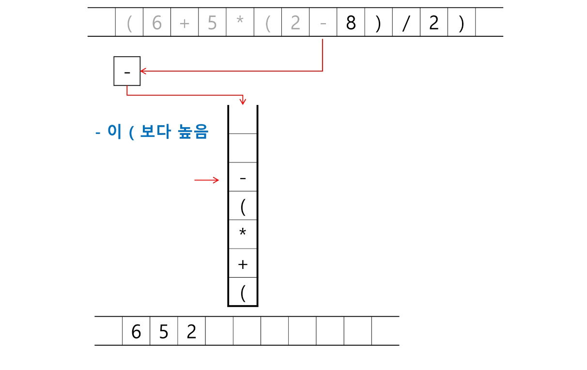 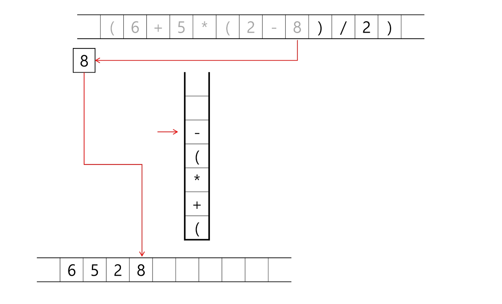 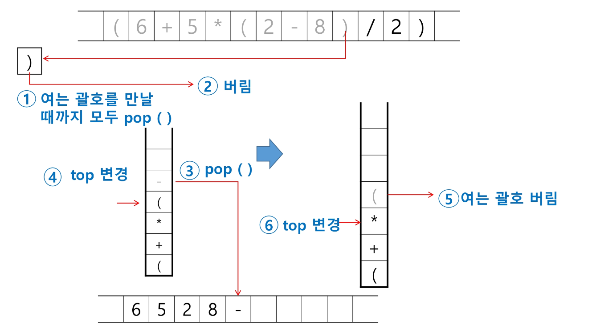 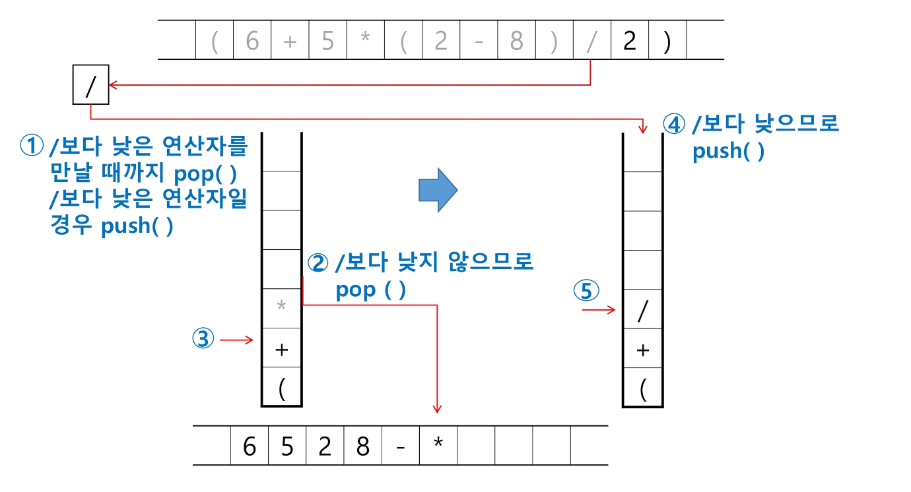 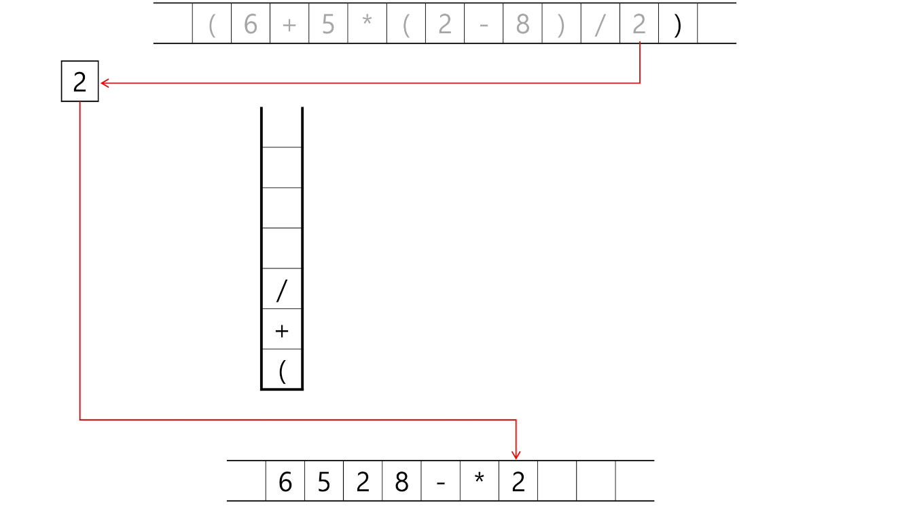 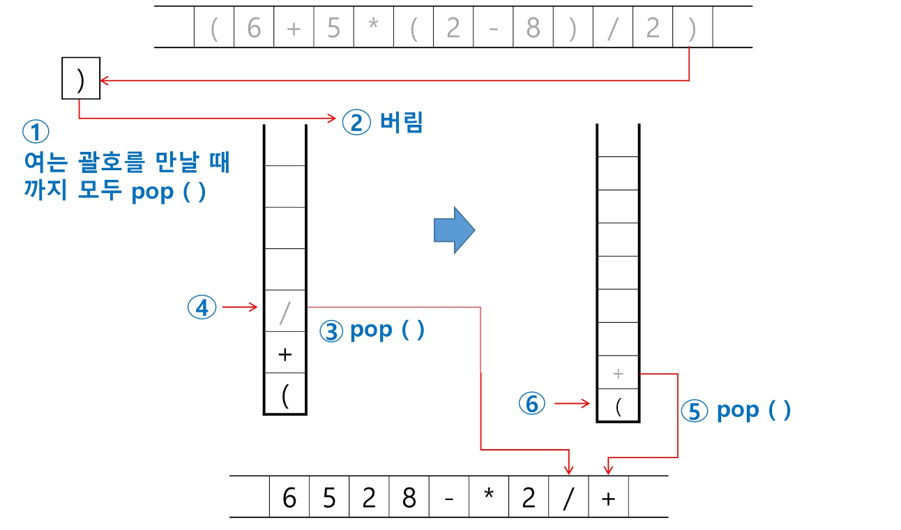 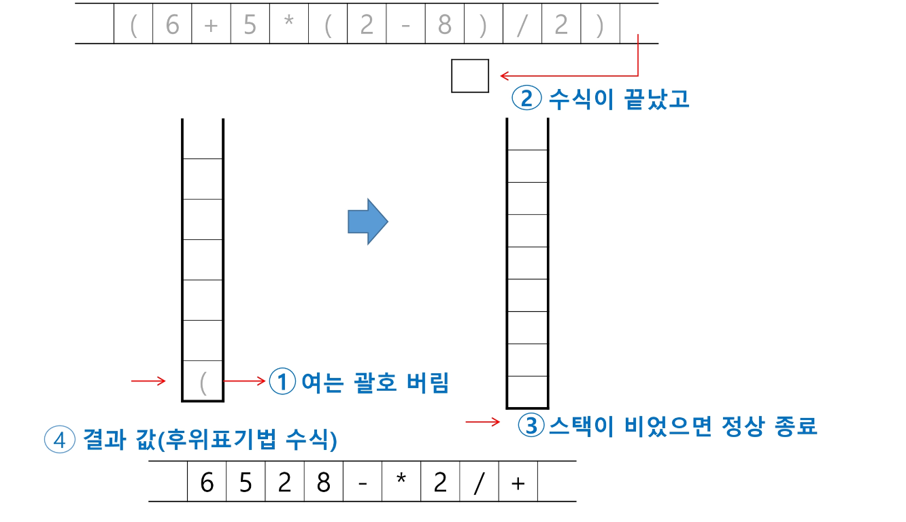

#### step2) 후기 표기법의 수식을 스택을 이용하여 계산

- 피연산자를 만나면 스택에 push한다.

* 연산자를 만나면 필요한 만큼의 피연산자를 스택에서 pop하여 연산하고, 연산결과를 다시 스택에 push한다.

- 수식이 끝나면, 마지막으로 스택을 pop하여 출력한다.

```py
stack = [0] * 100
top = -1
susik = '6528-*2/+'
for x in susik:
    if x not in '+-/*':
        top += 1
        stack[top] = int(x)
    else:
        if x=='+':
            op1 = stack[top]
            top -= 1
            op2 = stack[top]
            top -= 1
            top += 1
            stack[top] = op1 + op2
        elif x== '-':

        elif x==


##
stack = [0] * 100
top = -1
icp = {'(':3, '*':2 , '/':2, '+':1, '-':1}
isp = {'(':0, '*':2,  '/':2, '+':1, '-':1}

fx = '(6+5*(2-8)/2)'
susik = ''
for x in fx:
    if x in '(+-*/)':
        if top == -1 or isp[stack[top]] < icp[x]:
            top += 1    # push
            stack[top] = x
        elif isp[stack[top]] >= icp[x]:
            while top > -1 and isp[stack[top]] >= icp[x]:
                susik += stack[top]
                top -= 1
            top += 1
            stack[top] = x
print(susik)
```

### 백트래킹

- 해를 찾는 도중에 '막히면' 되돌아가서 다시 해를 찾는 기법.

* 최적화 문제와 결정 문제를 해결할 수 있다.

- 결정 문제: 문제의 조건을 만족하는 해가 존재하는지의 여부를 'yes' or 'No'로 답하는 문제
  - 미로찾기
  * n-Queen
  - Map coloring
  * 부분집합의 합 문제 등

#### 미로찾기

- 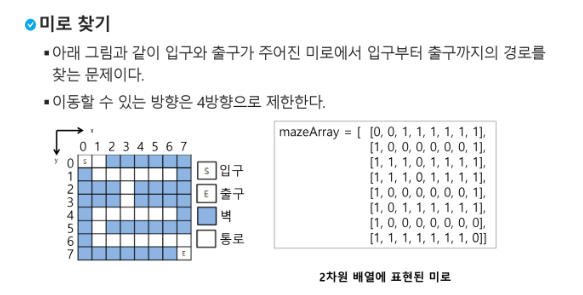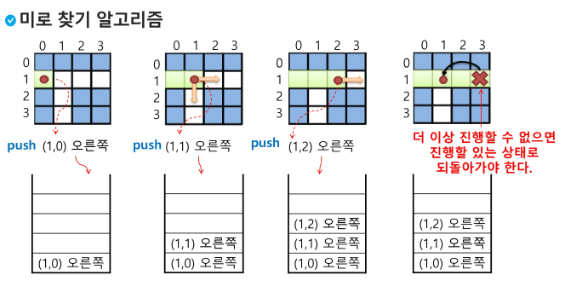 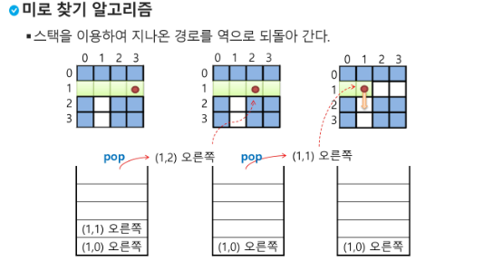 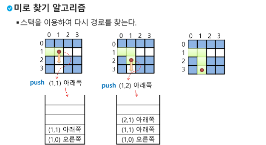

##### 백트래킹과 DFS의 차이

- 어떤 노드에서 출발하는 경로가 해결책으로 이어질 것 같지 않으면 더이상 그 경로 따라가지않고 시도 횟수 줄임(Prunning ㄱㅏ지치기)

* 모든 경로를 탐색하는 DFS와 달리 백트래킹은 불필요한 경로 차단.

- 경우의 수가 너무 많으면 DFS불가능. 백트래킹은 경우의 수가 줄긴하지만 지수함수 시가늘 요하기때문에 처리불가.

##### 백트래킹 기법

- 어떤 노드의 유망성을 점검 후 유망(promising)하지 않다고 결정되면 그 노드의 부모로 되돌아가 다음 자식노드로 감

* 어떤 노드를 방문했을때, 그 노드를 포함한 경로가 해답이 될 수 있으면 유망, 없으면 유망하지 않다고함.

- 가지치기(pruning) : 유망하지 않은 노드가 포함된 경로는 더이상 고려 X

#### 백트래킹 알고리즘

```py
def checknode (v) : # node
    if promising(v) :
        if there is a solution at v :
            write the solution
        else:
            for u in each child of v :
                checknode(u)

```

##### 부분집합 구하기( 백트래킹 )

- 어떤 집합의 공집합과 자기자신을 포함한 모든 부분집합을 powerset이라 하며 구하고자 하는 어떤 집합의 원소의 수가 n개 라면 부분집합의 개수는 2^n개 이다.

* 백트래킹 기법으로 powerset을 구해보자

```py
bit = [0, 0, 0, 0]
for i in range(2):
    bit[0] = i	# 0번째 원소
    for j in range(2):
        bit[1] = j	# 1번째 원소
        for k in range(2):
             bit[2] = k	# 2번째 원소
             for l in range(2):
                  bit[3] = l	# 3번째 원소
                  print(bit)	# 생성된 부분집합 출력
```

```py
## 부분집합의 합_재귀
def f(i, N):
    if i == N:
        print(bit, end= ' ')
        for j in range(N):
            if bit[j]:
                print([A[j]], end=' ')
        print()
        return
    else:
        bit[i] = 1
        f(i+1, N)
        bit[i] = 0
        f(i+1, N)
        return

N = 3
A = [1,2,3]
bit = [0]* N
f(0, N)

## 부분집합의 합
def f(i, N, s): # s : i-1원소까지의 부분집합의 합(포함된 원소의 합)
    if i == N:
        print(bit, end= ' ')
        print(f' : {s}')

        return
    else:
        bit[i] = 1      # 부분집합에 A[i]포함
        f(i+1, N, s+A[i])
        bit[i] = 0      # 부분집합에 A[i]빠짐
        f(i+1, N, s)
        return

N = 3
A = [1,2,3]
bit = [0]* N
f(0, 3, 0)

# 부분집합의 합
def f(i, N, s, t): # s : i-1원소까지의 부분집합의 합(포함된 원소의 합). t :찾으려는 합
    global cnt
    cnt += 1
    if s == t:

    if i == N:
        if s == 10:
            print(bit)
            return
    elif i == N:
        return
    else:
        bit[i] = 1      # 부분집합에 A[i]포함
        f(i+1, N, s+A[i], t)
        bit[i] = 0      # 부분집합에 A[i]빠짐
        f(i+1, N, s,t )
        return

N = 3
A = [1,2,3]
bit = [0]* N
cnt = 0
f(0, 3, 0)
```

```py
# 순열
def f(i, N):
    if i == N:
        print(A)
    else:
        for j in range(i, N):   # 자신부터 오른쪽끝까지
            A[i], A[j] = A[j], A[i]
            f(i+1, N)
            A[i], A[j] = A[j], A[i]
A = [1,2,3]
f(0,3)
```

### gpt 설명

#### DFS

- 깊이 우선 탐색(DFS, Depth-First Search)는 그래프나 트리와 같은 자료 구조에서 모든 가능한 경로를 탐색하는 알고리즘입니다. DFS는 스택(stack) 또는 재귀 함수를 사용하여 구현할 수 있습니다.

- 기본 아이디어는 다음과 같습니다:

- 한 경로로 계속 내려가다가 더 이상 갈 수 없으면 이전 단계로 돌아가서 다른 경로를 탐색하는 방식입니다.
- 깊이를 최대한 파고들어서 더 이상 갈 수 없을 때까지 탐색한 후, 되돌아오면서 다른 경로를 탐색합니다.
- DFS는 주로 그래프나 트리에서 연결된 모든 노드를 탐색하거나, 미로 찾기 문제와 같은 경로 찾기 문제에 사용됩니다. 탐색 방법에 따라 여러 가지 응용이 가능하며, 백트래킹과 결합하여 조합 최적화나 문제 해결에도 활용됩니다.

- DFS의 구현은 재귀 호출을 사용하거나 명시적인 스택을 사용하여 할 수 있습니다. 위에서 소개한 코드에서 사용된 dfs 함수도 깊이 우선 탐색을 수행하는 함수입니다.

#### 백트래킹

- 백트래킹(Backtracking)은 문제의 가능한 모든 경우를 탐색하면서, 불필요한 경우를 배제하여 최적화하는 알고리즘 설계 기법입니다. 백트래킹은 주로 결정 문제(예: 문제의 조건을 만족하는 해가 존재하는지 여부)나 조합, 순열, 그래프 등의 문제를 풀 때 사용됩니다.

- 기본적인 아이디어는 다음과 같습니다:

- 선택과 배제: 가능한 선택 중 하나를 선택하고, 그 선택을 검증하여 문제의 조건을 만족하는지 확인합니다.
- 재귀 호출: 선택한 것이 유효한 경우, 그 다음 단계로 넘어가기 위해 재귀 함수를 호출합니다.
- 해제 및 복구: 선택한 것이 유효하지 않은 경우, 이전 단계로 돌아가기 위해 선택한 것을 해제하고 원래 상태로 돌려놓습니다.
- 이러한 과정을 반복하면서 가능한 모든 조합을 탐색하게 됩니다. 중요한 점은 백트래킹이 전체 탐색이지만, 유효하지 않은 경우를 발견하면 더 이상 그 경로를 따라가지 않고 다른 경로로 넘어가는 방식입니다. 이렇게 하면 불필요한 계산을 줄여 시간 및 자원을 절약할 수 있습니다.

- 백트래킹은 대표적으로 스도쿠, N-Queens 문제와 같은 조합 최적화 문제나 미로 탐색, 그래프 탐색 문제 등에 사용됩니다.

### swea 문제풀이

```py
'''
Forth라는 컴퓨터 언어는 스택 연산을 기반으로 하고 있어 후위 표기법을 사용한다. 예를 들어 3+4는 다음과 같이 표기한다.
3 4 + .

Forth에서는 동작은 다음과 같다.

숫자는 스택에 넣는다.
연산자를 만나면 스택의 숫자 두 개를 꺼내 더하고 결과를 다시 스택에 넣는다.
‘.’은 스택에서 숫자를 꺼내 출력한다.

Forth 코드의 연산 결과를 출력하는 프로그램을 만드시오. 만약 형식이 잘못되어 연산이 불가능한 경우 ‘error’를 출력한다.

[입력]
첫 줄에 테스트 케이스 개수 T가 주어진다.  1≤T≤50
다음 줄부터 테스트 케이스의 별로 정수와 연산자가 256자 이내의 연산코드가 주어진다. 피연산자와 연산자는 여백으로 구분되어 있으며, 코드는 ‘.’로 끝난다.
나눗셈의 경우 항상 나누어 떨어진다.

[출력]
#과 1번부터인 테스트케이스 번호, 빈칸에 이어 계산결과를 정수로 출력하거나 또는 ‘error’를 출력한다.'''

# swea 4874 Forth  // 스택문제
T = int(input())
for tc in range(1, T+1):
    text = input().split()
    stack = []
    error = False

    for i in range(len(text)-1): # 마지막 . 빼기 위해서 한개 빼고
        if text[i].isdigit():   #해당 문자가 숫자라면
            stack.append(text[i])   # 스택에 쌓기

        else: # 해당 문자가 숫자가 아닌 연산자라면
            try: # 에러 처리를 위한 try-except // try 문 내에서 실행하다가 실패 혹은 예외사항이 발생시 바로 except문 실행
                b = int(stack.pop())  # 추가된 두 숫자를 꺼내기
                a = int(stack.pop())  # 거꾸로 꺼내기 때문에 b,a순으로
                # 연산자에 맞춰 계산
                if text[i] ==  '+':
                    c = a + b
                elif text[i] ==  '-':
                    c = a - b
                elif text[i] ==  '*':
                    c = a * b
                elif text[i] ==  '/':
                # 나머지는 버려야하니까 '//' 연산자 활용
                    c = a // b
                stack.append(c)
            except: # 숫자도 연산자도 아니라면 에러발생
                error = True
    # 에러가 True거나 스택에 남은게 하나가 아니라면 error 출력
    if error == True or len(stack) != 1:
        print(f'#{tc} error')
    else:
        print(f'#{tc} {stack[0]}')

# 강사님 풀이
T= int(input())
for tc in range(1, T+1):
    forth = list(input().split())
    stack = []
    error = False
    for i in range(len(forth)-1):
        if forth[i].isdigit():
            stack.append(forth[i])
        else: # 숫자가 아닌 연산자 일 경우
            try:
                b = int(stack.pop())
                a = int(stack.pop())
                if forth[i] == '+':
                    ans = a +b
                elif forth[i] == '-':
                    ans = a -b
                elif forth[i] == '*':
                    ans = a * b
                elif forth[i] == '/':
                    ans = a // b
                stack.append(ans)
            except:
                error = True

    if error == True or len(stack) != 1 :
        print(f'#{tc} error')
    else:
        print(f'#{tc} {stack.pop()}')
```

```py
'''
NxN 크기의 미로에서 출발지에서 목적지에 도착하는 경로가 존재하는지 확인하는 프로그램을 작성하시오. 도착할 수 있으면 1, 아니면 0을 출력한다.
주어진 미로 밖으로는 나갈 수 없다.

다음은 5x5 미로의 예이다.

13101
10101
10101
10101
10021

마지막 줄의 2에서 출발해서 0인 통로를 따라 이동하면 맨 윗줄의 3에 도착할 수 있는지 확인하면 된다.


[입력]
첫 줄에 테스트 케이스 개수 T가 주어진다.  1<=T<=50
다음 줄부터 테스트 케이스의 별로 미로의 크기 N과 N개의 줄에 걸쳐 미로의 통로와 벽에 대한 정보가 주어진다. 0은 통로, 1은 벽, 2는 출발, 3은 도착이다. 5<=N<=100

[출력]
각 줄마다 "#T" (T는 테스트 케이스 번호)를 출력한 뒤, 계산결과를 정수로 출력하거나 또는 ‘error’를 출력한다.
'''
# swea 4875 Miro // dfs 이용한 스택 문제
# 강사님 풀이
def maze():
    while stack:
        y,x = stack.pop() # 현재위치를 스택에서 꺼냄
        arr[y][x] = -1  # 지나간 길 표시
        for dy, dx in move:
            ny, nx = y + dy, x + dx
            if 0 <= ny < N and 0 <= nx < N :
                if arr[ny][nx] == 3:
                    return 1
                elif arr[ny][nx] == 0: # 갈수 있는 곳을 모두 스택에 추가
                    stack.append((ny, nx))
    return 0    # 도착점을 못찾으면 0 반환

T = int(input())
for tc in range(1, T+1):
    N = int(input())
    arr = [list(map(int, input())) for _ in range(N)]
    move = [(1,0), (-1, 0), (0, 1), (0, -1)]
    for y in range(N):
        for x in range(N):
            if arr[y][x] == 2:
                stack = [(y,x)] # 시작점 스택에 추가
                break

    print(f'#{tc} {maze()}')
```

```py
'''
사다리 게임이 지겨워진 알고리즘 반 학생들이 새로운 게임을 만들었다. 가위바위보가 그려진 카드를 이용해 토너먼트로 한 명을 뽑는 것이다. 게임 룰은 다음과 같다.

1번부터 N번까지 N명의 학생이 N장의 카드를 나눠 갖는다. 전체를 두 개의 그룹으로 나누고, 그룹의 승자끼리 카드를 비교해서 이긴 사람이 최종 승자가 된다.
그룹의 승자는 그룹 내부를 다시 두 그룹으로 나눠 뽑는데, i번부터 j번까지 속한 그룹은 파이썬 연산으로 다음처럼 두개로 나눈다.

두 그룹이 각각 1명이 되면 양 쪽의 카드를 비교해 승자를 가리고, 다시 더 큰 그룹의 승자를 뽑는 방식이다.

다음은 4명이 카드를 비교하는 경우로, 숫자 1은 가위, 2는 바위, 3은 보를 나타낸다. 만약 같은 카드인 경우 편의상 번호가 작은 쪽을 승자로 하고, 처음 선택한 카드는 바꾸지 않는다.

N명이 학생들이 카드를 골랐을 때 1등을 찾는 프로그램을 만드시오.

[입력]
첫 줄에 테스트 케이스 개수 T가 주어진다.  1≤T≤50
다음 줄부터 테스트 케이스의 별로 인원수 N과 다음 줄에 N명이 고른 카드가 번호순으로 주어진다. 4≤N≤100
카드의 숫자는 각각 1은 가위, 2는 바위, 3은 보를 나타낸다.


[출력]
각 줄마다 "#T" (T는 테스트 케이스 번호)를 출력한 뒤, 1등의 번호를 출력한다.
'''

# swea 4880 토너먼트 카드게임 //
def sep_group(start, end) :
    if start == end:    # 그룹에 한명이 남았을때만 출력
        return start

    a = sep_group(start, (start + end)//2)   # 재귀함수를 통해 각 그룹에 한명이 남을때까지 돌림
    b = sep_group((start + end)//2 +1, end)  # 이후 하나만 남아 재귀함수가 멈추고 start값이 나오면 가위바위보 진행
    return rsp(a, b)

def rsp(a, b):
    A, B = arr[a], arr[b]
    if A - B == 1 or A - B == -2:
        return a
    elif A == B :
        return a
    else:
        return b

T = int(input())
for tc in range(1, T+1):
    N = int(input())
    arr = list(map(int, input().split()))
    print(f'#{tc} {sep_group(0, N-1) +1 }')  # N개이나 인덱스값 시작이 0 이기에 -1 , 출력값은 인덱스값이기에 번호는 +1
```

```py
'''
NxN 배열에 숫자가 들어있다. 한 줄에서 하나씩 N개의 숫자를 골라 합이 최소가 되도록 하려고 한다. 단, 세로로 같은 줄에서 두 개 이상의 숫자를 고를 수 없다.
조건에 맞게 숫자를 골랐을 때의 최소 합을 출력하는 프로그램을 만드시오.

예를 들어 다음과 같이 배열이 주어진다.

2 1 2
5 8 5
7 2 2

이경우 1, 5, 2를 고르면 합이 8로 최소가 된다.

[입력]
첫 줄에 테스트 케이스 개수 T가 주어진다.  1≤T≤50
다음 줄부터 테스트 케이스의 첫 줄에 숫자 N이 주어지고, 이후 N개씩 N줄에 걸쳐 10보다 작은 자연수가 주어진다. 3≤N≤10

[출력]
각 줄마다 "#T" (T는 테스트 케이스 번호)를 출력한 뒤, 합계를 출력한다.
'''
# dfs + 백트래킹 활용해서 풀기
def DFS(idx, now_sum):
    global min_sum
    if now_sum >= min_sum:  # 현재 합이 최소 합보다 크면 더이상 탐색 x
        return
    if idx == N:    # 모든 행을 선택
        if min_sum > now_sum:   # 모든행을 선택했으면 현재 합이 최소합보다 작으면 최소합을 현재합으로 업데이트
            min_sum = now_sum
            return
    for i in range(N):
        if not used[i]:
            used[i] = 1
            DFS(idx+1, now_sum + arr[idx][i])   # 다음 행으로 넘어가면서 재귀호출
            used[i] = 0 # 복구 (백트래킹)

T = int(input())
for tc in range(1, T + 1):
    N = int(input())
    arr = [list(map(int, input().split())) for _ in range(N)]
    used = [0] * N
    min_sum = 21e8
    DFS(0,0)

    print(f'#{tc} {min_sum}')
```
