# 8.17-18
## Queue큐
### 큐의 특성
* 스택과 마찬가지로 삽입과 삭제의 위치가 제한적인 자류구조
+ 선형
* 선입선출구조
* 가장 첫번째원소 : Front
+ 가장 마지막원소 : Rear
+ 큐의 기본연산
    * enQueue( ) : rear 로 삽입
    + deQueue( ) : front 삭제 후 반환
    * createQueue( ) : 공백 상태 큐 생성
    + isEmpty() : 큐가 공백인지 확인
    * isFull( ) : 큐가 포화상태인지 확인
    + Qpeek() : front 원소 삭제 없이 반환
* 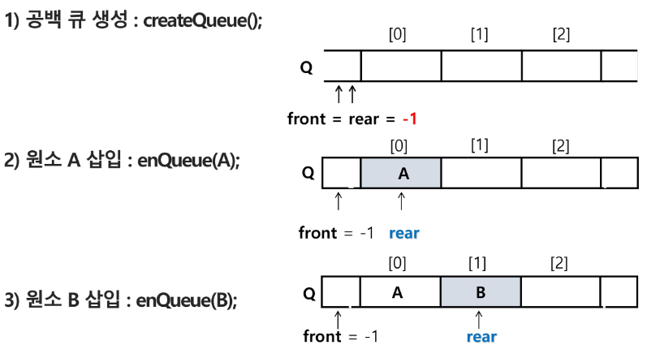 
### 큐의 구현
* 선형 큐 : 1차원 배열을 이용한 큐
+ 큐의 크기 = 배열의 크기
* 상태 표현
    * 초기 상태 : front = rear = -1
    + 공백 상태 : front == rear
    * 포화 상태 : rear == n-1 (n: 배열의 크기, n-1 : 배열의 마지막 인덱스)

```py
def enQ(data):
    global rear
    rear += 1
    Q[rear] = data

def deQ():
    global front
    if front == rear :
        print('Queue is Empty')
    else:
        front += 1
        return Q[front]

Qsize = 3
Q = [0] * Qsize
rear = -1
front = -1

enQ(1)
enQ(2)
rear += 1   # enQ(3) 과 같음
Q[rear] = 3

# enQ(4)
print(deQ())    #1
print(deQ())    #2
print(deQ())    #3
print(deQ())    #Queue is Empty // None
```

### 선형 큐 이용시 문제점 
* 잘못된 포화상태 인식
    * 반복된 원소의 삽입과 삭제로 rear = n-1로 인식되서 배열의 앞쪽에 공간이 있어도 포화상태로 인식하여 더 이상 삽입을 안하게됌.
    + 해결법1 : 매 연산이 이루어질때마다 저장된 원소들을 앞으로 이동시킴 // 원소이동에 많은 시간이 소요되어 큐의 효율성이 떨어짐
    * 해결법2 : 1차원배열을 처음 과 끝을 논리적으로 연결하여 원형형태의 큐를 이룬다 가정하고 사용

#### 원형 Queue 큐
* 초기 공백상태 front = rear =0
+ Index의 순환
    * front 와 rear의 위치가 배열의 마지막인덱스 n-1가르킨 후, 그 담에는 논리적 순환을 이루러 배열의 처음 인덱스 0으로 이동
    + 이를 위해 나머지 연산자 mod를 사용
* front 변수 
    * 공백상태와 포화상태를 쉽게 구분하기 위해 사용하지 않고 항상 빈자리로 둠
+ 삽입 및 삭제 위치
    * 선형큐 : rear = rear +1  // front = front +1 
    + 원형큐 : rear = (rear +1) mod n // front = (front + 1) mod n
    + 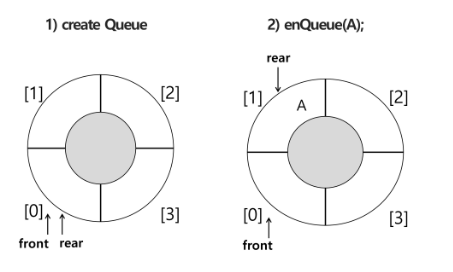 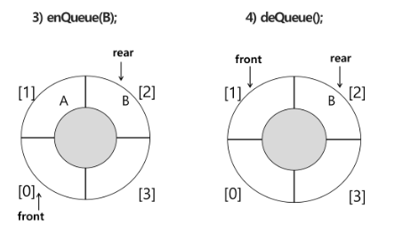 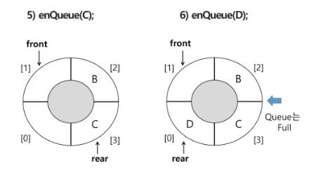
```py
def enQ(data):
    global rear
    if (rear+1)%cQsize == front:
        print('cQ is Full')
    else:
        rear = (rear+1)%cQsize
        cQ[rear] = data

def deq():
    global front
    front = (front + 1)%cQsize
    return cQ[front]


cQsize = 4
cQ = [0] * cQsize
front = 0
rear = 0

enQ(1)
enQ(2)
enQ(3)
print(deq())    # 1
print(deq())    # 2
enQ(4) 
enQ(5)  
enQ(6)  # cQ is Full
enQ(7)  # cQ is Full
print(deq())    #3
print(deq())    #4
print(deq())    #5
print(deq())    #2
```

```py 
# 참고용 / import해서 쓰면 편함
from collections import deque

q = deque()
q.append(1)
q.append(2)
q.append(3)
print(q.popleft())    #1
print(q.popleft())    #2
print(q.popleft())    #3
```
### 우선순위 큐
* 우선순위를 가진 항목들을 저장한 큐
* FIFO 순서가 아니라 우선순위가 높은 순서대로 반환
+ 적용분야
    * 시뮬레이션 시스템
    + 네트워크 트래픽 제어
    * 운영체제의 테스크 스케줄링

#### 우선순위 큐의 규현
* 배열을 이용한 우선순위 큐
     * 원소를 삽입하는 과정에서 우선순위를 비교하여 적절한 위치에 삽입하는 구조
    + 배열이기 때문에 삽입이나 삭제시 원소의 재배치가 발생 => 시간 및 메모리 낭비 큼
+ 리스트를 이용한 우선순위 큐


### 큐의 활용
#### 버퍼
* 데이터를 한 곳에서 다른 한곳으로 전송하는 동안 일시적으로 그 데잍러를 보관하는 메모리 영역
+ 버퍼링 : 버퍼를 활용하는 혹은 버퍼를 채우는 동작을 의미
* 버퍼는 일반적으로 입출력 및 네트워크와 관련된 기능에서 이용.
+ 순서대로 입력/출력/전달되어야 하므로 FIFO방식의 자료구조인 큐가 활용됌.

##### 스택과 큐의 비교 // 강사님 수업
* 스택 : 후입 선출
+ 데이터 추가 : push, 데이터 삭제 : pop
* append, pop 사용
* DFS로 활용
- - -
+ 큐 : 선입 선출
* 데이터 추가 : enqueue, 데이터 삭제 : dequeue
+ append, pop(0) 사용
* BFS로 활용 
---
+ from collections import deque
* deque 는 양쪽 끝에서 삽입과 삭제가 이루어지는 함수
```py 
from collections import deque
d = deque()
d.append(1)
d.extend([10, 15, 20])
print(d)    # deque([1, 10, 15, 20])

for item in d:
    print(item, end = ' ')  # 1 10 15 20
print()
print(d.popleft())    # 왼쪽끝에 요소 제거 후 반환
d.pop()     # 오른쪽 끝 요소 제거 후 반환
print(d)    # deque([10, 15])
```


# 8-17
## BFS(Breadth First Search)
* 너비 우선 탐색
* dfs의 경우 정점 하나를 선택해서 현재 정점에서 갈 수 있는 간선을 통해 경로의 끝 노드까지 방문한다면
+ bfs는 현재 정점에서 갈 수 있는 모든 노드를 방문하고 그 노드에서 또 갈수 있는 모든 노드를 방문하여 레벨을 한칸씩 올려간다.
+너비우선탐색은 인접 정점을 모두 방문한 후, 방문했던 정점을 시작점으로하여 다시 인접한 정점들을 방문하는 방식
* 인접한 정점들에 대해 탐색 후, 차례대로 다시 너비우선탐색을 하기 때문에, 선입선출 형태의 자료구조인 큐를 사용함.
* 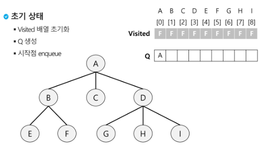 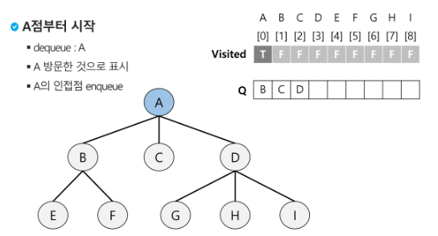 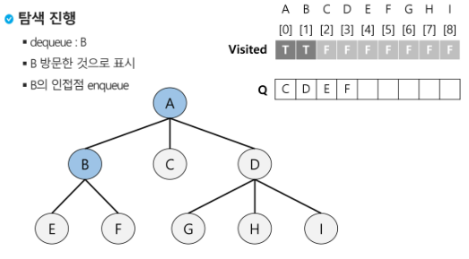 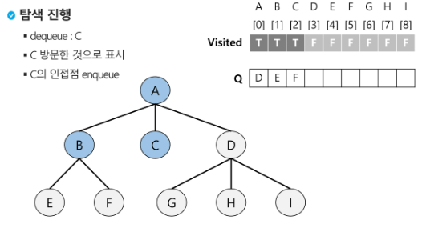 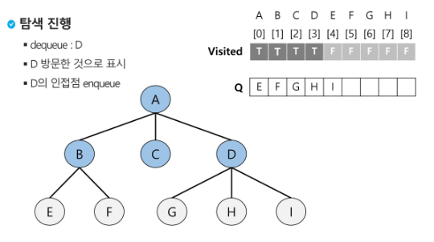 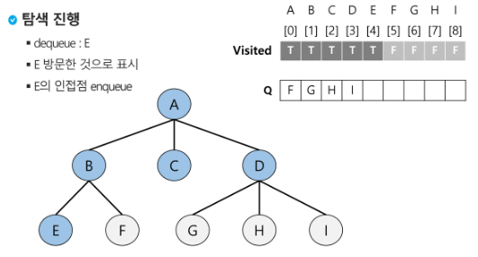  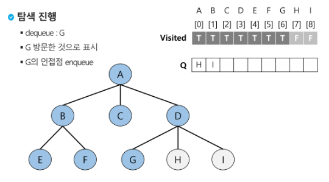 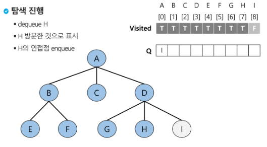 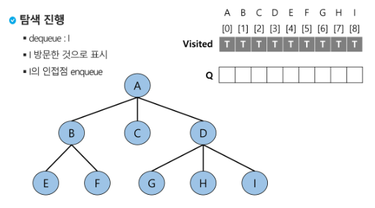 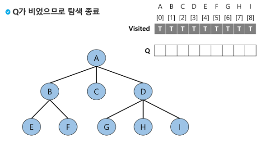
```py
def BFS(G, v):		# 그래프G , 탐색 시작점v
    visited = [0] * (n+1)	# 정점의 개수n
    queue = []		# 큐 생성
    queue.append(v)	# 시작점 v를 큐에 삽입		
    while queue :		# 큐가 비어있지 않은 경우	
         t = queue.pop(0)	# 큐의 첫번째 원소 반환
         if not visited[t] :	# 방문하지않은 곳이라면
                visited[t] = True	# 방문한 것으로 표시를 바꾸고
                visit(t)		#방문한 노드에서 할일을 진행 
	    for i in G[t]	# t와 연결된 모든 정점에 대해
	        if not visited[i]:	# 방문하지 않은곳이라면
	        queue.append(i)	# 큐에 넣기
##------------------------------------------------------------------------------------	       
def BFS(G, v, n):       # 그래프 G, 탐색 시작점 v, 정점의 개수 n
    visited = [False] * (n+1)   # 정점의 개수 n
    queue = []          # 큐 생성
    queue.append(v)     # 시작점 v를 큐에 삽입        
    visited[v] = True   # 시작점 v를 방문한 것으로 표시
        
    while queue:        # 큐가 비어있지 않은 경우    
        t = queue.pop(0)    # 큐의 첫번째 원소 반환
        visit(t)            # 방문한 노드에서 할 일을 진행 (이 함수를 구현해야 함)
        
        for i in G[t]:  # t와 연결된 모든 정점에 대해
            if not visited[i]:  # 방문하지 않은 곳이라면
                queue.append(i) # 큐에 넣기
                visited[i] = visited[t] + 1  # t로부터 1만큼 이동

# 예시 사용법
n = 6  # 정점의 개수
G = {
    1: [2, 3],
    2: [4, 5],
    3: [5],
    4: [6],
    5: [],
    6: []
}
BFS(G, 1, n)

```
