# 8.21-22
## 트리
* 비선형 구조 - 원소들 간에 1:n 관계를 가지는 자료구조
* 계층형 구조 - 원소들간 계층 관계를 가지는 계층형 자료구조
* 상위 원소에서 하위 원소로 내려가면서 확장되는 트리(나무)모양의 구조
* 한 개 이상의 노드로 이루어진 유한 집합

### 트리의 명칭
* 최상위 노드를 "루트" 라 칭함
+ n개의 노드를 분리집합으로 묶은 것은 "부 트리(sub tree)"라 칭함

* 노드(node) = 트리의 원소
+ 간선(edge) = 노드를 연결하는 선.
* 루트 노드 = 트리의 시작 노드( 최상위 노드 를 칭하기도함)
+ 형제 노드(sibling node) = 같은 부모 노드의 자식 노드들
* 조상 노드 = 간선을 따라 루트 노드까지 이르는 경로에 있는 모든 노드들
+ 서브 트리(sub tree) = 부모 노드와 연결된 간선을 끊었을 때 생성되는 트리
* 자손 노드 = 서브 트리에 있는 하위 레벨의 노드들
+ 차수(degree)
    * 노드의 차수 = 노드에 연결된 자식 노드의 수( 노드의 가지수)
    * 트리의 차수 = 트리에 있는 노드의 차수 중에서 가장 큰 값
    + 단말 노드(리프 노드) = 차수가 0인 노드. 자식 노드가 없는 노드

* 높이
    * 노드의 높이 = 루트에서 노드에 이르는 간선의 수. 노드의 레벨
    * 트리의 높이 = 트리에 있는 노드의 높이 중에서 가장 큰 값. 최대 레벨

### 이진 트리
* 모든 노드들이 2개의 서브 트리를 갖는 특별한 형태의 트리
+ 각 노드가 자식노드를 최대 2개까지만 가짐
    * 왼쪽 자식노드 // 오른쪽 자식 노드
* 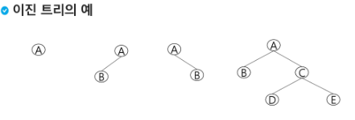

+ 레벨 i에서의 노드의 최대 개수는 2^i 이다.
+ 높이가 h인 이진 트리가 가질수 있는 노드의 최소개수는 (h+1)이며, 최대 개수는 (2^(h+1) - 1)개가 된다.

#### 완전 이진트리(CompleteBinary)
* 높이가 h이고 노드 수가 n개일 때, 포화 이젠 트리의 노드번호가 1번부터 n번까지 빈자리가 없는 이진트리
* 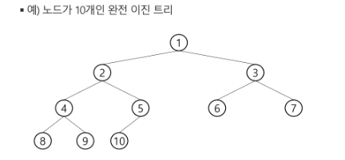

#### 편향 이진트리(Skewed Binary Tree)
* 높이 h에 대한 최소 개수의 노드를 가지면서 한쪽 방향의 자식 노드만을 가진 이진트리
+ 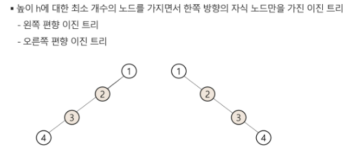

### 이진트리의 순회
* 순회(traversal)이란 트리의 각 노드를 중복되지 않게 전부 방문하는 것.
+ 트리는 비선형 구조이기때문에 선형구조와 다르게 선후 연결 관계를 알 수 없다.
* 3가지 순회방법
    + 전위 순회(preorder traversal) VLR ( V = 루트 )
        * 부모노드 방문 후 자식노드를 좌,우 순서로 방문.
    * 중위 순회(inorder traversal) LVR
         + 왼쪽 자식노드, 부모노드, 오른쪽 자식노드 순으로 방문.
    + 후위 순회(postorder traversal) LRV
        * 자식 노드를 좌우 순서로 방문 후 부모 노드로 방문.

#### 전위 순회 VLR
+ 현재 노드 n을 방문 및 처리 (V)
* 노드 n의 왼쪽 서브트리 방문(L)
+ 노드 n의 오른쪽 서브트리 방문(R)
+ 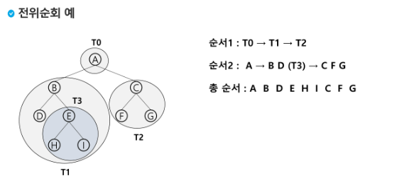

#### 중위 순회 LVR
* 현재 노드 n의 왼쪽 서브트리 방문(L)
+ 현재 노드 n을 방문(V)
* 현재 노드 n의 오른쪽 서브트리 방문(R)
+ 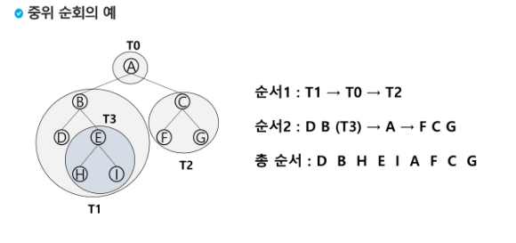

#### 후위 순회 LRV
* 현재 노드 n의 왼쪽 서브트리 방문(L)
* 현재 노드 n의 오른쪽 서브트리 방문(R)
+ 현재 노드 n을 방문(V)
* 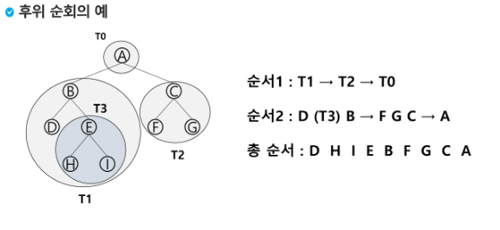

##### 연습문제
+ 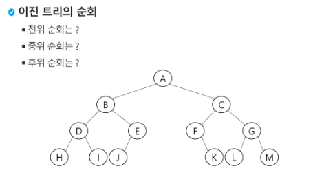
* 전위 순회 : A B D H I E J C F K G L M  // A B D E C F G
+ 중위 순회 : H D I B E J A F K C L G M // D B E A F C G
* 후위 순회 : H I D J E B K F L G M C A  // D E B F G C A

### 이진트리의 표현
* 이진 트리에 각 노드 번호를 다음과 같이 부여 
* 루트의 번호를 1로 함
+ 레벨 n에 있는 노드에 대하여 왼쪽부터 오른쪽으로 2^n부터 2^(n+1) - 1까지 번호를 차례대로 부여
* 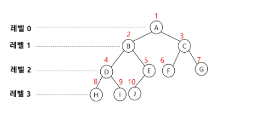

#### 배열을 이용한 이진트리 표현
* 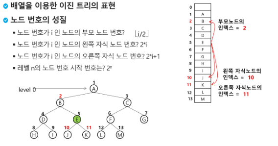
* 노드 번호가 i 인 노드의 부모 노드 번호 = i/2
+ 노드 번호가 i 인 노드의 왼쪽 자식 노드 번호 = 2*i
* 노드 번호가 i 인 노드의 오른쪽 자식 노드 번호 = 2*i + 1
+ 레벨 n의 노드 번호 시작 번호 2^n
* 노드 번호를 배열의 인덱스로 사용
+ 높이가 h인 이진 트리의 배열의 크기 = 2^(h+1) -1

+ 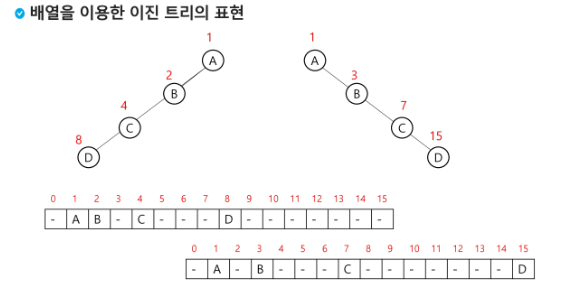

* 단점
     * 편향 이진트리의 경우 사진과 같이 사용하지 않는 배열원소에 대한 메모리 공간 낭비 발생
    + 트리의 중간에 새로운 노드 삽입이나 기존 노드 삭제 등 배열의 크기 변경이 어려워 비효율적.
###### 참고
* 이진트리의 저장
    * 부모 번호를 인덱스로 자식 번호를 저장
         + 부모가 1번일 때 자식이 2,3 이라면 
         * 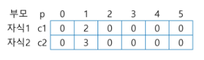

    * 자식 번호를 인덱스로 부모 번호를 저장
         * 자식이 2, 3번일 때 부모가 1번이라면
         + 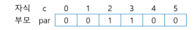
* 루트찾기, 조상찾기
+ 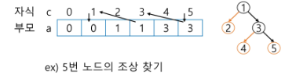
* 인덱스와 값을 이용해 역추적이 가능하다.

#### 연결리스트를 이용한 이진트리 표현
* 배열을 이용한 방법의 단점을 보완하기 위해 연결리스트를 이용
+ 연결 자료구조를 이용한 이진트리의 표현
* 
+ 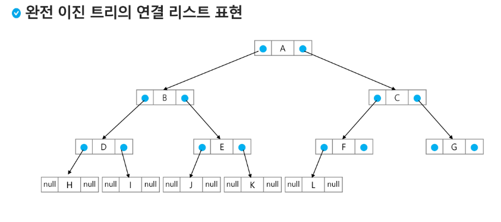

### 수식 트리
* 수식 이진 트리(Expression Binary Tree )
* 연산자는 루트 노드이거나 가지 노드
* 피연산자는 모두 잎 노드
+ 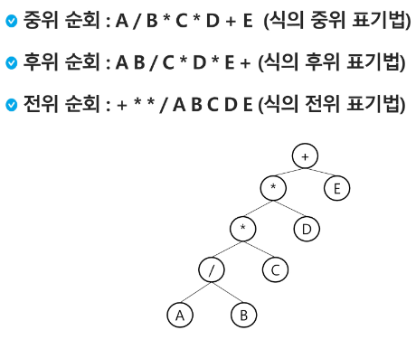


### 연습문제 swea 1231 중위순회
```py
# swea 1231 중위순회
def inorder(p, N):  # N 완전이진트리의 마지막 정점
    if p<=N:
        inorder(p*2, N)           # 왼쪽 자식으로 이동
        print(tree[p], end='')  # 중위 순회
        inorder(p*2+1, N)          # 오른쪽 자식으로 이동
T = 10
for tc in range(1, T+1):
    N = int(input())
    tree = [0] * (N+1)
    for _ in range(N):
        arr = list(input().split())
        tree[int(arr[0])] = arr[1]

    print(f'#{tc}', end='')
    inorder(1, N)
    print()
```
### 이진 탐색 트리
* 탐색작업을 효율적으로 하기 위한 자료구조
+ 모든 원소는 서로 다른 유일한 키를 가짐.
* key : 왼쪽서브트리 < 루트 노드 < 오른쪽 서브트리
* 왼쪽 서브트리와 오른쪽서브트리도 이진 탐색 트리다.
+ 중위 순회시 오름차순으로 정렬된 값을 얻을 수 있다.
* 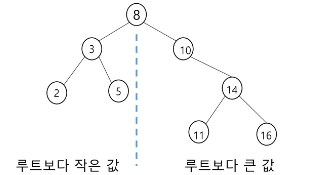

#### 탐색 연산
* 루트에서 시작한다. 
+ 탐색할 키 값x를 루트 노드의 키 값과 비교.
    * 키값x = 루트노드의 키값 : 원하는 원소를 찾았으므로 탐색연산 성공.
    + 키값x < 루트노드의 키값: 루트노드의 왼쪽 서브트리에 대해 탐색연산 수행
    + 키값x > 루트노드의 키값: 루트노드의 왼쪽 서브트리에 대해 탐색연산 수행
+ 서브트리에 대해 순환적으로 탐색 연산 반복.
* 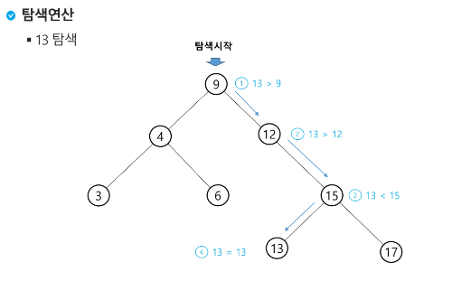

#### 삽입 연산
* 1) 탐색 연산을 먼저 수행
+ 2) 삽입할 원소와 같은 원소가 트리에 있는지 탐색하여 확인
* 3) 트리에 없으면 삽입이 가능하고 탐색이 실패하므로 탐색 실패 위치가 삽입 위치가 된다.
+ 4) 탐색 실패한 위치 = 삽입위치에 원소를 삽입
+ 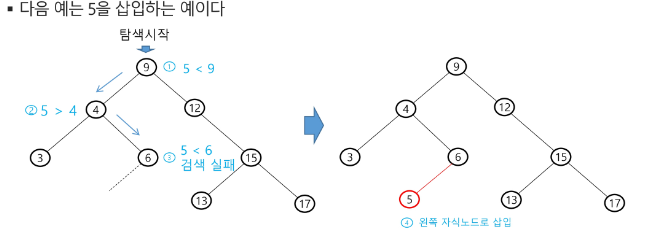

#### 이진 탐색 트리 - 성능
* 탐색, 삽입, 삭제등은 트리 높이만큼 시간 소용
    * O(h) // h: BST의 높이
* 평균(트리가 균형적으로 생성된 경우) : O(log n)
+ 최악의 경우(한쪽으로 치우친 경사 이진트리) : O(n)
* 순차탐색과 시간복잡도가 같다. 


### 힙(heap)
* 완전 이진 트리에서 있는 노드 중에서 키값이 가장 큰 노드나 키값이 가장 작은 노드를 찾기 위해서 만든 자료구조
+ 힙의 키를 우선순위로 활용하여 우선순위 큐를 구현할 수 있다.

#### 최대 힙(max heap)
* 키값이 가장 큰 노드를 찾기 위한 완전이진트리
+ 부모노드의 키값 > 자식노드의 키값
* 루트노드 : 키값이 가장 큰 노드

#### 최소 힙(min heap)
+ 키값이 가장 작은 노드를 찾기 위한 완전이진트리
* 부모노드의 키값 < 자식노드의 키값
+ 루트노드 : 키값이 가장 작은 노드

#### 힙 삽입
+ 삽입할 자리 탐색 및 확장 후 
* 확장한 자리에 삽입할 원소 저장
+ 삽입 후 부모노드와 비교하여 자리바꾸기를 통해 맞는 자리 확정

#### 힙 삭제
* 루트노드의 원소만 삭제 가능
+ 루트 노드의 원소를 삭제하여 반환
* 이를 활용하여 최대값 또는 최소값을 반환
+ 루트 노드 삭제 후 마지막 노드를 삭제하여 루트노드에 삽입
* 후에 자식노드와 비교하여 자리바꾸기를 통해 맞는 자리 확정
+ 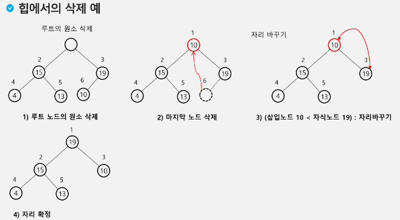

```py
# 힙
def deq():
    global last
    tmp = heap[1]           # 루트 백업
    heap[1] = heap[last]    # 삭제할 노드의 키를 루트에 복사
    last -= 1               # 마지막 노드 삭제
    p = 1       # 루트에 옮긴 값을 자식과 비교
    c = p * 2   # 왼쪽 자식 (비교할 노드 번호)
    while c <= last:    # 자식이 하나라도 있다면
        if c + 1 <= last and heap[c] < heap[c + 1]:     # 오른쪽 자식도 있고, 오른쪽 자식이 더 크면
          c += 1        # 비교대상이 오른쪽 자식 노드
        if heap[p] < heap[c]:   # 자식이 더 크면 최대힙 규칙에 어긋나므로
            heap[p], heap[c] = heap[c], heap[p]
            p = c   # 자식을 새로운 부모로
            c = p*2 # 왼쪽 자식 번호를 계산
        else:   # 부모가 더크면
            break # 비교 중단

    return tmp

heap = [0] *100
last = 0
```


