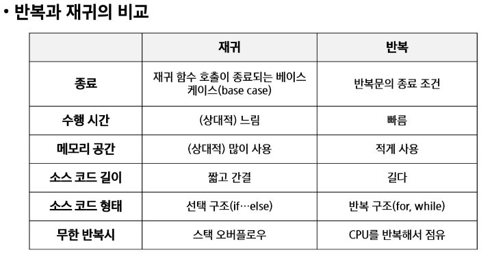
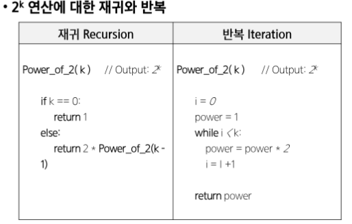
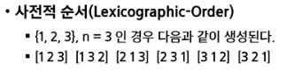
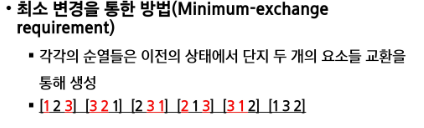
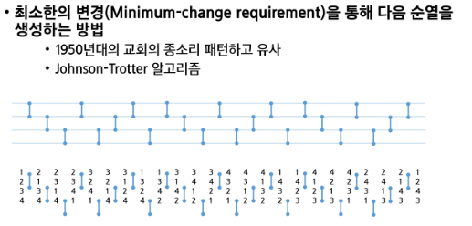
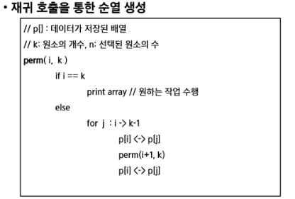
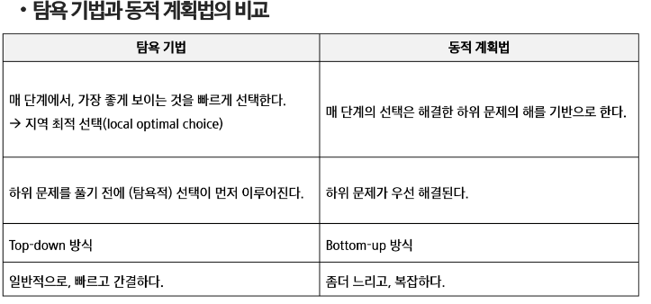
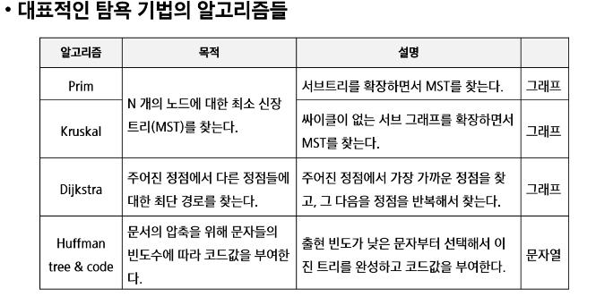

# 08.30
## 완전검색 & 그리디  // 순열 부분집합 조합에 대해 마스터해야함
+ 재귀적 알고리즘의 특성을 이해 및 구현
* 완전 검색의 개념을 이해 및 해결 방법 
* 조합적 문제애 대한 완전 검색 구현
  * 순열 / 부분집합 / 조합
  * 순열: 원소의 순서가 중요한 경우 사용되며, 모든 가능한 순서대로 나열합니다.
  + 조합: 원소의 순서는 중요하지 않고, 특정 개수의 원소로 만들어지는 모든 경우를 나타냅니다.
  + 부분집합: 주어진 집합의 모든 가능한 부분집합을 나타내며, 원소의 순서나 개수에 제약이 없습니다.
* 탐욕 알고리즘 기법의 개념 및 주요 특성 이해

### 반복 및 재귀
+ 반복과 재귀는 유사한 작업을 수행
  + 반복은 수행하는 작업이 완료될때까지 반복
    + 루프 (for, while)
  + 재귀는 주어진 문제의 해를 구하기 위해 동일하면서 더 작은 문제의 해를 이용
    + 큰 문제를 해결하기 위한 더 작은 문제로 쪼개고 결과를 결합
    + 함수 내부에서 직,간접적으로 자기 자신을 호출하는 재귀함수
    + 재귀 호출은 반복적인 스택 사용으로 메모리 및 속도에서 성능저하가 발생
    + 반복횟수 n 이 커질수록 재귀는 반복에 비해 비효율적일 수 있음
  + 추상 자료형(list, tree 등)의 알고리즘은 재귀적 구현이 간단하고 자연스러운 경우가 많다

* 반복과 재귀의 비교
  * 
  * 

### 완전검색
#### 고지식한 방법(brute-force)
+ brute-force는 문제를 해결하기 위한 간단하고 쉬운 접근법
+ 대부분의 문제에 적용 가능
+ 상대적으로 빠른 시간에 문제 알고리즘 설계를 할 수 있음
+ 문제에 포함된 자료의 크기가 작을수록 유용
+ 학술적 or 교육적 목적을 위해 알고리즘의 효율성을 판단하기 위한 척도로 사용
  
##### brute force 탐색
* 자료들의 리스트에서 키 값을 찾기 위해 첫 번째 자료부터 비교하면서 진행
  ```py
  A = [0, 1, 2,  . . . n]
  def sequential search(A, k):
    # A[n] = k, i = 0
    while A[i] != k:
        i += 1
        if i < n:
            return i
        else:
            return -1
  ```
+ 모든 경우의 수를 생성하고 테스트 => 속도는 느리지만, 답을 찾을 확률은 크다
  + 완전 검색은 입력의 크기를 작게 해서 간편하고 빠르게 답을 구하도록 작성
+ 이를 기반으로 **"그리디 기법"** 이나 **"동적계획법"** 을 이용해서 효율적인 알고리즘을 찾는다.
+ 시험등에서 문제를 풀때, 완전검색으로 해답을 도출한 후, 성능 개선을 위해 다른 알고리즘을 사용하고 해답을 확인하는 것을 추천한다.

##### 완전 검색을 통한 baby-gin 접근
+ 고려할 수 있는 모든 경우의 수 생성하기
  + 6개의 숫자로 만들 수 있는 모든 숫자 나열( 중복 포함 )
  + {2, 3, 5, 7, 7, 7} 같은 경우 중복되어도 생성   
+ 해답 테스트
  + 앞 3자리와 뒷 3자리로 잘라 테스트하여 판단

### 완전검색
+ 많은 종류의 문제들이 특정 조건을 만족하는 경우나 요소를 찾는 것
+ 이들은 전형적으로 순열(permutation), 조합(combination), 부분집합(subsets) 과 같은 조합적 문제들과 연관된다.
+ 완전 검색은 조합적 문제에 대한 brute-force 방법이다.

### 순열
+ 서로 다른 것들 중 몇 개를 뽑아서 한줄로 나열하는 것
+ 서로 다른 n개 중 r개를 택하는 순열은 아래와 같이 표현
  + nPr = n x (n-1) x (n-2) x ... x (n-r+1)
  + nPn = n! = n x (n-1) x (n-2) x ... x 2 x 1
+ 다수의 알고리즘 문제들은 순서화된 요소들의 집합에서 최선의 방법을 찾는 것과 관련
  + 예) TSP (Traveling Salesman Problem)
+ N개의 요소들에 대해서 n!개의 순열들이 존재
  + 12! = 479,001,600
  + n>12 인 경우 시간복잡도가 폭발적으로 증가함 
  + 10개,11개까지만,,

* 단순한 순열 생성 방법
  * 동일한 숫자가 포함되지 않았다면, 각 자리수 별로 loop를 사용해 구현
* 순열 생성 방법
  * 사전적 순서
    * 
  * 최소 변경을 통한 방법(Minimum - exchange requirement) 
    * 각 순열들은 이전 상태에서 단지 두 개의 오소들을 교환하여 생성
    * 
  * 최소한의 변경(Minimum - change requirement) 
    * 50년대 교회의 종소리 패턴하고 유사
    * Johnson - Trotter
    * 
  * 재귀호출을 통한 순열 생성
    * 
  * ```py
          # 재귀로 순열 생성
      def f(i, N, card):
          if i == N:   # 순열 완성
              return
          else:       # card[i]에 들어갈 숫자를 결정
              for j in range(N):
                  if used[j]==0:
                      p[i] = card[j]
                      used[j] = 1
                      f(i+1, N)
                      used[j] = 0

      card = list(map(int, input()))  # 6장의 카드 인식
      used = [0] * 6 # 이미 사용한 카드 인지 표시
      p = [0] * 6
      f(0, 6)

      # 재귀로 순열 생성2 / 좀 더 기본형
      def f(i, N, k):
          global cnt
          if i == k:   # i 이전에 고른 개수, N개에서 k개를 고르는 순열
              cnt += 1
              print(cnt, p)
              return
          else:       # p[i]에 들어갈 숫자를 결정
              for j in range(N):
                  if used[j] == 0:
                      p[i] = card[j]
                      used[j] = 1
                      f(i+1, N, k)
                      used[j] = 0


      card = [1, 2, 3, 4, 5]  # 6장의 카드 인식
      N = 5
      K = 3
      cnt = 0
      used = [0] * N  # 이미 사용한 카드 인지 표시
      p = [0] * K
      f(0, N, K)
      ```

### 부분 집합
+ 집합에 포함된 원소들을 선택하는 것
+ 다수의 중요 알고리즘들이 원소의 그룹에서 최적의 부분집합을 찾는 것
+ N개의 원소를 포함한 집합
  + 자기자신과 공집합을 포함한 모든 부분집합의 개수는 2^n개
  + 원소의 수가 증가하면 부분집합의 개수는 지수적으로 증가

+ 부분 집합 생성 방법
    + 바이너리 카운팅(binary counting)을 통한 사전적 순서
    + 부분집합을 생성하는 가장 자연스러운 방법
    + 바이너리 카운팅은 사전적 순서로 생성하기위한 가장 간단한 방법
      + 원소의 수에 해당하는 N개의 비트열을 이용
      + n번째 비트값이 1이면 n번째 원소가 포함됨을 의미
    + 
    ```py
        # 부분집합
    a = [3, 6, 7, 1, 5, 4]
    N = 6

    for i in range(1 << N):
        subset1 = []
        for j in range(N):
            if i & (i << j):       # j번 비트가 0이 아니면
                subset1.append(a[j])
        print(*subset1)

    # 두개의 그룹으로 부분집합
    a = [3, 6, 7, 1, 5, 4]
    N = 6

    for i in range(1 << N):
        subset1 = []
        subset2 = []
        for j in range(N):
            if i & (i << j):       # j번 비트가 0이 아니면
                subset1.append(a[j])
            else:
                subset2.append(a[j])
        print(subset1, subset2)

    # 두개의 그룹으로 부분집합/ 공집합 제외
    a = [3, 6, 7, 1, 5, 4]
    N = 6

    for i in range(1, 1 << N):
        subset1 = []
        subset2 = []
        for j in range(N):
            if i & (i << j):       # j번 비트가 0이 아니면
                subset1.append(a[j])
            else:
                subset2.append(a[j])
        print(subset1, subset2)

    # 두개의 그룹으로 부분집합2 /// 이건뭐노
    a = [1, 2, 3, 4]
    N = 4

    # for i in range(1, (1 << N)-1)
    for i in range(1, (1 << N)//2):  # (1, (1 << (N-1))) 과 같다.
        subset1 = []
        subset2 = []
        total1 = 0
        total2 = 0
        for j in range(N):
            if i & (i << j):       # j번 비트가 0이 아니면
                subset1.append(a[j])
                total1 += a[j]
            else:
                subset2.append(a[j])
                total2 += a[j]
        print(subset1, subset2)

        r1 = f(subset1)
        r2 = f(subset2)
        if r1 and r2:
            if min_v > abs(total1-total2):
    ```
'''
programing advanced
완전탐색 알고리즘
그래프 탐색 - > 완전 탐색: 문제해결을 위해 가능한 모든 경우의 수를 탐색하는 방법
: stack, queue, DFS, BFS, 백트리킹, 분할정복, 시뮬레이션(사과먹기, 농사)
1번 최소합 : 완전탐색 + DFS
2번 전자 카드 : 완전탐색 + 순열
'''
```py
# swea 5188 최소합
T = int(input())
move = [(0, 1), (1, 0)]
for tc in range(1, T+1):
    N = int(input())
    arr = [list(map(int, input().split())) for _ in range(N)]
    visit = [[0]*N for _ in range(N)]

    def DFS(y,x):
        if y == N-1 and x == N-1:  # 도착지에 도달한 경우
            return arr[y][x] # 현재 위치의 값 반환

        if visit[y][x] != 0:    # 이미 계산한 위치인 경우 저장된 값 반환
            return visit[y][x]

        min_sum = 1e8   # 현재 위치에서 아래 또는 오른쪽으로 이동할 때의 최소 합을 찾기 위한 변수 초기화
        for dy, dx in move: # 아래(0) 또는 오른쪽(1)으로 이동하는 경우를 반복
            ny, nx = y + dy, x + dx  # 다음 위치 계산
            if 0 <= ny < N and 0 <= nx < N:  # 그리드 범위 내에 있는지 확인
                min_sum = min(min_sum, DFS(ny, nx))  # 다음 위치로 이동하여 최소 합 계산

        visit[y][x] = arr[y][x] + min_sum  # 현재 위치의 값과 아래/오른쪽 중 최소 합을 저장하여 방문 배열 업데이트
        return visit[y][x]  # 최소 합 반환

    result = DFS(0, 0)  # 시작점에서 DFS 호출하여 최소 합 계산
    print(f'#{tc} {result}')  # 테스트 케이스 번호와 결과 출력

# 강사님 풀이
dir = [(0,1), (1,0)]
def dfs(x, y, sum_v):
    global result
    # 가지치기 : 불필요한 경로 차단 -> 조건에 맞지않으면 탐색X
    if sum_v >= result:
        return
    # 목표지점에 도착한 경우
    if x == N-1 and y == N-1:
        if sum_v < result:
            result = sum_v
        return

    for dx, dy in dir:
        nx, ny = x+ dx, y+ dy
        if -1 < nx < N and -1 < ny < N:
            dfs(nx, ny, sum_v + arr[nx][ny])

T = int(input())
for tc in range(1, T+1):
    N = int(input())
    arr = [list(map(int, input().split())) for _ in range(N)]
    result = float('inf')   # 무한대표현, 음의 무한대는 -float('inf')
    # 탐색시작
    dfs(0, 0, arr[0][0])
    print(f'#{tc} {result}')


# swea 5189 전자카트 / 강사님풀이
def cart(cur, start, total):
    global result
    if cur == n - 1:    # 모든 구역을 다 돌았을 경우
        result = min(result, arr[start][0] + total)   # 총 배터리 사용량의 최소값 업데이트
        return
    for i in range(1, n):   # 모든 구역 탐색 => 순열
        if visited[i] == 0 and start != i:  # 아직 방문하지 않은 구역이고, 시작구역과 다른경우
            visited[i] = 1      #1 방문표시
            cart(cur+1, i, total + arr[start][i])   #2 다음 구역으로 이동
            visited[i] = 0     #3 방문표시 지우기

T = int(input())
for tc in range(1, T+1):
    n = int(input())
    arr = [list(map(int, input().split())) for _ in range(n)]
    # arr[y][x] y 가 출발 / x 가 도착
    visited = [0 for _ in range(n)]
    result = float('inf')
    cart(0, 0, 0)
    print(f'#{tc} {result}')


# swea 4반 정사각형반 // 같은 카운트 중에 가장 작은 값을 찾으려할때 오류 발생 // 해결
def move(N, y, x, arr):
    global cnt
    cnt += 1
    # if arr[y][x] == N**2:
    #     return
    for dy, dx in dir:
        ny = y + dy
        nx = x + dx
        if 0 <= ny < N and 0 <= nx < N:
            if arr[ny][nx] == arr[y][x] + 1:
                move(N, ny, nx, arr)

T = int(input())
dir = [(0, 1), (0, -1), (1, 0), (-1, 0)]
for tc in range(1, T+1):
    N = int(input())
    arr = [list(map(int, input().split())) for _ in range(N)]
    max_R = 0
    ans = []
    A = 1e8
    for i in range(N):
        for j in range(N):
            cnt = 0
            move(N, i, j, arr)
            A = arr[i][j]
            if cnt > max_R:
                ans = []
                max_R = cnt

            if cnt == max_R:
                ans.append(A)
    ans.sort()
    print(f'#{tc} {ans[0]} {max_R}')


# 강사님풀이
dir = [(0, 1), (0, -1), (1, 0), (-1, 0)]

for tc in range(1, int(input()) + 1):
    N = int(input())
    arr = [list(map(int, input().split())) for _ in range(N)]
    v = [0] * (N * N + 1)
    for i in range(N):
        for j in range(N):
            for r, c in dir:
                # 격자내에 있어야하고, 현재 칸의 숫자 + 1이 다음 칸의 숫자인 경우
                if 0 <= i+r < N and 0 <= j+c < N and arr[i][j] + 1 ==arr[i+r][j+c]:
                    v[arr[i][j]] = 1    # 연속된 숫자임을 표시

    start, cnt, temp = 0, 1, 1
    for i in range(len(v) - 1, -1, -1):
        if v[i] == 1:   # 연속된 숫자의 경우
            temp += 1   # 연속 카운트 증가
        else:
            if cnt <= temp: # 최댓값 갱싱
                cnt = temp
                start = i + 1   # 시작점 갱신
            temp = 1    # 연속카운트 초기화
    print(f'#{tc} {start} {cnt}')
```

### 조합
+ 서로 다른 n개의 원소 중 r개를 순서없이 골라낸 것을 조합이라 함
+ 
    ```
    nCr = n! / (n-r)!r!, (n>=r)
    nCr = n-1Cr=1 + n-1Cr
    nC0 = 1
    ```
+ 재귀 호출을 이용한 조합 생성 알고리즘
+ ```py
  # 1 5개의 원소중 3개의 원소를 가진 조합
  def ncr(n, r):
    if r == 0:
        print(tr)
    elif n < r:     # 남은원소보다 많은 원소를 선택해야하는 경우
        return      # 불가
    else:
        tr[r-1] = a[n-1]    # a[n-1]조합에 포함시키는 경우
        ncr(n-1, r-1)
        ncr(n-1, r)         # a[n-1]을 포함시키지 않는 경우
  N = 5
  R = 3
  a = [1, 2, 3, 4, 5]
  tr = [0]*R
  ncr(N, R)

  '''
  [3, 4, 5]
  [2, 4, 5]
  [1, 4, 5]
  [2, 3, 5]
  [1, 3, 5]
  [1, 2, 5]
  [2, 3, 4]
  [1, 3, 4]
  [1, 2, 4]
  [1, 2, 3]
  '''
  # 2
  def nCr(n, r, s):
    if r == 0:
        print(comb)
    else:
        for i in range(s, n-r+1):
            comb[r-1] = A[i]
            nCr(n, r-1, i+1)


  A = [1, 2, 3, 4, 5]
  N = len(A)
  R = 3
  comb = [0] * R
  nCr(N, R, 0)
  '''
  [3, 2, 1]
  [4, 2, 1]
  [5, 2, 1]
  [4, 3, 1]
  [5, 3, 1]
  [5, 4, 1]
  [4, 3, 2]
  [5, 3, 2]
  [5, 4, 2]
  [5, 4, 3]
  '''
  ```
  ```py
  '''
  배열 arr의 부분집합(subset) 중에서 원소들의 합이 0인 부분집합을 모두 찾아서 출력하는 재귀적인 방법을 구현한 것입니다. 코드의 구조는 재귀 함수를 사용하여 모든 가능한 부분집합을 생성하고, 해당 부분집합의 합이 0인지 검사하는 방식으로 동작합니다.
  '''
  def subset(i, N):
    if i == N:
        s = 0
        for j in range(N):
            if bit[j]:
                s += arr[j]
        if s == 0:
            for j in range(N):
                if bit[j]:
                    print(arr[j], end=' ')
            print()
    else:
        bit[i] = 1
        subset(i+1, N)
        bit[i] = 0
        subset(i+1, N)
    return

  arr = [-1, 3, -9, 6, 7, -6, 1, 5, 4, -2]
  N = len(arr)
  bit = [0] * N
  subset(0, N)
  ```


### 탐욕 알고리즘(greedy)
+ 탐욕알고리즘은 최적해를 구하는데 사용되는 근시안적인 방법
+ 일반적을 머리속에 떠오르는 생각을 검증없이 바로 구현하면 Greedy 접근이 된다.
+ 여러 경우 중 하나를 최적이라 생각하고 진행하는 방식으로 최종 해답에 도달한다. 그러나 각 시점에 이루어진 결정들이 지역적으로는 최적이지만, 그것들을 수집하여 나온 최종적인 해답이 최적이라는 보장은 없다.
  
#### 탐욕 알고리즘 동작과정
+ 1. 해 선택: 현재 상태에서 부분문제의 최적 해를 구한 뒤, 이를 부분 해 집합(solution Set)에 추가한다.
+ 2. 실행 가능성 검사 : 새로운 부분 해 집합이 실행 가능한지, 문제의 조건을 위반하지 않는 지 검사한다.
+ 3. 해 검사: 새로운 부분 해 집합이 문제의 해가 되는지 확인한다. 해가 되지 않는다면 1. 해 선택 부터 다시 시작한다.

+ 거스름돈문제(동전문제)
+ 배낭짐싸기(Knapsack문제)
```py
'''
그리디 알고리즘 : 각 단계에서 '지금 당장 가장 좋은 선택'을 하는 방법을 사용하는 알고리즘
가장 쉬운 예제 : 거스름돈 -> 가장 적은 개수의 동전으로 거슬러 준다
'''
# swea 4반 동전 교환
n = int(input())
cnt = 0
result = 0
while n != 0:
    if n // 500 != 0:
        A = (n // 500)
        n = n % 500
        cnt = cnt + A
    elif n // 100 != 0:
        B = (n // 100)
        n = n % 100
        cnt = cnt + B
    elif n // 50 != 0:
        C = (n // 50)
        n = n % 50
        cnt = cnt + C
    elif n // 10 != 0:
        D = n // 10
        n = n % 10
        cnt += D
print(cnt)


# swea 4반 배관공 콰리오
n, L = map(int, input().split())
leaks = list(map(int, input().split()))
# 구멍의 위치 정렬
leaks.sort()
cur = leaks[0]  # 첫번째 구멍의 위치저장
cnt = 1     # 첫번째 구멍을 막기 위해 1로 초기화
for i in range(1, n):   # 두번째 구멍으로 부터 확인
    if leaks[i] - cur < L:   # 현재 테이프로 다음 구멍을 막을 수 있으면 pass
        continue
    else:
        # 현재 구멍의 위치를 갱신하고, 테이프 개수 1 증가
        cur = leaks[i]
        cnt += 1
print(cnt)


# swea 4반 종강파티
n, m = map(int, input().split())
six_min = float('inf')
one_min = float('inf')
for _ in range(m):
    six_cost, one_cost = map(int, input().split())
    # 현재까지 가장 저렴한 6병 세트와 낱개 가격 업데이트
    six_min = min(six_min, six_cost)
    one_min = min(one_min, one_cost)
if one_min * 6 < six_min: # 낱개가 세트로 사는것보다 싸다면 모두 낱개로 구매
    print(one_min * n )
else:
    buy = n // 6
    n %= 6  # 6으로 나눈 나머지가 남은 병수
    if n * one_min > six_min:   # 낱개가 세트로 사는것보다 비싸다면
        buy += 1
        print(buy * six_min)
    else:
        print(buy * six_min + one_min * n)
```
##### 활동선택(Acitivity-selection)문제
+ 탐욕 알고리즘을 활용해서 풀 수 있는 문제
  + 공집합이 아닌 하위 문제 Sij가 있고 Sij에 속한 활동 am은 종료시간이 가장 빠른 활동이다.
  + 1. 하위문제 Sij에서 종료시간이 가장 빠른 활동 am을 선택한다.
  + 2. sim은 공집합이므로, am을 선택하면 공집합이 아닌 하위 문제 smj가 남는다.
  + 3. 1, 2 과정을 반복한다.

+ 탐욕 알고리즘의 필수 요소
  + 탐욕적 선택 속성 
    + 탐욕전 석택은 최적해로 갈 수 있음을 보여라
    + 탐욕적 선택은 항상 안전함 => ? 뭔소리임
  + 최적 부분 구조
    + 최적화 문제를 정형화하라
  + 원문제의 최적해 = 탐욕적 선택 + 하위 문제의 최적해 임을 증명

+ 탐욕 기법과 동적계획법(DP)와 차이점
  + 
+ 


+ 회의실 배정하기
  ```py
  # 회의실 배정하기
  N = 10
  a = [1, 4, 1, 6, 6, 10, 5, 7, 3, 8, 5, 9, 3, 5, 8, 11, 2, 13, 12, 14]

  meet = []
  for i in range(N):
      meet.append([a[i*2], a[i*2+1]])
  meet.sort(key=lambda x: x[1])
  meet = [[0, 0]]+meet
  S = []
  j = 0
  for i in range(1, N+1):
      if meet[i][0] > meet[j][1]:  # si >= fj
          S.append(i)
          j = i
  print(S)  # [1, 4, 8, 10]
  ```

