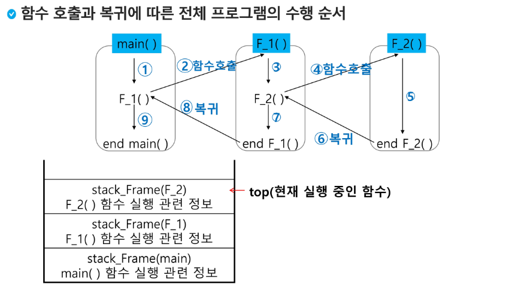
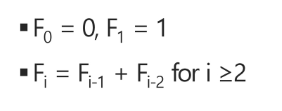

# 8.9-10

## 스택(STACK) = 선형 후입선출 자료구조

* 자료를 쌓아 올린 형태의 자료구조
* 스택에 저장된 자료는 선형 구조를 갖는다.
  * 선형구조 : 자료 간의 관계가 1대1의 관계
  * 비선형구조 : 자료 간의 관계가 1대N의 관계를 갖는다. (ex :Tree)
* 가변형 자료형 : 스택에 자료를 삽입하거나 꺼낼 수 있다.
* 후입선출 : 마지막에 삽입한 자료가 가장 먼저 꺼내짐.

### 스택의 구현

* 자료구조 : 자료를 선형으로 저장할 저장소
  * 배열을 사용할 수 있다.
  * 저장소 자체를 스택이라 부르기도함.
  * 스택에서 마지막 삽입된 원소의 위치를 top이라 부른다.

+ 연산
  * 삽입 : 저장소에 자료를 저장한다. 보통 push 라 부른다.
  * 삭제 : 저장소에서 자료를꺼낸다. 가장 마지막에 삽입된 자료부터 나오며 pop이라 부른다.
  * 스택이 공백인지 아닌지 확인하는 연산 = isEmpty
  * 스택의 top에 있는 item(원소)을 반환하는 연산 = peek

* 

```py
# 스택의 push 알고리즘
# append 메소드를 통해 리스트의 마지막에 데이터 삽입
def push(item):
    s.append(item)

```

```py
#참고
def push(item, size):
    global top
    top += 1
    if top == size:
         print('overflow!')
    else:
         stack[top] = item

size = 10
stack = [0] * 10
top = -1

push(10, size)
top += 1 	# push(20)
stack[top] = 20	# 
```

```py
# 스택의 pop 알고리즘
def pop():
    if len(s) == 0:
         # underflow
         return
    else: 
         returen s.pop();

```

```py
#참고
def pop() :
        global top
        if top == -1 :
                print('underflow')
                return 0
        else:
                top -= 1 
                return stack[top+1]

print(pop())

if top > -1:    #pop( )
          top -= 1
          print(stack[top+1])
```

```py
# 수업실습1
stack = [0] * 10
top = -1

top += 1    # push(1)
stack[top] = 1
top += 1    # push(2)
stack[top] = 2
top += 1    # push(3)
stack[top] = 3

print(stack[top])
top -= 1
top -= 1
print(stack[top+1])
```

### 스택 구현 고려사항

* 1차원배열로 구현시 구현이 용이하나, 스택의 크기 변경이 어렵다.
* 동적으로 할당하여 스택을 구현하면 구현은 복잡하나 메모리를 효율적으로 사용할 수 있다.

### 스택의 응용

* 괄호검사 : 괄호의 왼쪽이 입력되고, 오른쪽과 만나면 pop 되어 스택에 왼쪽 괄호가 남아있지 않아야함.
  * 스택시작시 왼쪽괄호 삽입으로 무조건 들어있고, 마지막 조사후엔 스택이 비어있어야함.

+ function call : 프로그램에서의 함수 호출과 복귀에 따른 수행 순서를 관리

  * 후입선출 특성을 활용하여 수행순서 관리
  * 함수 호출시 수행에 필요한 지역변수, 매개변수, 수행 후 복귀할 주소등의 정보를 스택 프레임(stack frame (top) )에 저장하여 시스템 스택에 삽입
  * 함수의 실행이 끝나면 시스템 스택의 top 원소(스택 프레임)을 삭제(pop)하면서 프레임에 저장된 복귀 주소를 확인하고 복귀.
  * 이 과정이 반복되고 전체 프로그램 수행이 끝나면 시스템 스택은 공백이 됌.

  + 

### 재귀호출

* 자기 자신을 호출하여 순환 수행되는 것.
* 재귀호출 방식을 사용하여 함수 작성시 프로그램의 크기가 줄고 간단하게 작성가능.

#### factorial (팩토리얼)

* 1부터 n까지의 모든 자연수를 곱하는 연산
* n! = n * (n-1)!

+ 마지막에 구한 하위 값을 이용하여 상위값을 구하는 작업반복

* 

#### 피보나치 수열

* 0과 1로 시작하고 두수의 합을 다음 항으로 하는 수열을 피보나치 수열이라 함.
  + 0, 1, 1, 2, 3, 5, 8, 13, 21, ~

+ 피보나치 수열의 i 번째 값을 계산하는 함수 F 를 정의한다면
  * 

* 위 정의로부터 피보나치 수열의 i번째 항을 반환하는 함수를 재귀함수로 구현할 수 있다.

```py
def fibo(n):
    if n < 2:
         return n
    else:
         return fibo(n-1) + fibo(n-2)
```

#### 메모이제이션( memoization )

* 피보나치 수열을 재귀함수로 구하는 것은 " 엄청난 중복 호출" 이 존재한다.

+ 

* 메모이제이션은 컴퓨터프로그램을 실행할 때, 이전에 계산한 값을 메모리에 저장해서 매번 다시 입력하지 않도록 하여 전체적인 실행속도를 빠르게 하는 기술이다. 동적 계획법의 핵심이 되는 기술이다.

+ 앞의 예에서 피보나치 수를 구하는 알고리즘에서 fibo(n)의 값을 계산하자마자 저장하면(memoize), 실행시간을 Θ(n)으로 줄일 수 있다.

```py
# 메모이젱션 방법을 적용한 알고리즘

# memo를 위한 배열을 할당하고, 모두 0으로 초기화한다;
# memo[0]을 0으로 memo[1]은 1로 초기화한다;

def fibo1(n):
    global memo
    if n >= 2 and memo[n] == 0:
         memo[n] = (fibo1(n-1) + fibo1(n-2))
    return memo[n]

memo = [0] * (n+1)
memo[0] = 0
memo[1] = 1
```

```py
# swea 4869 종이붙이기  // 재귀함수 풀이 = > 규칙성을 찾아서 함수 만들기!!
def paper(N):
    if N == 10:
        return 1
    elif N == 20:
        return 3
    else:
        return paper(N-10)+ (2*paper(N-20))

T = int(input())
for tc in range(1, T+1):
    N = int(input())
    cnt = paper(N)
    print(f'#{tc} {cnt}')


# swea 4866 괄호검사  // 스택
def stack(text):
    stack=[]
    for i in text:
        if i == "{" or i =="(":
            stack.append(i)
        elif stack and i == "}" and stack[-1] == "{":   # 스택이 비어있지 않고, 조건을 충족할시
            stack.pop()
        elif stack and i == ")" and stack[-1] == "(":
            stack.pop()
        elif i == "}" or i == ")":
            stack.append(i)

                # 파이썬 내부에서 0이 False고 나머지는 True, 고로
    if stack:   # 리스트 비어 있으면 False, 안 비어 있으면 True 반환
        return "0"  # 스택이 비어있지 않는 경우
    else:
        return "1"  # 비어있는 경우 1 출력

T = int(input())
for tc in range(1, T+1):
    text = input()
    result = stack(text)
    print(f'#{tc} {result}')


강사님 기출 왼쪽, 오른쪽 이동 // 리스트를 한정적으로 생각하지말고 더 추가해서 넣은다음에 삭제한다고 생각하기.
arr = [3, 5, 1, 9, 7]
for _ in range(4):
    w = input()
    if w == 'R':
        a = arr.pop()
        arr[4] = arr[3]
        arr[3] = arr[2]
        arr[2] = arr[1]
        arr[1] = arr[0]
        arr[0] = a
    elif w == 'L':
        b = arr[0]
        arr[0] = arr[1]
        arr[1] = arr[2]
        arr[2] = arr[3]
        arr[3] = arr[4]
        arr[4] = b

print(arr)

## 강사님 풀이
arr = [3, 5, 1, 9, 7]
T = [(input()) for _ in range(4)]

def Right(lst):
    # 리스트 뒤쪽에 있는 앞의 4개의 원소추가
    for i in range(4):
        lst.append(lst[i])
    # 리스트 앞쪽의 4개의 요소제거
    for _ in range(4):
        lst.pop(0)

def left(lst):
    lst.append(lst[0])
    lst.pop(0)

for i in range(4):
    if T[i] =='R':
        Right(arr)
    if T[i] == 'L':
        left(arr)
print(*arr)


# 강사님 기출 _ 이진수로 만들기 // 재귀함수
'''
자연수 N을 입력받고 재귀호 출을 사용해 N을 2진수로 만드는 코드를 작성하시오
'''
N = int(input())
def bianry(N):
    if N == 1:
        return '1'
    elif N == 0:
        return '0'
    if N >= 2:
        a = N // 2
        b = N % 2
        return bianry(a) + str(b)
result = bianry(N)
print(result)

## 승희 풀이
def binary(N):
    if N == 1:
        print('1', end = '')
        return
    if N == 0:
        print('0', end = '')
        return
    binary(N // 2)
    print(N % 2, end = "")

N = int(input())
binary(N)

# 강사님 기출 _ 콜라츠 추측
'''
콜라츠 추측은 특정 자연수가 아래의 과정을 거치면 무조건 1 이 된다는 추측이다.
1. 어떤수가 짝수면 2로 나눈다.
2. 어떤수가 홀수면 3을 곱하고 1을 더한다.
3. 어떤수가 1이 아니라면 조건1,2를 반복한다.

주어진 자연수 N이 1디 될때까지 몇번 거쳐야 하는지 출력하는 프로그램을 작성하시오.
'''

N =int(input())
cnt = 0
def collatz(N, cnt):
    if N != 1:        # 이 조건없이 해도 가능함 대신 N=1일때를 elif로
        if N % 2 == 0:
            a = N // 2
            cnt += 1
            return collatz(a, cnt)
        else:
            a = (N * 3) + 1
            cnt += 1
            return collatz(a, cnt)
    if N == 1:
        return cnt

print(collatz(N, cnt))


# 강사님 기출 _ 자리의 합
N = int(input())
result = 0
def Num_sum(N, result):
    a = N % 10
    b = N // 10
    result += a
    if b == 0:
        return result
    return Num_sum(b, result)

print(Num_sum(N, result))


# 강사님 기출 _ 다섯 종류의 숫자카드
# 백트래킹 : 가능한 모든 경로를 탐색하되, 특정조건을 만족하지 않는 경로는 건너뛰는 방식으로 문제해결 ex) continue
N = list(input())
cnt = 0
arr = []

# while True:
for i in range(5):
    arr.append(N[i])
    for j in range(5):
        arr.append(N[j])
        for k in range(5):
            arr.append(N[k])
            for l in range(5):
                arr.append(N[l])

                for m in range(2):
                    if (int(arr[m]) - int(arr[m + 1])) <= 3 and (int(arr[m]) - int(arr[m+1])) >= -3:
                        cnt += 1
                    else:
                        continue

print(cnt)

# 강사님 풀이
card = list(input())
cnt = 0
path = [0] * 4
    global cnt
    # 4장의 카드를 뽑았으면 경우의 수 증가
    if level == 4:
        cnt += 1
        return # 재귀 함수 호출 종료

    for i in range(5): # 다섯개의 카드 중 선택
        path[level] = card[i] # 현재 레벨 경로에 선택한 카드 저장
        # 연속된 카드간의 차이가 4이상이면 다음카드를 선택 => 백트래킹
        if int(path[level]) - int(path[level -1 ]) >= 4:
            continue
        if int(path[level -1 ]) - int(path[level]) >= 4:
            continue
        # 다음 레벨로 재귀 호출
        card_cnt(level + 1)

card_cnt(0)  # 시작 level 은 0
print(cnt)

# 승희 풀이
N = list(input().strip())

# 뽑은 카드가 유효한지 확인
def isvalid(result):
    # 1115
    for i in range(3):
        if abs(int(result[i]) - int(result[i+1])) > 3:
            return False
    return True

# 중복 순열 만들기
def comb(start):
    global cnt
    if len(result) == 4:
        if isvalid(result):
            cnt += 1
        return

    for i in range(start, len(N)):
        result.append(N[i])
        comb(0)
        result.pop()


result = []
cnt = 0
comb(0)
print(cnt)
```

## DP ( Dynamic Programming )

* 동적계획(DP) 알고리즘은 그리디 알고리즘과 같이 **"최적화 문제"** 를 해결하는 알고리즘이다.

+ 입력 크기가 작은 부분 문제들을 모두 해결하고 그것을 이용해 큰 크기의 부분 문제들을 해결하여, 최종적으로 원래 주어진 입력의 문제를 해결하는 알고리즘
+ DP가 재귀 함수 같이 큰문제 안에 작은 여러문제로 나눠질 수 있을때 중복되는 부분문제가 많이 있는경우에 메모제이션 하면서 최적화 하는것.
  큰문제안에 여러문제로 생각하며 푸는것 자체는 분할정복에 가까워

##### 피보나치 수 DP적용

* 피보나치 수는 부분 문제의 답으로부터 본 문제의 답을 얻기때문에 최적 부분 구조로 이루어짐.

+ 1. 문제를 부분 문제로 분할
     * Fibo(n) = Fibo(n-1) + Fibo(n-2)
     * Fibo(n-1) = Fibo(n-2) + Fibo(n-3)

* 2. 분할이 끝났으면 가장 작은 부분문제부터 해를 구한다.

+ 3. 그 결과는 테이블에 저장하고 테이블에 저장된 부분문제 해를 이용해 상위 문제의 해를 구한다.

```py
def fibo(n):
    dp = [0] * (n+1)
    dp[0] = 0
    dp[1] = 1
    for i in range(2, n+1):
        dp[i] = dp[i-1] + dp[i-2]

    return dp[n]
```

# 8.10

* DP 구현 방식

  + recursive 방식 : fibo1()

  * iterative 방식 : fibo2()
* 메모이제이션을 재귀적구조에 사용하는 것보다 반복적 구조로 DP를 구현한것이 성능에서 효율적이다.

+ 재귀적 구조는 내부에 시스템 호출 스택을 사용하는 오버헤드가 발생하기 때문이다.

### DFS(깊이 우선 탐색)

+ 비선형구조인 그래프 구조는 그래프로 표현된 모든 자료를 빠짐없이 검색하는 것이 중요

* 깊이 우선 탐색(DFS = Depth First Search)  == Stack

+ 너비 우선 탐색(BFS = Breadth First Search) == Queue

* 갈 수 있는 경로 끝까지 깊게 탐색하고 더이상 갈곳이 없으면 가장 마지막의 갈림길로 돌아와 다시 갈곳이 없을 때까지 갔다가 돌아와 모든 정점을 찾는 순회방법

+ 가장 마지막에 만났던 갈림길의 정점으로 되돌아가 다시 깊이 우선 탐색을 반복하므로 후입선출 구조의 "스택" 선택

##### DFS 알고리즘

* 1. 시작 정점 v를 결정하여 방문.

+ 2. 정점 v에 인접한 정점 중에서 방문하지 않은 정점 w가 있으면 스택에 push 후 정점 w 방문 // 이 과정 계속 반복
+ 2-2. 방문하지 않은 정점이 없으면 탐색 방향을 바꾸기 위해 스택을 pop하여 가장 마지막 방문 정점을 v로 하여 반복

* 3. 스택이 공백이 될 때까지 2) 단계 반복
