# 0913 Django Template system
## Django Template system
+ 데이터 표현을 제어하면서, 표현과 관련된 부분을 담당
+ HTML의 콘텐츠를 변수 값에 따라 바꾸고싶다면?
  + 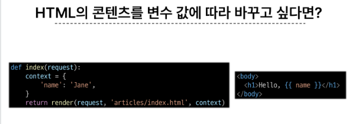
+ Django Template language (DTL)
  + Template에서 조건, 반복, 변수 등의 프로그래밍적 기능을 제공하는 시스템
  + DTL Syntax
    1. Variable
       * render 함수의 세번째 인자로 딕셔너리 데이터를 사용
       * 딕셔너리 key에 해당하는 문자열이 template에서 사용 가능한 변수명이 됨
       * dot(.)을 사용하여 변수 속성에 접근할 수 있음
       * {{ variable }}
    2. Filters
       * 표시할 변수를 수정할 때 사용
       * chained가 가능하며 일부 필터는 인자를 받기도 함
       * 약 60개의 bulit on tamplate filters를 제공
       * {{ varable|filter }}
       * {{ name|truncatewords:30 }}
    3. Tags
       * 반복 또는 노리를 수행하여 제어 흐름을 만듦
       * 일부태그는 시작과 종료태그가 필요
       * 약 24개의 bulit in template tags를 제공
       * { % tag % }
       *  
    4. Comments  
       *  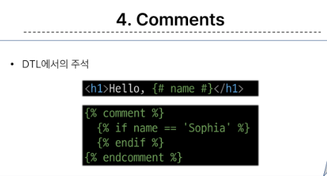
* 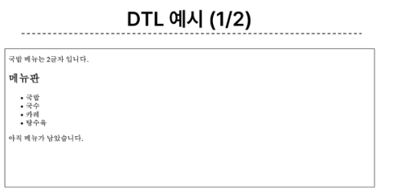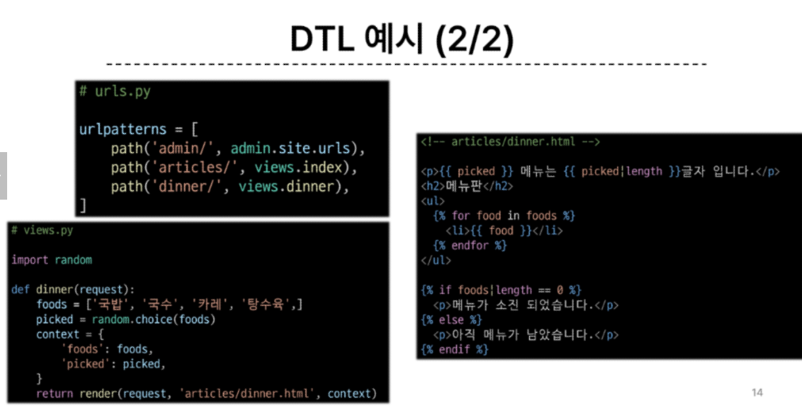
## TEMPLATE 상속
+ template inheritance
+ **페이지의 공통요소를 포함** 하고, **하위 템플릿이 재정의 할 수 있는 공간** 을 정의하는 기본 'skeleton' 템플릿을 작성하여 상속 구조를 구축
+ 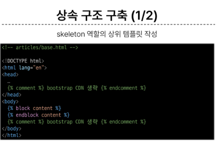
+ 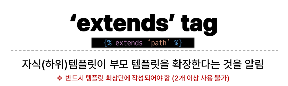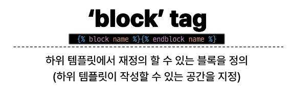
+ 

## HTML form(요청과 응답)
### 데이터를 보내고 가져오기
+ HTML form element를 통해 사용자와 어플리켕션 간의 상호작용 이해하기
+ HTML form은 HTTP 요청을 서버에 보내는 가장 편리한 방법
  + 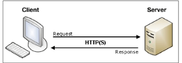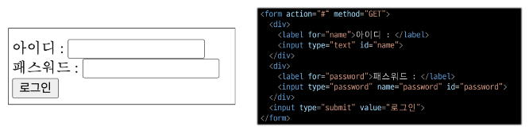
#### 'form' element
+ 사용자로부터 할당된 데이터를 서버로 전송
  + 웹에서 사용자 정보를 입력하는 여러 방식(text, password, checkbox 등 )을 제공
  + 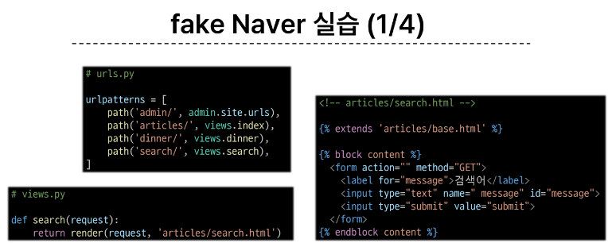 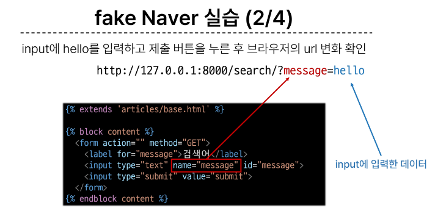 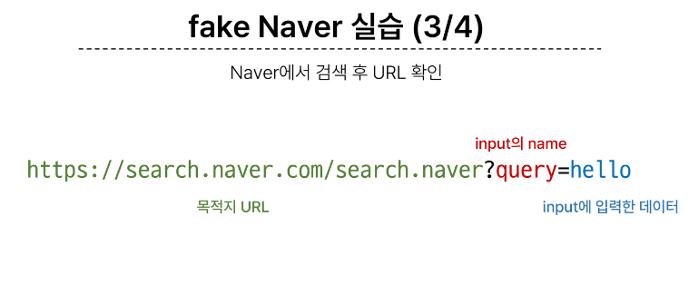 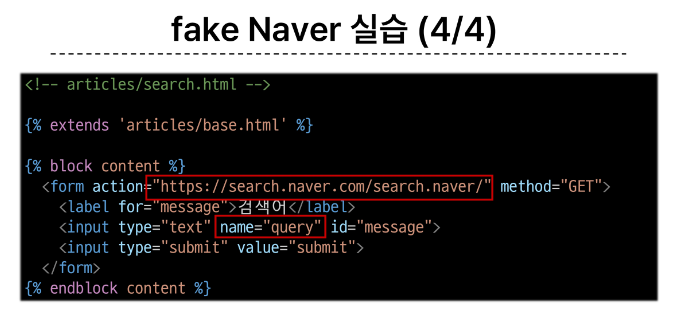
+ 'action' & 'method'
  + form의 핵심 속성 2가지
  + 데이터를 어디(action)로 어떤 방식(method)으로 요청할지
  + action ( 가장 필수 요소 )
    + 입력 데이터가 전송될 URL 지정( 목적지 )
    + 만약 이 속성을 지정하지 않으면 데이터는 현재 form이 있는 페이지의 URL로 보내짐
  + method
    + 데이터를 어떤 방식으로 보낼 것 인지 정의
    + 데이터의 HTTP request methods(GET, POST)를 지정
 
+ 'input' element
  + 사용자의 데이터를 입력 받을 수 있는 요소
  + type속성 값에 따라 다양한 유형의 입력 데이터를 받음

+ 'name' attribute
  + input의 핵심 속성!
  + 입력한 데이터에 붙이는 이름(key)
  + 데이터를 제출했을 때 서버는 name 속성에 설정된 값을 통해서만 사용자가 입력한 데이터에 접근할 수 있음

+ 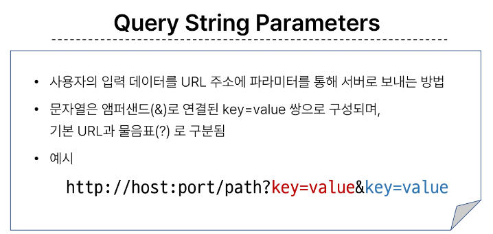

### form 활용
* 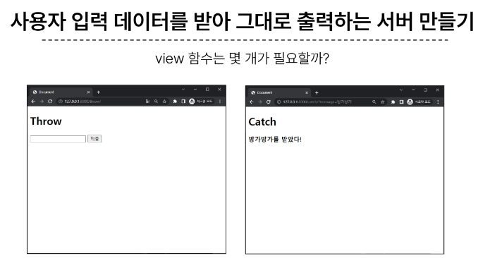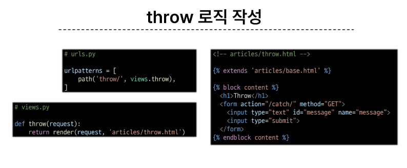
* HTTP request 객체
  * form으로 전송한 데이터 뿐만 아니라 모든 요청 관련 데이터가 담겨 있음
  * (view 함수의 첫번째 인자)
+ 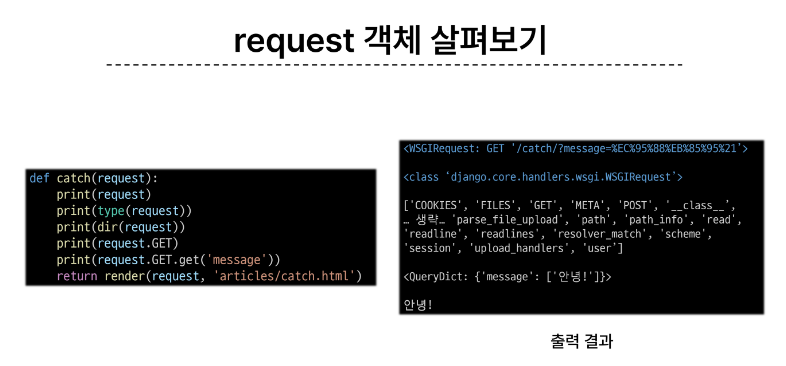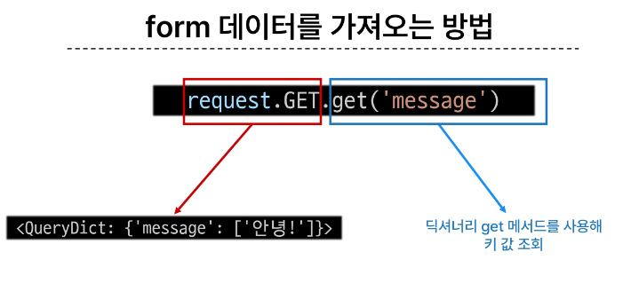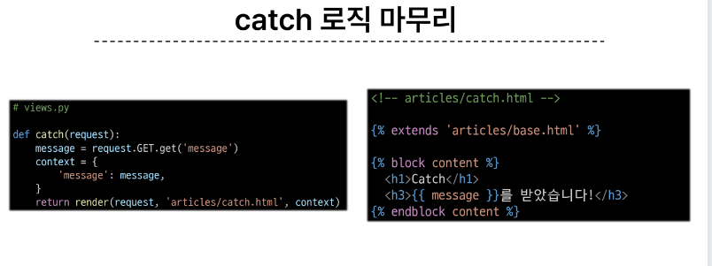
  

#### 참고
+ DIRS : 템플릿 디렉토리의 경로 목록
+ BASE_DIR : 프로젝트 기본 디렉토리 경로
+ 이를 활용해서 최상단에 위치한 base.html을 추가하기 
  + 기존에 app내에 있던 base가 겹친다면 추가
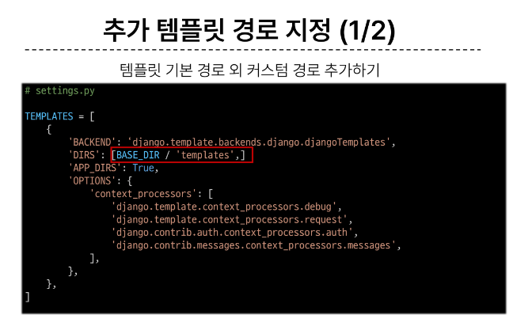 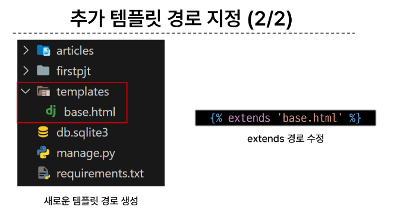 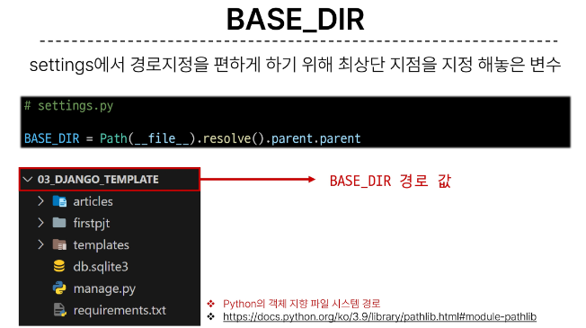 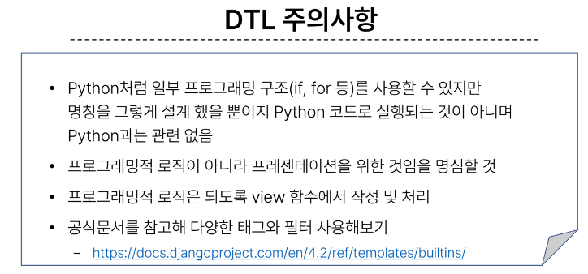

## Django URLs
+ 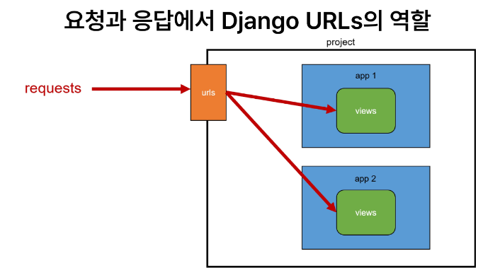
+ URL dispatcheer
  + 운항관리자, 분배기
  + URL 패턴을 정의하고, 해당 패턴이 일치하는 요청을 처리할 view 함수를 연결(매핑)

### 변수와 URL
+ 현재 URL관리의 문제점
  + 템플릿의 많은 부분이 중복되고, URL의 일부만 변경되는 상황이라면 계속해서 비슷한 URL과 템플릿을 작성해 나가야 할까?
 

+ Variable Routing
  + URL 일부에 변수를 포함시키는 것
  + (변수는 view함수의 인자로 전달 할 수 있음)

+ Variable Routing 작성법
+ 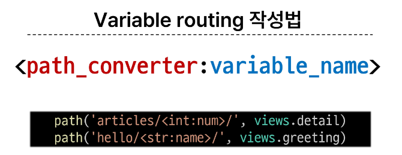 
+ /<path_converter:variable_name >/  <타입:이름>
+ path converters
  + URL 변수의 타입을 지정
  + str, int 둥 5가지 타입 지원
+ 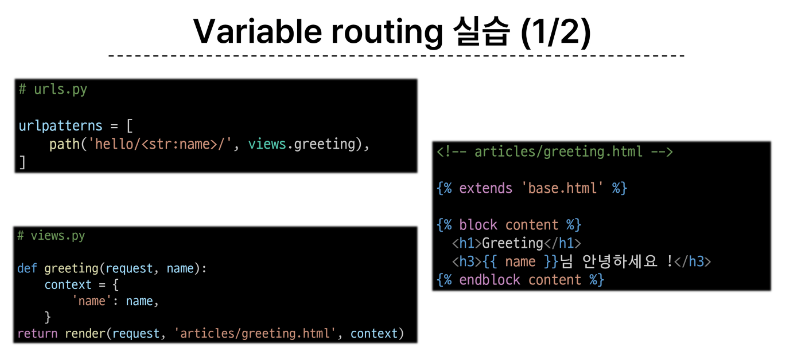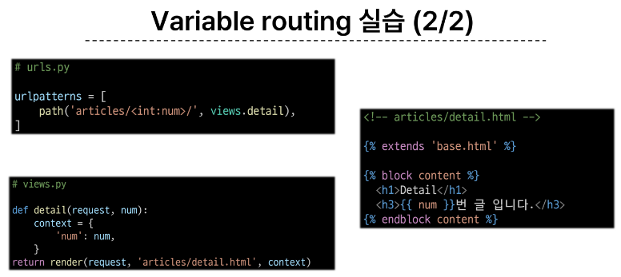

### APP과 URL
+ App URL mapping
  + 각 앱에 URL을 정의하는 것
  + 프로젝트와 각 앱이 URL을 나누어 관리를 편하게 하기 위함
+ 2번째 앱 pages 생성 후 발생할 수 있는 문제
  + view 함수 이름이 같거나 같은 패턴의 url 주소를 사용하게 되는 경우
  + 아래 코드와 같이 해결할 수 있으나 더 좋은 방법이 필요
  + ==>> URL을 각자 app에서 관리하자!
  + 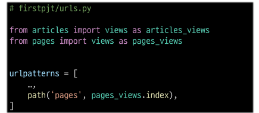
+ 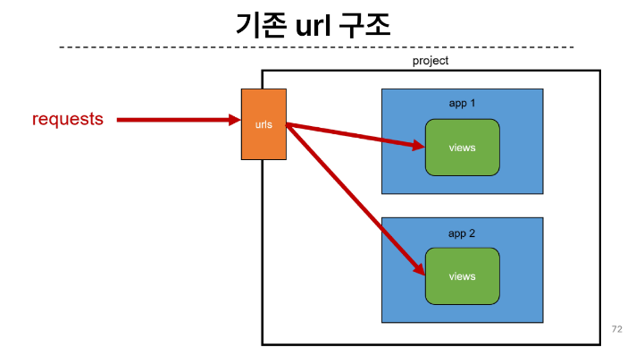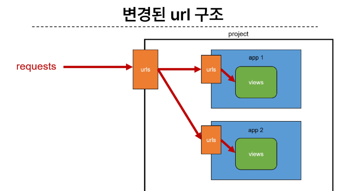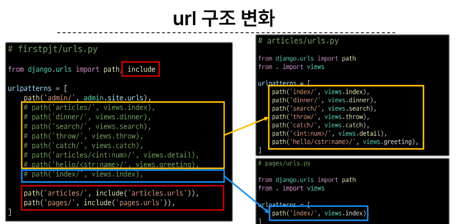
 

+ include()
  + 프로젝트 내부 앱들의 URL을 참조할 수 있도록 매핑하는 함수
  + URL의 일치하는 부분까지 잘라내고 남은 문자열 부분은 후속처리를 위해 include된 URL로 전달
+ 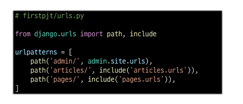

#### URL 이름지정 name
+ url 구조 변경에 따른 문제점
  + 기존 'articles/' 주소가 'articles/index/'로 변경됨에 따라 해당 주소를 사용하는 모든 위치를 찾아가 변경해야 함
  + URL에 이름을 지어주는 것으로 해결
  + 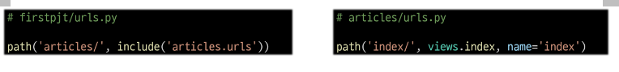
 
  
+ Naming URL patterns
  + url에 이름을 지정하는 것
  + path 함수의 name 키워드 인자를 정의해서 사용
  + 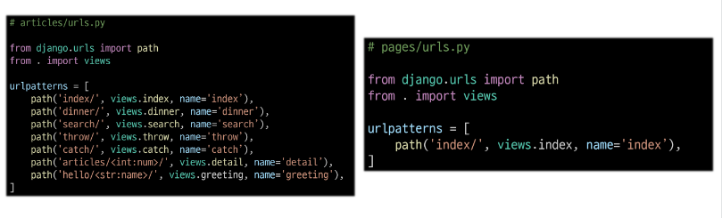
  + name = ' ' 이라 사용하여 이름을 지정 
 

+ url 표기 변화
  + href 속성값 뿐만 아니라 form의 속성처럼 url을 작성하는 모든 위치에서 변경
  + 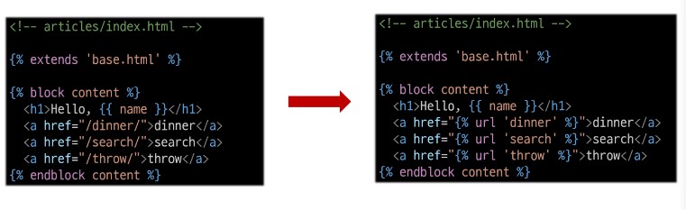
  +  으로 변경
+ url tag
  + 
  + 주어진 url 패턴의 이름과 일치하는 절대 경로 주소를 반환

#### URL 이름 공간
+ url 이름 지정 후 남은 문제
  + articles 앱의 url 이름과 pages 앱의 url 이름이 같은 상황
  + 단순히 이름만으로 완벽하게 구분할 수 없으니 key(성)을 붙이는 것으로 해결
  + 'app_name' 속성 지정하여 변수값을 설정
    + 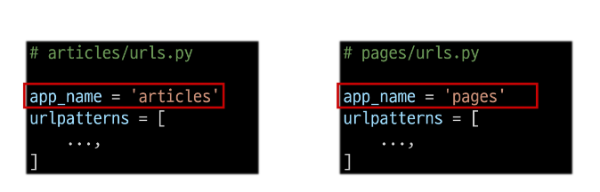

#### URL태그의 최종 변화
+ 
+ {% url 'app_name:url-name'}

#### 참고
+ 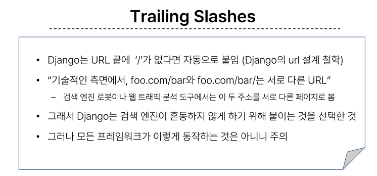