# 0914 Django Model
## Model
+ Model을 통한 DB(데이터베이스) 관리
+ 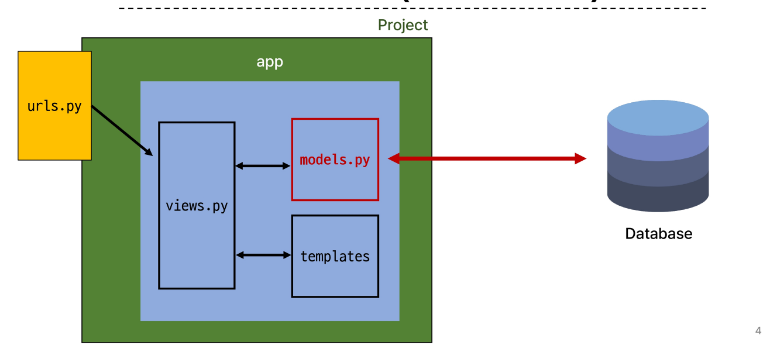
+ Django Model
  + DB의 테이블을 정의하고 데이터를 조작할 수 있는 기능들을 제공
    + 테이블 구조를 설계하는 '청사진(blueprint)'
<br>

+ model 클래스 작성
  + 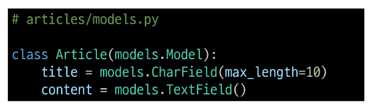
  + ```py
        # 상속 (models 모듈, Model클래스)
        class Article(models.Model):
            # CharField 클래스, TextField 클래스
            title = models.CharField(max_length=10)
            content = models.TextField()
    ```
+ model 클래스 살펴보기
  + 작성한 모델클래스는 최종적으로 DB에 다음과 같은 테이블 구조를 만듦
    + 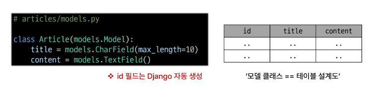
    + id 필드는 Django가 자동 생성한다.
    + django.db.models 모듈의 Model이라는 부모 클래스를 상속받음
    + Model은 model에 관련된 모든 코드가 이미 작성 되어있는 클래스
    + 개발자는 가장 중요한 테이블 구조를 어떻게 설계할지에 대한 코드만 작성하도록 하기 위한 것(프레임워크의 이점)
  + 클래스 변수명
    + 테이블의 각 "필드(열) 이름"
    + 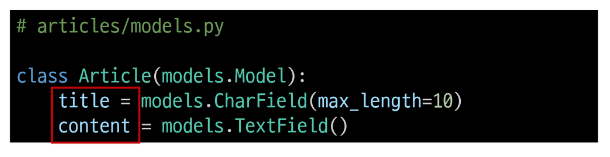
  + model Field클래스
    + 테이블 필드의 "데이터 타입"
    + 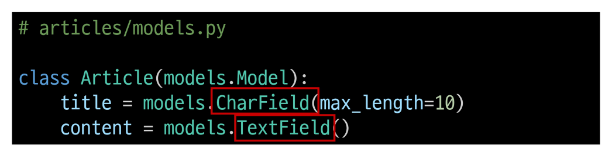
  + model Field 클래스의 키워드 인자(필드 옵션)
    + 테이블 필드의 "제약 조건" 관련 설정
    + 
    + 제약 조건
      + 데이터가 올바르게 저장되고 관리되도록 하기 위한 규칙
      + Ex) 숫자만 저장되도록, 문자가 100자까지만 저장되도록 하는 등

### Migrations
+ model 클래스의 변경사항(필드생성, 수정삭제 등)을 DB에 최종 반영하는 방법
+ Migrations 과정
  + 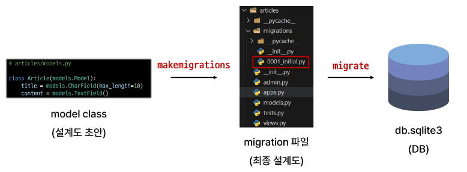
+ Migrations 핵심명령어 (매우 중요!!)
  + **makemigrations**
    + model class를 기반으로 최종 설계도(migration) 작성
  + **migrate**
    + 최종설계도(migration)를 DB에 전달하여 반영
    + 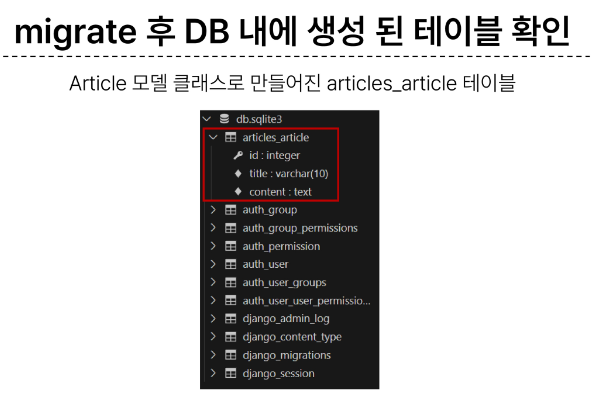

#### 추가 Migrations
+ 이미 생성된 테이블에 필드를 추가해야 한다면?
  + 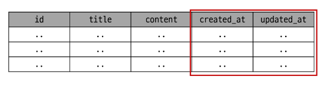
+ 추가 모델 필드 작성
  + 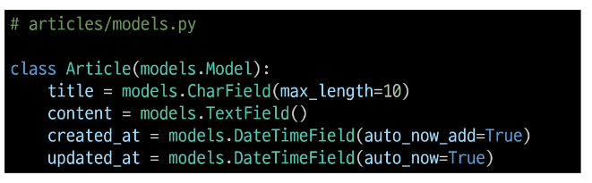
  + 이미 기존 테이블이 존재하기 때문에 필드를 추가할 때 필드의 기본 값 설정이 필요
  + 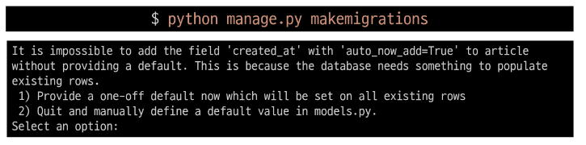
  + 1번은 현재 대화를 유지하면서 지접 기본값을 입력하는 방법(이것으로 선택)
  + 2번은 현재 대화에서 나간 후 model.py에 기본 값 관련 설정을 하는 방법
  + 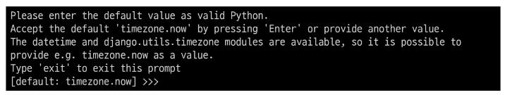
  + 추가하는 필드의 기본 값을 입력해야 하는 상황
  + 날짜 데이터이기 때문에 직접 입력하기보다 Django가 제안하는 기본 값을 사용하는 것을 권장
  + 아무것도 입력하지 않고 enter를 누르면 Django가 제안하는 기본 값으로 설정됨
  + 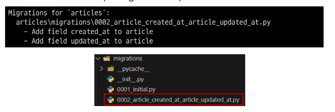
  + migrations 과정 종료 후 2번째 migration 파일이 생성됨을 확인
  + 이처럼 Django는 설계도를 쌓아가면서 추후 문제가 생겼을 시 복구하거나 되돌릴 수 있도록 함(마치 'git commit')
  + 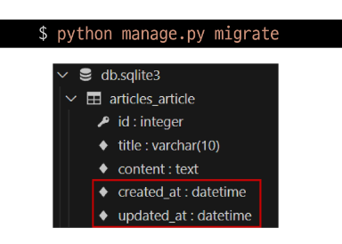
  + migrate 후 테이블 필드 변화 확인
  + db.splite3에 우클릭하여 데이터베이스 오픈하여 확인
##### model class에 변경사항(1)이 생겼다면, 반드시 새로운 설계도를 생성(2)하고 이를 DB에 반영(3)해야 한다.
1. model class 변경
2. makemigrations
3. migrate

### Model Field
+ DB 테이블의 필드(열)을 정의하며, 해당 필드에 저장되는 데이터 타입과 제약조건을 정의
+ CharField()
  + 길이의 제한이 있는 문자열을 넣을 때 사용
  + max_length = 는 필수 인자
+ TextField()
  + 글자의 수가 많을 때 사용
+ DataTimeField()
  + 날짜와 시간을 넣을 때 사용
  + auto_now 
    + 데이터가 저장될 때마다 자동으로 현재 날짜시간을 저장
  + auto_now_add
    + 데이터가 처음 생성될 때만 자동으로 현재 날짜시간을 저장

## Admin site
+ Automatic admin interface
  + Django는 추가 설치 및 설정 없이 자동으로 관리자 인터페이스를 제공
  + 데이터 확인 및 테스트 등을 진행하는데 매우 유용

+ admin 계정 생성
  + python manage.py createsuperuser
  + email은 선택사항이기 때문에 입력하지 않고 진행 가능
  + 비밀번호 입력시 보안상 터미널에 출력되지않으니 무시하고 입력하기
  + DB의 auth_user에서 생성된 admin계정 확인 가능

+ admin에 모델클래스 등록
  + admin.py에 작성한 모델 클래스를 등록해야만 admin site에서 확인 가능
  + 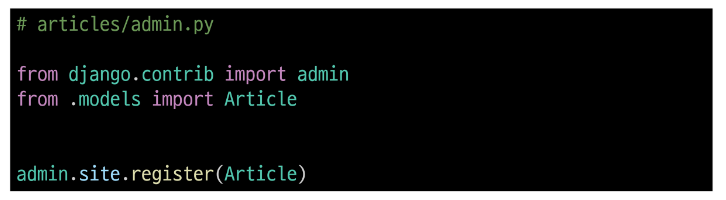

### 참고
+ 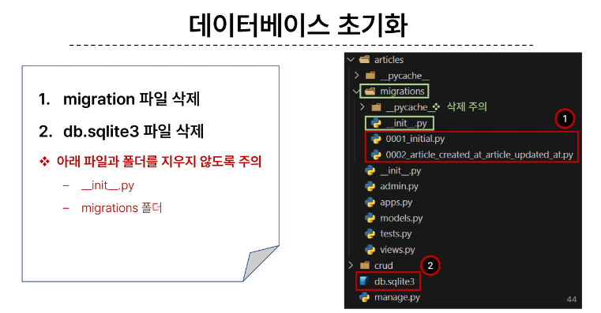
+ Migration 기타 명령어
  + python manage.py showmigrations
    + migrations 파일들이 migrate 됐는지 안됐는지 여부를 확인하는 명령어
    + [X]표시가 있으면 migrate가 완료되었음을 의미
  + python manage.py sqlmigrate articles 0001
    + 해당 migrations 파일이 sql언어(db에서 사용하는 언어)로 어떻게 번역 되어 DB에 전달되는지 확인하는 명령어

+ 첫 migrate 시 출력 내용이 많은 이유는?
  + Django 프로젝트가 동작하기 위해 미리 작성되어 있는 기본 내장 app들에 대한 migration 파일들이 함께 migrate 되기 때문

+ SQLite
  + 데이터베이스 관리 시스템 중 하나이며 Django의 기본 데이터베이스로 사용됨
  + 파일로 존재하며 가볍고 호환성이 좋음

+ CRUD
  + 소프트웨어가 가지는 기본적인 데이터 처리 기능
  + Create  저장
  + Read  조회
  + Update  갱신
  + Delete  삭제


# 승희 정리
## Intro, Design Pattern

- Django를 배웠는데 프레임워크는 뭘까?

> Django는 웹 개발을 위한 파이썬 기반의 프레임워크입니다. 프레임워크는 개발을 보다 효율적으로 진행하기 위해 필요한 도구와 라이브러리의 집합체입니다.

- 가상환경은 왜 만들고, 의존성 파일은 왜 만들까?

> 가상환경은 프로젝트마다 독립된 파이썬 환경을 구성하여 의존성 충돌을 방지하고, 프로젝트에 필요한 패키지를 관리하는데 사용됩니다. 의존성 파일은 해당 프로젝트에서 사용하는 외부 패키지와 버전 정보를 기록하여 다른 환경에서도 동일한 패키지 버전을 사용할 수 있도록 합니다.

- urls.py, settings.py, views.py 의 각각의 역할은 무엇인가? MTV패턴과 연관지어 생각해보기

> urls.py 파일은 URL 매핑을 담당하고, settings.py 파일은 Django 설정과 관련된 정보를 포함합니다. views.py 파일은 클라이언트 요청에 대한 처리 로직과 데이터베이스 조작 등의 역할을 담당합니다. 이들은 MTV(Model-Template-View) 패턴에서 각각 URL 매핑, 설정 및 모델 정의, 그리고 클라이언트에게 보여질 결과물 생성 등의 역할과 연관되어 있습니다.

- git 사용할때 git ignore은 왜 필요할까?

> git ignore 파일은 Git 저장소에 포함시키지 않아야 할 파일들을 지정하는데 사용됩니다. 이는 보안 정보나 임시/중간 파일 등 저장소에 올라가면 안 되는 내용들을 제외하기 위해 필요합니다.

## Django Template & URLs

-  템플릿 상속을 하는 이유는 무엇일까?

> 템플릿 상속은 코드 재사용과 유지보수를 용이하게 하기 위해 사용됩니다. 공통된 부분(레이아웃, 헤더 등)을 부모 템플릿으로 정의하고, 자식 템플릿에서 해당 부분만 추가 또는 수정하여 사용할 수 있습니다.

- html에는 로직이 들어갈 수 없다고 했는데 DTL은 어떻게 사용할 수 있는가?

> HTML에서 로직 처리를 할 수 없는 것은 웹 애플리케이션의 구조상 서버 사이드에서 처리되어야 하기 때문입니다. DTL(Django Template Language)은 Django가 제공하는 템플릿 언어로, HTML 문서 내에서 서버 사이드 로직(조건문, 반복문 등)을 실행하거나 변수 값을 출력하는 등의 작업을 할 수 있도록 합니다.

- form 태그에서 query란 무엇인가? 데이터 베이스의 query와의 차이는 무엇인가?

> form 태그에서 query란 입력 데이터를 전달하기 위한 매개변수 이름입니다. 데이터베이스의 query와는 다르며, 여기서는 클라이언트가 서버로 전송하는 요청 데이터를 의미합니다.

- GET방식과 POST 방식의 차이

> GET 방식과 POST 방식 모두 HTTP 요청 메서드 중 일부입니다. GET 방식은 주소창에 데이터가 노출되며 주로 조회나 검색과 같은 요청에 사용됩니다. POST 방식은 HTTP body에 데이터를 담아 전송하므로 주소창에 데이터가 노출되지 않으며 주로 생성/수정/삭제와 같은 변경 작업에 사용됩니다.

- url mapping은 왜 사용하는 걸까?

> url mapping(혹은 URL 리팩터링)은 URL 경로와 해당 경로를 처리할 뷰 함수 혹인 컨트롤러 간의 연결 작업입니다.

## Django Model

- naming url patterns는 왜 사용하는걸까?

> naming url patterns(혹인 URL 패턴 명명 규칙)는 가독성 및 유지보수 측면에서 중요합니다. 명확하고 일관된 이름 규칙으로 URL 패턴들을 명명함으로써 코드 이해도와 협업 시 발생할 수 있는 오류 예방 및 디버깅 시 용이성 증대 등 다양한 이점을 얻게 됩니다.

- 왜 title은 최대 길이를 10으로 지정할까?

> 일반적으로 제목(title) 필드 길이 제한 설정 시 너무 긴 제목으로 인해 UI 디자인 상 깨짐 현상 및 가독성 저하 문제 예방, 데이터베이스 성능 최적화 차원 (넉넉하지만 너무 큰 문자열 칼럼 비용 절감),
> 
> + 악성 사용자로 인한 문제 발생 예방 등의 다양한 이유

- db.sqlite는 왜 ID의 데이터를 지웠을 때, 그 번호를 다시 사용하지 않을까?

> 데이터 일관성과 참조 무결성을 유지하기 위해서입니다. 삭제된 ID는 재사용하지 않고 새로운 ID를 할당하여 데이터 일관성과 참조 무결성을 유지. 
> django sqlite는 왜 ID의 데이터를 지웠을 때, 그 번호를 다시 사용하지 않을까?

> - 그 id관련되어서 문제가 한 번 있었을 수도 있으니까 그 id를 다시 사용하지 않는 것이 안전하다고 생각해서 

- CRUD란 무엇인가?

> 소프트웨어가 가지는 기본적인 데이터 처리 기능으로 Create, Read, Update, Delete이다


