# 0915 Django ORM
## ORM 
+ Object-Relational-Mapping
+ 객체 지향 프로그래밍 언어를 사용하여 호환되지 않는 유형의 시스템 간에 데이터를 변환하는 기술
+ ORM의 역할
  + 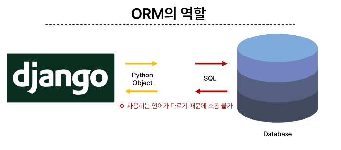
  + 언어가 다른 DB와 django 사이에 ORM이 존재한다

## QuerySet API
+ ORM에서 데이터를 검색,필터링,정렬 및 그룹화 하는데 사용하는 도구
+ API를 사용하여 SQL이 아닌 Python 코드로 데이터를 처리
+ 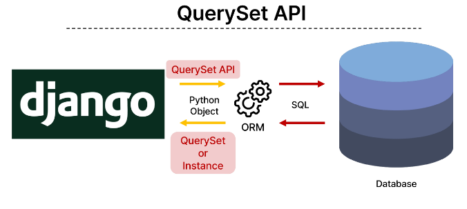
+ QuerySet API 구문
+ 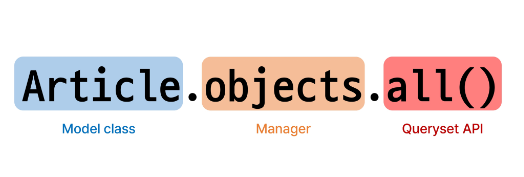
  + > 주로 QuerySet API를 변경하여 사용!
+ Query 
  + 데이터 베이스에 특정한 데이터를 보여달라는 요청
  + "쿼리문을 작성한다"
    + => 원하는 데이터를 얻기 위해 데이터베이스에 요청을 보낼 코드를 작성한다.
  + 파이썬으로 작성한 코드가 ORM에의해 SQL로 변환되어 데이터베이스에 전달되면, 데이터베이스의 응답데이터를 ORM이 QuerySet이라는 자료 형태로 변환하여 우리에게 전달
  + 데이터베이스에게서 전달받은 객체 목록(데이터 모음)
    + 순회가 가능한 데이터로써 1개 이상의 데이터를 불러와 사용할 수 있음
  + Django ORM을 통해 만들어진 자료형
  + 단, 데이터베이스가 단일한 객체를 반환할 때는 QuerySet이 아닌 모델(Class)의 인스턴스로 반환됨

+ > Python의 모델 클래스와 인스턴스를 활용해 DB에 데이터를 저장, 조회, 수정, 삭제하는 것

### 실습
+ create 
  + 외부 라이브러리 설치 및 설정
  + 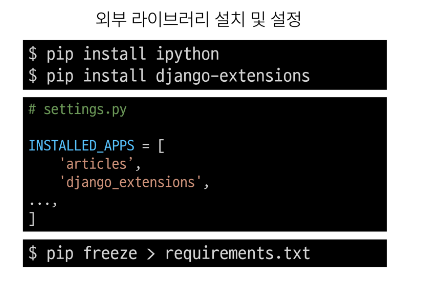
  + > pip install ipython
  + > pip install django-extensions
  + 설치 후 프로젝트의 settings에서 INSTALLED_APPS에 django_extensions 추가하기
    + app 등록 권장 순서
    1. normal app 
       + => articles와 같은 직접만든 앱
    2. thrid party app 
       + => django-extensions와 같은 외부 사용
    3. django app
       + => 이외 django 내부에 깔린 앱
 
 

+ Django shell
  + Django 환경안에서 실행되는 python shell
  + 입력하는 QuerySet API 구문이 Django프로젝트에 영향을 미침
  + 실행문
    + > python manage.py shell_plus
      + 일반적인 shell 도 있지만 직접 import를 다 해주어야 해서 shell_plus를 사용한다.
      + exit 을 사용하여 끝낼 수 있다.

#### 데이터 객체를 만드는 3가지 방법
1. 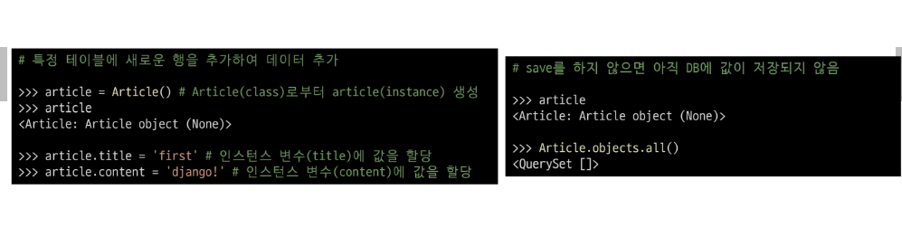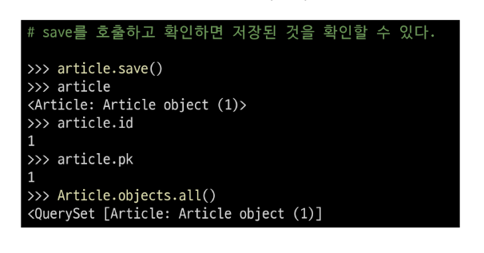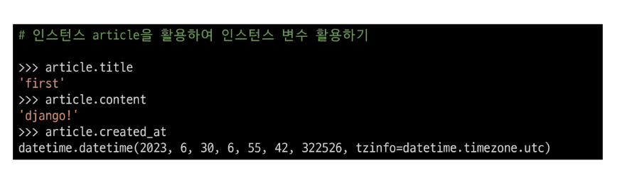
   + article = Article()
   + article.title = "이름" 
   + article.content = "이름"
   + article.save()
   + 
   + article / Article.objects.all() # 생성 확인
   + article.title / article.title / article.created_at # 생성 내용 확인
  
2. 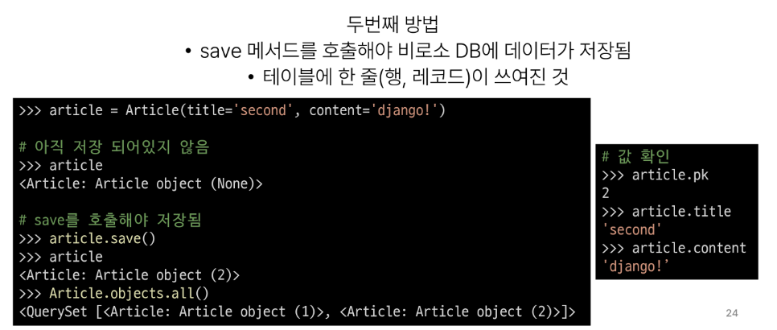 
   + 한번에 저장하는 방법 / 테이블에 한줄(행, 레코드)이 쓰여진 것 
   + article = Article(title='second', content= 'django!' )
   + article.save()
   + article / Article.objects.all() # 생성 확인
3. 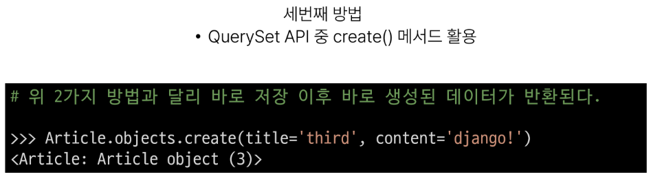
   + 저장 후 바로 생성된 데이터가 반환 save사용X
   + Article.objects.create(title='third', content='django!')
 
 

#### 저장문 (create&save)
+ save()
  + 객체를 데이터베이스에 저장하는 메서드
#### 조회문 read
+ all()
  + 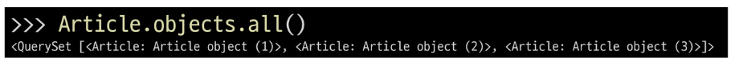
  + Article.objects.all()
  + 전체 데이터 조회
+ get()
  + 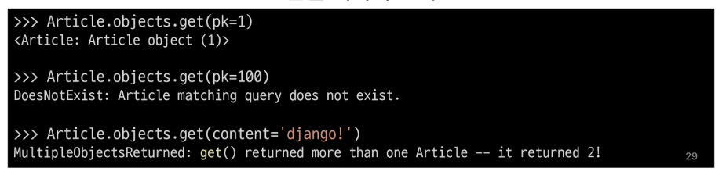
  + Article.objects.get(pk=1)
  + Article.onjects.get(content='django!')
  + 단일 데이터 조회
  + 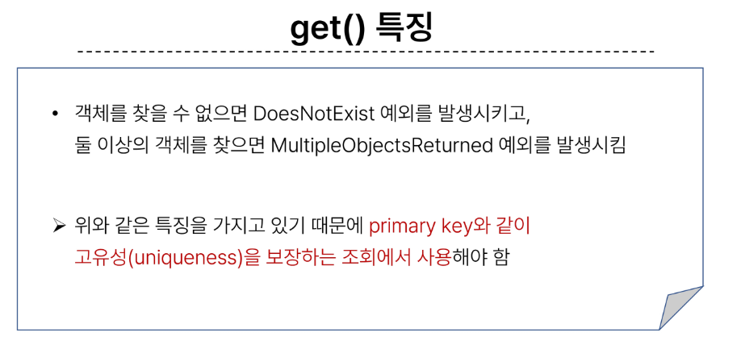
  + pk값을 확실하게 알고 조회할 수 있는 경우에만 사용
+ filter()
  + 
  + Article.objects.filter(content='djanjo!')
  + Article.objects.filter(title='abc')
  + Article.objects.filter(title='second')

#### 수정문 Update
+ 데이터 수정
  + 인스턴스 변수를 변경 후 save 메서드 호출
  + 수정하기 위해선 조회가 먼저 이루어져야함
  + 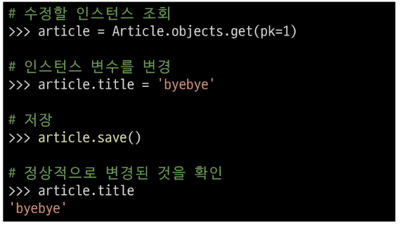
  + article = Article.objects.get(pk=1) # 조회
  + article.title = 'byebye' # 새로운 값 변수에 저장 // 변경
  + article.save() # 저장
  + article.title  # 변경 확인

#### 삭제문 delete
+ 데이터 삭제
  + 삭제하려는 데이터 조회 후 delete 메서드 호출
  + 수정문과 같은 방식
  + 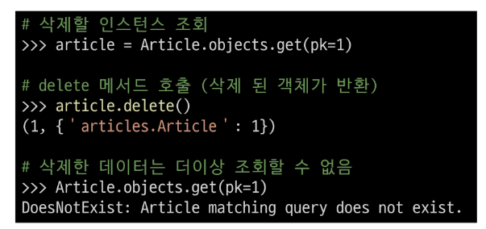
  + article = Article.objects.get(pk=1) # 삭제할 데이터 호출 / 조회
  + article.delete()    # 삭제
  + Article.objects.get(pk=1)   # 조회 되지 않음
  + 조회하는 데이터는 모두 삭제, 전체 삭제도 가능

#### 참고
+ Field lookups
  + 특정 레코드에 대한 조건을 설정하는 방법
  + QuerySet 메서드 filter(), exclude() 및 get()에 대한 키워드 인자로 지정됨
  + 
  + content__contains='조회명'
 

+ ORM, QuertSet API를 사용하는 이유
  + 데이터베이스 쿼리를 추상화하여 Django개발자가 데이터베이스와 직접 상호작용하지 않아도 되도록함
  + 데이터베이스와의 결합도를 낮추고 개발자가 더욱 직관적이고 생산적으로 개발할 수 있도록 도움