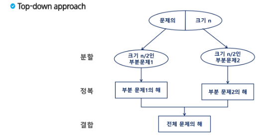
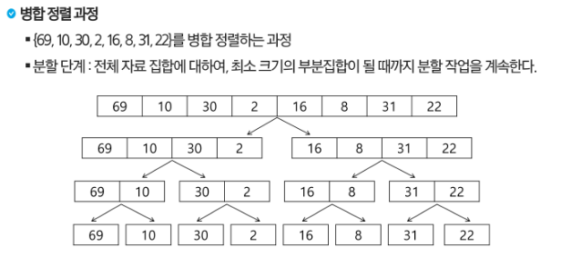
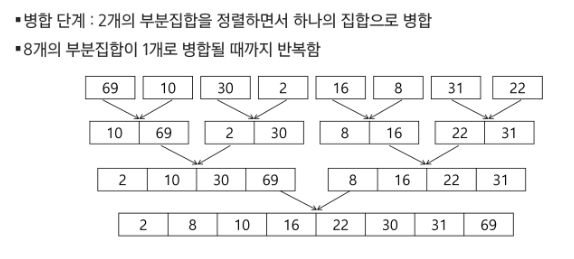
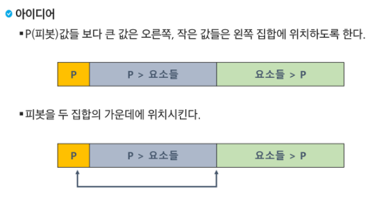
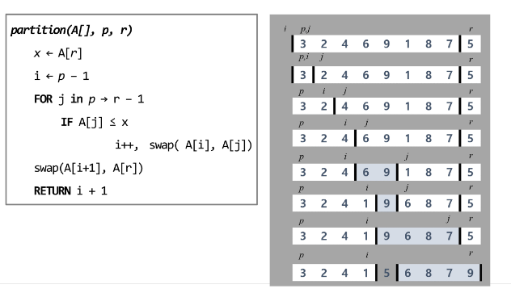
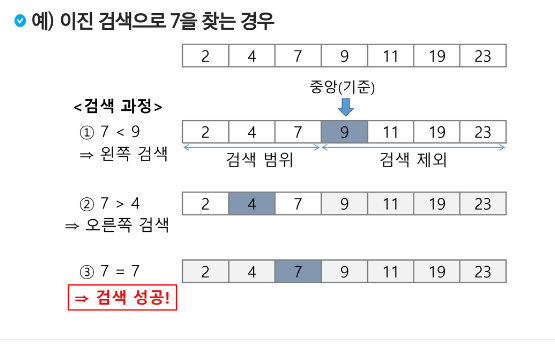
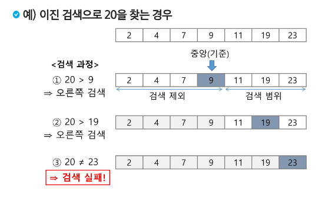

# 0918 응용알고리즘
```
알고리즘 설계 기법의 종류
1. 전체를 다보자 (Brute Force - 완전탐색 )
	- 배열 : 반복문을 다 돌리기
	- 그래프 : DFS, BFS
2. 상황마다 좋은 걸 고르자( Greedy - 탐욕 알고리즘 )
	- 규칙을 찾는 것
	- 주의사항 : 항상 좋은 것을 뽑아도, 최종 결과가 제일 좋다는 보장되지 않는다.
3. 하나의 큰 문제를 작은 문제로 나누어 부분적으로 해결하자(Dynamic Programmig)
	- Memoization 기법을 활용
	- 점화식(bottom-up), 재귀(top-down)
4. 큰 문제를 작은 문제로 쪼개서 해결하자
    (Divide and Conquer - 분할 정복)
5. 전체 중, 가능성 없는 것을 빼고 보자 
    (Backtracking - 백트래킹)
    - 가지치기
```
## 분할 정복
+ 큰문제를 작은문제로 분할하는 기법
+ 퀵 정렬과 병합정렬 + 이진탐색에 대해 학습
+ 설계 전략
  + 분할(Divide) : 해결할 문제를 여러개의 작은 부분으로 나눈다.
  + 정복(Conquer) : 나눈 작은 문제를 각각 해결한다.
  + 통합(Combine) : 해결된 해답을 모은다.
<br>

+ 재귀(Top-down)
 + 
 + 구조가 변하지 않는다 = 재귀
### 병합정렬(Merge Sort)
+ 여러개의 정렬된 자료의 집합을 병합하여 한 개의 정렬된 집합으로 만드는 방식
+ 자료를 최소 단위의 문제까지 나눈 후에 차례대로 정렬하여 최종결과 얻어냄
+ 재귀방식
+ 시간복잡도 : O(n log n)
#### 과정예시
+ 분할 단계 : 전체 자료 집합에 대하여, 최소 크기의 부분집합이 될 때까지 분할 작업을 계속 진행.

+ 병합 단계 : 2개의 부분집합을 정렬하면서 하나의 집합으로 병합, 부분집합이 1개로 병합 될때까지 반복 진행.


### 퀵 정렬
+ 주어진 배열을 두 개로 분할하고, 각각 정렬한다
+ 병합 정렬은 그냥 두 부분을 나누는 반면, 퀵 정렬은 분할할 때, 기준 아이템중심으로, 이보다 작은것은 왼편, 큰것은 오른편에 위치시킨다.
+ 각 부분 정렬 이 끝난후 병합 정렬은 "병합" 과정이 필요하나 퀵 정렬은 필요하지 않다.

#### 호어 파티션 알고리즘

+ 
+ 배열에서 하나의 요소를 피벗으로 선택한다. 피벗은 배열의 첫번째, 마지막, 혹은 중간요소를 선택한다.
+ 피벗을 선택후 피벗을 기준으로 배열을 두 그룹으로 나눈다. 피벗보다 작거나 같은 요소는 왼쪽으로, 큰 요소는 오른쪽으로 이동.
+ 피벗을 기준으로 분할된 두 하위 배열에 대해 재귀적으로 퀵 정렬 수행
  

### 이진검색( 코테 많이 나옴 매우 중요!)
+ 자료의 가운데에 있는 항목의 키 값과 비교하여 다음 검색의 위치를 결정하고 검색을 계속 진행하는 방법
  + 목적 키를 찾을 때까지 이진 검색을 순환적으로 반복 수행함으로써 검색 범위를 반으로 줄역면서 보다 빠르게 검색을 수행함
  + 이진 검색을 하기 위해서는 자료가 정렬된 상태여야한다.

#### 검색과정
1. 자료의 중앙에 있는 원소를 고른다.
2. 중앙 원소의 값과 찾고자 하는 목표값을 비교한다.
3. 목표값이 중앙 원소의 값보다 작으면 자료의 왼쪽 반에 대해서 새로 검색을 수행하고, 크다면 자료의 오른쪽 반에 대해서 새로 검색을 수행한다.
4. 찾고자 하는 값을 찾을때까지 1~3의 과정을 반복한다.

+ 반복구조와 재귀구조로 모두 표현 가능


```
sort(), sorted()
내장 라이브러리가 굉장히 강력!
병합 정렬
- 직접 구현할 일은 적다.
-> 멀티 쓰레드

- 과거에 면접 단골 질문 + 분할 정복 학습에 좋다
= > 코드를 보기전 직접 손으로 써보기

퀵 정렬
- 직접 구현할 일은 적다.
-> 평균적으로 굉장히 좋음( 시간복잡도 : NlogN )
-> 특히, 큰 데이터를 다룰때 좋다.
-> 단점: 역순 정렬 등 최악의 경우 (시간복잡도 : N^2 )

- 과거에 면접 단골 질문 + 분할 정복 학습에 좋다
= > 코드를 보기전 직접 손으로 써보기

이진 검색
- 코딩 테스트의 메인 알고리즘 중 하나
- 목적 : " 원하는 값을 빨리 찾는 것"
- 시간 : O(log N)
- Parametric Search ( 특정 범위 검색 )
 - lower bound
 - upper bound
	- 여러개의 데이터 중 2가 처음 나온 시점
	- 2~9 사이의 데이터는 몇개 인가?
```

#### 로우토 파티션 알고리즘


## 백트래킹
+ 상태 공간 트리의 모든 노드를 검색하는 기법
+ 이진 트리(binary tree)의 특성을 이해하고 이진 트리의 중요한 연산인 탐색, 삽입, 삭제 알고리즘을 학습