# 0918 응용알고리즘
```
알고리즘 설계 기법의 종류
1. 전체를 다보자 (Brute Force - 완전탐색 )
	- 배열 : 반복문을 다 돌리기
	- 그래프 : DFS, BFS
2. 상황마다 좋은 걸 고르자( Greedy - 탐욕 알고리즘 )
	- 규칙을 찾는 것
	- 주의사항 : 항상 좋은 것을 뽑아도, 최종 결과가 제일 좋다는 보장되지 않는다.
3. 하나의 큰 문제를 작은 문제로 나누어 부분적으로 해결하자(Dynamic Programmig)
	- Memoization 기법을 활용
	- 점화식(bottom-up), 재귀(top-down)
4. 큰 문제를 작은 문제로 쪼개서 해결하자
    (Divide and Conquer - 분할 정복)
5. 전체 중, 가능성 없는 것을 빼고 보자 
    (Backtracking - 백트래킹)
    - 가지치기
```
## 분할 정복
+ 큰문제를 작은문제로 분할하는 기법
+ 퀵 정렬과 병합정렬 + 이진탐색에 대해 학습
+ 설계 전략
  + 분할(Divide) : 해결할 문제를 여러개의 작은 부분으로 나눈다.
  + 정복(Conquer) : 나눈 작은 문제를 각각 해결한다.
  + 통합(Combine) : 해결된 해답을 모은다.
<br>

+ 재귀(Top-down)
 + 
 + 구조가 변하지 않는다 = 재귀
### 병합정렬(Merge Sort)
+ 여러개의 정렬된 자료의 집합을 병합하여 한 개의 정렬된 집합으로 만드는 방식
+ 자료를 최소 단위의 문제까지 나눈 후에 차례대로 정렬하여 최종결과 얻어냄
+ 재귀방식
+ 시간복잡도 : O(n log n)
#### 과정예시
+ 분할 단계 : 전체 자료 집합에 대하여, 최소 크기의 부분집합이 될 때까지 분할 작업을 계속 진행.

+ 병합 단계 : 2개의 부분집합을 정렬하면서 하나의 집합으로 병합, 부분집합이 1개로 병합 될때까지 반복 진행.


### 퀵 정렬
+ 주어진 배열을 두 개로 분할하고, 각각 정렬한다
+ 병합 정렬은 그냥 두 부분을 나누는 반면, 퀵 정렬은 분할할 때, 기준 아이템중심으로, 이보다 작은것은 왼편, 큰것은 오른편에 위치시킨다.
+ 각 부분 정렬 이 끝난후 병합 정렬은 "병합" 과정이 필요하나 퀵 정렬은 필요하지 않다.

#### 호어 파티션 알고리즘

+ 
+ 배열에서 하나의 요소를 피벗으로 선택한다. 피벗은 배열의 첫번째, 마지막, 혹은 중간요소를 선택한다.
+ 피벗을 선택후 피벗을 기준으로 배열을 두 그룹으로 나눈다. 피벗보다 작거나 같은 요소는 왼쪽으로, 큰 요소는 오른쪽으로 이동.
+ 피벗을 기준으로 분할된 두 하위 배열에 대해 재귀적으로 퀵 정렬 수행
  

### 이진검색( 코테 많이 나옴 매우 중요!)
+ 자료의 가운데에 있는 항목의 키 값과 비교하여 다음 검색의 위치를 결정하고 검색을 계속 진행하는 방법
  + 목적 키를 찾을 때까지 이진 검색을 순환적으로 반복 수행함으로써 검색 범위를 반으로 줄역면서 보다 빠르게 검색을 수행함
  + 이진 검색을 하기 위해서는 자료가 정렬된 상태여야한다.

#### 검색과정
1. 자료의 중앙에 있는 원소를 고른다.
2. 중앙 원소의 값과 찾고자 하는 목표값을 비교한다.
3. 목표값이 중앙 원소의 값보다 작으면 자료의 왼쪽 반에 대해서 새로 검색을 수행하고, 크다면 자료의 오른쪽 반에 대해서 새로 검색을 수행한다.
4. 찾고자 하는 값을 찾을때까지 1~3의 과정을 반복한다.
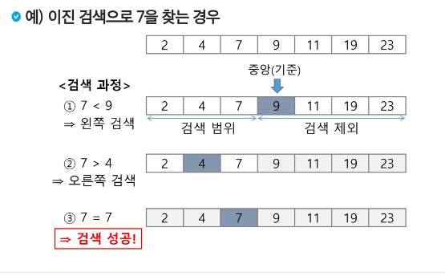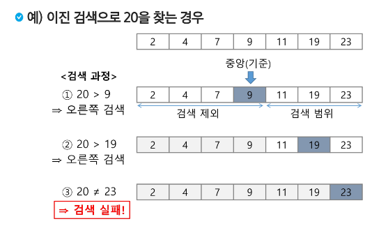
+ 반복구조와 재귀구조로 모두 표현 가능


```
sort(), sorted()
내장 라이브러리가 굉장히 강력!
병합 정렬
- 직접 구현할 일은 적다.
-> 멀티 쓰레드

- 과거에 면접 단골 질문 + 분할 정복 학습에 좋다
= > 코드를 보기전 직접 손으로 써보기

퀵 정렬
- 직접 구현할 일은 적다.
-> 평균적으로 굉장히 좋음( 시간복잡도 : NlogN )
-> 특히, 큰 데이터를 다룰때 좋다.
-> 단점: 역순 정렬 등 최악의 경우 (시간복잡도 : N^2 )

- 과거에 면접 단골 질문 + 분할 정복 학습에 좋다
= > 코드를 보기전 직접 손으로 써보기

이진 검색
- 코딩 테스트의 메인 알고리즘 중 하나
- 목적 : " 원하는 값을 빨리 찾는 것"
- 시간 : O(log N)
- Parametric Search ( 특정 범위 검색 )
 - lower bound
 - upper bound
	- 여러개의 데이터 중 2가 처음 나온 시점
	- 2~9 사이의 데이터는 몇개 인가?
```

#### 로우토 파티션 알고리즘


## 백트래킹
+ 상태 공간 트리의 모든 노드를 검색하는 기법
+ 이진 트리(binary tree)의 특성을 이해하고 이진 트리의 중요한 연산인 탐색, 삽입, 삭제 알고리즘을 학습

+ 여러가지 선택지(옵션)들이 존재하는 상황에서 한가지를 선택한다.
+ 선택이 이루어지면 새로운 선택지들의 집합이 생성된다.
+ 이런 선택을 반복하면서 최종상태에 도달한다. 
  + 올바른 선택이 계속되었다면 목표 상태에 도달한다.
  + 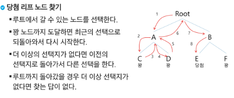

### 백트리킹과 깊이 우선 탐색과의 차이
* 어떤 노드에서 출발하는 경로가 해결책으로 이어질 것 같지 않으면 더 이상 그 경로를 따라가지 않음으로써 시도의 횟수를 줄임( Prunning 가지치기 )
* 깊이 우선탐색이 모든 경로를 추적하는데 비해 백트래킹은 불필요한 경로를 조기에 차단
* 깊이 우선 탐색을 가하기에는 경우의 수가 너무나 많음. 즉, N!가지의 경우의 수를 가진 문제에 대해 깊이 우선 탐색을 가하면 당연히 처리 불가능한 문제.
* 백트래킹 알고리즘을 적용하면 일반적으로 경우의 수가 줄어들지만 이 역시 최악의 경우에는 여전히 지수함수 시간(Exponential Time)을 요하므로 처리 불가능

### 백트래킹 절차
1. 상태 공간 트리의 깊이 우선 탐색을 실시한다.
2. 각 노드가 유망한지 점검한다.(가지치기 prunning 실행)
3. 만약 그 노드가 유망하지 않으면, 노드의 부모 노드로 돌아가서 검색을 계속한다.
```py
# {1,2,3} 집합에서 3개의 숫자를 선택하는 기본적인 예제

arr = [i for i in range(1,4)]
path = [0]*3

def backtracking(cnt):
    #재귀를 끝내는 기저 조건
    #숫자 3개를 골랐을 때 종료
    if cnt == 3:
        print(*path)
        return
    # 1차 가지치기 (여기선 없음)

    # 반복문
    for num in arr:
        # 가지치기 - 중복된 숫자 제거
        if num in path:
            continue
        # 들어가기 전 로직 - 경로 저장
        path[cnt] = num
        # 다음 재귀 함수 호출
        backtracking(cnt+1)
        # 돌아와서 할 로직(초기화) { 여기가 제일 중요 }
        path[cnt] = 0


cnt = 0
backtracking(cnt)
```
위와 같은 형식으로 대부분 작성되니 참고하도록 한다.


## 트리
```
트리
- 사이클이 없는 연결 그래프
  사이클
  연결 그래프 : 모든 꼭지점이 서로 갈 수 있다.

- 이진트리
  자녀 노드가 둘 이하인 트리
  0. 이진 트리 종류
      - 완전 이진 트리
          - 마지막 레벨을 제외한 모든 레벨은 꽉 차 있어야한다.
          - 마지막 레벨 노드는 왼쪽부터 채워져야한다.
      - 포화 이진 트리
          - 모든 레벨이 꽉 차 있는 것

      - 나머지 이진 트리
  1. 순회 방법
       1
    2    3
  4  X  5   6
  의 트리가 있을 때
      - 전위(부모 -> 좌 -> 우)
        - 1 2 4 3 5 6
      - 중위(좌 -> 부모 -> 우)
        - 4 2 1 5 3 6
      - 후위(좌 -> 우 -> 부모)
        - 4 2 5 6 3 1
  2. 트리 저장 방법

```
+ 트리란 사이클이 없는 무향 연결 그래프
+ 한개 이상의 노드로 이루어진 유한 집합
  + 노드 중 부모가 없는 노드를 루트라 한다.(최상단 노드)
  + 두 노드 사이에는 유일한 경로가 존재한다.
  + 각 노드는 최대 하나의 부모 노드가 존재할 수 있다.
  + 각 노드는 자식노드가 없거나 하나 이상이 존재할 수 있다.
  + 원소들간 1:N 관계, 계층 관계를 가지는 "비선형 계층형 자료구조"
+ 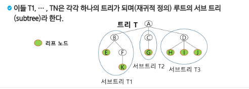
### 트리 용어 정리
+ 노드 
  + 트리의 원소이고 정점이라고도 한다.

+ 간선
  + 노드를 연결하는 선

+ 루트노드
  + 트리의 시작노드

+ 형제노드
  + 같은 부모 노드의 자식 노드들

+ 조상노드
  + 간선을 따라 루트 노드까지 이르는 경로에 있는 모든 노드들

+ 서브트리
  + 부모노드와 연결된 간선을 끊었을 때 생성되는 트리

+ 자손노드
  + 서브트리에 있는 하위 레벨의 노드들

+ 차수
  + 노드의 차수
    + 노드에 연결된 자식노드의 수
  + 트리의 차수
    + 트리에 있는 노드의 차수 중 가장 큰 값
  + 단말 노드(리프 노드)
    + 차수가 0 인 노드, 자식 노드가 없는 노드

+ 높이(레벨)
  + 노드의 높이
    + 루트에서 노드에 이르는 간선의 수. 노드의 레벨
  + 트리의 높이
    + 트리에 있는 노드의 높이 중에서 가장 큰 값. 최대 레벨

### 이진트리
+ 모든 노드들이 최대 2개의 서브트리를 갖는 특별한 형태의 트리
+ 각 노드가 자식 노드를 최대 2개까지만 가질수 있음
  + 왼쪽 자식노드
  + 오른쪽 자식노드
+ 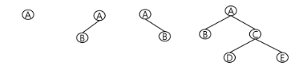
+ 높이가 h인 이진트리가 가질 수 있는 노드의 최소 개수는 (h+1)개, 최대 개수는 (2^(h+1) -1)개
+ 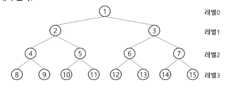
+ 최소 4개, 최대 2^4 -1 = 15

#### 이진트리의 종류
+ 포화 이진 트리
  + 모든 레벨이 꽉 차 있는 트리
+ 완전 이진 트리
  - 마지막 레벨을 제외한 모든 레벨은 꽉 차 있어야한다.
  - 마지막 레벨 노드는 왼쪽부터 채워져야한다.
  - 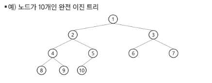
  - n번까지 빈자리가 없는 이진트리
> 위 두개가 제일 중요
+ 편향 이진 트리
  + 한쪽 방향의 자식 노드만 가진 이진트리
  + 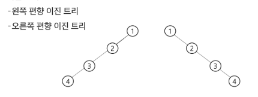

#### 이진트리의 순회
+ 순회 : 트리의 노드들을 체계적으로 방문하는 것
+ 3가지 순회 방법
+ 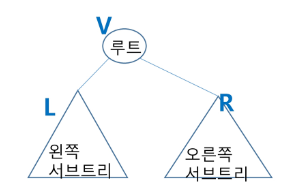
  + 전위 순회 VLR
    + 부모 -> 좌 -> 우
  + 중위 순회 LVR
    + 좌 -> 부모 -> 우
  + 후위 순회 LRV
    + 좌 -> 우 -> 부모
```
       1
    2    3
  4  X  5   6
  의 트리가 있을 때

- 전위(부모 -> 좌 -> 우)
  - 1 2 4 3 5 6
- 중위(좌 -> 부모 -> 우)
  - 4 2 1 5 3 6
- 후위(좌 -> 우 -> 부모)
  - 4 2 5 6 3 1
```
+ 순회 알고리즘
```py
def preorder_travers(Tree):
  if T is not null
    visit(Tree)  # 전위 순회
    preorder_travers(Tree.left)
    visit(Tree) # 중위 순회
    preorder_travers(Tree.right)
    visit(Tree) # 후위 순회
```
#### 이진트리의 표현
+ 노드 번호가 i 인 노드
  + 부모 노드의 번호 i//2
  + 왼쪽 자식 노드 번호 2*i
  + 오른쪽 자식 노드 번호 2*i+1
+ 레벨 n의 노드 시작 번호 2^n

+ 배열을 이용한 이진 트리의 표현
  + 노드 번호를 배열의 인덱스로 사용
  + 높이가 h인 이진트리의 배열의 크기는 2^(h+1)-1
  + 단점
    + 사용하지 않는 배열의 원소에 대한 메모리 공간 낭비 발생
    + 트리의 중간에 노드를 삽입하거나 기존 노드를 삭제할 경우 배열의 크기 변경이 어렵다.
  + 연결리스트를 이용한 이진 트리의 표현(단점 극복)
    + 이진트리의 모든 노드는 최대 2개의 자식 노드를 가지므로 일정한 구조의 단순 연결리스트 노드를 사용하여 구현
    + 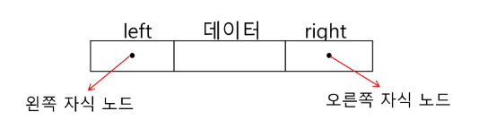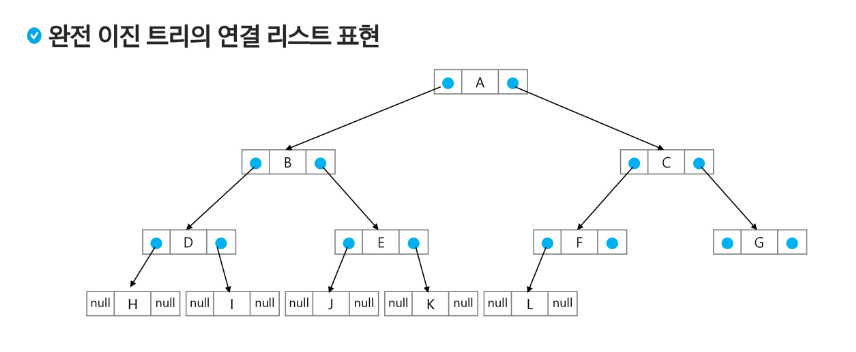

#### 이진 탐색 트리
+ 탐색 작업을 효율적으로 하기 위한 자료구조
+ 모든 원소는 서로 다른 유일한 키를 가진다.
+ 왼쪽 서브 트리 < 루트 노드 < 오른쪽 서브트리 
+ 왼쪽과 오른쪽 서브트리 또한 이진 탐색 트리다.
+ 중위 순회하면 오름차순으로 정렬된 값을 얻을 수 있다.

+ 탐색연산
  + 루트에서 탐색시작
  + 탐색할 키 값 x를 루트노드의 키값 k와 비교
    + x = k: 탐색성공
    + x < k: 루트노드의 왼쪽 서브 트리에 대해서 탐색 연산 수행
    + x > k: 루트노드의 오른쪽 서브 트리에 대해서 탐색 연산 수행
  + 서브트리에 대해서 순환적으로 탐색연산 반복
  + 탐색 수행할 서브트리가 없으면 탐색 실패
  + 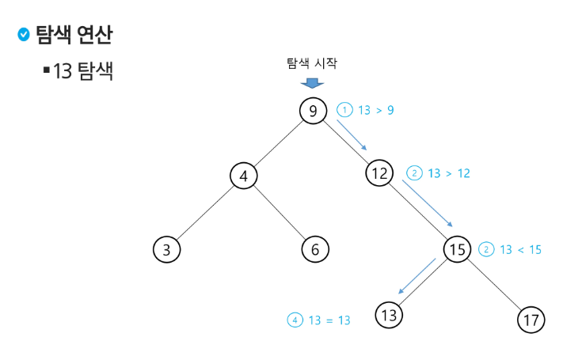
+ 삽입연산
  + 탐색연산을 수행
  + 탐색 실패한 위치에 원소를 삽입
  + 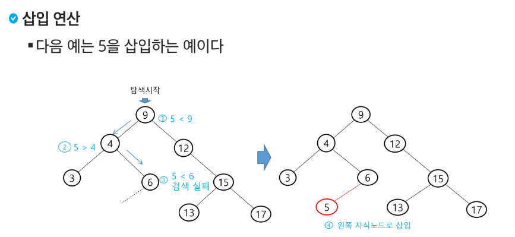
+ 삭제연산
  + 삭제할 노드의 차수가 0,1,2 각각의 경우에 따라 나뉜다.
  + 차수가 0일 경우
    + 탐색 후 삭제
  > 차수가 0이 아니라면, 삭제할 노드가 리프 노드가 아닌 경우들
  + 차수가 1일 경우
    + 탐색 후 삭제
    + 서브 트리 이동
    + 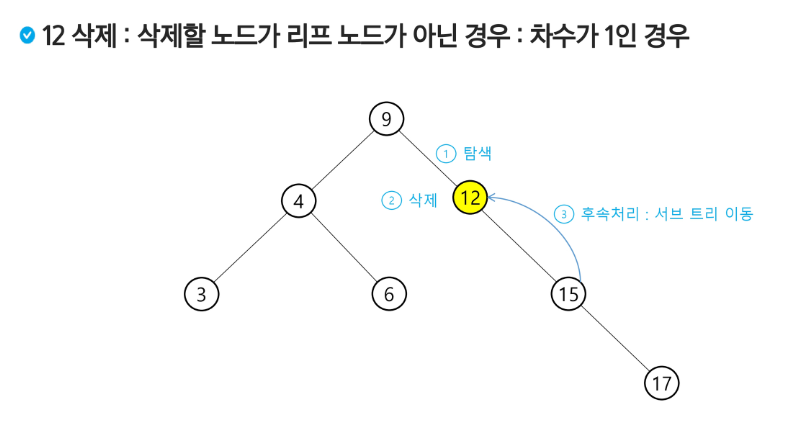
  + 차수가 2일 경우
    + 탐색 후 삭제
    + 후보 찾기
    + 서브 트리 이동
    + 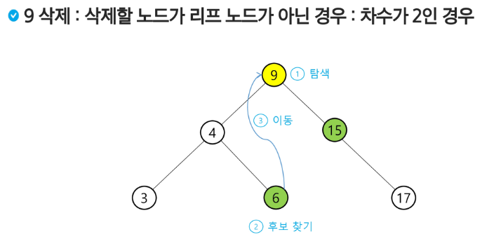

  + 탐색, 삽입, 삭제 는 트리의 높이만큼 시간 소요
    + O(h)
  + 평균적으로(이진트리가 균형적으로 생성됐을 시)
    + O(log n)
  + 최악의 경우(한쪽으로 치우친 편향 이진트리의 경우)
    + O(n)
    + 순차 탐색과 시간복잡도가 같다.

### heap (힙)
+ 완전 이진 트리에서 있는 노드 중에서 키 값이 가장 큰 노드나 키 값이 가장 작은 노드를 찾기 위해서 만든 자료구조

+ "리스트에서 계속 최소값이나 최대값 뽑아야 할 때 쓰면 좋은 것"

+ 최대 힙(max heap)
  + 키 값이 가장 큰 노드를 찾기 위한 "완전 이진 트리"
  + 부모 노드의 키 값 > 자식 노드의 키 값
  + 루트 노드 : 키 값이 가장 큰 노드
+ 최소 힙(min heap)
  + 키 값이 가장 작은 노드를 찾기 위한 "완전 이진 트리"
  + 부모 노드의 키 값 < 자식 노드의 키 값
  + 루트노드 : 키 값이 가장 작은 노드
+ 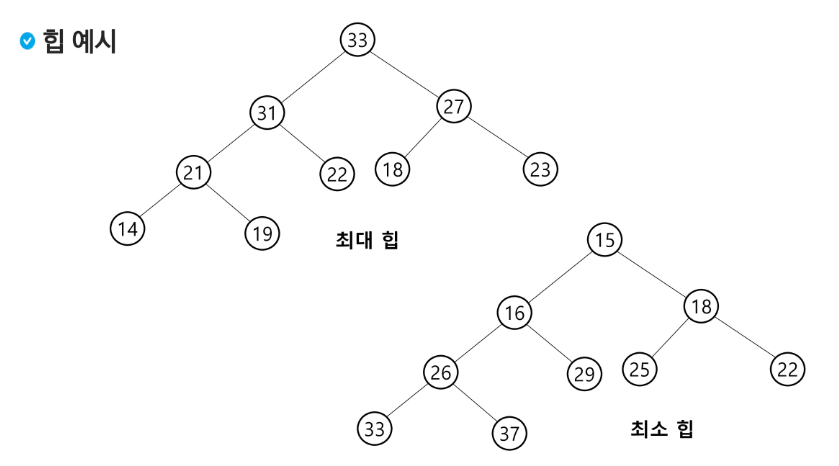

#### 힙 연산
+ 힙 삽입
+  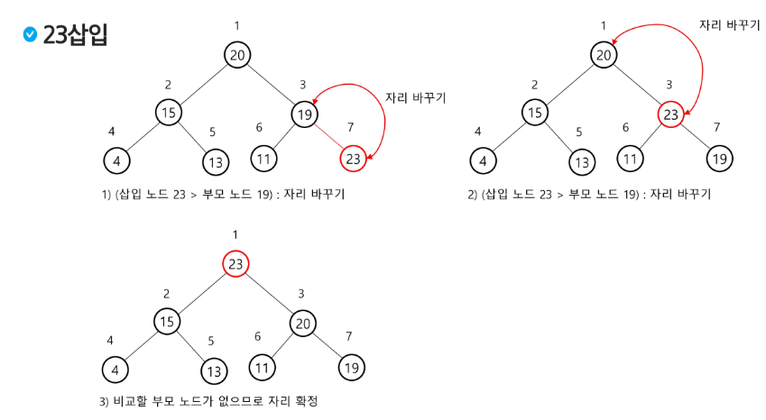
+ 힙 삭제
  + 힙에서는 루트노드의 원소만 삭제할 수 있다.
  + 루트 노드의 원소를 삭제하여 반환한다.
  + 우선순위 큐와 비교 해보자.
  + 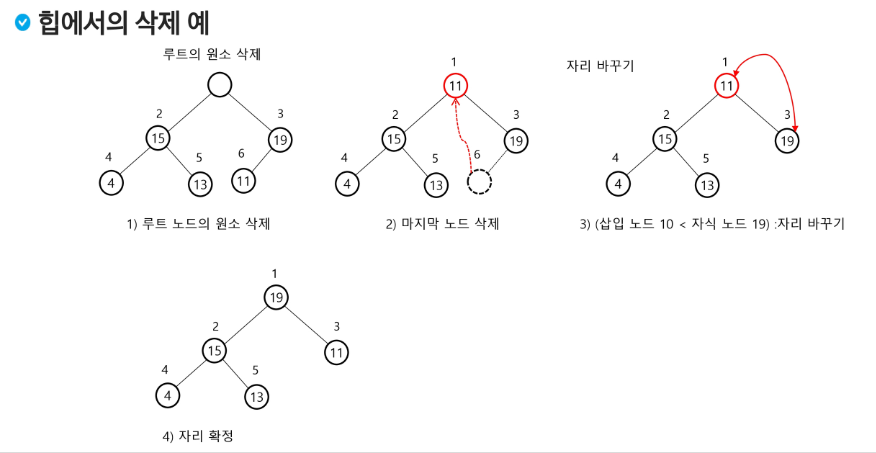

#### 힙의 활용
+ 힙을 활용하는 대표적인 2가지는 "특별한 큐의 구현과 정렬" 이다.
+ 우선순위 큐를 구현하는 가장 효율적인 방법이 바로 힙을 사용하는 것
  + 완전 정렬보다 관리비용이 적다
  + 노드 하나의 추가/삭제 시간복잡도가 O(log n)이고 최대값, 최소값을 O(1)에 구할 수 있다.
+ 배열을 통해 트리형태를 쉽게 구현할 수 있다.
  + 부모나 자식노드를 O(1)연산으로 쉽게 찾을 수 있다
  + n위치에 있는 노드의 자식은 2n과 2n+1에 위치한다.
  + 완전 이진 트리의 특성에 의해 추가/삭제 위치는 자료의 시작과 끝 인덱스로 쉽게 판단할 수 있다.
+ 힙 정렬은 힙 자료구조를 이용해서 이진탐색과 유사한 방법으로 수행된다.
+ 정렬을 위한 2단계
  + 하나의 값을 힙에 삽입한다(반복)
  + 힙에서 순차적으로(오름차순)으로 값을 하나씩 제거한다.
+ 힙 정렬의 시간 복잡도
  + N개의 노드 삽입 연산 + N개의 노드 삭제 연산
  + 삽입과 삭제는 각각 O(log n)
  + 따라서 전체 정렬은 O(n log n) 
+ 힙 정렬은 배열에 저장된 자료를 정렬하기에 유용하다.