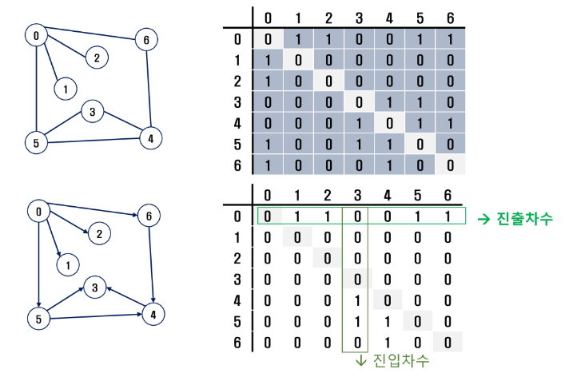
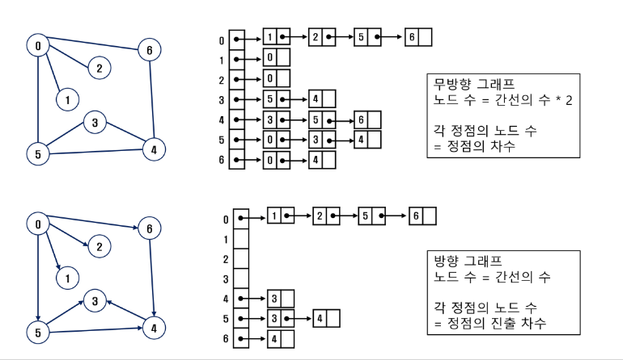
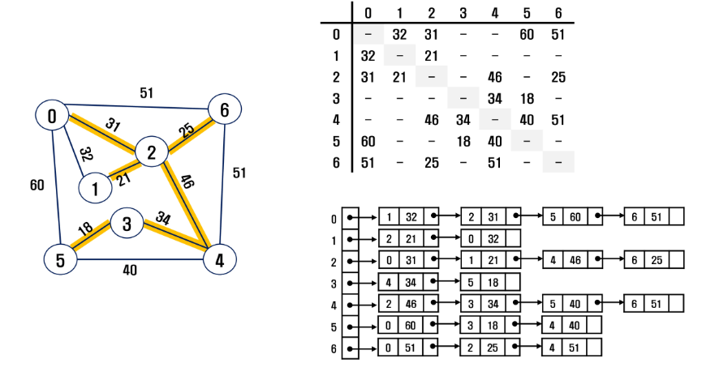
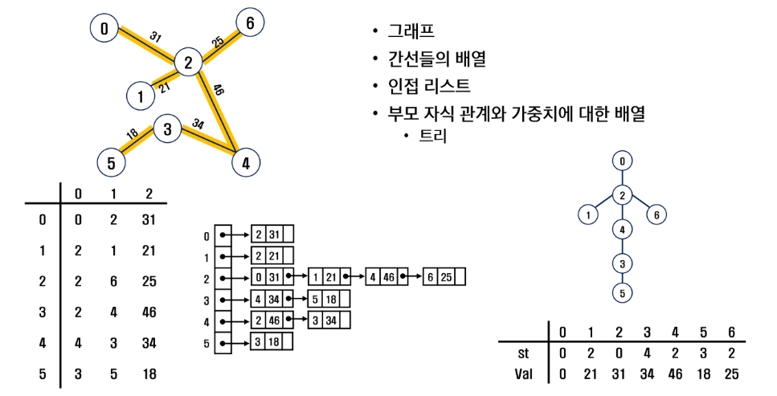
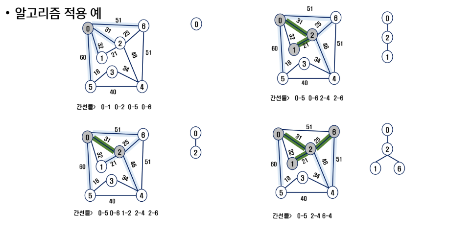
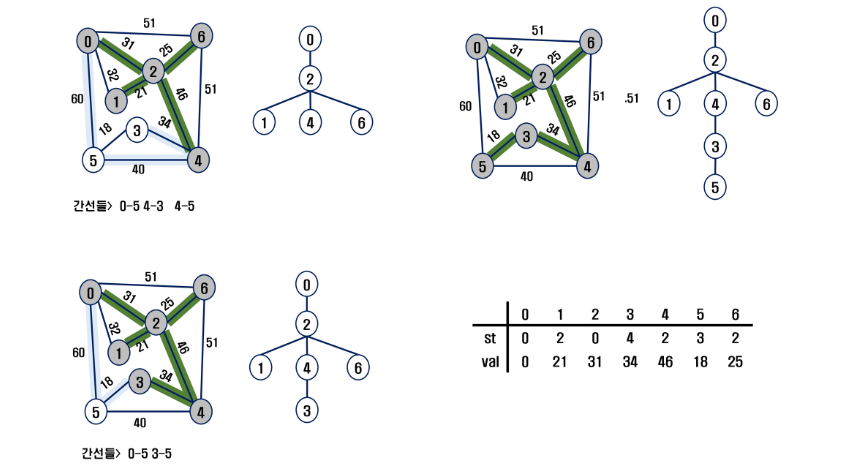

# 0920 그래프 & 백트래킹
- bfs dfs 학습
- 상호배타 집합(Disjoint-Sets)의 자료구조 학습
- 최소신장트리(Minimum Spanning Tree)를 이해하고 탐욕기법으로 최소신장트리를 찾는 알고리즘 학습
- 그래프의 두 정점 사이의 최단 경로를 찾는 방법 학습

## 그래프
+ 아이템(사물 또는 추상적 개념)들과 이들 사이의 연결관계 표현
 - 데이터 간 관계를 표현한 자료구조
    - 관계? 데이터 사이의 연관
- 정점(노드)와 간선으로 이루어진 자료구조
+ 선형 자료구조나 트리자료구조로 표현하기 어려운 N:N 관계를 가지는 원소들을 표현하기에 용이
+ 정점의 개수 v일 때, 그래프에 포함된 간선의 개수 e가 가질수 있는 최대 간선의 수는
+ v*(v-1)/2 이다.
#### 그래프의 종류
+ 무향 그래프
+ 유향 그래프
+ 가중치 그래프
+ 사이클 없는 방향 그래프
+ 
+ 완전 그래프
  + 정점들에 대해 가능한 모든 간선들을 가진 그래프
+ 부분 그래프
  + 원래 그래프에서 일부 정점이나 간선을 제외한 그래프
  
#### 인접 정점
+ 인접
  + 두개의 정점에 간선이 존재하면 서로 인접한다고 한다.
  + 완전그래프에 속한 임의의 두 정점은 모두 인접해 있다.

#### 그래프 경로
+ 경로란 간선들을 순서대로 나열한 것
  + 간선들: (0, 2), (2, 4), (4, 6)
  + 정점들 : 0 - 2 - 4 - 6
+ 경로 중 한 정점을 최대 한번만 지나는 경로를 "단순 경로" 라 한다.
+ 시작한 정점에서 끝나는 경로를 "사이클"이라고 한다.
+ 

#### 그래프 표현
+ 간선의 정보를 저장하는 방식
+ 메모리나 성능을 고려해 결정
+ >인접 행렬
  + v * v 크기의 2차원 배열을 이용해서 간선 정보를 저장
  + 배열의 배열(포인터 배열)
  + 행번호와 열번호는 그래프의 정점에 대응
  + 인접시 1, 아닐시 0으로 표현
  + 무향 그래프 
    + i번째 행의 합 = i번째 열의 합 = V의 차수
  + 유향 그래프
    + 행i의 합 = V의 진출차수
    + 열i의 합 = V의 진입차수
+ 
```
graph = [
    [0, 1, 0, 1, 0],
    [1, 0, 1, 1, 1],
    [0, 1, 0, 0, 0],
    [1, 1, 0, 0, 1],
    [0, 1, 0, 1, 0]
]
```

+ >인접 리스트
  + 각 정점마다 해당 정점으로 나가는 간선의 정보를 저장
  + 정점에 대한 인접 정점들을 순차적으로 표현
  + 하나의 정점에 대한 인접 정점들을 각각 노드로 하는 연결 리스트로 저장
  + 
```
graph = [
    [1, 3],
    [0, 2, 3, 4],
    [1],
    [0, 1, 4],
    [1, 3]
]
```

+ >간선의 배열
  + 간선(시작정점, 끝정점)을 배열에 연속적으로 저장
```
graph = [(0,1), (0,3), (1,0), (1,2), (1,3), (1,4), (2,1), (3,0), (3,1), (3,4), (4,1), (4,3)]
```
### DFS 깊이 우선 탐색 + stack
+ stack = 선형 후입 선출 자료구조
  + push 자료 삽입
  + pop 자료 꺼내기(가장 마지막에 들어간 자료)
  + isEmpty (공백인지 아닌지 확인)
  + peek (스택의 top에 있는 원소 반환) pop과 똑같음
### BFS 너비 우선 탐색 + queue
+ queue = 선입 선출 자료구조
  + enQueue = push
  + deQueue = pop(0)
  + isEmpty (공백상태 확인. front = rear)
  + isFull  (포화상태 확인. rear = n-1) n은 배열의 크기, n-1은 배열의 마지막 인덱스
```py
graph = [
    [0, 1, 0, 1, 0],
    [1, 0, 1, 1, 1],
    [0, 1, 0, 0, 0],
    [1, 1, 0, 0, 1],
    [0, 1, 0, 1, 0]
]

# DFS
# stack 버전
def dfs_stack(start):
    vistied= [ ]
    stack = [start]

    while stack:
        now = stack.pop()
        # 이미 방문한 지점이라면 컨티뉴
        if now in vistied:
            continue

        # 방문하지 않은 지점이라면, 방문표시
        vistied.append(now)

        # # 갈 수 있는 곳들을 stack에 추가
        # for next in range(5):
        # 작은 번호부터 조회한다면
        for next in range(4, -1, -1):
            # 연결이 안되어 있다면 continue
            if graph[now][next] == 0:
                continue

            # 방문한 지점이라면 stack에 추가하지않음
            if next in vistied:
                continue

            stack.append(next)
    return vistied
print("dfs_stack =", end= ' ')
print(*dfs_stack(0))


# DFS
# 재귀버전
# MAP 크기를 알 때 append 형식말고 아래와 같이 사용하면 훨씬 빠르다
visited = [0] * 5
path = []   # 방문 순서 기록

def dfs(now):
    visited[now] = 1
    # print(now, end=' ')
    path.append(now)

    # 인접한 노드들을 방문
    for next in range(5):
        if graph[now][next] == 0:
            continue
        if visited[next]:
            continue

        dfs(next)

print("dfs_재귀 =", end=' ')
dfs(0)
print(*path)
    # 기저 조건

    # 들어가기 전에 무엇을 해야하는가

    # 함수호출
    
    # 돌아와서 할 행동

# bfs
# queue
def bfs(start):
    visited = [0] * 5

    # 먼저 방문 했던 것을 먼저 처리해야 한다 = queue
    queue = [start]
    visited[start] = 1

    while queue:
        # queue이 맨 앞 요소를 꺼냄
        now = queue.pop(0)
        print(now, end=' ')

        #방문 체크 + 방문한 지점은 pass

        # 인접한 노드들을 queue에 추가
        for next in range(5):
            # 연결이 안되어 있따면 continue
            if graph[now][next] == 0:
                continue
            # 방문한 지점이라면 queue에 추가하지 않음
            if visited[next]:
                continue

            queue.append(next)
            # bfs 이므로 여기서 방문체크를 해주어도 상관없다.
            visited[next] = 1

print("bfs_queue =", end=' ')
bfs(0)
```
```py
# 인접리스트
# 갈 수 있는 지점만 저장하자
# 주의사항
# 각 노드마다 갈 수 있는 지점의 개수가 다름
# = > range 쓸때 index 조심
# 메모리가 인접행렬에 비해 훨씬 효율적이다.
graph = [
    [1, 3],
    [0, 2, 3, 4],
    [1],
    [0, 1, 4],
    [1, 3]
]

# 파이썬은 딕셔너리로도 구현할 수 있다.
# 0대신 짱구, 1대신 맹구 등 숫자가 아닌 언어로 쓸 수 있다.
graph_dict = {
    '0' : [1, 3],
    '1' : [0, 2, 3, 4],
    '2' : [1],
    '3' : [0, 1, 4],
    '4' : [1, 3]
}


# DFS
# stack 버전
def dfs_stack(start):
    vistied = []
    stack = [start]

    while stack:
        now = stack.pop()
        # 이미 방문한 지점이라면 컨티뉴
        if now in vistied:
            continue

        # 방문하지 않은 지점이라면, 방문표시
        vistied.append(now)

        # 갈 수 있는 곳들을 stack에 추가
        for to in range(len(graph[now]) -1, -1, -1):
            # 이제 연결이 안되어있는 건 애초에 저장하지 않았으므로
            # 체크할 필요가없다
            next = graph[now][to]
            # 방문한 지점이라면 stack에 추가하지않음
            if next in vistied:
                continue

            stack.append(next)
    return vistied


print("dfs_stack =", end=' ')
print(*dfs_stack(0))

# DFS
# 재귀버전
# MAP 크기를 알 때 append 형식말고 아래와 같이 사용하면 훨씬 빠르다
visited = [0] * 5
path = []  # 방문 순서 기록


def dfs(now):
    visited[now] = 1
    # print(now, end=' ')
    path.append(now)

    # 인접한 노드들을 방문
    for to in range(len(graph[now])):
        next = graph[now][to]
        if visited[next]:
            continue

        dfs(next)


print("dfs_재귀 =", end=' ')
dfs(0)
print(*path)


# 기저 조건

# 들어가기 전에 무엇을 해야하는가

# 함수호출

# 돌아와서 할 행동

def bfs(start):
    visited = [0] * 5

    # 먼저 방문 했던 것을 먼저 처리해야 한다 = queue
    queue = [start]
    visited[start] = 1

    while queue:
        # queue이 맨 앞 요소를 꺼냄
        now = queue.pop(0)
        print(now, end=' ')

        # 방문 체크 + 방문한 지점은 pass

        # 인접한 노드들을 queue에 추가
        for to in range(len(graph[now])-1, -1 ,-1):
            next = graph[now][to]
            # 방문한 지점이라면 queue에 추가하지 않음
            if visited[next]:
                continue

            queue.append(next)
            # bfs 이므로 여기서 방문체크를 해주어도 상관없다.
            visited[next] = 1


print("bfs_stack =", end=' ')
bfs(0)
```
```py
import sys
sys.stdin = open("in.txt", "r")
from pprint import pprint
"""
7 6 10
0 1 5
0 2 3
1 3 2
1 4 7
2 5 5
2 6 2
"""
# 던전의 개수 n, 던전을 연결하는 경로의 수 m, 코코가 보유한 골드 k
n, m, k = map(int, input().split())
# 던전번호a, b 그리고 입장하기 위한 골드 c

# 인접 그래프 생성
arr = [[0]*n for _ in range(n)]
graph = {}
graph2 = [[] for _ in range(n)]

for i in range(n):
    graph[i] = []

for _ in range(m):
    a, b, c = map(int, input().split())

    arr[a][b] = c

    graph[a].append([b, c])

    graph2[a].append([b, c])

pprint(arr)
pprint(graph)
pprint(graph2)

# arr 접근
for node in range(n):
    for nxt in range(n):
        if arr[node][nxt] != 0:
            print(f'{node}에 {nxt}가 인접, 가중치는{arr[node][nxt]}')


# graph (딕셔너리)
for node in graph.keys():
    for nxt, coin in graph[node]:
        print(f'{node}에 {nxt}가 인접, 가중치는{coin}')


# graph2 (리스트)
for node in range(n):
    for nxt, coin in graph[node]:
        print(f'{node}에 {nxt}가 인접, 가중치는{coin}')
```


## 서로소 집합(Disjoint-sets)
+ 서로소 또는 상호배타 집합들은 서로 중복 포함된 원소가 없는(교집합이 없는) 집합들이다.
+ 집합에 속한 하나의 특정 멤버를 통해 각 집합들을 구분한다.
+ 이를 대표자(representative)라 한다.

+ 상호배타 집합을 표현하는 방법
  + 연결리스트
  + 트리

+ 상호배타 집합 연산
  + Mark-Set( x )   전체 집합에 데이터 추가
  + Find-Set( x )   각 요소가 내가 속한 그룹의 대표자를 어떻게 찾을지
  + Union( x, y )   대표자 저장(같은 그룹으로 묶기)
  + 
    + Mark-Set => 집합에 데이터를 추가, 스스로가 데이터의 대표
    + Union => y의 대표를 x로, b의 대표를 a로 설정하면서 각각 그룹으로 묶임
    + Find-Set => 입력된 데이터의 대표를 찾음


## 최소신장트리(MST)
+ 무방향 가중치 그래프에서 신장트리를 구성하는 간선들의 가중치의 합이 최소인 신장 트리
+ 신장트리란?
  + n개의 정점으로 이루어진 무방향 그래프에서 n개의 정점과 n-1개의 간선으로 이루어진 트리
  + 한줄로 쭉 이어져있는 트리?
  + ```
    신장 트리란?
    1. 모든 정점을 연결
    2. 사이클이 존재하지 않는 부분 그래프
    	- 간선의 개수 : N -1 개
    3. 한 그래프에서 여러개의 신장 트리가 나올 수 있다.
    ```

+ **그래프에서 최소 비용 문제**
  + 모든 정점을 연결하는 간선들의 가중치의 합이 최소가 되는 트리
  + 두 정점 사이의 최소비용의 경로 찾기

### 예제

```
우리는 도로 건설 계획을 세우고 있다.
총 N개의 도시를 연결하는 도로를 건설하려고 할 때
모든 도시에 갈 수 있도록하며,
가장 비용이 적게 들도록
도로를 건설하는 경우의 수를 구하시오
```
1. 갈 수 있는 곳들 중 제일 짧은곳으로 가자
	- 모든 정점을 방문할 때 까지
	- BFS와 비슷한데 가중치를 활용
  + 
```py
'''
7 11
0 1 32
0 2 31
0 5 60
0 6 51
1 2 21
2 4 46
2 6 25
3 4 34
3 5 18
4 5 40
4 6 50
'''
import heapq
def prim(start):
    heap = []
    # MST에 포함되었는 지 여부
    MST = [0] * V

     # 가중치, 정점 정보
    heapq.heappush(heap, (0, start))
    # 누적합 저장
    sum_weight = 0

    while heap:
        # 가장 적은 가중치를 가진 정점을 꺼냄
        weight, v = heapq.heappop(heap)

        #이미 방문한 노드라면 pass
        if MST[v]:
            continue
        #방문 체크
        MST[v] = 1
        # 누적합 추가
        sum_weight += weight
        # 갈 수 있는 노드들을 체크
        for next in range(V):
            # 갈 수 없거나 이미 방문했다면 pass
            if graph[v][next] == 0 or MST[next]:
                continue

            heapq.heappush(heap, (graph[v][next], next))

    return sum_weight
# 노드의 수 V, 간선의 수 E
V, E = map(int, input().split())
# 인접행렬(리스트가 더 좋긴 하나 크기가 작다면 인접행렬도 충분히 사용해도 좋음)
graph = [[0] * V for _ in range(V)]

for _ in range(E):
    f, t, w = map(int, input().split())
    graph[f][t] = w  # 단방향 그래프로 작성한 것
    graph[t][f] = w  # 무방향 그래프는 반대도 추가해 줄 것


result = prim(0)
print(result)
```

2. 전체 간선들 중에서 제일 가중치가 적은 곳부터 선택하자
	- 간선 정보를 정렬해야 가중치가 가장 작은 것부터 가져올 수 있다.
	- 
	- Prim 알고리즘
#### Prim 알고리즘
+ 하나의 정점에서 연결된 간선들 중에서 하나 씩 선택하면서 MST를 만들어가는 방식
  1. 임의 정점을 하나 선택해서 시작
  2. 선택한 정점과 인접하는 정점들 중에서 최소비용의 간선이 존재하는 정점을 선택
  3. 모든 정점이 선택될 때까지 반복

+ 서로소인 2개의 집합정보가 유지된다.
  + 트리 정점들(tree vertices) - MST를 만들기 위해 선택된 정점들
  + 비트리 정점들(nontree vertices) - 선택되지 않은 정점들
```py
# 모든 간선들 중 비용이 가장 적은 걸 우선으로 고르기
# heapq도 가능, 이번엔 sort사용
'''
7 11
0 1 32
0 2 31
0 5 60
0 6 51
1 2 21
2 4 46
2 6 25
3 4 34
3 5 18
4 5 40
4 6 51

'''

V, E = map(int, input().split())
edge = []
for _ in range(E):
    f, t, w = map(int, input().split())
    edge.append([f, t, w])
# w를 기준으로 정렬
edge.sort(key=lambda x: x[2])

# 사이클 발생 여부를 union find 로 해결
parents = [i for i in range(V)]


def find_set(x):
    if parents[x] == x:
        return x

    parents[x] = find_set(parents[x])
    return parents[x]


def union(x, y):
    x = find_set(x)
    y = find_set(y)

    if x == y:
        # print('사이클발생')
        return

    if x < y:
        parents[y] = x
    else:
        parents[x] = y


# 현재 방문한 정점 수
cnt = 0
sum_weight = 0
for f, t, w in edge:
    # 싸이클이 발생 하지 않는다면
    if find_set(f) != find_set(t):
        cnt += 1
        sum_weight += w
        union(f, t)
        # MST구성이 끝나면
        if cnt == V:
            break
print(f'최소비용 = {sum_weight}')
```
```py
# 힙 사용법
import heapq
def prim(start):
    heap = []
    heapq.heappush(heap, 3)
    heapq.heappush(heap, -1)
    heapq.heappush(heap, -2)
    # heap은 스스로 정렬이 된다.
    # 그래서 가장 작은 수 부터 나오게 됌
    print(-heapq.heappop(heap))
    print(heapq.heappop(heap))
    print(heapq.heappop(heap))
prim(0)
```

#### KRUSAL 알고리즘
+ 간선을 하나씩  선택해서 MST찾는 알고리즘
  1. 최소, 모든 간선을 가중치에 따라 오름차순으로 정렬
  2. 가중치가 가장 낮은 간선부터 선택하면서 트리를 증가시킴
    - 사이클이 존재하면 다음으로 가중치가 낮은 간선 선택
  3. n-1개의 간선이 선택될 때 까지 2. 를 반복

## 최단 경로
+ 간선의 가중치가 있는 그래프에서 두 정점 사이의 경로들 중에 간선의 가중치의 합이 최소인 경로

+ 하나의 시작 정점에서 끝 정점까지의 최단경로
  + 다익스트라(dijstra) 알고리즘
    + 음의 가중치를 허용하지 않음
  + 벨만-포드(Bellman-Ford) 알고리즘
    + 음의 가중치 허용

+ 모든 정점들에 대한 최단 경로
  + 플로이드-워샬(Floyd-Warshall) 알고리즘
```
최단거리 문제 유형
1. 특정 지점 -> 도착지점까지의 최단거리 : 다익스트라
2. 가중치에 음수가 포함되어 있다면?: 벨만포드
3. 여러지점 => 여러 지점까지의 최단거리 : 플로이드-워샬
        - 여러 지점을 모두 다익스트라 돌리는 것도 방법이긴함
        - 시간 복잡도 계산을 잘 해야함
```

### 다익스트라(dijstra) 알고리즘
+ 시작 정점에서 거리가 최소인 정점을 선택해 나가면서 최단경로를 구하는 방식이다.

+ 시작정점 (s)에서 끝정점(t)까지의 최단 경로에 정점 x가 존재하면
  + 이때 최단경로는 (s에서 x까지의) 최단경로와 (x에서 t까지의) 최단경로로 구성

+ 탐욕기업을 사용한 알고리즘으로 MST의 프림 알고리즘과 유사

```py
'''
6 8
0 1 2
0 2 4
1 2 1
1 3 7
2 4 3
3 4 2
3 5 1
4 5 5
'''
# 내가 갈 수 있는 경로 중 누적거리가 제일 짧은것부터 고르자
# 1. 누적 거리를 계속 저장
# 2. 우선순위 큐

import heapq
# 입력
n, m = map(int, input().split())
# 인접리스트
graph = [[] for _ in range(n)]
for _ in range(m):
    f, t, w = map(int, input().split())
    graph[f].append([t, w]) #단방향이기에 이렇게만 입력받음

# 누적거리를 저장
INF = float('inf')  # 엄청 큰 수를 저장
distance = [INF] * n

def dijkstra(start):
    # 우선순위 큐
    pq = []
    # 출발점 초기화
    heapq.heappush(pq, (0, start))
    distance[start] = 0

    while pq:
        # 현재시점에서
        # 누적 거리가 가장 짧은 노드에 대한 정보 꺼내기
        dist, now = heapq.heappop(pq)

        # 이미 방문한 지점 + 누적 거리가 더 짧게 방문한 적이 있다면 pass
        if distance[now] < dist:
            continue
        # 인접 노드를 확인
        for next_node, cost in graph[now]:
            #next_node로 가기 위한 누적거리
            new_cost = dist + cost
            # 누적걸가 기존보다 크네?
            if distance[next_node] <= new_cost:
                continue

            distance[next_node] = new_cost
            heapq.heappush(pq, (new_cost, next_node))

dijkstra(0)
print(distance)
```
```그래프

그래프 탐색
- 완전 탐색: DFS, BFS

서로소 집합
- 대표 데이터 비교하는 Union-Find
- 그래프에서는 싸이클 판별

최소 비용(많이 나오는 문제)
1. 최소 신장 트리 : MST
	- 전체 그래프에서 총합이 최소인 신장트리
2. 최단 거리 : 다익스트라
	- 정점 사이의 거리가 최단인 경로 찾기


----------------------------------
DFS, BFS 공통점 : 그래프나 트리의 노드들을 탐색하는 방법론
BFS: 가까운 노드부터, DFS: 깊이를 우선시하여 탐색

Union-Find 는 그래프의 노드들을 집합으로 관리
두 노드가 같은 집합에 속하는지 or
두 집합을 하나로 합치는 연산을 효율적으로 수행하는데 사용

다익스트라: 가중치 있는 그래프에서 한 노드로 부터 다른 모든 노드까지의 최단거리를 찾는다.

```
