# 0925 Django ORM with view
+ Django shell 에서 연습했던 QuerySet API 를 직접 view함수에서 사용하기
## Read
### 전체 게시글 조회
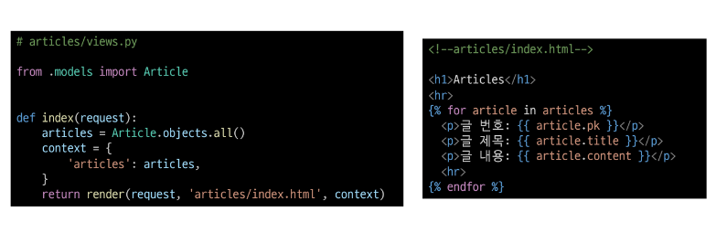 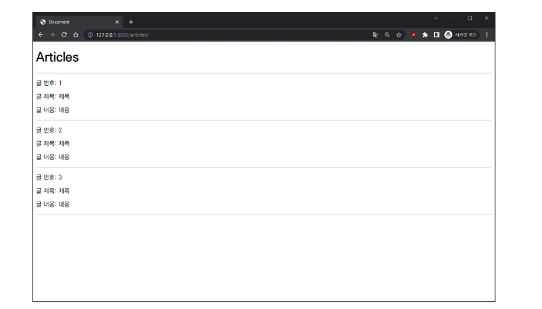 
### 단일 게시글 조회
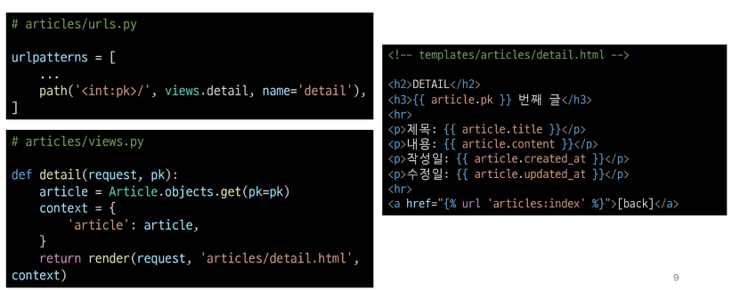 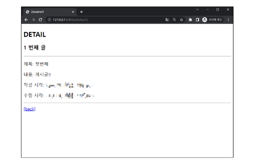
### 단일 게시글 페이지 링크 작성
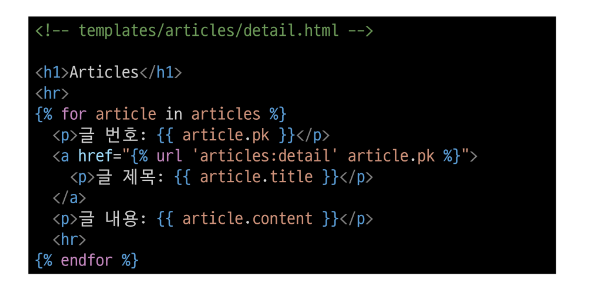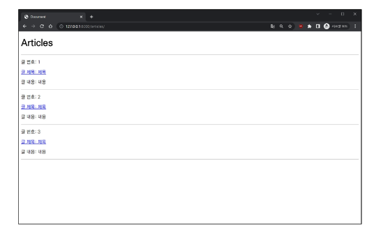

## create
+ create 로직을 구현하기 위해 필요한 view함수의 개수는?
  + new : 사용자 입력 데이터를 받을 페이지를 렌더링
  + create : 사용자가 입력한 데이터를 받아 DB에 저장
### new 기능 구현 
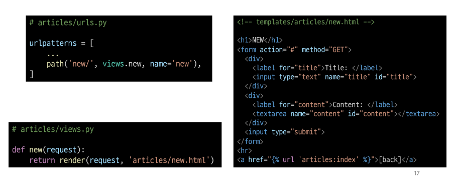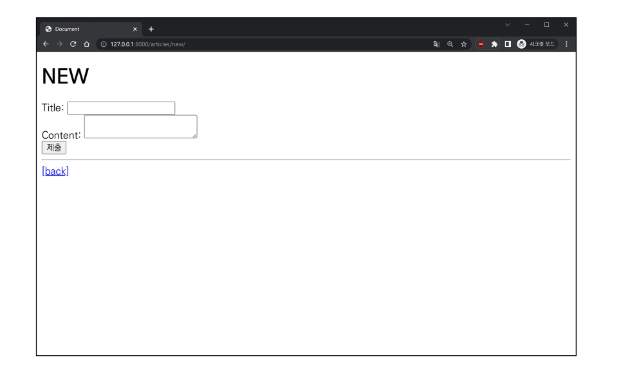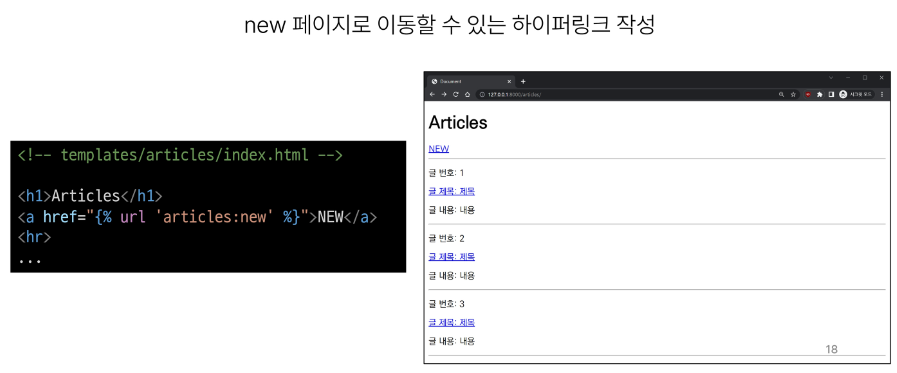
### create 기능 구현
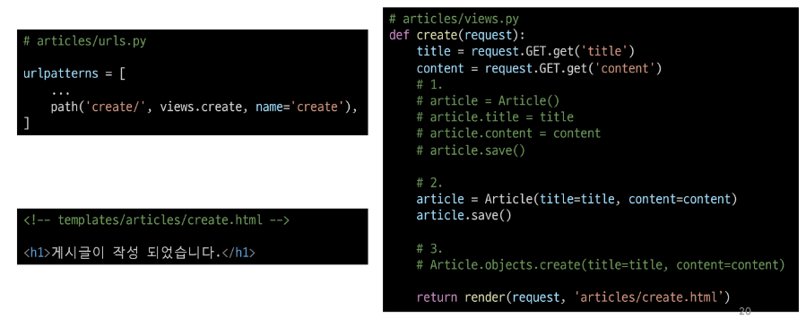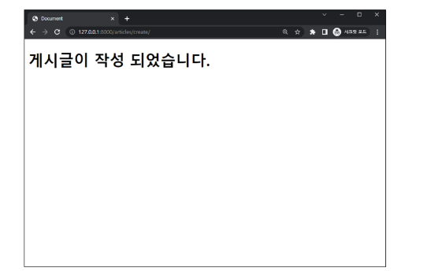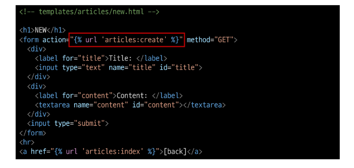
```
CRUD의 Create

첫 번째 방법
article = Article() -> 인스턴스가 하나 만들어졌다, article은 객체
article.title = 'first'
article.content = 'django!'
db 확인하기 -> 비어있다(안써졌다) -> 저장을 해야한다
article.save()
article 로 확인 -> 1로 바뀌었다 -> id
Article.objects.all() -> 게시글 전체 조회
다중 -> 쿼리셋 , 단일 -> 인스턴스
articles = Article.objects.all()
articles
articles[0] -> 쿼리셋의 인덱스가 존재
pk -> primary.key

두 번째 방법
인스턴스 생성
article = Article(title='second', content='django!')
article.title, article.content 는 있다 article.pk는없다 -> 아직 저장 안했다.

세 번째 방법
인스턴스생성도 하지 않는다
Article.objects.create(title='third', content='django!')

CRUD의 Read
Article.objects.all()
for article in articles:
    print(article.title)
Article.objects.get(pk=1)
Article.objects.get(content = 'django!') -> 단일 데이터 조회 get은 pk로 조회할 때 만 쓰자
-> 그떄는 filter를 활용하자
Article.objects.filter(content = 'django!')
Article.objects.filter(title = 'first')
3가지 방법 all() get() filter()

CRUD의 Update(수정) <- 항상 조회가 먼저 이루어진다
인스턴스에서 놀기 -> 반드시 save
article = Article.objects.get(pk=1)
article
article.title = 'byebye'
article.title
article.save()

CRUD의 Delete(삭제)
article
article.delete()
article
디비확인
전체 삭제 가능?
articles = Article.objects.all()
article.delete()

공식문서 django queryset api

추가 조회문
Article.objects.filter(content_contains='dja')
```

## HTTP request methods
+ HTTP
  + 네트워크 상에서 데이터를 주고 받기위한 약속
+ HTTP request methods
  + 데이터(리소스)에 어떤 요청(행동)을 원하는지를 나타내는 것
  + GET(조회할 때 사용 CRUD의 R) & POST(이외 나머지 모두 CRUD의 CUD)
### GET method
+ 특정 리소스를 '조회'하는 요청 / CRUD의 R
+ GET으로 데이터를 전달하면 Query String 형식으로 보내짐
+ 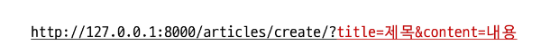

### POST method
+ 특정 리소스에 "변경(생성, 수정, 삭제)"을 요구하는 요청 / CRUD의 CUD
+ POST로 데이터를 전달하면 HTTP Body에 담겨 보내짐
+ 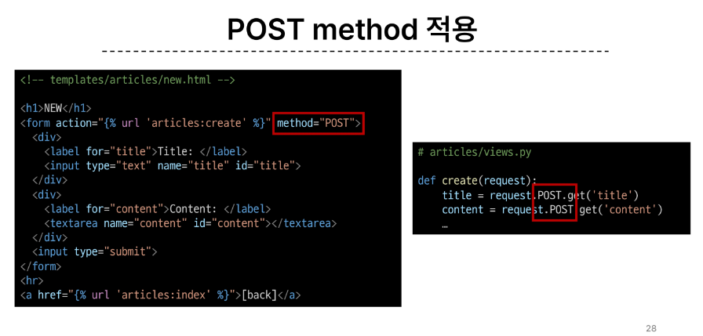

### HTTP resoponse status code
+ 특정 HTTP 요청이 성공적으로 완료되었는지를 3자리 숫자로 표현하기로 한것
+ [HTTP 코드](https://developer.mozilla.org/en-US/docs/Web/HTTP/Status)
+ 200번대 : 성공 
+ 300번대 : Redirection ?
+ 400번대 : 클라이언트 에러
+ 500번대 : 서버 에러

+ 403 Forbidden
  + 서버에 요청이 전달되었지만, 권한 때문에 거절되었다는 것을 의미
  + 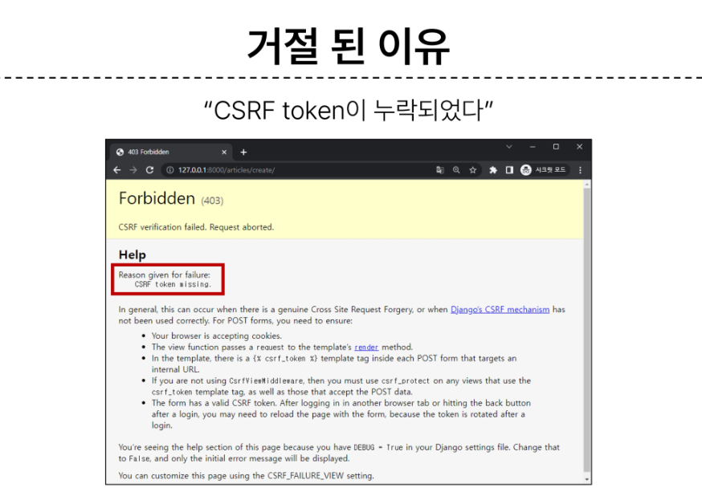

#### CSRF
+ Cross- Site- Request- Forgery
+ 사이트 간 요청 위조
  + 사용자가 자신의 의지와 무관하게 공격자가 의도한 행동을 하여 특정 웹페이지를 보안에 취약하게 하거나 수정,삭제등의 작업을 하게 만드는 공격

+ >CSRF Token 적용
  + DTL의 csrf-token 태그를 사용해 사용자에게 토큰 값을 부여
  + 요청 시 토큰 값도 함께 서버로 전송될 수 있도록 함
  + 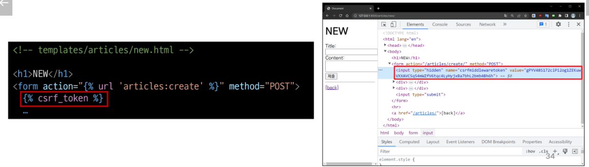

+ >요청 시 CSRF Token을 함께 보내야 하는 이유
  + Django 서버는 해당 요청이 DB에 데이터를 하나 생성하는(DB에 영향을 주는) 요청에 대해 "Django가 직접 제공한 페이지에서 데이터를 작성하고 있는 것 인지"에 대한 확인 수단이 필요한 것
  + 겉모습이 똑같은 위조 사이트나 정상적이지 않은 요청에 대한 방어수단
  + 기존
    + 요청데이터 => 게시글 작성
  + 변경
    + 요청데이터 + 인증 토큰 => 게시글 작성

+ > 왜 POST만 Token을 확인할까?
  + POST는 단순 조회가 아닌 특정 리소스에 변경(생성, 수정, 삭제)을 요구하는 의미와 기술적인 부분을 가지고 있기 때문에
  + DB에 조작을 가하는 요청은 반드시 인증 수단이 필요
  + 데이터베이스에 대한 변경 사항을 만드는 요청이기 때문에 토큰을 사용해 최소환의 신원을 확인하는 것.
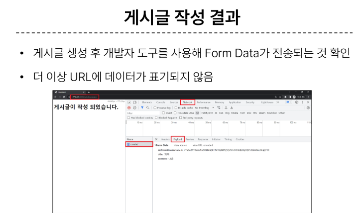

## redirect
+ 게시글 작성 후 완료를 알리는 페이지를 응답하는 것
  + 게시글을 "조회해줘!"라는 요청이 아닌 "작성해줘!"라는 요청이기 때문에 게시글 저장 후 페이지를 응답하는 것은 POST요청에 대한 적절한 응답이 아님
  + 데이터 저장 후 페이지를 주는 것이 아닌 다른 페이지로 사용자를 보내야 한다
    + 사용자를 보낸다 = 사용자가 GET요청을 한번 더 보내도록 해야한다.

+ redirect()
  + 클라이언트가 인자에 작성된 주소로 다시 요청을 보내도록 하는 함수
  + 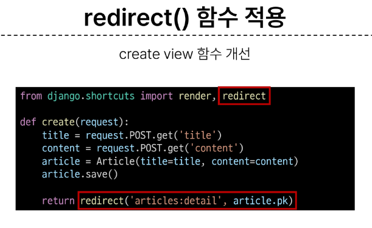
  + 특징
    + 해당 redirect에서 클라이언트는 detail url로 요청을 다시 보내게 됨
    + 결과적으로 detail view함수가 호출되어 detail view함수의 반환 결과인 detail페이즈를 응답받음
    + 결국 사용자는 게시글 작성 후 작성된 게시글의 detail 페이지로 이동하는 것으로 느끼게 되는 것 
    + 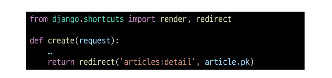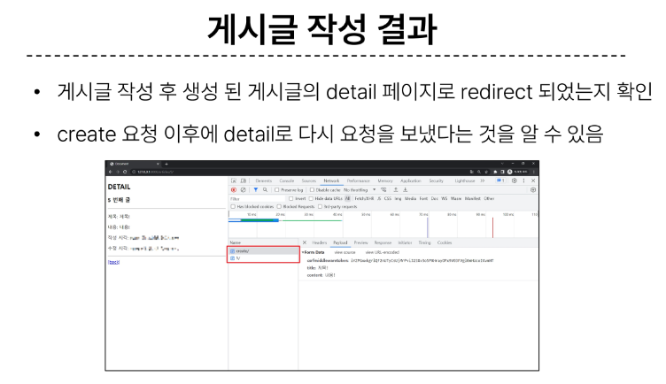

## Delete
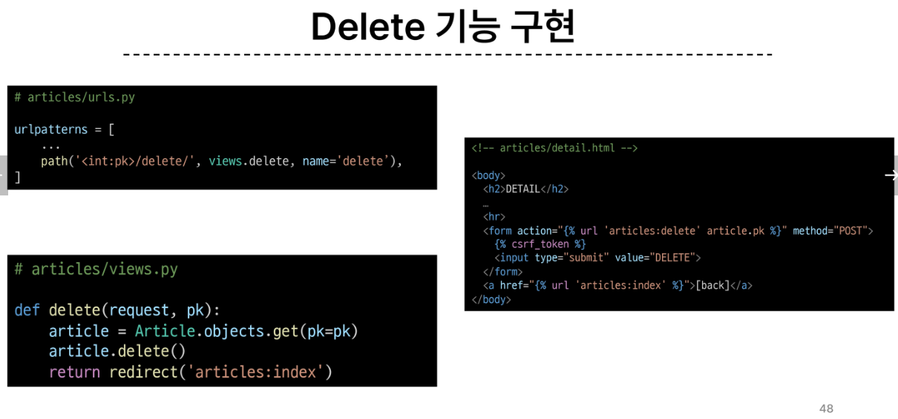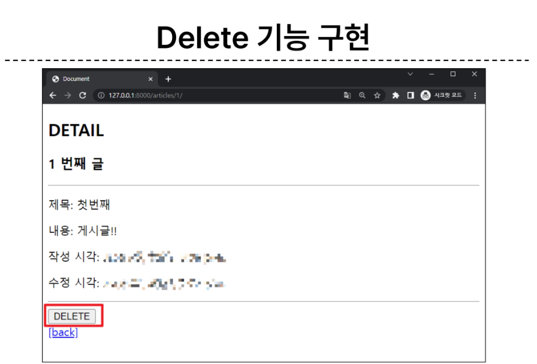

## Update
+ Update 로직을 구현하기 위해 필요한 view함수의 개수는?
  + edit : 사용자 입력 데이터를 받을 페이즈를 렌더링
  + update : 사용자가 입력한 데이터를 받아 DB에 저장
### edit 기능 구현
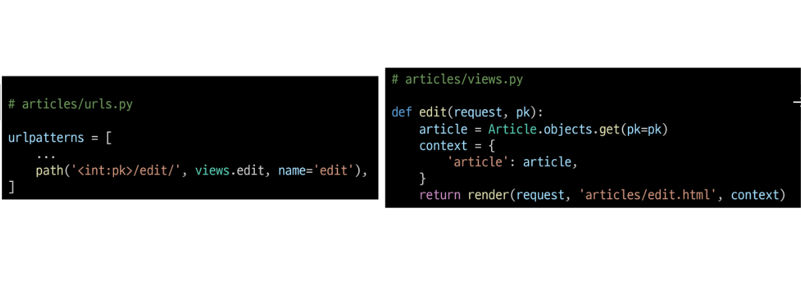 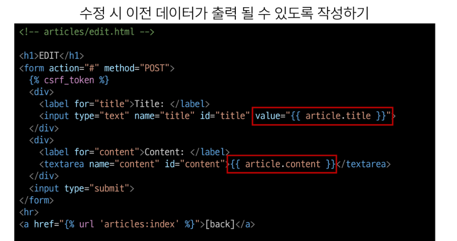 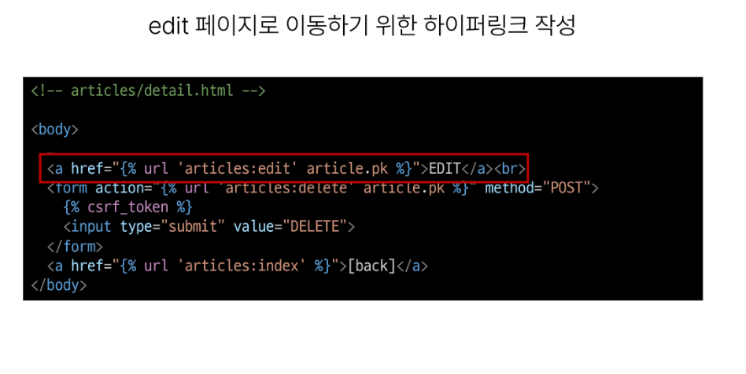 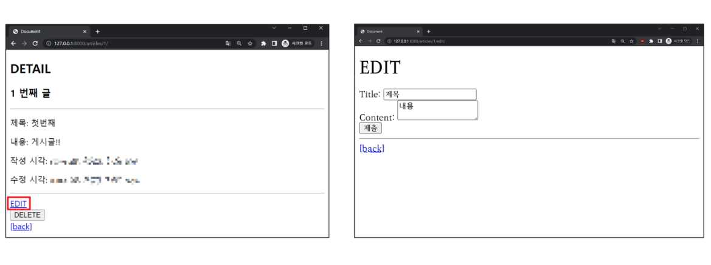
### upadte 기능 구현
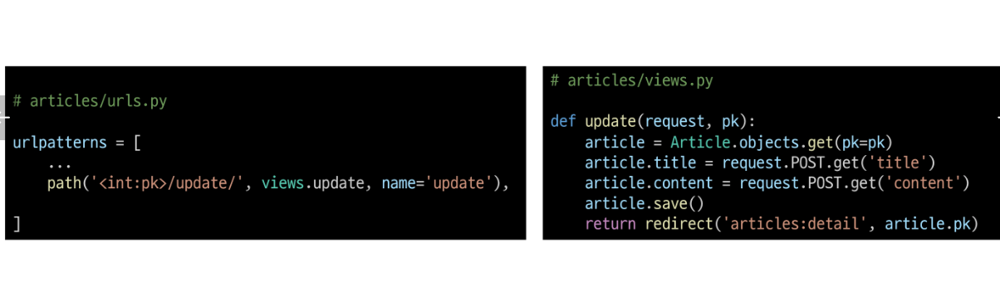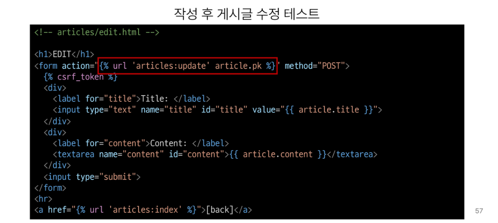
## 참고
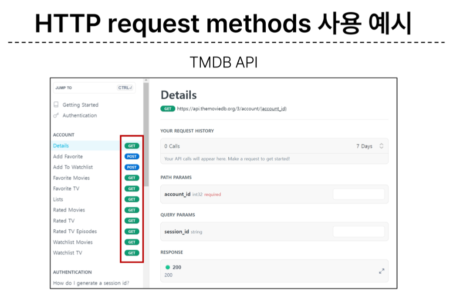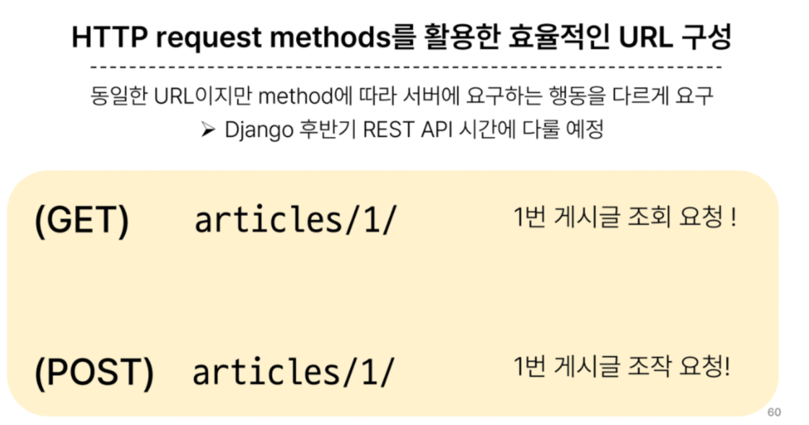