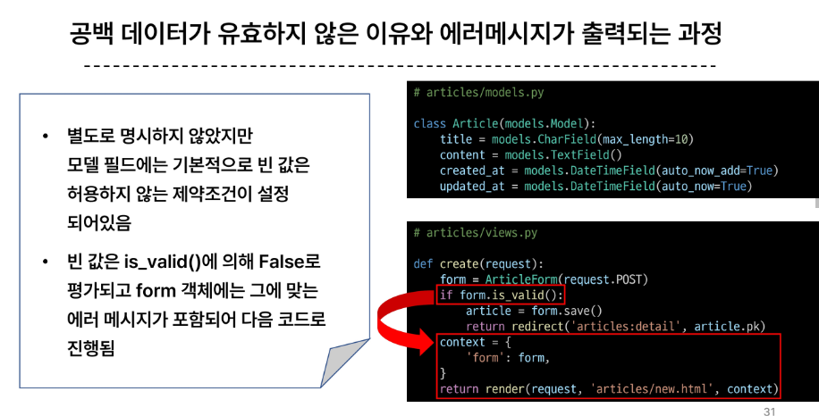

# 0926 Django Form
+ HTML 'form'
  + 지금까지 사용자로부터 데이터를 받기위해 활용한 방법
  + 그러나 비상적인 혹은 악의적인 요청을 필터링 할 수 없었음
  + => 유효한 데이터인지에 대한 확인이 필요

+ 유효성 검사
  + 수집한 데이터가 정확하고 유효하지 확인하는 과정
  + 유효성 검사를 구현하기 위해선 입력 값, 형식, 중복, 범위, 보안 등 많은 것들을 고려해야 함
  + 이런 과정과 기능을 직접 개발하는 것이 아닌 Django가 제공하는 Form을 사용!

## Django Form
+ 사용자 입력 데이터를 수집하고, 처리 및 유효성 검사를 수행하기 위한 도구
+ => 유효성 검사를 단순화하고 자동화 할 수 있는 기능을 제공
+ Form class 정의
```py
#articles/forms.py

from Django import forms

class ArticleForm(forms.Form)
    title = forms.CharField(max_length = 10)
    content = forms.CharField()
```
+ Form class를 적용한 new 로직


+ Form rendering options
  + label, input 쌍을 특정 HTML 태그로 감싸는 옵션
  + 

## Widgets
+ HTML 'input' element의 표현을 담당
+ Widget은 단순히 input 요소의 속성 및 출력되는 부분을 변경하는 것
+ 

## Django Model Form
+ Form 
  + 사용자 입력 데이터를 DB에 저장하지 않을 때 (ex. 로그인)
+ ModelForm
  + 사용자 입력 데이터를 DB에 저장해야 할 때 (ex. 게시글, 회원가입)
  + Model과 연결된 Form을 자동으로 생성해주는 기능을 제공
  + Form + model

+ ModelForm class 정의
```py
#articles/forms.py
# 기존 articleForm 클래스 수정
from Django import forms
form .models import Article

class ArticleForm(forms.ModelForm)
    class Meta:
        model = Article
        fiels = '__all__'
        # fields = ('title',)    # 일부만 적용할 때
        # exclude = ('title',)
```


### Meta class
+ > ModelForm의 정보를 작성하는 곳
+ 
+ ModelForm을 적용한 create 로직
  + 

+ > is_valid
  + 여러 유효성 검사를 실행하고, 데이터가 유효한지 여부를 Boolean 으로 반환
  + 

+ > ModelForm을 적용한 edit 로직
  + 

+ > ModelForm을 적용한 update 로직
  + 

+ > save()
  + 데이터베이스 객체를 만들고 저장
  + save() 메서드가 생성과 수정을 구분하는 법
    + 키워드 인자 instance 여부를 통해 생성할지, 수정할 지를 결정
    + 

### Django Form 정리
+ 사용자로부터 데이터를 수집하고 처리하기 위한 강력하고 유연한 도구
+ HTML form의 생성, 데이터 유효성 검사 및 처리를 쉽게 할 수 있도록 도움

### 참고
+ modelform 키워드 인자 data와 instance 살펴보기


+ Widget 응용
+ 
+ 

## Handling HTTP requests
### view 함수 구조 변화
+ new 와 create view 함수간 공통점과 차이점
+ 공통점
  + 데이터 생성을 구현하기 위함
+ 차이점
  + new는 GET method 요청만을
  + create는 POST method 요청만을 처리

+ > HTTP request method 차이점을 활용해 view 함수 구조 변경
+ 

+ > 새로운 create view 함수 
+ 

+ > 기존 new 관련 코드 수정
+ 

+ > request method에 따른 요청의 변화
+ 

+ > 새로운 update view 함수
+ 

+ > 기존 edit관련 코드 수정
+ 