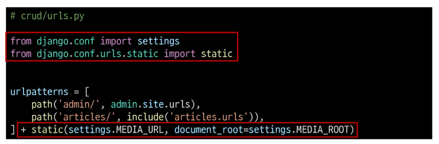
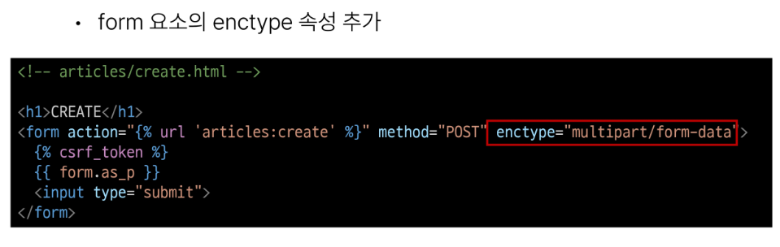
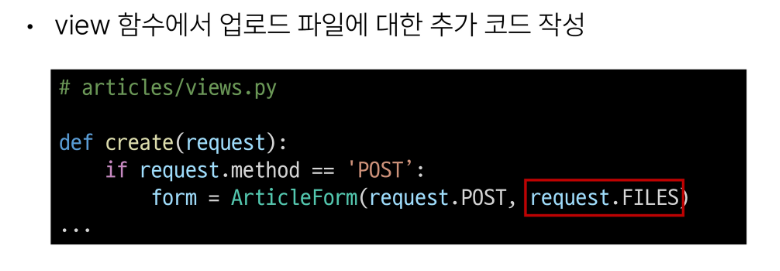
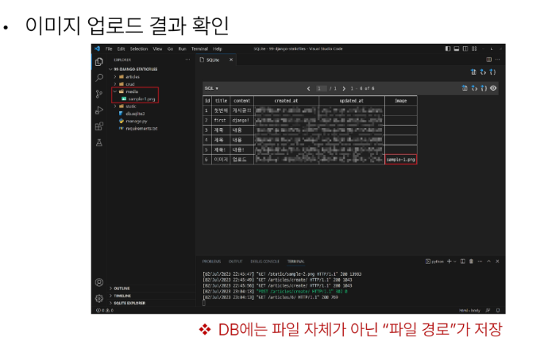
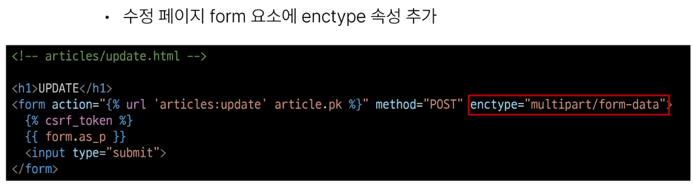
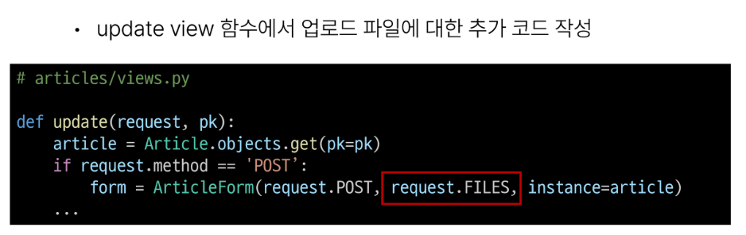

# 0927 Django Static files
## static files (정적 파일)
+ 서버 측에서 변경되지 않고 고정적으로 제공되는 파일
+ (이미지, JS, CSS파일 등)

+ 웹 서버와 정적파일
  + 웹서버의 기본동작은 특정 위치(URL)에 있는 자원을 요청(HTTP request)받아서 응답(HTTP response)을 처리하고 제공하는 것
  + 이는 " 자원에 접근 가능한 주소가 있다." 라는 의미
  + 웹 서버는 요청받은 URL로 서버에 존재하는 정적 자원을 제공함
  + 정적 파일 제공하기 위한 경로(URL)가 있어야 함
  + 

### static file 제공하기
+ 기본 경로에서 제공 & 추가 경로에서 제공

+ Static files 기본 경로
  + app폴더/static/
  + 

+ STATIC_URL
  + 기본 경로 및 추가 경로에 위치한 정적 파일을 참조하기 위한 URL
  + 실제 파일이나 디렉토리가 아니며, URL로만 존재
  + 

+ 
+ 
+ 
+ 정적 파일을 제공하려면 요청에 응답하기 위한 URL이 필요

## media files
+ 사용자가 웹에서 업로드하는 정적 파일 (user-uploaded)

+ ImageField()
  + 이미지 업로드에 사용하는 모델 필드
  + 이미지 객체가 직접 저장되는 것이 아닌 '이미지 파일의 경로' 가 문자열로 DB에 저장

+ 미디어 파일을 제공하기 전 준비
  1. setting.py 에 MEDIA_ROOT, MEDIA_URL 설정
  2. 작성한 MEDIA_ROOT와 MEDIA_URL 에 대한 url 지정

+ MEDIA_ROOT
  + 미디어 파일들이 위치하는 디렉토리의 절대경로
  + 

+ MEDIA_URL
  + MEDIA_ROOT에서 제공되는 미디어 파일에 대한 주소를 생성
  + (STATIC_URL과 동일한 역할)
  + 

+ MEDIA_ROOT와 MEDIA_URL에 대한 url 지정
  + 업로드 된 파일의 URL == settings.MEDIA_URL
  + 위 URL을 통해 참조하는 파일의 실제위치 == settings.MEDIA_ROOT
  + 

+ 이미지 업로드
  + 

## 업로드 이미지 제공

## 업로드 이미지 수정

## 참고
