# 0905 CSS Layout
## CSS Box Model
+ 모든 HTML 요소를 사각형 박스로 표현하는 개념
+ 모든 요소는 네모박스를 깎아쓰는것
### 구성요소 
+ 내용(content) - 콘텐츠가 표시되는 영역
+ 안쪽여백(padding) - 콘텐츠 주위에 위치하는 공백영역
+ 테두리(border) - 콘텐츠와 패딩을 감싸는 테두리 선(영역)
+ 외부간격(margin) - 이박스와 다른 요소 사이의 공(가장 바깥쪽영역)
+ 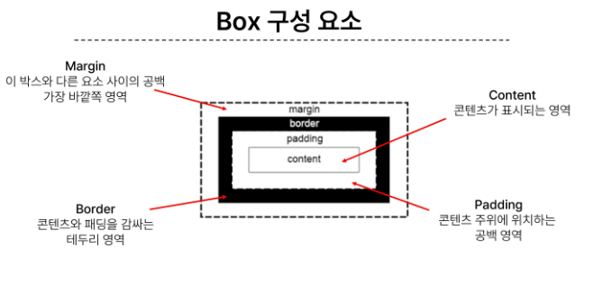
+ 방향은 top(위), bottom(아래), right(오른쪽), left(왼쪽)
+ width & height
  + 요소의 너비와 높이
  + CSS는 width값을 border가 아닌 content의 크기를 기준으로 한다!
  + ```html
    *{
        box-sizing: border-box;
    }
    ```
+  다음과 같이 선언하여서 사용
### 박스타입
+ Block & inline
+ Normal flow : CSS가 적용하지 않았을 경우 웹페이지 요소가 기본적으로 배치되는 방향
  + inline direction : 가로 / block direction : 세로
#### block 타입 특징
+ 항상 새로운 행으로 나뉨
+ width와 height 속성을 사용하여 너비와 높이를 지정할 수 있음
+ 기본적으로 widht를 지정하지않으면, 박스는 inline방향으로 사용 가능한 공간을 모두 차지함
+ 대표적인 block 타입 태그 (h1~h6, p, div)

#### inline 타입 특징
+ 새로운 행으로 나뉘지 않음
+ widht와 height 속성을 사용할 수가 없음
+ 수직방향
  + padding, margins, borders가 적용되지만 다른요소를 밀어낼 수는 없음
+ 수평방향
  + padding, margins, borders가 적용되어 다른 요소를 밀어낼 수 있음
+ 대표적인 inline 타입 태그 (a, img, span)

### 기타 display 속성
+ inline-block
  + inline과 block요소 사이의 중간 지점을 제공하는 display값
  + blcok요소의 특징을 가짐
    + width와 height 속성 사용가능
    + padding, margin, border 로 인해 다른 요소가 밀려남
  + 요소가 줄 바꿈 되는 것을 윈치않으면서도, 너비와 높이를 적용하고 싶을 때 사용
+ none
  + 요소를 화면에 표시하지않고, 공간조차 부여하지않음

## CSS Layout Position
+ 각 요소의 위치와 크기를 조정하여 웹페이지의 디자인을 결정하는 것
+ Display, Position, Float, Flexbox 등
### CSS position
+ 요소를 Normal Flow에서 제거하여 다른 위치로 배치하는 것
+ 다른 요소 위에 올리기, 화면의 특정 위치에 고정시키기 등
+ 이동방향
  + 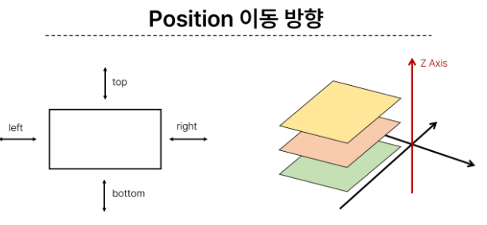
+ 유형(position)
  + static
    + 기본값
    + 요소를 Normal Flow에 따라 배치
  
  + relative
    + 요소를 Normal Flow에 따라 배치
    + 자기 자신을 기준으로 이동
    + 요서가 차지하는 공간은 static일때와 같음
     
  + absolute
    + 요소를 Normal Flow에서 제거
    + 가장 가까운 relative 부모 요소를 기준으로 이동
    + 문서에서 요소가 차지하는 공간이 없어짐 
    + 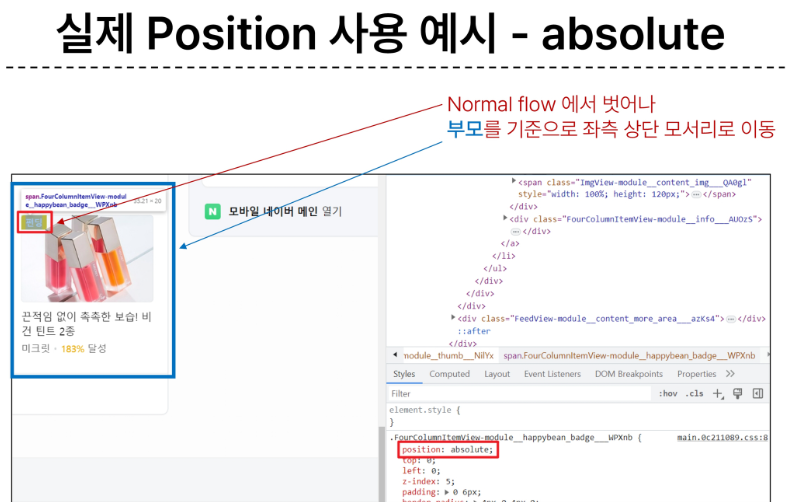
    + 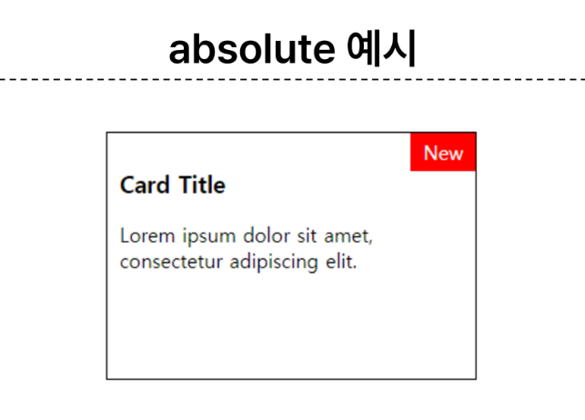
    + 위와 같이 부모 요소의 좌측 상단 등에 나타내 표시(NEW)
     
  + fixed
    + 요소를 Normal Flow에서 제거
    + 현재 화면영역(viewport)를 기준으로 이동
    + 문서에서 요소가 차지하는 공간이 없어짐 
    + 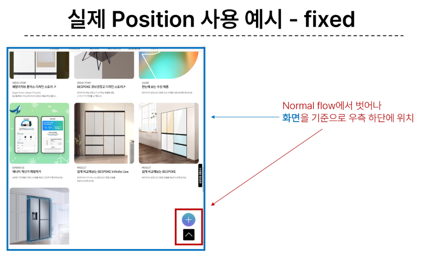

  + sticky
    + 요소를 Normal Flow에 따라 배치
    + 요소가 일반적인 문서 흐름에 따라 배치되다가 스크롤이 특정 임계점에 도달하면 그 위치에서 고정됌(fixed)
    + 만약 다음 sticky요소가 나오면 다음 sticky 요소가 이전 sticky 요소의 자리를 대체
      + 이전 sticky 요소가 고정되어 있던 위치와 다음 sticky 요소가 고정되어야 할 위치가 겹치기 때문에
    + 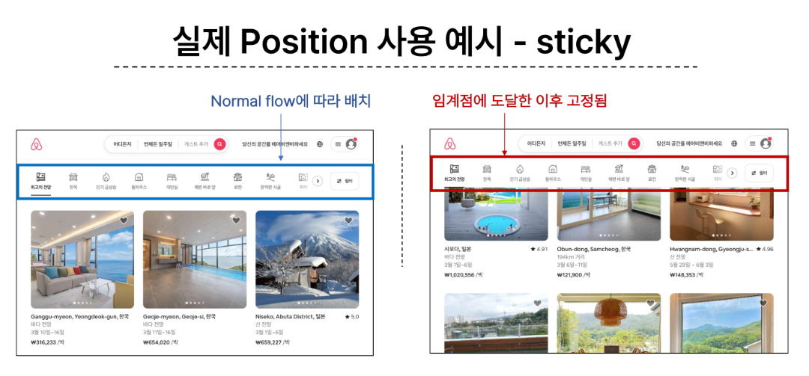

### Z-index
+ 요소가 겹쳤을 때 어떤 요소순으로 위에 나타낼지 결정
+ 특징
  + 정수 값을 사용해 Z축 순서를 지정
  + 더 큰 값을 가진 요소가 작은 값의 요소를 덮음
+ z-index : 1; 

## CSS layout Flexbox
### CSS Flexbox
+ 요소를 행과 열 형태로 배치하는 1차원 레이아웃 방식
+ 공간배열 & 정렬

#### 구성요소
+ 요소를 행과 열 형태로 배치하는 1차원 레이아웃 방식
+ 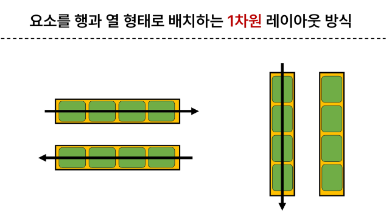
+ 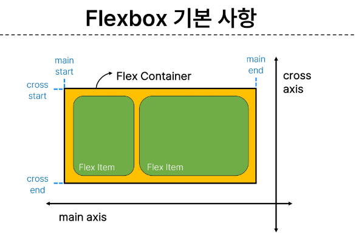
+ main axis (주축)
  + flex item들이 배치되는 기본 축
  + main start에서 시작하여 main end 방향으로 배치
  
+ cross axis (교차 축)
  + main axis에 수직인 축
  + cross start에서 시작하여 cross end방향으로 배치
  
+ Flex Container
  + display: flex; 혹은 display: inline-flex;가 설정된 부모 요소
  + 이 컨테이너의 1차 자식 요소들이 Flex item이 됨
  + flexbox 속성 값들을 사용하여 자식 요소 Flex item들을 배치

+ Flex item
  + Flex Container 내부에 레이아웃 되는 항목

#### 레이아웃 구성
1. Flex Container 지정
   + flex item은 기본적으로 행으로 나열
   + flex item은 주축의 시작 선에서 시작
   + flex item은 교차축의 크기를 채우기 위해 늘어남
   + 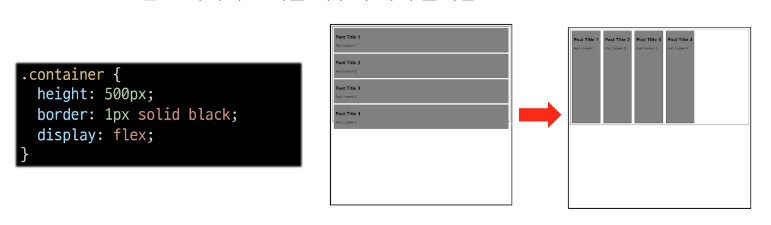
  
2. Flex direction 지정
   + flex item이 나열되는 방향을 지정
   + column으로 지정할 경우 주 축이 변경됨
   + -reverse로 지정하면 시작 선과 끝 선이 서로 바뀜
   + 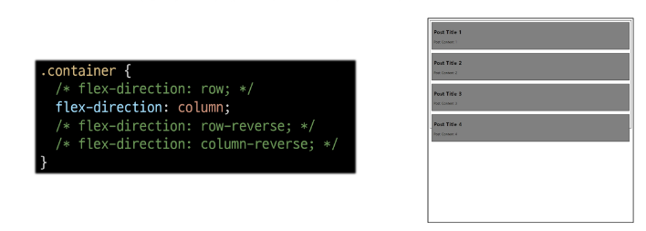

3. flex-wrap
   + flex item 목록이 flex container의 하나의 행에 들어가지 않을 경우 다른 행에 배치할지 여부 결정
   + 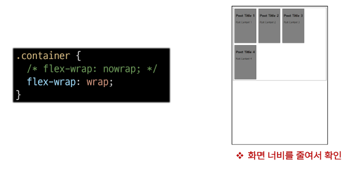

4. justify-content
   + 주 축을 따라 flex item과 주위에 공간을 분배
   + 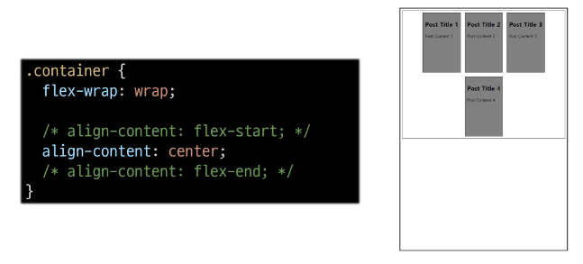

5. align-content
   + 교차 축을 따라 flex item과 주위에 공간을 분배
     + flew-wrap이 wrap 또는 wrap-reverse로 설정된 여러 행에만 적용됨
     + 한줄 짜리 행에는 (flex-wrap이 nowrap으로 설정된 경우) 효과 없음
     + 

6. align-items
   * 교차 축을 따라 flex item 행을 정렬
   * 

7. align-self
   * 교차 축을 따라 개별 flex item을 정렬
   * 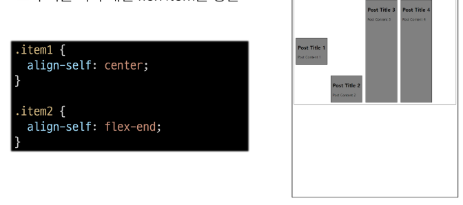

##### Flexbox 속성
+ Flex Container 관련 속성
  + display, flex-direction, flex-wrap, justify-content, align-items, align-content
  
+ Flex item 관련 속성 
  + align-self, flex-grow, flex-basis, order    

##### 목적에 따른 분류
+ 배치
  + flex-direction
  + flex-wrap
+ 공간분배
  + justify-content
  + align-content
+ 정렬
  + align-items
  + align-self

##### 속 성명 Tip
+ justify = 주축
+ align = 교차 축

8. flex-grow
   - 남는 행 여백을 비율에 다라 각 flex item에 분배 
     - 아이템이 컨테이너 내에서 확장하는 비율을 지정
   + flex-grow 의 반대는 flex-shrink
   + 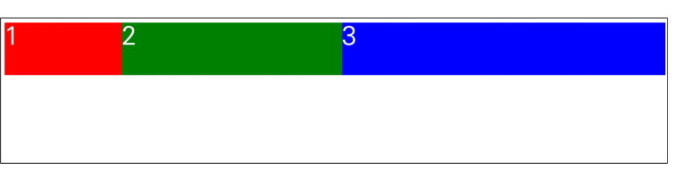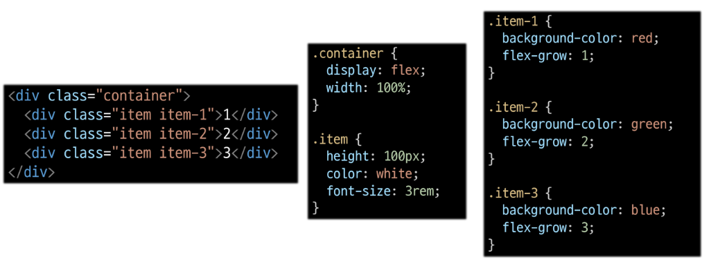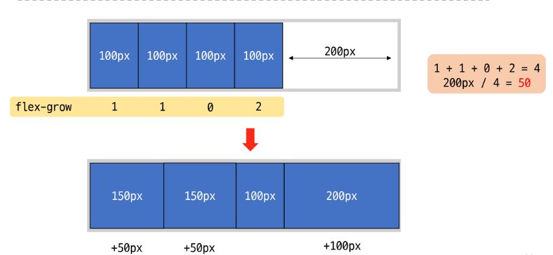

9. flex-basis
   + flex item의 초기 크기 값을 지정
   + flex-basis 와 width 값을 동시에 적용한 경우 flex-basis가 우선
   + 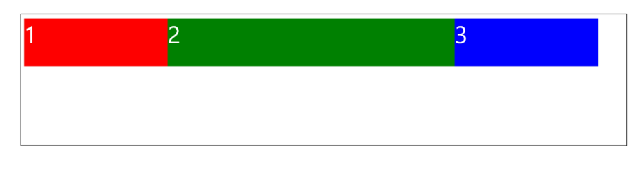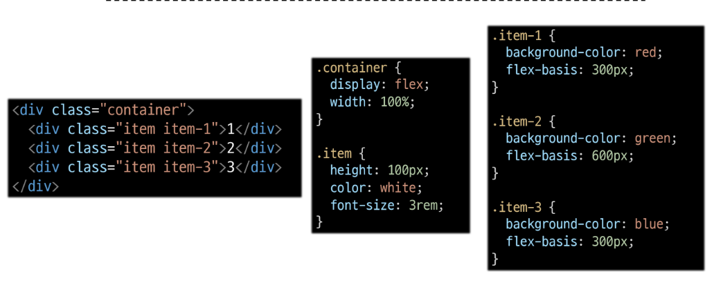

#### flew-wrap 응용
+ 반응형 레이아웃
  + 다양한 디바이스와 화면크기에 자동으로 적응하여 콘텐츠를 최적으로 표시하는 웹 레이아웃 방식
+ 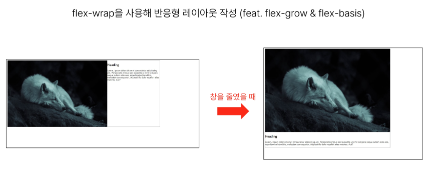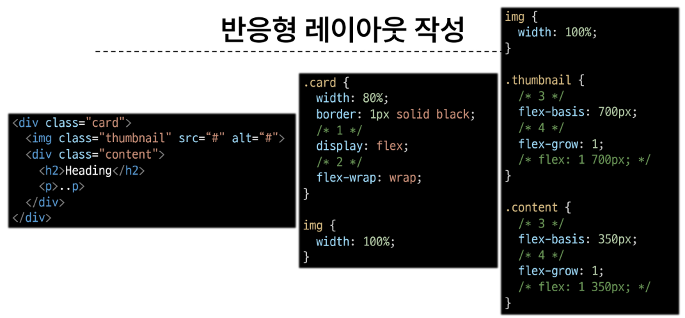


## 정리
### flex-direction
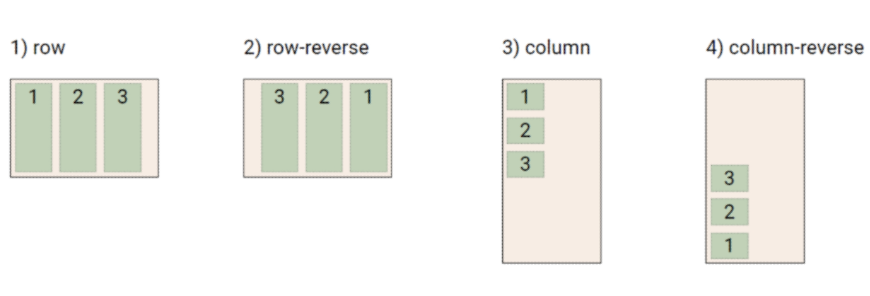
### flex-wrap
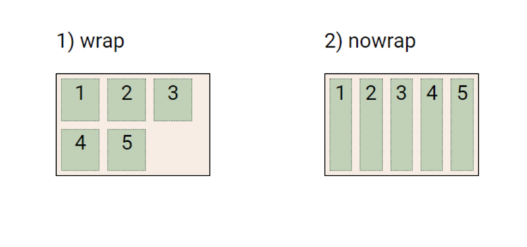
### justify-content
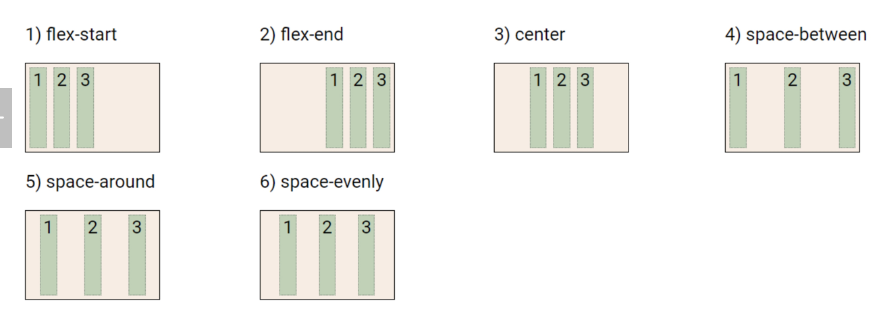
### align-content
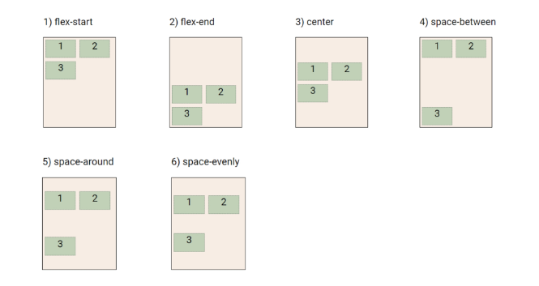
### align-items
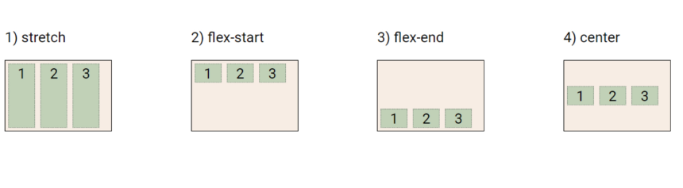
### align-self
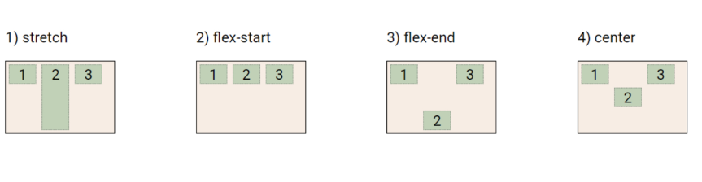
## 참고 ( 실습 내용 확인 )
### shorthand 속성
+ border
  + border-width, border-style, border-color 를 한번에 설정하기 위한 속성
  + ```html
    border: 2px solid black;
    ```
+ margin and padding
  + 4방향의 속성을 각각 지정하지 않고 한번에 지정할 수 있는 속성
  + 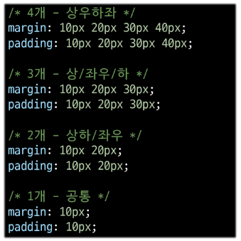

+ margine collapsing(마진 상쇄)
  + 두 block타입 요소의 margin top과 bottom이 만나 더 큰 margin으로 결합되는 현상
  + 웹 개발자가 레이아웃을 더욱 쉽게 관리할 수 있도록 함
    + 각 요소에 대한 상/하 margin을 각각 설정하지 않고 한 요소에 대해서만 설정하기 위함
  + 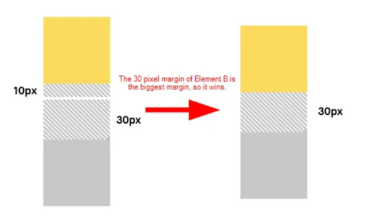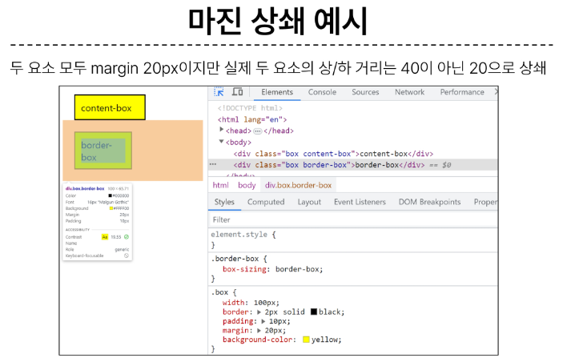

### position의 역할  
+ 전체 페이지에 대한 레이아웃을 구성하는 것이 아닌 페이지의 특정 항목의 위치를 조정하는 것에 관한 것!!

+ justify-items 및 justify-self 속성이 없는 이유
  + 필요없음
  + margin auto를 통해 정렬 및 배치가 가능

+ shorthand
  + flex-flow
  + 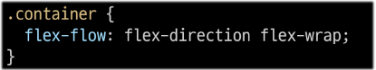
  + flex
  + 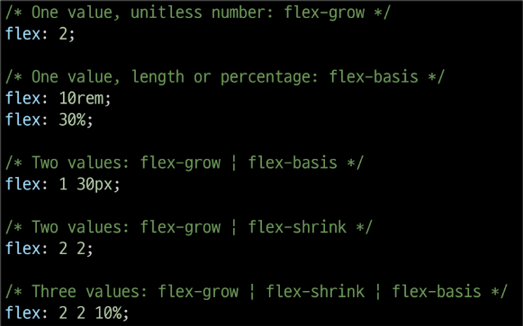

```

CSS에서 display 속성은 HTML 요소의 표시 방법을 지정하는 데 사용됩니다. 이 속성을 사용하여 요소가 화면에 어떻게 렌더링되는지 제어할 수 있습니다. display 속성은 다양한 값들을 가질 수 있으며, 각 값은 다른 표시 방법을 나타냅니다. 일반적으로 다음과 같은 몇 가지 display 속성 값이 있습니다:

block: 이 값은 요소를 블록 수준 요소로 표시하며, 요소가 새로운 줄에서 시작하고 너비가 부모 요소의 100%를 차지합니다. 대표적으로 <div>, <p>, <h1>과 같은 요소가 블록 수준 요소입니다.

inline: 이 값은 요소를 인라인 요소로 표시하며, 요소가 텍스트 흐름 내에서 자리를 차지하고 너비와 높이가 내용에 따라 조정됩니다. 대표적으로 <span>, <a>, <strong>과 같은 요소가 인라인 요소입니다.

inline-block: 이 값은 요소를 인라인 블록 요소로 표시하며, 요소가 텍스트 흐름 내에서 자리를 차지하면서도 너비와 높이를 지정할 수 있습니다. 이는 블록과 인라인 요소의 중간 형태로 생각할 수 있습니다.

none: 이 값은 요소를 화면에 표시하지 않습니다. 요소가 숨겨져 있는 상태가 됩니다.

flex: 이 값은 요소를 플렉스 컨테이너로 설정하며, 플렉스 아이템을 가로로 정렬하는 데 사용됩니다. 플렉스 레이아웃을 만들 때 유용합니다.

grid: 이 값은 요소를 그리드 컨테이너로 설정하며, 그리드 아이템을 그리드 레이아웃에 배치하는 데 사용됩니다. 그리드 레이아웃을 만들 때 사용됩니다.

display 속성은 웹 페이지의 레이아웃을 디자인하고 요소의 배치와 표시 방법을 제어하는 데 중요한 역할을 합니다. 각 값은 특정한 레이아웃 요구 사항에 맞게 선택되며, 원하는 디자인을 구현하는 데 사용됩니다.
```