# 0906 Fundamentals of Bootstrap
## Bootstrap
+ CSS 프론트엔드 프레임워크(Toolkit)
+ 미리 만들어진 다양한 디자인 요소들을 제공하여 웹 사이트를 빠르고 쉽게 개발할 수 있도록 함
+ 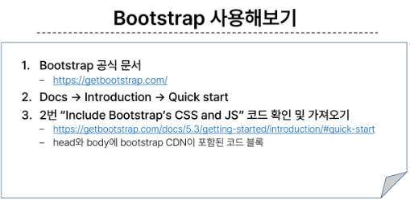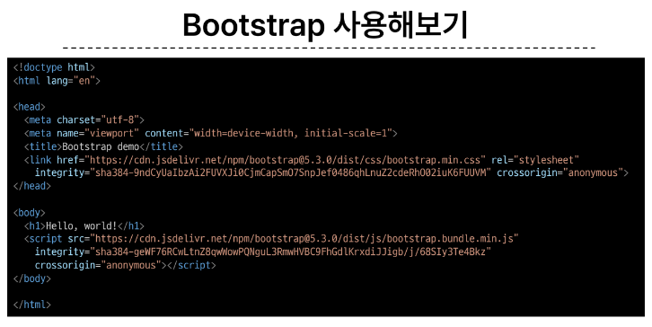
+ 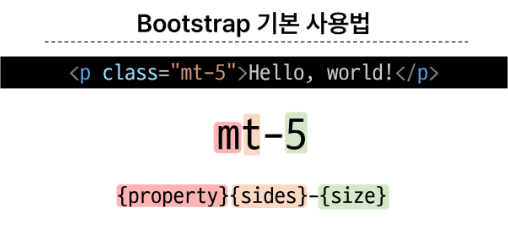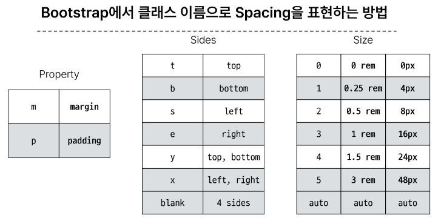
+ Bootstrap 에는 특정한 규칙이 있는 클래스 이름으로 이미 스타일 및 레이아웃이 작성되어 있음
### Typography
+ 제목, 본문 텍스트, 목록 등
+ Display headings
  + 기존 Heading보다 더 눈에 띄는 제목이 필요한 경우(더 크고 약간 다른 스타일)
  + ```html
    <h1 class="display-1">Display 1</h1>
    <h2 class="display-2">Display 2</h2>
    <h3 class="display-3">Display 3</h3>
    <h4 class="display-4">Display 4</h4>
    <h5 class="display-5">Display 5</h5>
    <h6 class="display-6">Display 6</h6>
    ```
+ Inline text elements
  + HTML inline 요소에 대한 스타일
  + ```html
    <p>You can use the mark tag to <mark>highlight</mark> text.</p>
    <p><del>This line of text is meant to be treated as deleted text.</del></p>
    <p><s>This line of text is meant to be treated as no longer accurate.</s></p>
    <p><ins>This line of text is meant to be treated as an addition to the document.</ins></p>
    <p><u>This line of text will render as underlined.</u></p>
    <p><small>This line of text is meant to be treated as fine print.</small></p>
    <p><strong>This line rendered as bold text.</strong></p>
    <p><em>This line rendered as italicized text.</em></p>
    ```

+ lists
  + HTML list에 대한 스타일
  + ```html
    <ul class="list-unstyled">
        <li>This is a list.</li>
        <li>It appears completely unstyled.</li>
        <li>Structurally, it's still a list.</li>
        <li>However, this style only applies to immediate child elements.</li>
        <li>Nested lists:
        <ul>
            <li>are unaffected by this style</li>
            <li>will still show a bullet</li>
            <li>and have appropriate left margin</li>
        </ul>
        </li>
        <li>This may still come in handy in some situations.</li>
    </ul>    
    ```

### colors
+ Bootstrap Color Sysyem
  + Bootstrap이 지정하고 제공하는 색상 시스템

+ Colors
  + Text,Border, Background 및 다양한 요소에 사용하는 색상키워드
  + 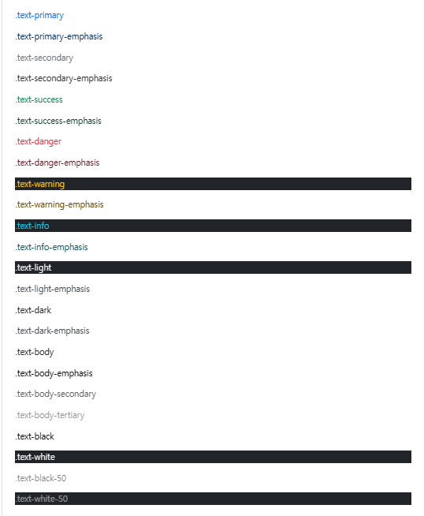
  + ```html
    <!doctype html>
    <html lang="en">
    <head>
        <meta charset="utf-8">
        <meta name="viewport" content="width=device-width, initial-scale=1">
        <title>Bootstrap demo</title>
        <link href="https://cdn.jsdelivr.net/npm/bootstrap@5.3.1/dist/css/bootstrap.min.css" rel="stylesheet" integrity="sha384-4bw+/aepP/YC94hEpVNVgiZdgIC5+VKNBQNGCHeKRQN+PtmoHDEXuppvnDJzQIu9" crossorigin="anonymous">
    </head>
    <body>
        <p class="text-primary">.text-primary</p>
        <p class="text-primary-emphasis">.text-primary-emphasis</p>
        <p class="text-secondary">.text-secondary</p>
        <p class="text-secondary-emphasis">.text-secondary-emphasis</p>
        <p class="text-success">.text-success</p>
        <p class="text-success-emphasis">.text-success-emphasis</p>
        <p class="text-danger">.text-danger</p>
        <p class="text-danger-emphasis">.text-danger-emphasis</p>
        <p class="text-warning bg-dark">.text-warning</p>
        <p class="text-warning-emphasis">.text-warning-emphasis</p>
        <p class="text-info bg-dark">.text-info</p>
        <p class="text-info-emphasis">.text-info-emphasis</p>
        <p class="text-light bg-dark">.text-light</p>
        <p class="text-light-emphasis">.text-light-emphasis</p>
        <p class="text-dark bg-white">.text-dark</p>
        <p class="text-dark-emphasis">.text-dark-emphasis</p>

        <p class="text-body">.text-body</p>
        <p class="text-body-emphasis">.text-body-emphasis</p>
        <p class="text-body-secondary">.text-body-secondary</p>
        <p class="text-body-tertiary">.text-body-tertiary</p>

        <p class="text-black bg-white">.text-black</p>
        <p class="text-white bg-dark">.text-white</p>
        <p class="text-black-50 bg-white">.text-black-50</p>
        <p class="text-white-50 bg-dark">.text-white-50</p>
        <script src="https://cdn.jsdelivr.net/npm/bootstrap@5.3.1/dist/js/bootstrap.bundle.min.js" integrity="sha384-HwwvtgBNo3bZJJLYd8oVXjrBZt8cqVSpeBNS5n7C8IVInixGAoxmnlMuBnhbgrkm" crossorigin="anonymous"></script>
    </body>
    </html>
    ```
+ + 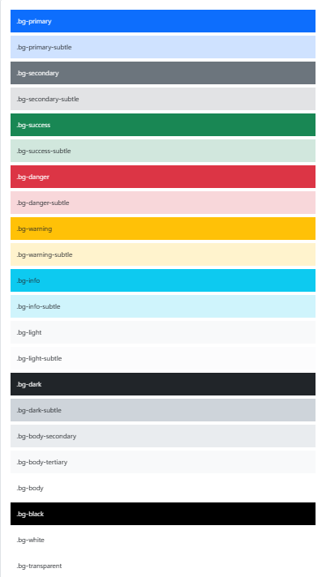
  + ```html
    <!doctype html>
    <html lang="en">    
    <head>
        <meta charset="utf-8">
        <meta name="viewport" content="width=device-width, initial-scale=1">
        <title>Bootstrap demo</title>
        <link href="https://cdn.jsdelivr.net/npm/bootstrap@5.3.1/dist/css/bootstrap.min.css" rel="stylesheet" integrity="sha384-4bw+/aepP/YC94hEpVNVgiZdgIC5+VKNBQNGCHeKRQN+PtmoHDEXuppvnDJzQIu9" crossorigin="anonymous">
    </head>
    <body>
        <div class="p-3 mb-2 bg-primary text-white">.bg-primary</div>
        <div class="p-3 mb-2 bg-primary-subtle text-emphasis-primary">.bg-primary-subtle</div>
        <div class="p-3 mb-2 bg-secondary text-white">.bg-secondary</div>
        <div class="p-3 mb-2 bg-secondary-subtle text-emphasis-secondary">.bg-secondary-subtle</div>
        <div class="p-3 mb-2 bg-success text-white">.bg-success</div>
        <div class="p-3 mb-2 bg-success-subtle text-emphasis-success">.bg-success-subtle</div>
        <div class="p-3 mb-2 bg-danger text-white">.bg-danger</div>
        <div class="p-3 mb-2 bg-danger-subtle text-emphasis-danger">.bg-danger-subtle</div>
        <div class="p-3 mb-2 bg-warning text-dark">.bg-warning</div>
        <div class="p-3 mb-2 bg-warning-subtle text-emphasis-warning">.bg-warning-subtle</div>
        <div class="p-3 mb-2 bg-info text-dark">.bg-info</div>
        <div class="p-3 mb-2 bg-info-subtle text-emphasis-info">.bg-info-subtle</div>
        <div class="p-3 mb-2 bg-light text-dark">.bg-light</div>
        <div class="p-3 mb-2 bg-light-subtle text-emphasis-light">.bg-light-subtle</div>
        <div class="p-3 mb-2 bg-dark text-white">.bg-dark</div>
        <div class="p-3 mb-2 bg-dark-subtle text-emphasis-dark">.bg-dark-subtle</div>
        <p class="p-3 mb-2 bg-body-secondary">.bg-body-secondary</p>
        <p class="p-3 mb-2 bg-body-tertiary">.bg-body-tertiary</p>

        <div class="p-3 mb-2 bg-body text-body">.bg-body</div>
        <div class="p-3 mb-2 bg-black text-white">.bg-black</div>
        <div class="p-3 mb-2 bg-white text-dark">.bg-white</div>
        <div class="p-3 mb-2 bg-transparent text-body">.bg-transparent</div>
        <script src="https://cdn.jsdelivr.net/npm/bootstrap@5.3.1/dist/js/bootstrap.bundle.min.js" integrity="sha384-HwwvtgBNo3bZJJLYd8oVXjrBZt8cqVSpeBNS5n7C8IVInixGAoxmnlMuBnhbgrkm" crossorigin="anonymous"></script>
    </body>
    </html>
    ```

+ 실습해보기
+ 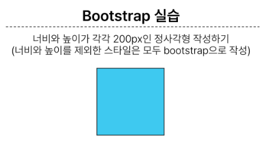
  ```html
  <!DOCTYPE html>
    <html lang="en">

    <head>
    <meta charset="UTF-8">
    <meta http-equiv="X-UA-Compatible" content="IE=edge">
    <meta name="viewport" content="width=device-width, initial-scale=1.0">
    <title>Document</title>
    <link href="https://cdn.jsdelivr.net/npm/bootstrap@5.3.1/dist/css/bootstrap.min.css" rel="stylesheet"
        integrity="sha384-4bw+/aepP/YC94hEpVNVgiZdgIC5+VKNBQNGCHeKRQN+PtmoHDEXuppvnDJzQIu9" crossorigin="anonymous">
    <style>
        .box {
        width: 200px;
        height: 200px;
        }
    </style>
    </head>

    <body>
    <div class="box"></div>
    <div class="box border border-dark bg-info m-5 "></div>
    <script src="https://cdn.jsdelivr.net/npm/bootstrap@5.3.1/dist/js/bootstrap.bundle.min.js"
        integrity="sha384-HwwvtgBNo3bZJJLYd8oVXjrBZt8cqVSpeBNS5n7C8IVInixGAoxmnlMuBnhbgrkm"
        crossorigin="anonymous"></script>
    </body>

    </html>
    ```

### component
+ Bootstrap에서 제공하는 UI관련 요소
  + UI요소 => 버튼 네비게이션 바, 카드, 폼, 드롭다운 등

+ 대표 Component
  + Alerts
  + Badges
  + Buttons
  + Cards
  + Navbar

+ id이름이 같다면 버튼등과 동작등이 겹쳐서 제대로 이루어지지 않으니 이름이 겹치지 않도록 주의해야 함!!!!!!!
+ Component 이점
  + 일관된 디자인을 제공하여 웹사이트의 구성 요소를 구축하는데 유용하게 활용

## Sematic Web
+ 웹 데이터를 의미론적으로 구조화된 형태로 표현하는 방식
+ 목적과 역할에 맡게 어떻게 보일 수 있도록 작성
  
### semantic in HTML
+ HTML Semantic Element
  + 기본적인 모양과 기능 이외에 의미를 가지는 HTML 요소
  + 검색엔진 및 개발자가 웹페잊 콘텐츠를 이해하기 쉽도록
  + header
  + nav
  + main
  + article
  + section
  + aside
  + footer
+ 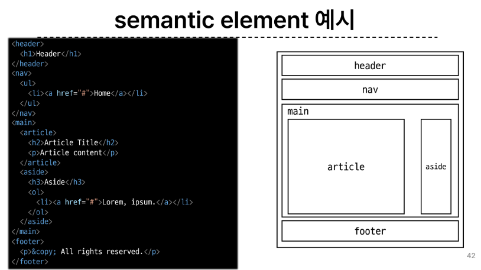

### semantic in CSS
+ OOCSS
  + objected oriented CSS
  + 객체지향 접근법을 적용하여 CSS를 구성하는 방법론
  + 기본원칙
    1. 구조와 스킨을 분리
       1. 구조와 스킨을 분리함으로써 자사용성 높임
       2. 모든 버튼의 공통구조를 정의 + 각각의 스킨(배경색과 폰트 색상)정의
    2. 컨테이너와 콘텐츠를 분리 
       + 객체에 직접 적용하는 대신 객체를 둘러싸는 컨테이너에 스타일 적용
       + 스타일을 정의할 때 위치에 의존적인 스타일을 사용하지 않도록 함
       + 콘텐츠를 다른 컨테이너로 이동시키거나 재배치할 때 스타일이 깨지는 것을 방지 
       + 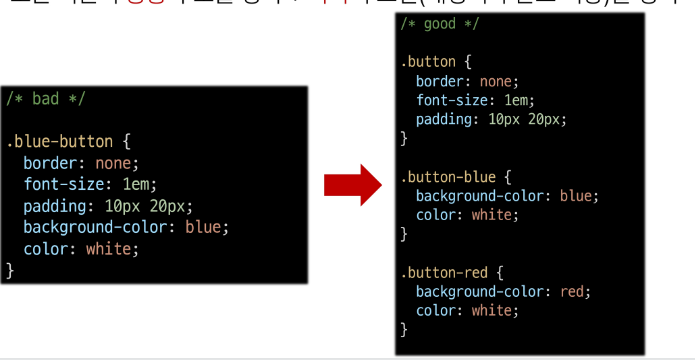
    + .header와 .footer 클래스가 폰트 크기와 색 둘다 영향을 줌
      + .container와 .title이 폰트 크기 담당(콘텐츠 스타일)
      + .header와 .footer가 폰트 색 담당(컨테이너 스타일)
      + 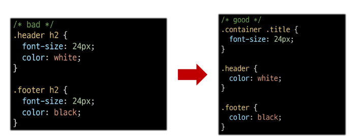
    + 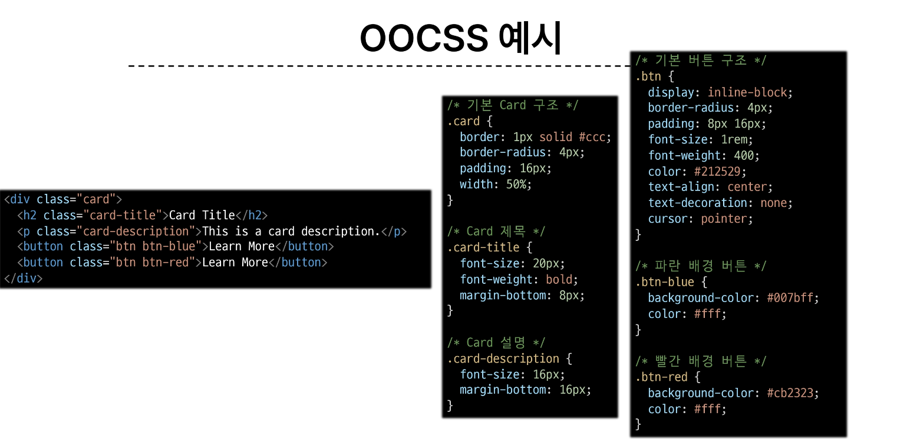
+ CSS 방법론
  + CSS를 효율적이고 유지 보수가 용이하게 작성하기 위한 일련의 가이드라인

#### 참고
+ CDN
  + Content Delivery Network
  + 지리적 제약 없이 빠르고 안전하게 콘텐츠를 전송할 수 있는 전송 기술
  + 서버와 사용자 사이의 물리적인 거리를 줄여 콘텐츠 로딩에 소요되는 시간을 최소화(웹 페이지 로드 속도를 높임)
  + 지리적으로 사용자와 가까운 CDN서버에 콘텐츠를 저장해서 사용자에게 전달
  + 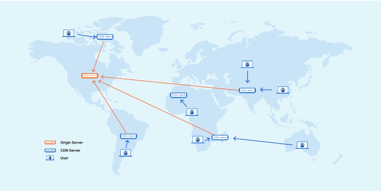
  + 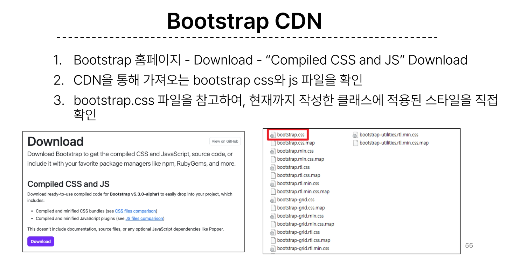
+ Bootstrap을 사용하는 이유
  + 가장 인기있고 잘 정립된 CSS프레임워크
  + 사전에 디자인된 다양한 컴포넌트 및 기능
    + 빠른 개발과 유지보수
  + 손쉬운 반응형 웹 디자인 구현
  + 커스터마이징이 용이
  + 크로스 브라우징 지원
    + 모든 주요 브라우저에서 작동하도록 설계되어 있음
+ 책임과 역할
  + HTML = 콘텐츠의 구조와 읨
  + CSS = 레이아웃과 디자인
+ 의미론적인 마크업의 이점
  + 검색엔진 최적화(SEO)
    + 검색엔진이 해당 웹사이트를 분석하기 쉽게 만들어 검색 순위에 영향을 줌
  + 웹 접근성
    + 시작 장애 사용자가 스크린 리더기로 웹페이지를 사용할 떄 추가적으로 도움