# 0912 Django
## Framework
+ 웹 어플리케이션을 빠르게 개발할 수 있도록 도와주는 도구 
  + 개발에 필요한 기본 구조, 규칙, 라이브러리 등을 제공

+ 왜 프레임워크를 사용하는가?
  + 기본적인 구조, 도구, 규칙 등을 제공하기 때문에 개발자는 필수적인 해야하는 핵심 개발에만 집중할 수 있음
  + 여러 라이브러리를 제공해 개발 속도를 빠르게 할 수 있음(생산성)
  + 유지보수와 확장에 용이해 소프트웨어의 품질을 높임
  
## django
+ python 기반의 대표적인 웹 프레임워크
+ 스포티파이, 인스타그램, 드롭박스 등 대규모 서비스에서도 안정적인 서비스를 제공
  
### 클라이언트와 서버
+ 웹의 동작 방식
  + 우리가 컴퓨터 혹은 모바일 기기로 웹 페이지를 보게 될 때 까지 무슨일이 일어날까?
  + 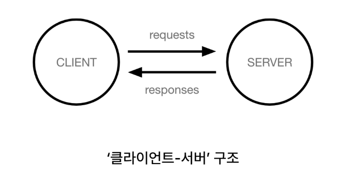

+ 클라이언트(Client)
  + 서비스를 요청하는 주체
  + 웹 사용자의 인터넷이 연결됭 장치, 웹 브라우저

+ 서버(server)
  + 클라이언트의 요청에 응답하는 주체
  + 웹 페이지, 앱을 저장하는 컴퓨터
  + 

+ 우리가 웹페이지를 보게 되는 과정
+ 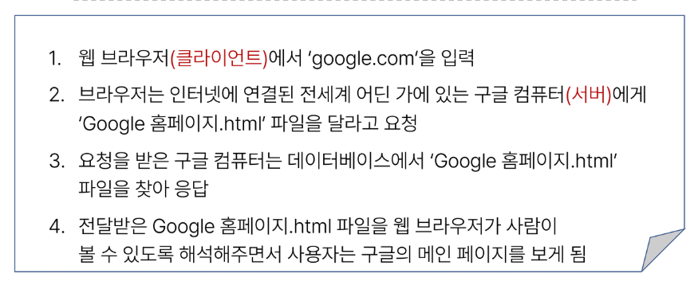

### 프로젝트 및 가상환경
+ python 어플리케이션과 그에 따른 패키지들을 격리하여 관리할 수 있는 독립적인 실행환경
+ 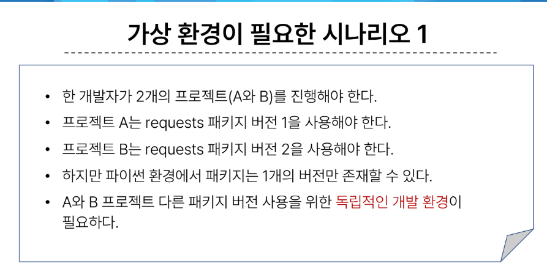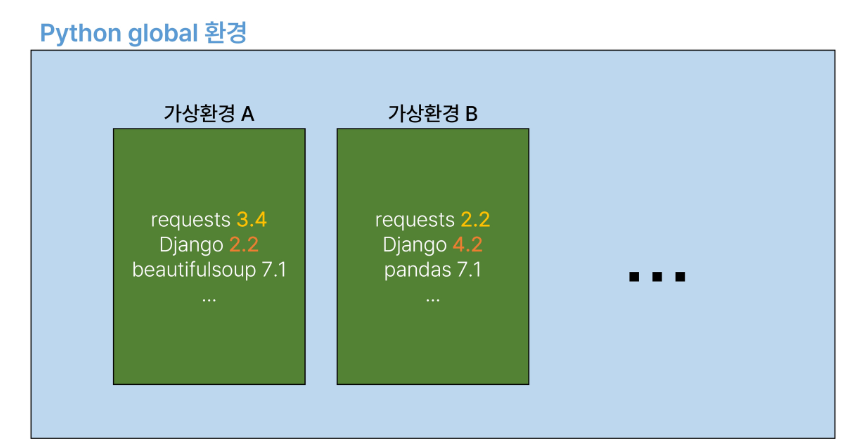
  
+ 가성환경 venv 생성
```
$ python -m venv venv
```
+ 가상환경 활성화
```
$ source venv/Scripts/activate
```
+ 환경에 설치된 패키지 목록 확인
```
$ pip list
```
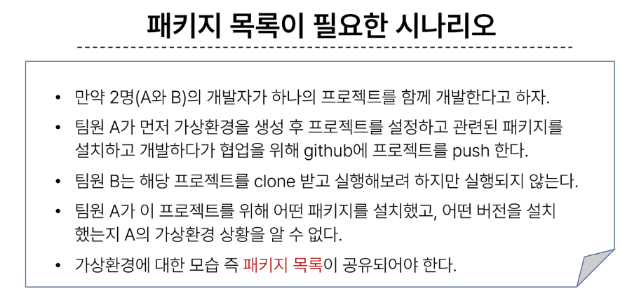
+ 의존성 패키지 
  + 한 소프트웨어 패키지가 다른 패키지의 기능이나 코드를 사용하기 때문에 그 패키지가 존재해야만 제대로 작동하는 관계
  + 사용하려는 패키지가 설치되지 않았거나, 호환되는 버전이 아니면 오류가 발생하거나 예상치 못한 동작을 보일 수 있음
  + 
  + 의존성 패키지 관리의 중요성
    + 개발 환경에서는 각각의 프로젝트가 사용하는 패키지와 그 버전을 정확히 관리하는 것이 중요
    + 가상환경 & 의존성 패키지 관리
      + 의존성 패키지 목록 생성
        + pip freeze > requirments.txt
        + requirments.txt 라는 파일 생성으로 현재 사용중인 프로그램들의 버전에 대해 남김

#### Django 프로젝트 생성 전 루틴
1. 가상환경 (venv) 생성
   + python -m venv venv
2. 가상환경 활성화
   + source venv/Scripts/activate 
   + . venv/Scripts/activate
   + 탭 누르면 자동완성 가능
3. Django 설치
   + pip install Django
   + pip list 로 설치 확인 
4. 의존성 파일 생성
   + pip freeze > requirements.txt 
   + pip install -r requirement.txt
     + 사용시 남긴 requirements.txt내에 기록된 프로그램들이 설치됌

### Django 프로젝트 생성
+ django-admin startproject firstpjt
  + firstpjt라는 이름의 프로젝트 생성

+ 서버확인
  + 터미널에 나오는 http:// 주소를 접속 후 확인

#### 참고
+ Django 프로젝트 생성 루틴 정리 + git
  1. 가상환경 생성
  2. 가상환경 활성화
  3. django 설치
  4. 의존성 파일 생성(패키지 설치시마다 진행)
  5.  .gitignore 파일 생성 (첫 add 전)
    + 인터넷에 gitignore을 검색해서 사이트에서 python, django를 검색해서 나온 파일을 .gitignore이라는 파일을 만들어서 생성
  6.  git 저장소 생성
  7.  django 프로젝트 생성 
<br>

+ 가상환경을 사용하는 이유
  + 의존성 관리
    + 라이브러리 및 패키지를 각 프로젝트마다 독립적으로 사용 가능
  + 팀 프로젝트 협업
    + 모든 팀원이 동일한 환경과 의존성 위에서 작업하여 버전간 충돌을 방지
<br>

+ LTS(Long-Term Support)
  + 프레임워크나 라이브러리 등의 소프트웨어에서 장기간 지원되는 안정적인 버전을 의미할 때 사용
  + 기업이나 대규모 프로젝트에서는 소프트웨어 업그레이드에 많은 비용과 시간이 필요하기 때문에 안정적이고 장기간 지원되는 버전이 필요함

### Django project 실행 및 app 앱
+ django project 
  + 애플리케이션의 집합
  + (DB설정, URL연결, 전체 앱 설정 등을 처리)
<br>

+ Django application
  + 독립적으로 작동하는 기능 단위 모듈
  + (각자 특정한 기능을 담당하며 다른 앱들과 함께 하나의 프로젝트를 구성)
+ 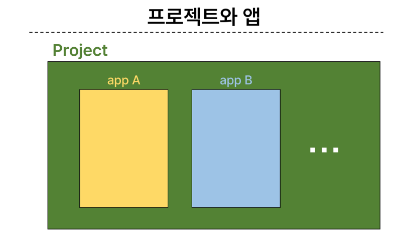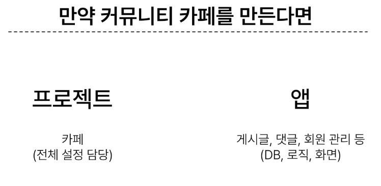

+ 앱 사용 과정
  1. 앱 생성
     + python manage.py startapp articles
       + articles 이라 불리는 앱 생성 
       + 앱 이름은 복수형으로 지정하는것을 권장
  2. 앱 등록
     + 반드시 앱을 등록하고 사용해야 함
     + pjt내 settings에서 INSTALLED_APPS 내에 앱 이름 작성
     + 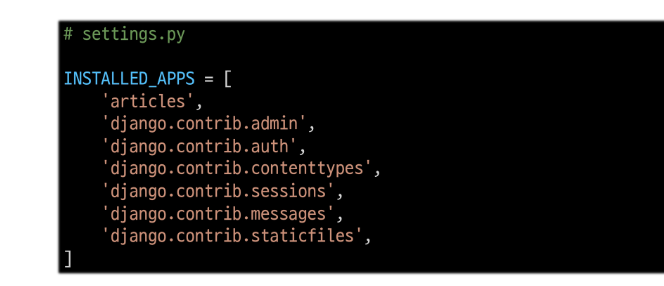

### Django 디자인 패턴
+ MVC 디자인 패턴
  + model, view, controller
  + 애플리케이션을 구조화하는 대표적인 패턴
  + (데이터, 사용자 인터페잇, 비즈니스 로직을 분리)
    + 시각적 요소와 뒤에서 실행되는 로직을 서로 영향없이, 독립적이고 쉽게 유지보수할 수 있는 애플리케이션을 만들기 위해 분리

+ MTV 디자인 패턴
  + model, Template, view
  + Django에서 애플리케이션을 구조화하는 패턴
  + (기존 MVC패턴과 동일하나 명칭을 다르게 정의한 것)
  + model은 동일 // view => Template // Controller => view
<br>

+ 프로젝트 구조
  + settings.py
    + 프로젝트의 모든 설정을 관리
  + urls.py
    + url과 이에 해당하는 적절한 views를 연결
  + z__init__.py
    + 해당 폴더를 패키지로 인식하다록 설정
    + (z는 언더바가 강조 표시로 바뀌어서 임의로 자신이 작성함)
  + asgi.py
    + 비동기식 웹 서버와의 연결 관련 설정 
  + wsgi.py
    + 웹 서버와의 연결 관련 설정
  + manage.py
    + Django프로젝트와 다양한 방법으로 상호작용 하는 커맨드라인 유틸리티
    + 프로젝트내가 아닌 프로젝트와 같은 위치에 존재함
  + 

+ 앱 구조
  + admin.py
    + 관리자용 페이지 설정
  + models.py
    + DB와 관련된 Model을 정의
    + MTV패턴의 M
  + views.py
    + HTTP 요청을 처리하고 해당요청에 대한 응답을 반환(url, mode, template과 연계)
    + MTV패턴의 V
  + apps.py
    + 앱의 정보가 작성된 곳
  + test.py
    + 프로젝트 테스트 코드를 작성하는 곳
  + 

### 요청과 응답
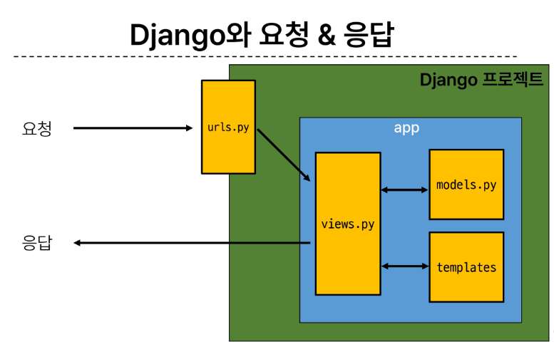
+ URLs
  + 
  + 주어진 주소로 요청이 왔을 때 views모듈의 index 뷰 함수를 호출
+ Views
  + 
  + 특정 경로에 있는 template과 request 객체를 결합해 응답객체를 반환하는 index view 함수를 정의
    + 모든 view함수는 첫번째 인자로 request(요청)객체를 필수적으로 받음

+ Template
  1. articles 앱 폴더 안에 templates 폴더 생성
     + 폴더명은 반드시 templates여야 하며 개발자가 직접 생성해야함
  2. template 폴더 안에 articles 폴더 생성( articles라는 이름의 동작 모음집)
  3. articles 폴더 안에 템플릿 파일 생성 
  + 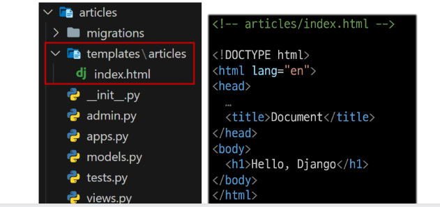

+ Django 에서 template을 인식하는 경로 규칙
  + app폴더/templates/articles/index.html
  + app폴더/templates/example.html
  + 

+ 데이터 흐름에 따른 코드 작성
  + URLs => View => Template
  + 

### 참고
+ MTV 디자인 패턴 정리
  + Model
    + 데이터와 관련된 로직을 관리
    + 응용프로그램의 데이터 구조를 정의하고 데이터베이스의 기록을 관리
  + Template
    + 레이아웃과 화면을 처리
    + 화면상의 사용자 인터페이스 구조와 레이아웃을 정의
  + View
    + Model & Template과 관련한 로직을 처리해서 응답을 반환
    + 클라이언트의 요청에 대해 처리를 분기하는 역할
  + View예시
    + 데이터가 필요하다면 model에 접근해서 데이터를 가져오고,
    + 가져온 데이터를 template로 보내 화면을 구성하고,
    + 구성된 화면을 응답으로 만들어 클라이언트에게 반환

  + 
+ 왜 Django는 MTV라 부를까?
  + 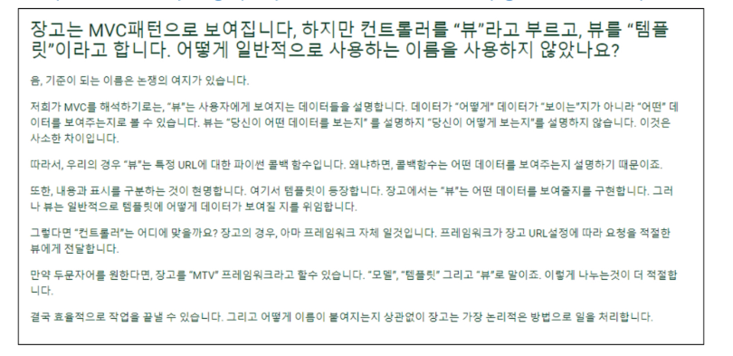

+ render 함수
  + 주어진 템플릿을 주어진 컨텍스트 데이터와 결합하고 렌더링 된 텍스트와 함께 HttpResponse(응답) 객체를 반환하는 함수
  1. request
     + 응답을 생성하는 데 사용되는 객체  
  2. template_name
     + 템플릿 이름의 경로 
  3. context 
     + 템플릿에서 사용할 데이터(딕셔너리 타입으로 작성) 
  + render(request, template_name, context)