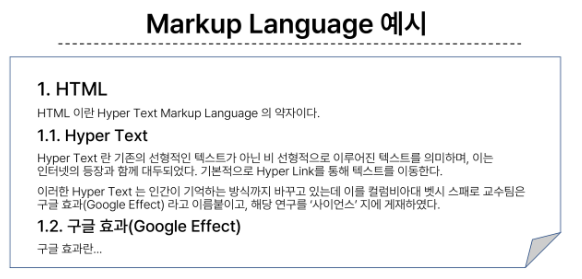
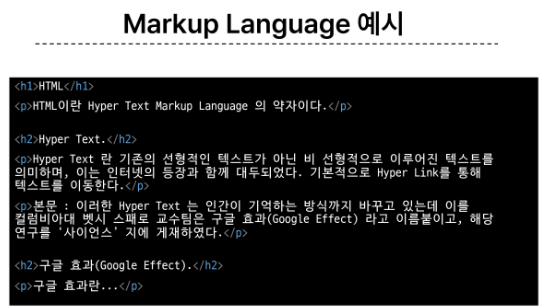
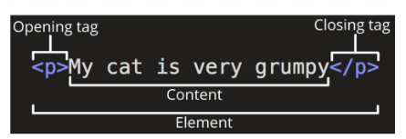
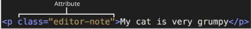
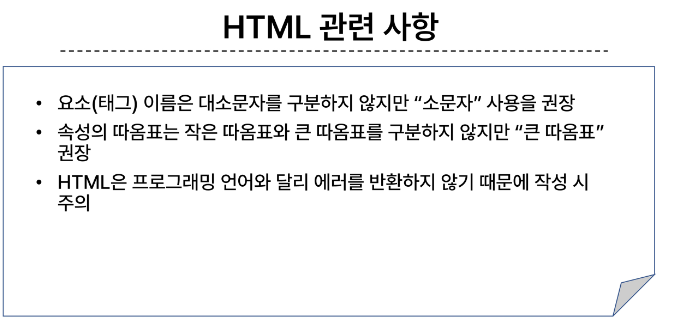
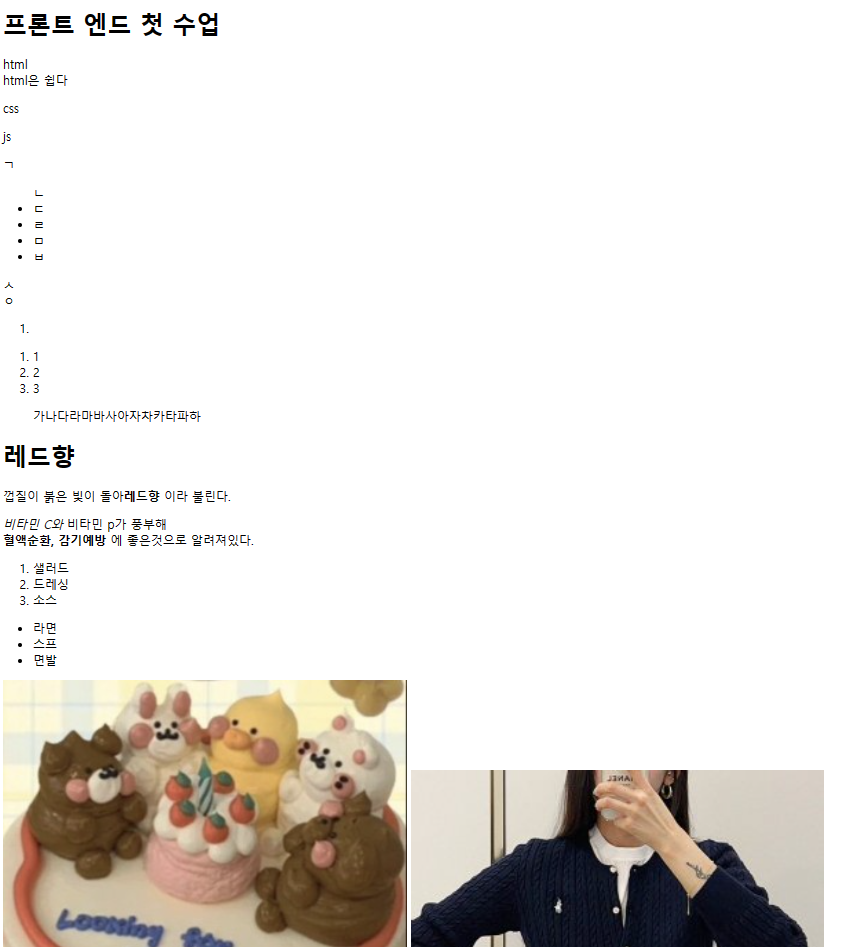
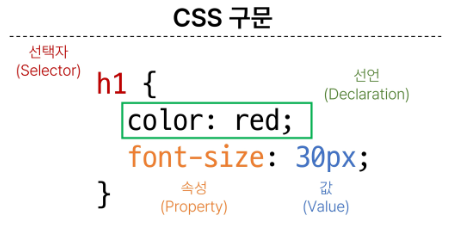
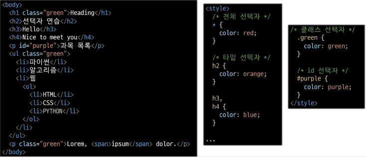
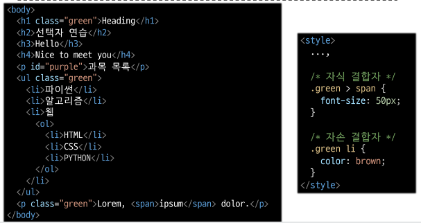
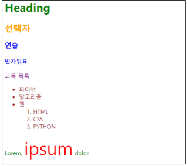

# 9.4
# Fundametals of HTML and CSS
## web
+ world wide web 
  + 인터넷으로 연결된 컴퓨터들이 정보를 공유하는 거대한 정보공간
+ web
  + web site, web application 등을 통해 사용자들이 정보를 검색하고 상호 작용하는 기술
+ web site
  + 인터넷에서 여러개의 web page가 모인 것으로, 사용자들에게 정보나 서비스를 제공하는 공간
+ web page
  + HTML, CSS 등의 웹 기술을 이용하여 만들어진, **"Web site"를 구성하는 하나의 요소**
  + Struture(구조)뼈대  - HTML 
  + Styling(스타일)디자인  - CSS 
  + Behavior(행동)로직  -  Javascript 
  + ```
    프레임 워크 : 미리 짜여진 소스코드

    클라이언트(프론트 엔드) : vue, react 

    서버에 클라이언트가 요청 / 클라이언트에게 서버가 응답

    서버(백엔드) : Django(python), spring(java), node js(java script)

    서버가 DB에 쿼리 요청

    DB : 무료(my SQL) 유료(ORACLE)
    ```
### HTML (웹구조화)
* HyperText Markup Language
* 웹 페이지의 의미와 구조를 정의하는 언어
+ Hypertext
  + 웹 페이지를 다른 페이지로 연결하는 링크 (참조를 통해 한 문서에서 다른문서로 즉시 접근할 수 있는 텍스트)
+ Markup Language
  + 태그 등을 이용하여 문서나 데이터의 구조를 명시하는 언어
  + ex) HTML, Markdown(마크다운도 마크업 랭귀지의 하나)
  + 
  
#### HTML structure
+ <'!D0CTYPE html'>
  + 해당 문서가 html로 만든 문서라는 것을 나타냄
+ <'html'> 내용전체 <'/html'>
  + 전체 페이지의 콘텐츠를 포함
+ <'title'> 제목 <'/title'>
  + 브라우저 탭 및 즐겨찾기 시 표시되는 제목으로 사용
+ <'head'> 메타태그, 타이틀 등 <'/head'>
  + HTML 문서에서 관련된 설명, 설정등
  + 사용자에게 보이지않음
+ <'body'> 컨텐츠 내용 <'/body'>
  + 페이지에 표시되는 모든 컨텐츠
+ 

#### HTML Elemet(요소)
+ 
+ 하나의 요소는 여는 태그와 닫는 태그, 그리고 그안의 내용으로 구성
+ 닫는 태그는 태그 앞에 슬래시가 포함되며, 닫는 태그가 없는 태그도 존재(메타태그 등)

#### HTML Attributes(속성)
+ 
+ 규칙
  + 속성은 요소 이름과 속성 사이에 공백이 있어야함
  + 하나 이상의 속성들이 있는 경우엔 속성 사이에 공백으로 구분함
  + 속성 값은 열고 닫는 따옴표로 감싸야함
+ 목적
  + 나타내고 싶지 않지만 추가적인 기능, 내용을 담고 싶을 때 사용
  + CSS에서 해당 요소를 선택하기 위한 값으로 활용됨
+ ```html
    <!DOCTYPE html>
    <html lang="en">
    <head>
        <meta charset="UTF-8">
        <title> My page </title>
    </head>
    <body>
        <p>This is my page</p>
        <a href="https://www.google.co.kr/">google</a>
        

        
    </body>
    </html>
    ```

+ ```html
    <!DOCTYPE html>
    <html lang="en">
    <head>
        <meta charset="UTF-8">
        <meta name="viewport" content="width=device-width, initial-scale=1.0">
        <title>Document</title>
    </head>
    <body>
        
    </body>
    </html>
    ```
+ !를 치고 탭 혹은 엔터를 누르면 이와같은 기본 틀이 나타난다.
+ 

#### HTML TEXT structure
+ HTML의 주요 목적 중 하나는 텍스트 구조와 의미를 제공하는 것
+ <'h1'>Heading<'/h1'>
  + h1 요소는 단순히 텍스트만 크게 하는것이 아닌 문서의 최상위 제목이라는 의미 부여
+ 대표적인 HTML Text structure
  + heading & patagraphs
    + h1~h6, p
  + Lists
    + ol, ul, li
  + Emphasis & importance
    + em, strong
  + 
+ 
```html
<!DOCTYPE html>
<html lang="ko">
<head>
    <meta charset="UTF-8">
    <title> 연습 문제1 </title>
</head>
<body>
    <h1>수습 국원 모집</h1>
    <h2>방송에 관심 있는 새내기 여러분 환영합니다</h2>
    <p>교내 방송국에서 신입생 여러분을 대상으로 수습 국원을 모집합니다.
        학부나 전공에 상관없습니다.<br>
        평소 방송에 관심있었던 여러 학우들의 지원바랍니다.
    <ul>
        <li><strong>모집 기간 :</strong> 3월 2일 ~ 3월 11일 </li>
        <li><strong>모집 분야 :</strong> 아나운서, PD, 엔지니어</li>
        <li><strong>지원 방법 :</strong> 양식 작성 후 이메일 접수 <br>
        <i>지원서 양식은 교내 방송국 홈페이지 공지 게시판에 있습니다.</i></li>
    </ul>

    <h2>혜택</h2>
    <blockquote>a.수습기자 활동 중 소정의 활동비 지급<br>b.정기자로 진급하면 장학금 지급</blockquote>

    <!-- <ol>
        <li>수습기자 활동 중 소정의 활동비 지급</li>
        <li>정기자로 진급하면 장학금 지급</li>
    </ol> -->
    

    </p>

    
</body>
</html>
```
+ 

```htm
<!--!를 누르고 엔터 혹은 탭을 누르면 작성--> 
<!DOCTYPE html>
<html lang="ko"> <!--언어 선택하기-->>
<head>
    <meta charset="UTF-8"> <!--한글 깨짐 방지하는 UTF-8-->
    <!-- 키워드, 설명, 제작자 등...-->
    <meta name="viewport" content="width=device-width, initial-scale=1.0">
    <title>html practice</title>
</head>
<body>
    <h1>프론트 엔드 첫 수업</h1>
    <!-- br 은 줄바꿈-->
    <!-- ol>li*3-->
    <!-- p*3 치면 p 3개 생성-->
    <p>html <br> html은 쉽다</p>
    <p>css</p>
    <p>js</p>
    <!-- p>ul>li*3 하면 p 안에 ul 안에 li 3개 생성-->
    <p>ㄱ
        <ul>ㄴ
            <li>ㄷ</li>
            <li>ㄹ</li>
            <li>ㅁ</li>
            <li>ㅂ</li>
        </ul>ㅅ<br>
        ㅇ
    </p>

    <!-- ul(unordered list) 은 점을 사용해서 나타내고 ol(ordered list)은 숫자를 이용해서 나타낸다-->
    <!-- ol>#hi-->
    <ol>
        <li id="hi"></li>
    </ol>

    <!-- il>hello*3-->
    <ol>
        <li class="hello">1</li>
        <li class="hello">2</li>
        <li class="hello">3</li>
    </ol>

    <!--인용문을 뜻하며 blockquote 사용시 들여쓰기가 된다-->
    <blockquote>가나다라마바사아자차카타파하</blockquote>

    <!-- i 혹은 em 은 글자 기울이기, strong 혹은 b는 글자 굵게하기-->
    <h1>레드향</h1>
    <p>껍질이 붉은 빛이 돌아<b>레드향</b> 이라 불린다.</p>
    <p><i>비타민 C와</i> 비타민 p가 풍부해<br>
        <strong> 혈액순환, 감기예방</strong> 에 좋은것으로 알려져있다.</p>


    <ol>
        <li>샐러드</li>
        <li>드레싱</li>
        <li>소스</li>
    </ol>

    <ul>
        <li>라면</li>
        <li>스프</li>
        <li>면발</li>
    </ul>
    


    <!--이미지 첨부하기, width는 %시 화면비율에 대해 35%. 숫자만 입력시 픽셀로 확인-->
    
    
    <br>
    
    <br>
    <!-- 링크 작성하기 a -->
    <a href="https://www.naver.com">NAVER</a>
</body>
</html>
```
+ 


### 웹스타일링 (CSS)
+ Cascading style sheet
+ 웹페이지의 디자인과 레이아웃을 구성하는 언어
+ 
+ 선택자{} =  뭐를 스타일링 할지 정함
+ 속성 : 값; = 속성에 대한 값을 선언하고 ';' 으로 마무리

#### CSS 적용방법
+ 인라인 스타일 (html 요소(태그안에) 직접 작성하는 방법)
+  
+ 내부 스타일 시트 (head 태그 안에 style태그에 작성)
+  사용 권장 XX, html과 구조 정보가 혼합되어 이해어려움
+ 외부 스타일 시트 (별도의 CSS 파일 생성 후 HTML link 태그를 사용해 불러오기) 가장 많이 사용하는 방법
+ 

#### CSS선택자
+ HTML 요소를 선택하여 스타일을 적용할 수 있도록 하는 선택자
+ 종류
  + 기본선택자
    * 전체(*) 선택자
    * 요소(tag) 선택자
    * 클래스(class) 선택자
    * 아이디(id) 선택자
    * 속성(attr) 선택자
  * 결합자
    + 자손 결합자(" " (space))
    + 자식 결합자 (>)
+ 특징
  + 전체선택자 (*)
    + HTML 모든 요소를 선택
  + 요소선택자
    + 지정한 모든 태그를 선택
  
  * 클래스 선택자 ('.'(dot))
    + 주어진 클래스 속성을 가진 모든 요소를 선택 (가장 많이 사용 99%)
  + 아이디 선택자 ('#')
    + 주어진 아이디 속성을 가진 요소 선택
    + 문서에는 주어진 아이디를 가진 요소가 하나만 있어야함
  + 
  
  + 자손 결합자(" "(space))
    + 첫 번째 요소의 자손 요소들 선택
    + 예)p span은 <'p'>안에 있는 모든 <'span'>을 선택(하위레벨 상관X)
  + 자식 결합자(">")
    + 첫 번째 요소의 직계 자식만 선택
    + 예) ul > li 는 <'ul'>안에 있는 모든 <'li'>를 선택 (한단계 아래 자식들만)
    + 

#### CSS 선택자의 우선순위
+ 계단식
  + 동일한 우선순위를 같는 규칙이 적용될 때 마지막에 나오는 규칙이 적용됨.
+ 우선순위 높은순
  + importance
    + !important
    + 다른 우선순위 규치보다 우선하여 적용하는 스타일
    + 구조를 무시하고 강제로 적용하기에 권장하지 않음
  + inline 스타일
    + 권장하지 않는 스타일이기에 신경 x
  + 선택자
    + id > class > 요소
  + 소스 코드 순서

#### CSS 상속
+ 상속을 통해 부모 요소의 속성을 자식에게 상속해 재사용성을 높임
* 상속되는 속성
  * text 관련 요소 (font, color, text-align), opacity, visibility 등
* 상속되지 않는 속성
  * Box model 관련 요소 (width, height, border, box-sizing 등 )
  * position 관련 요소(position, top/right/bottom/left, z-index 등)
* 
+ CSS의 속성은 외우지 말고 MDN 문서를 통해 검색하여 사용
+ 속성은 되도록 'class'만 사용하기
  + id, 요소 선택자등 여러 선택자들과 사용할 경우 우선순위 규칙에 따라 예기치 못한 스타일 규칙이 적용되기 때문에 전반적인 유지보수가 어려워짐.
  + 문서에서 단 한번 유일하게 적용될 스타일의 경우에만 id 선택자 사용 고려
```HTML
<!DOCTYPE html>
<html lang="ko">
<head>
    <meta charset="UTF-8">
    <meta name="viewport" content="width=device-width, initial-scale=1.0">
    <title>css 연습하기</title>
    <style>

        .가디건{
            border : 1px solid black;
            margin: 10px;
            padding: 10px;
        }
    </style>
</head>
<body>
    
    
</body>
</html>

<!DOCTYPE html>
<html lang="ko">
<head>
    <meta charset="UTF-8">
    <meta name="viewport" content="width=device-width, initial-scale=1.0">
    <title>CSS 연습하기2</title>
    <style>
        p{
            font-style: italic; /* 이탤릭체*/
        }
        .accent{
            border : 1px solid black;
            padding: 5px;
        }
        .bg{
            background-color: gray;
        }
    </style>
</head>
<body>
    <h1 class = "bg"> 레드향 </h1>
    <p> 껍질에 붉은 빛이 돌아 <span class = "accent">레드향</span>이라 불린다.</p>
    <p>레드향은 한라봉과 귤을 교배한 것</p>
    <p>비티만 C와 비타민이 풍부하다.</p>
</body>
</html>


<!DOCTYPE html>
<html lang="en">
<head>
    <meta charset="UTF-8">
    <meta name="viewport" content="width=device-width, initial-scale=1.0">
    <title>css 연습하기3</title>
    <style>
        h1{
            display: inline-block;
            font-size: 1.4em; /*1em = 16px*/
            background-color: black;
            color: white;
        }
        li{
            font-size: 1em;
            color: blue;
        }
    </style>
</head>
<body>
    <h1>웹 기술 - 기본</h1>
    <ul>
        <li>HTML</li>
        <li>CSS</li>
        <li>javascript</li>
    </ul>
</body>
</html>

<!-- 아이디 셀렉터가 우선순위가 더 높다는 것을 기억하도록 -->

<!DOCTYPE html>
<html lang="en">
<head>
    <meta charset="UTF-8">
    <meta name="viewport" content="width=device-width, initial-scale=1.0">
    <title>CSS 연습하기4</title>
    <style>
        p{
            color: black;
        }
        h1{
            color: brown !important; /*important가 가장 우선순위*/
        }
        p{
            color: blue;   /* 가장 마지막에 있는 조건이 설정됌*/
        }
    </style>
</head>
<body>
    <h1 style="color: green;">가장 빛나는 너에게</h1> <!-- 인라인은 사용을 자제하도록-->
    <p>집에 가고싶어</p>
</body>
</html>
```