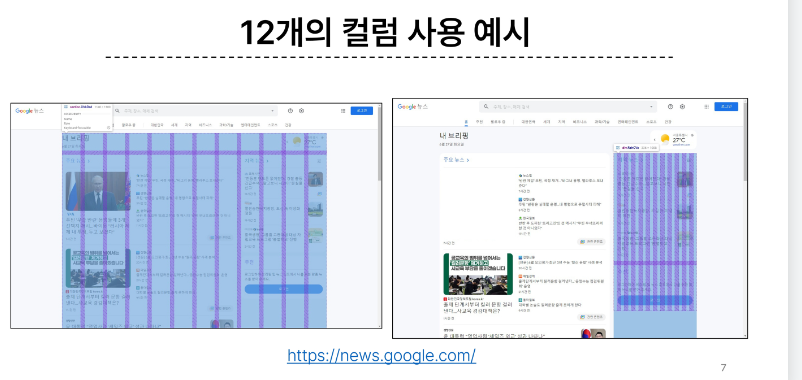
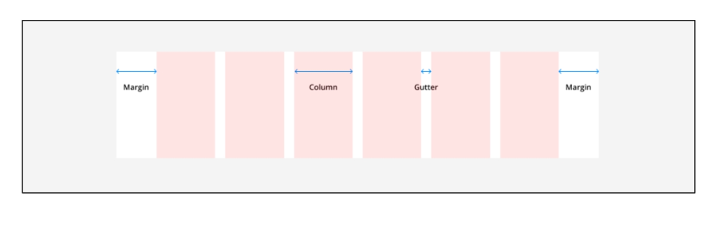
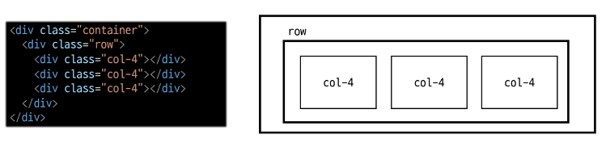
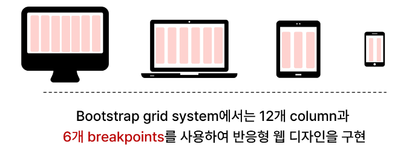
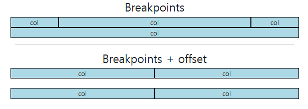
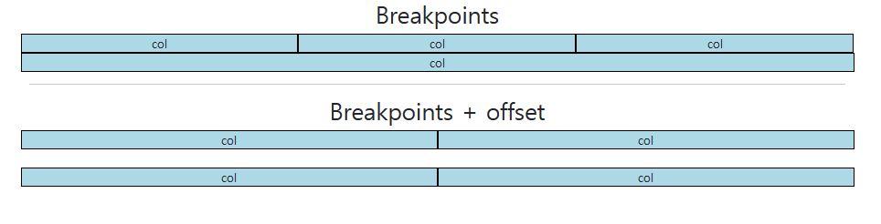
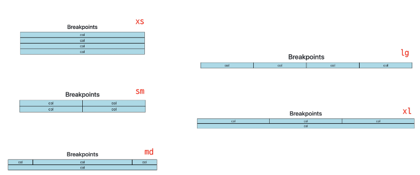

# 0907 Bootstrap Grid system
## Bootstrap Grid system
+ 웹 페이지의 레이아웃을 조정하는데 사용되는 12개의 컬럼으로 구성된 시스템
+ Grid system 목적
  + 반응형 디자인을 지원해 웹 페이지를 모바일, 태블릿, 데스크탑 등 다양한 기기에서 적절하게 표시할 수 있도록 도움
  + 
### Grid system 클래스와 기본구조
+ Grid system 기본 요소
  1. Container : Column들을 담고 있는 공간
  2. Column : 실제 컨텐츠를 포함하는 부분
  3. Gutter : 컬럼과 컬럼 사이의 여백영역
+ 
+ 1개의 row안에 12칸의 column영역이 구성
+ 각 요소는 12칸 중 몇개를 차지할 것인지 지정됨.
+ 
```html
<!DOCTYPE html>
<html lang="en">

<head>
<meta charset="UTF-8">
<meta http-equiv="X-UA-Compatible" content="IE=edge">
<meta name="viewport" content="width=device-width, initial-scale=1.0">
<link href="https://cdn.jsdelivr.net/npm/bootstrap@5.3.0-alpha1/dist/css/bootstrap.min.css" rel="stylesheet"
    integrity="sha384-GLhlTQ8iRABdZLl6O3oVMWSktQOp6b7In1Zl3/Jr59b6EGGoI1aFkw7cmDA6j6gD" crossorigin="anonymous">
<style>
    .box {
    border: 1px solid black;
    background-color: lightblue;
    text-align: center;
    }
</style>
</head>

<body>
<!-- basic 
컨테이너가 가장 최상단부모
row의 길이가 생략 되어있었음, 안쓰면 12칸이 안나옴
col을 통해 X만큼 차지할 칸 분배(그냥 col만 쓰는건 지양) col-2 col-4등
12칸을 넘어가면 다음 줄로 넘어가고 채우지 못한 부분은 그대로
-->
<h2 class="text-center">Basic</h2>
<div class="container">
    <div class="row">
    <div class="box col">col</div>
    <div class="box col">col</div>
    <div class="box col">col</div>
    </div>
    <div class="row">
    <div class="box col-4">col-4</div>
    <div class="box col-4">col-4</div>
    <div class="box col-4">col-4</div>
    </div>
    <div class="row">
    <div class="box col-2">col-2</div>
    <div class="box col-8">col-8</div>
    <div class="box col-2">col-2</div>

    </div>
</div>

<hr>
<!-- 중첩 Nesting  -->
<h2 class="text-center">Nesting</h2>
<div class="container">
    <div class="row">
    <div class="box col-4">col-4</div>
    <div class="box col-8">
        <div class="row">
        <div class="box col-6">col-6</div>
        <div class="box col-6">col-6</div>
        <div class="box col-6">col-6</div>
        <div class="box col-6">col-6</div>
        </div>
    </div>
    </div>
</div>

<hr>
<!-- 상쇄 offset
offset을 사용하면 주어진 수 X만큼 상쇄(무시, 건너뜀)후 배치한다.
-->
<h2 class="text-center">Offset</h2>
<div class="container">
    <div class="row">
    <div class="box col-4">col-4</div>
    <div class="box col-4 offset-4">col-4 offset-4</div>
    </div>
    <div class="row">
    <div class="box col-3 offset-3">col-3 offset-3</div>
    <div class="box col-3 offset-3">col-3 offset-3</div>
    </div>
    <div class="row">
    <div class="box col-6 offset-3">col-6 offset-3</div>
    </div>
</div>

<hr>
<!-- Gutters  => 컬럼간의 간격
Grid system에서 column 사이에 여백 영역
X축은 padding, y축은 margin으로 여백 생성 -->
<!-- gx-0은 x축에서 여백 영역 0으로  -->
<h2 class="text-center">Gutters(gx-0)</h2>
<div class="container">
    <div class="row gx-0">
    <div class="col-6">
        <div class="box">col</div>
    </div>
    <div class="col-6">
        <div class="box">col</div>
    </div>
    </div>
</div>

<br>
<!-- gy-5는 y축 관계에 여백 영역생성 -->
<h2 class="text-center">Gutters(gy-5)</h2>
<div class="container">
    <div class="row gy-5">
    <div class="col-6">
        <div class="box">col</div>
    </div>
    <div class="col-6">
        <div class="box">col</div>
    </div>
    <div class="col-6">
        <div class="box">col</div>
    </div>
    <div class="col-6">
        <div class="box">col</div>
    </div>
    </div>
</div>


<br>
<!-- g-5는 x,y축 모두 5만큼 여백영역 생성 -->
<h2 class="text-center">Gutters(g-5)</h2>
<div class="container">
    <div class="row g-5">
    <div class="col-6">
        <div class="box">col</div>
    </div>
    <div class="col-6">
        <div class="box">col</div>
    </div>
    <div class="col-6">
        <div class="box">col</div>
    </div>
    <div class="col-6">
        <div class="box">col</div>
    </div>
    </div>
</div>

<script src="https://cdn.jsdelivr.net/npm/bootstrap@5.3.0-alpha1/dist/js/bootstrap.bundle.min.js"
    integrity="sha384-w76AqPfDkMBDXo30jS1Sgez6pr3x5MlQ1ZAGC+nuZB+EYdgRZgiwxhTBTkF7CXvN"
    crossorigin="anonymous"></script>
</body>

</html>

```
+ 
+ Baisc 기본
+ Nesting 중첩
+ offset 상쇄
+ gutter 여백생성

### Grid system for responsive web
+ Responsive Web Design
  + 디바이스 종류나 화면 크기에 상관없이 어디서든 일관된 레이아웃 및 사용자 경험을 제공하는 기술
+ 
+ 12개의 Column과 6개의 breakpoint를 이용하여 구현
  
#### Grid system Breakpoints
+ 웹 페이지를 다양한 화면 크기에서 적절하게 배치하기 위한 분기점
+ 화면 너비에 따라 6개의 분기점 제공
  + xs, sm, md, lg, xl, xxl
+ 
```html
<!DOCTYPE html>
<html lang="en">

<head>
<meta charset="UTF-8">
<meta http-equiv="X-UA-Compatible" content="IE=edge">
<meta name="viewport" content="width=device-width, initial-scale=1.0">
<link href="https://cdn.jsdelivr.net/npm/bootstrap@5.3.0-alpha1/dist/css/bootstrap.min.css" rel="stylesheet"
    integrity="sha384-GLhlTQ8iRABdZLl6O3oVMWSktQOp6b7In1Zl3/Jr59b6EGGoI1aFkw7cmDA6j6gD" crossorigin="anonymous">
<style>
    .box {
    border: 1px solid black;
    background-color: lightblue;
    text-align: center;
    }
</style>
</head>

<body>
<!-- 각 breakpoint에서 분배할 영역의 값을 숫자로 제시
가장 작을때 는 각 12칸씩(한줄씩) 가져가고 이후 화면이 커질수록 변화한다 -->
<h2 class="text-center">Breakpoints</h2>
<div class="container">
    <div class="row">
    <div class="box col-12 col-sm-6 col-md-2 col-lg-3 col-xl-4">
        col
    </div>
    <div class="box col-12 col-sm-6 col-md-8 col-lg-3 col-xl-4">
        col
    </div>
    <div class="box col-12 col-sm-6 col-md-2 col-lg-3 col-xl-4">
        col
    </div>
    <div class="box col-12 col-sm-6 col-md-12 col-lg-3 col-xl-12">
        col
    </div>
    </div>

    <hr>

    <h2 class="text-center">Breakpoints + offset</h2>
    <div class="row g-4">
    <div class="box col-12 col-sm-4 col-md-6">
        col
    </div>
    <div class="box col-12 col-sm-4 col-md-6">
        col
    </div>
    <div class="box col-12 col-sm-4 col-md-6">
        col
    </div>
    <!-- breakpoint는 값 이상일때가 조건이기때문에
    offset을 쓸때는 종료조건도 있어야한다 -->
    <div class="box col-12 col-sm-4 offset-sm-4 col-md-6 offset-md-0">
        col
    </div>
    </div>
</div>

<script src="https://cdn.jsdelivr.net/npm/bootstrap@5.3.0-alpha1/dist/js/bootstrap.bundle.min.js"
    integrity="sha384-w76AqPfDkMBDXo30jS1Sgez6pr3x5MlQ1ZAGC+nuZB+EYdgRZgiwxhTBTkF7CXvN"
    crossorigin="anonymous"></script>
</body>

</html>
```
     
**Grid system은 화면 크기에 따라 12개의 칸을 각 요소에 나눠주는 것**

## CSS Layout 정리
+ Grid system

+ Flexbox

+ Position

+ 각각의 기술은 용도와 장단점이 있음
+ 각 기술은 독립적인 용도를 가지지 않으며, 어떤 기술이 적합한 도구가 될지는 특정 상황에 따라 다름
+ 이를 파악하기 위해서는 충분한 경험이 필요

### 참고
+ The Grid system
  + Css가 아닌 편집 디자인 에서 나온 개념으로 구성요소를 잘 배치해서 시각적으로 좋은 결과물을 만들기 위함
  + 기본적으로 안쪽에 있는 요소들의 오와 열을 맞추는 것에서 기인
  + 정보 구조와 배열을 체계적으로 작성하여 정보의 질서를 부여하는 시스템
  + 
+ Grid cards
  + row-cols 클래스를 사용하여 행당 표시할 열(카드)수를 손쉽게 제어할 수 있음
  + 
  + <div class="row row-cols-1 row-cols-sm-3 row-cols-md-2 g-4">
  + row만 남겨두면 작동하지않음!
  + ``` html
    <!DOCTYPE html>
    <html lang="en">

    <head>
    <meta charset="UTF-8">
    <meta http-equiv="X-UA-Compatible" content="IE=edge">
    <meta name="viewport" content="width=device-width, initial-scale=1.0">
    <link href="https://cdn.jsdelivr.net/npm/bootstrap@5.3.0-alpha1/dist/css/bootstrap.min.css" rel="stylesheet"
        integrity="sha384-GLhlTQ8iRABdZLl6O3oVMWSktQOp6b7In1Zl3/Jr59b6EGGoI1aFkw7cmDA6j6gD" crossorigin="anonymous">
    </head>

    <body>
    <h2 class="text-center">Grid Cards</h2>
    <div class="container">
        <div class="row row-cols-1 row-cols-sm-3 row-cols-md-2 g-4">
        <div class="col">
            <div class="card">
            <div class="card-body">
                <h5 class="card-title">Card title</h5>
                <p class="card-text">This is a longer card with supporting text below as a natural lead-in to additional
                content. This content is a little bit longer.</p>
            </div>
            </div>
        </div>
        <div class="col">
            <div class="card">
            <div class="card-body">
                <h5 class="card-title">Card title</h5>
                <p class="card-text">This is a longer card with supporting text below as a natural lead-in to additional
                content. This content is a little bit longer.</p>
            </div>
            </div>
        </div>
        <div class="col">
            <div class="card">
            <div class="card-body">
                <h5 class="card-title">Card title</h5>
                <p class="card-text">This is a longer card with supporting text below as a natural lead-in to additional
                content.</p>
            </div>
            </div>
        </div>
        <div class="col offset-sm-4 offset-md-0">
            <div class="card">
            <div class="card-body">
                <h5 class="card-title">Card title</h5>
                <p class="card-text">This is a longer card with supporting text below as a natural lead-in to additional
                content. This content is a little bit longer.</p>
            </div>
            </div>
        </div>
        </div>
    </div>

    <script src="https://cdn.jsdelivr.net/npm/bootstrap@5.3.0-alpha1/dist/js/bootstrap.bundle.min.js"
        integrity="sha384-w76AqPfDkMBDXo30jS1Sgez6pr3x5MlQ1ZAGC+nuZB+EYdgRZgiwxhTBTkF7CXvN"
        crossorigin="anonymous"></script>
    </body>

    </html>
    ```